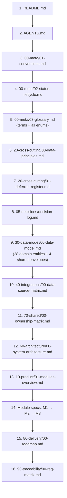

# QDS Master Index — File Map, Reading Order & Fact Router

This file is the **single authority** for two things: (1) the complete map of the
documentation tree, and (2) the mandatory order in which an AI coding agent must
read it. No other file may restate the file map or the reading order; if you find a
competing index elsewhere, that is a lint failure. When you need a specific fact,
do not search the whole tree — use the [Fact-Location Router](#fact-location-router)
to jump straight to the one file that owns it.

The tree is **consolidated and closed**: it contains **exactly 23 files**. Fine-grained
per-entity, per-source, or per-module-section files do **not** exist. Never link to a
path outside these 22, and never create new files without an approved change to the
tree via [decision-log.md](../05-decisions/decision-log.md).

## Master File Map (all 23 files)

Each file has exactly one canonical responsibility ("canonical_for"). If a fact is
canonical in a file, every other file **links** to it rather than restating it.

| # | Path | Purpose | Canonical for | Status |
|---|------|---------|---------------|--------|
| 1 | [README.md](../README.md) | Entry router only; points readers here. Holds no facts. | (none — router only) | APPROVED |
| 2 | [AGENTS.md](../AGENTS.md) | Binding operating rules for AI coding agents. | agent operating rules | APPROVED |
| 3 | [00-meta/00-index.md](00-index.md) | **This file.** Master file map + agent reading order + fact router. | master-file-map, agent-reading-order, fact-location-router | APPROVED |
| 4 | [00-meta/01-conventions.md](01-conventions.md) | ID grammar, cross-ref syntax, frontmatter spec, callout format, acceptance-criteria format, how-to-extend. | doc conventions, frontmatter spec | APPROVED |
| 5 | [00-meta/02-status-lifecycle.md](02-status-lifecycle.md) | Status vocabulary, build permissions, phase gate. | status lifecycle, build permissions | APPROVED |
| 6 | [00-meta/03-glossary.md](03-glossary.md) | All domain terms (GL-*) **and every enum** (ENUM-*). The single home of every enum. | glossary (GL-*), all enums (ENUM-*) | APPROVED |
| 7 | [05-decisions/decision-log.md](../05-decisions/decision-log.md) | ADR ledger + full bodies ADR-0001..ADR-0010. Sole ADR home. | decisions (ADR-*) | APPROVED |
| 8 | [10-product/00-vision-and-scope.md](../10-product/00-vision-and-scope.md) | Business framing + the exactly-3-modules law. | vision, scope, 3-modules law | APPROVED |
| 9 | [10-product/01-modules-overview.md](../10-product/01-modules-overview.md) | Scope map: every feature → sources → Active/Deferred → REQ-ID. | requirements scope map (REQ-*) | APPROVED |
| 10 | [20-cross-cutting/00-data-principles.md](../20-cross-cutting/00-data-principles.md) | DP-*: metric tiering, provenance, confidence, AI-review loop, GDPR/ToS, stack lock. | data principles (DP-*) | APPROVED |
| 11 | [20-cross-cutting/01-deferred-register.md](../20-cross-cutting/01-deferred-register.md) | DEF-* list + the "unavailable, never empty" UI rule. | deferred items (DEF-*) | APPROVED |
| 12 | [30-data-model/00-data-model.md](../30-data-model/00-data-model.md) | ER overview + shared envelopes + all 28 domain entities (field tables) + metrics catalog (MET-*). Single home for entity shapes. | entity fields (ENT-*), metrics (MET-*), envelopes | APPROVED |
| 13 | [30-data-model/01-analytics-model.md](../30-data-model/01-analytics-model.md) | Analytics star schema: facts (FACT-*), dimensions (DIM-*), rollups (ROLLUP-*). | analytics-model, FACT-*, DIM-*, ROLLUP-* | APPROVED |
| 14 | [40-integrations/00-data-source-matrix.md](../40-integrations/00-data-source-matrix.md) | Closed provider registry (SRC-*), capability→source matrix, per-source summary, raw→domain mapping, snapshots note. | data sources (SRC-*) | APPROVED |
| 15 | [50-modules/_module-spec-template.md](../50-modules/_module-spec-template.md) | The 6-section module-spec template. | module-spec template | APPROVED |
| 16 | [50-modules/module-1-monitoring.md](../50-modules/module-1-monitoring.md) | Module 1 (Monitoring & Reporting) full spec. | Module 1 spec (REQ-M1-*) | APPROVED |
| 17 | [50-modules/module-2-discovery.md](../50-modules/module-2-discovery.md) | Module 2 (Discovery) full spec. | Module 2 spec (REQ-M2-*) | APPROVED |
| 18 | [50-modules/module-3-crm-seeding.md](../50-modules/module-3-crm-seeding.md) | Module 3 (CRM & Seeding) full spec. | Module 3 spec (REQ-M3-*) | APPROVED |
| 19 | [60-architecture/00-system-architecture.md](../60-architecture/00-system-architecture.md) | System context, layers, module boundaries, service map (SVC-*). References ownership matrix; does not restate write-owners. | architecture, services (SVC-*) | APPROVED |
| 20 | [70-shared/00-ownership-matrix.md](../70-shared/00-ownership-matrix.md) | ENT-* → single WRITE-owner module + READER modules. The tiebreaker for write authority. | write-ownership | APPROVED |
| 21 | [80-delivery/00-roadmap.md](../80-delivery/00-roadmap.md) | Phases P0..P4, milestones, dependencies, risks, sequence rationale. | roadmap, phases (P0..P4) | APPROVED |
| 22 | [90-traceability/00-req-matrix.md](../90-traceability/00-req-matrix.md) | REQ-* → module → entities/sources → phase → status. | traceability matrix | APPROVED |
| 23 | [_lint/check-docs.md](../_lint/check-docs.md) | Linter spec + required-frontmatter definition. | linter spec | APPROVED |

## Mandatory Agent Reading Order

Read the files **in this exact sequence** before writing or changing any code or doc.
Earlier files establish rules and vocabulary that later files assume. Do not skip
ahead: the glossary and data principles must be internalized before any module spec
makes sense, and the ownership matrix must be read before architecture or the module
specs so you never mis-assign write authority.

Ordered list (canonical):

1. [README.md](../README.md) — orient; confirm you are in the right tree.
2. [AGENTS.md](../AGENTS.md) — the binding rules you must obey.
3. [00-meta/01-conventions.md](01-conventions.md) — ID grammar, cross-ref syntax, frontmatter.
4. [00-meta/02-status-lifecycle.md](02-status-lifecycle.md) — what is buildable and when.
5. [00-meta/03-glossary.md](03-glossary.md) — every term and every enum.
6. [20-cross-cutting/00-data-principles.md](../20-cross-cutting/00-data-principles.md) — DP-* doctrine.
7. [20-cross-cutting/01-deferred-register.md](../20-cross-cutting/01-deferred-register.md) — what is out of v1 scope.
8. [05-decisions/decision-log.md](../05-decisions/decision-log.md) — why the stack and scope are what they are.
9. [30-data-model/00-data-model.md](../30-data-model/00-data-model.md) — the 28 domain entities, envelopes, metrics; then [01-analytics-model.md](../30-data-model/01-analytics-model.md) — the analytics star schema (facts, dimensions, rollups).
10. [40-integrations/00-data-source-matrix.md](../40-integrations/00-data-source-matrix.md) — the closed set of sources.
11. [70-shared/00-ownership-matrix.md](../70-shared/00-ownership-matrix.md) — who may write each entity.
12. [60-architecture/00-system-architecture.md](../60-architecture/00-system-architecture.md) — layers, boundaries, services.
13. [10-product/01-modules-overview.md](../10-product/01-modules-overview.md) — the feature scope map.
14. Module specs, in order: [module-1-monitoring.md](../50-modules/module-1-monitoring.md) → [module-2-discovery.md](../50-modules/module-2-discovery.md) → [module-3-crm-seeding.md](../50-modules/module-3-crm-seeding.md).
15. [80-delivery/00-roadmap.md](../80-delivery/00-roadmap.md) — phases and sequence.
16. [90-traceability/00-req-matrix.md](../90-traceability/00-req-matrix.md) — the requirement ledger you close against.

> Note: [00-vision-and-scope.md](../10-product/00-vision-and-scope.md), the
> [_module-spec-template.md](../50-modules/_module-spec-template.md), and
> [_lint/check-docs.md](../_lint/check-docs.md) are reference material, not steps in the
> build-reading path. Read vision-and-scope for business context whenever you need the
> "why"; consult the template when authoring a module spec; consult the linter spec
> before submitting any doc change.

## Fact-Location Router

Never restate a canonical fact — **link to its owner**. To answer "where is X defined?",
find X's fact-class below and go to the one file that owns it. This is the router for
[single-source-of-truth](../AGENTS.md) enforcement.

| I need… | Canonical owner | Notes |
|---------|-----------------|-------|
| An **enum** (name or values) — e.g. ENUM-MentionType, ENUM-MetricTier, ENUM-VerificationStatus | [00-meta/03-glossary.md](03-glossary.md) | The **sole** home of every enum. Elsewhere, reference by enum name only; never re-list values. Glossary heading anchors equal the lowercased ID (e.g. `#gl-metrictier`). |
| A **domain term / definition** (GL-*) | [00-meta/03-glossary.md](03-glossary.md) | |
| **Entity fields / shapes** (ENT-*) and **envelopes** (Provenance, ConfidenceAssessment, MetricValue, ReachEstimate) | [30-data-model/00-data-model.md](../30-data-model/00-data-model.md) | The only place field tables live. Also states once that STORY is **not** in ENUM-ContentType — stories are ENT-Story only. |
| **Metrics** (MET-*) and their **tier** — engagement rate / average / median are DERIVED; estimated reach is ESTIMATED | [30-data-model/00-data-model.md](../30-data-model/00-data-model.md) | Tier vocabulary itself (ENUM-MetricTier) is defined in the glossary. |
| **Analytics** — facts (`FACT-*`), dimensions (`DIM-*`), rollups (`ROLLUP-*`) | [30-data-model/01-analytics-model.md](../30-data-model/01-analytics-model.md) | The OLAP star schema; dashboards read rollups. |
| **Write-ownership** — which module may write an entity, and who reads it | [70-shared/00-ownership-matrix.md](../70-shared/00-ownership-matrix.md) | The tiebreaker for write authority. Architecture and module specs link here; they never restate owners. |
| **Data sources** (SRC-*), capability→source matrix, raw→domain mapping | [40-integrations/00-data-source-matrix.md](../40-integrations/00-data-source-matrix.md) | Closed provider registry. TikTok has exactly one source. |
| **Deferred items** (DEF-*) and the "unavailable, never empty/zero" UI rule | [20-cross-cutting/01-deferred-register.md](../20-cross-cutting/01-deferred-register.md) | |
| **Decisions / rationale** (ADR-*) | [05-decisions/decision-log.md](../05-decisions/decision-log.md) | Sole ADR home; ledger + full bodies ADR-0001..ADR-0010. |
| **Cross-cutting data principles** (DP-*) | [20-cross-cutting/00-data-principles.md](../20-cross-cutting/00-data-principles.md) | |
| **Requirements** (REQ-*) — scope, source mapping, Active/Deferred | [10-product/01-modules-overview.md](../10-product/01-modules-overview.md) | Detailed behavior lives in the relevant module spec (M1/M2/M3). |
| **Acceptance criteria** (AC-*) and detailed feature behavior | Module specs: [M1](../50-modules/module-1-monitoring.md) · [M2](../50-modules/module-2-discovery.md) · [M3](../50-modules/module-3-crm-seeding.md) | |
| **Internal services** (SVC-*), layers, module boundaries | [60-architecture/00-system-architecture.md](../60-architecture/00-system-architecture.md) | |
| **Phases / roadmap** (P0..P4), sequence, risks | [80-delivery/00-roadmap.md](../80-delivery/00-roadmap.md) | |
| **Traceability** — REQ → module → entities/sources → phase → status | [90-traceability/00-req-matrix.md](../90-traceability/00-req-matrix.md) | |
| **Status vocabulary & build permissions** (ENUM-DocStatus, phase gate) | [00-meta/02-status-lifecycle.md](02-status-lifecycle.md) | ENUM-DocStatus values are defined in the glossary. |
| **ID grammar, cross-ref syntax, frontmatter, callouts, how-to-extend** | [00-meta/01-conventions.md](01-conventions.md) | |
| **Linter rules & required frontmatter** | [_lint/check-docs.md](../_lint/check-docs.md) | |
| **Business framing & the exactly-3-modules law** | [10-product/00-vision-and-scope.md](../10-product/00-vision-and-scope.md) | |

If a fact you need is not in this router, it is either an entity field (→ data model),
an enum (→ glossary), or it does not yet exist — in which case propose it through the
[decision-log](../05-decisions/decision-log.md) rather than inventing it.