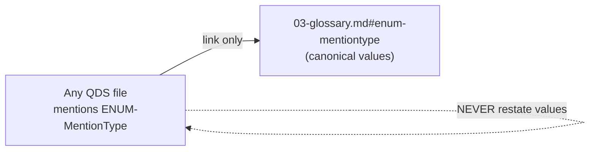
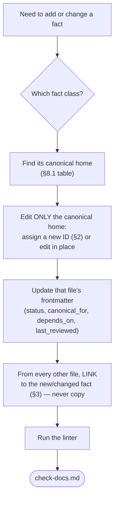

# Conventions

This file is the canonical grammar for the entire QDS documentation tree. Every
other file obeys the rules defined here so that IDs, links, frontmatter,
callouts, and acceptance criteria resolve **deterministically**. A coding agent
reading any QDS file must be able to follow a reference without guessing.

This file is canonical for: **ID grammar**, **cross-reference syntax**,
**frontmatter spec**, **callout format**, **acceptance-criteria format**, and
**how-to-extend**. It does not define terms, enums, entities, ownership,
sources, deferred items, or decisions — those live in their own canonical files
(see [the fact-location router](00-index.md)).

> DO Read this file before authoring or editing any QDS documentation.
>
> DO NOT Duplicate any grammar rule from this file into another file; link back
> here instead.

---

## 1. The tree is closed (22 files)

The QDS tree has **exactly 22 files**. Fine-grained per-entity, per-source, or
per-module-section files **do not exist**. Never create or link to a path
outside the 22. The authoritative list of the 22 paths and the reading order
lives in [00-index.md](00-index.md) — this file does not restate that map.

---

## 2. ID grammar

Every referenceable thing carries an ID built from one of the fixed shapes
below. Use these exact shapes; never invent a new prefix.

| ID shape | Names a… | Example (real) | Canonical home |
|---|---|---|---|
| `REQ-M<n>-<NNN>` | Requirement, `n` in {1,2,3} | `REQ-M1-002` | module specs + [01-modules-overview.md](../10-product/01-modules-overview.md) |
| `AC-M<n>-<NNN>` | Acceptance criterion | `AC-M1-002` | the owning module spec |
| `ENT-<PascalName>` | Entity | `ENT-Creator` | [00-data-model.md](../30-data-model/00-data-model.md) |
| `ENUM-<PascalName>` | Enum | `ENUM-MentionType` | [03-glossary.md](03-glossary.md) |
| `MET-<PascalName>` | Metric | `MET-EngagementRate` | [00-data-model.md](../30-data-model/00-data-model.md) |
| `FACT-<PascalName>` | Analytics fact table | `FACT-SeedingContent` | [01-analytics-model.md](../30-data-model/01-analytics-model.md) |
| `DIM-<PascalName>` | Analytics dimension | `DIM-Product` | [01-analytics-model.md](../30-data-model/01-analytics-model.md) |
| `ROLLUP-<PascalName>` | Pre-aggregated rollup | `ROLLUP-SeedingByProduct` | [01-analytics-model.md](../30-data-model/01-analytics-model.md) |
| `DP-<NNN>` | Data principle | `DP-002` | [00-data-principles.md](../20-cross-cutting/00-data-principles.md) |
| `DEF-<NNN>` | Deferred item | `DEF-001` | [01-deferred-register.md](../20-cross-cutting/01-deferred-register.md) |
| `SRC-<kebab>` | External source contract | `SRC-youtube-data-api-v3` | [00-data-source-matrix.md](../40-integrations/00-data-source-matrix.md) |
| `SVC-<PascalName>` | Internal service | `SVC-Ingestion` | [00-system-architecture.md](../60-architecture/00-system-architecture.md) |
| `XMC-<NNN>` | Cross-module contract | `XMC-001` | the producing module spec |
| `GL-<PascalName>` | Glossary term | `GL-MetricTier` | [03-glossary.md](03-glossary.md) |
| `ADR-<NNNN>` | Decision record | `ADR-0008` | [decision-log.md](../05-decisions/decision-log.md) |

Rules:

- **Case is fixed.** Prefixes are UPPERCASE; `PascalName` uses PascalCase;
  `kebab` uses lowercase-with-hyphens. `<NNN>` is zero-padded to 3 digits;
  `<NNNN>` (ADR) to 4.
- **IDs are immutable.** Once assigned and merged, an ID is never reused for a
  different thing and never renumbered. Retire via status (see
  [02-status-lifecycle.md](02-status-lifecycle.md)), not deletion.
- **One ID, one canonical home.** The canonical home is the only file that may
  define the thing's facts (see [§6](#how-to-extend)).

### 2.1 Placeholder rule for illustrative examples (F5)

Worked examples and illustrations **must never reuse a real requirement ID** for
a feature it does not name. When you need a stand-in:

- Use `REQ-Mx-NNN` (and `AC-Mx-NNN`) for requirement/criterion placeholders —
  the literal `x` and `NNN` signal "not a real ID".
- Use `ENT-Example` for an entity placeholder.

> DO NOT Write `REQ-M1-005` in an example that is not actually about
> historical performance tracking. Use `REQ-Mx-NNN` instead.

---

<a id="cross-ref-syntax"></a>
## 3. Cross-reference syntax

All cross-references are **relative Markdown links** between two of the 22 real
paths. Never use absolute paths, bare IDs without a link, or links to files that
do not exist.

### 3.1 Link shapes

| Target | Syntax | Example |
|---|---|---|
| A whole file | `[Text](relative/path.md)` | `[glossary](03-glossary.md)` |
| A heading in a file | `[Text](relative/path.md#anchor)` | `[MentionType](03-glossary.md#enum-mentiontype)` |
| A heading in this same file | `[Text](#anchor)` | `[the extend law](#how-to-extend)` |

Relative paths are computed from the **linking file's directory**. From
`docs/00-meta/01-conventions.md`, the glossary is `03-glossary.md`; the data
model is `../30-data-model/00-data-model.md`.

### 3.2 Anchor rule (F11)

An anchor pointing at an ID-titled heading is the **lowercased ID with the
prefix hyphen preserved**. Glossary and other ID-keyed headings therefore anchor
as the lowercased ID:

| Heading text | Anchor |
|---|---|
| `GL-MetricTier` | `#gl-metrictier` |
| `ENUM-MentionType` | `#enum-mentiontype` |
| `ADR-0008` | `#adr-0008` |
| `DP-002` | `#dp-002` |

For prose headings (not an ID), the anchor is GitHub-style slugification:
lowercase, spaces → hyphens, punctuation dropped.

### 3.3 Referencing a canonical fact

When you mention something owned by another file, **cite the ID and link to its
canonical home** — do not copy its definition.



> DO Write: classify each mention with
> `[ENUM-MentionType](03-glossary.md#enum-mentiontype)`.
>
> DO NOT List `PAID, SEEDED, LIKELY_ORGANIC, UNKNOWN` again outside the
> glossary — that is a lint failure.

---

<a id="frontmatter-spec"></a>
## 4. Frontmatter spec (F10)

Every `.md` file begins with a YAML frontmatter block delimited by `---`. The
block has **exactly these keys, in this order**:

| Key | Type | Rule |
|---|---|---|
| `id` | string | The file's own ID (e.g. this file is `CONV-Conventions`). |
| `title` | string | Human title; matches the H1. |
| `status` | one `ENUM-DocStatus` value | A single value from [ENUM-DocStatus](03-glossary.md#enum-docstatus). Governs buildability per [02-status-lifecycle.md](02-status-lifecycle.md). |
| `canonical_for` | list | Fact-classes / ID-prefixes this file owns. Use `[]` if the file owns none. |
| `depends_on` | list | Concrete **real** IDs or **real** file paths this file relies on. **Real IDs only** — never a placeholder, never an invented ID. |
| `last_reviewed` | date | Always `2026-07-02`. Never a date later than `2026-07-02`. |

Rules:

- `status` holds a single [ENUM-DocStatus](03-glossary.md#enum-docstatus) value —
  never a list, never free text.
- `depends_on` entries must resolve: each is either a real ID defined in its
  canonical home, or one of the 22 real paths. A `depends_on` on a
  placeholder (`REQ-Mx-NNN`, `ENT-Example`) is a lint failure.
- `last_reviewed` is frozen at `2026-07-02` for this documentation set; a future
  date is a lint failure.

Minimal template:

```yaml
---
id: <ID>
title: <Title>
status: <one ENUM-DocStatus value>
canonical_for: []            # or a list of fact-classes / ID-prefixes
depends_on:                  # real IDs or real paths only; [] if none
  - <REAL-ID or path>
last_reviewed: 2026-07-02
---
```

---

## 5. Callout format: DO / DO NOT / DEFERRED

QDS uses exactly three callout kinds, written as Markdown blockquotes. Do not
invent other callout labels.

| Callout | Meaning | Use for |
|---|---|---|
| `DO` | A required or recommended action. | Positive guidance an agent should follow. |
| `DO NOT` | A prohibited action. | Anti-patterns, lint traps, restated-fact hazards. |
| `DEFERRED` | Out of v1 scope; must map to a `DEF-*`. | Flagging a capability excluded from v1. A `DEFERRED` callout **must** link to its item in [01-deferred-register.md](../20-cross-cutting/01-deferred-register.md). |

Form: a blockquote whose first token is the bold label, e.g.

> DO Tag every metric with its [ENUM-MetricTier](03-glossary.md#enum-metrictier)
> value.

> DO NOT Present an `ESTIMATED` value as fact (enforces
> [DP-001](../20-cross-cutting/00-data-principles.md#dp-001)).

> DEFERRED Audience demographics are excluded from v1 — see
> [DEF-001](../20-cross-cutting/01-deferred-register.md#def-001). The UI renders
> "unavailable", never empty or zero.

---

<a id="acceptance-criteria-format"></a>
## 6. Acceptance-criteria format

Every acceptance criterion is written in **Given / When / Then** form, carries an
`AC-M<n>-<NNN>` ID, is **keyed to exactly one `REQ-M<n>-<NNN>`**, and **cites the
`DP-*` it enforces** (linking to [00-data-principles.md](../20-cross-cutting/00-data-principles.md)).

Structure for each criterion:

- **ID**: `AC-M<n>-<NNN>` (matching the module of its requirement).
- **Requirement**: a link to the parent `REQ-M<n>-<NNN>`.
- **Enforces**: one or more `DP-*` links.
- **Given** — the precondition / starting state.
- **When** — the triggering action.
- **Then** — the observable, testable outcome.

Rules:

- Every `Then` must be **observable and testable** — no vague adjectives.
- Reference enums, entities, and sources **by linked ID**; never restate their
  definitions (see [§7](#how-to-extend)).
- The `Enforces` line is mandatory: an acceptance criterion that constrains data
  quality must name the principle it upholds.

---

## 7. Worked example (placeholders only)

The following is illustrative. It uses **placeholder IDs only** (`REQ-Mx-NNN`,
`AC-Mx-NNN`, `ENT-Example`) so it can never be mistaken for a real requirement
(F5). Real files substitute real IDs and real canonical links.

**REQ-Mx-NNN — Example: attach provenance to ingested records**

> AC-Mx-NNN — Provenance is present on every externally-sourced record
>
> - **Requirement**: REQ-Mx-NNN
> - **Enforces**: [DP-002](../20-cross-cutting/00-data-principles.md#dp-002)
> - **Given** an `ENT-Example` record produced from an external source
> - **When** the record is persisted
> - **Then** it carries a non-empty `Provenance` envelope whose `source` is a
>   valid `SRC-*` id and whose `fetchedAt` is set.

Notice what the example does and does not do:

> DO Link enum/entity/principle references to their canonical homes and cite the
> enforced `DP-*`.
>
> DO NOT Reuse a real requirement ID (e.g. a real `REQ-M1-...`) to stand in for
> this generic example, and DO NOT restate the fields of the `Provenance`
> envelope here — those are canonical in
> [00-data-model.md](../30-data-model/00-data-model.md).

---

<a id="how-to-extend"></a>
## 8. How to extend, and the no-duplicate-source-of-truth law

Adding to the documentation means adding to the **canonical home** of the fact
class, then linking from everywhere else.

### 8.1 The single-source-of-truth law

Each fact class has exactly one canonical file. Restating a canonical fact
anywhere else is a **lint failure** — link instead.

| Fact class | Canonical home (link, never restate) |
|---|---|
| Enums (values) | [03-glossary.md](03-glossary.md) |
| Domain terms (`GL-*`) | [03-glossary.md](03-glossary.md) |
| Entity fields & metrics (`MET-*`) | [00-data-model.md](../30-data-model/00-data-model.md) |
| Write-ownership | [00-ownership-matrix.md](../70-shared/00-ownership-matrix.md) |
| Data sources (`SRC-*`) | [00-data-source-matrix.md](../40-integrations/00-data-source-matrix.md) |
| Deferred items (`DEF-*`) | [01-deferred-register.md](../20-cross-cutting/01-deferred-register.md) |
| Decisions (`ADR-*`) | [decision-log.md](../05-decisions/decision-log.md) |
| Data principles (`DP-*`) | [00-data-principles.md](../20-cross-cutting/00-data-principles.md) |
| Status vocabulary & build permissions | [02-status-lifecycle.md](02-status-lifecycle.md) |
| Master map & reading order | [00-index.md](00-index.md) |

> DO NOT Restate an entity's field table, an enum's values, or an entity's
> write-owner outside its canonical home. Link to it.

### 8.2 Procedure to add or change a fact



Steps:

1. **Identify the fact class** and its canonical home from the table in §8.1.
2. **Assign an ID** using the grammar in [§2](#2-id-grammar), or edit the
   existing entry in place. Never reuse or renumber an ID.
3. **Edit only the canonical home.** Add the definition there and nowhere else.
4. **Set frontmatter** on the canonical file: pick a single
   [ENUM-DocStatus](03-glossary.md#enum-docstatus) `status`, list owned
   fact-classes in `canonical_for`, list real dependencies in `depends_on`, and
   keep `last_reviewed: 2026-07-02`.
5. **Link, don't copy.** Every other file that needs the fact references it by
   linked ID.
6. **Respect status gates.** A `DRAFT`/`PROPOSED` item must not be cited as
   fact; a `DEFERRED` item must map to a `DEF-*` and render "unavailable" in the
   UI — see [02-status-lifecycle.md](02-status-lifecycle.md).
7. **Validate** against the linter spec in [check-docs.md](../_lint/check-docs.md).