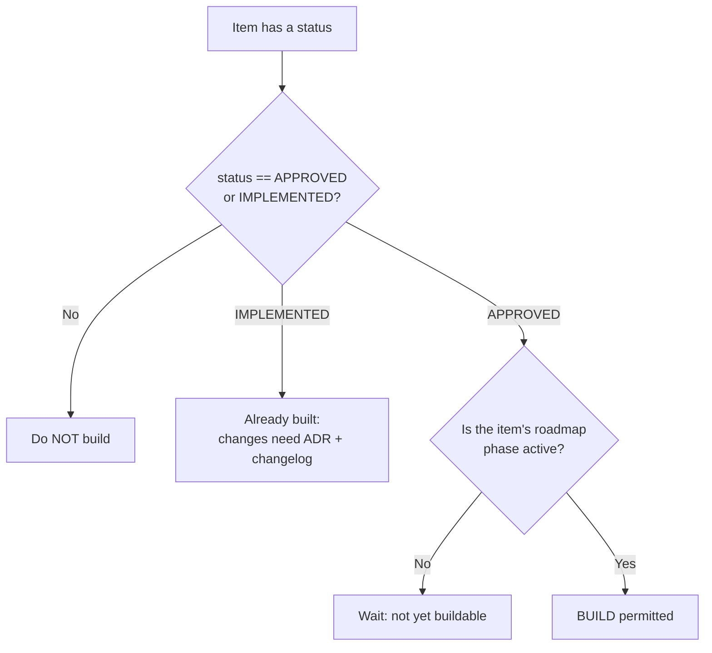
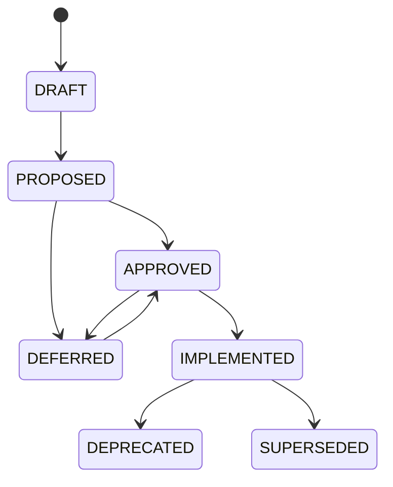

# Status Lifecycle and Build Permissions

This file is the single authority for what each document/item **status** means and
whether an AI coding agent is permitted to build it. Status is declared in every
file's frontmatter (`status:`) and on individual items (requirements, ADRs, entities)
using exactly one value of **ENUM-DocStatus**.

The values of ENUM-DocStatus are canonical in
[03-glossary.md](03-glossary.md#enum-docstatus). This file references them by name and
attaches build semantics; it does **not** redefine the enum.

## The two-condition rule (read this first)

An item is buildable **only** when **both** conditions hold:

1. **Status = APPROVED** (or IMPLEMENTED for already-built items), AND
2. **Its roadmap phase is active** — see the phase gate below.

Status alone never grants a build. Phase membership alone never grants a build.
Both gates must be open at the same time.

## Status vocabulary and build permission

Each ENUM-DocStatus value grants exactly one build permission. There is no other
interpretation.

| ENUM-DocStatus value | Meaning | Buildable? | May be cited as fact? | Notes |
| --- | --- | --- | --- | --- |
| `DRAFT` | Work in progress, not agreed | No | No | Must not be built or cited as fact. |
| `PROPOSED` | Put forward, not yet accepted | No | No | Must not be built or cited as fact. |
| `APPROVED` | Accepted and specified | **Only when its phase is active** | Yes | Subject to the phase gate below. |
| `IMPLEMENTED` | Built and verified | Already built | Yes | Changes require an ADR + a changelog entry. ADRs are canonical in [decision-log.md](../05-decisions/decision-log.md). |
| `DEFERRED` | Out of v1 scope | No | No | Must map to a `DEF-*`; triggers the unavailable-never-empty UI rule (below). |
| `DEPRECATED` | Retired; no longer valid | No | No | Must not be built. |
| `SUPERSEDED` | Replaced by a newer item | No | No | Must not be built. |

## Phase gate

Buildability of an `APPROVED` item is gated by whether its roadmap **phase (P0..P4)**
is currently active. Phase membership is a separate axis from status: an item can be
`APPROVED` yet not-yet-buildable because its phase has not started.

The phases, their contents, and the active-phase sequence are canonical in
[00-roadmap.md](../80-delivery/00-roadmap.md). This file does not restate phase
contents; it only defines the gate that consumes them.

Agents must resolve an item's phase via the roadmap before building. If the roadmap
places an `APPROVED` item in a phase that is not active, treat it as not-yet-buildable
and wait — do not build ahead of the phase.

## DEFERRED and the unavailable-never-empty UI rule

A `DEFERRED` item is out of v1 scope and must not be built. Every `DEFERRED` item
**must** map to a `DEF-*` entry.

Because deferred capabilities may still have a visible surface (a field, a filter,
a score), the UI rule applies: a deferred field renders **"unavailable"** — never
empty, never zero, never a fabricated value. This rule and the full `DEF-*` list are
canonical in
[01-deferred-register.md](../20-cross-cutting/01-deferred-register.md#unavailable-never-empty).

## Status transitions

Typical forward flow (transitions are governed by the roadmap and, for anything
`IMPLEMENTED`, by an ADR in [decision-log.md](../05-decisions/decision-log.md)):

Notes:

- `DEFERRED -> APPROVED` promotes a `DEF-*` item back into scope; it becomes buildable
  only once its phase is active (the two-condition rule still applies).
- `IMPLEMENTED` items are locked: any change requires an ADR plus a changelog entry.
- `DEPRECATED` and `SUPERSEDED` are terminal for build purposes — never build them.

## How agents apply this file

1. Read the item's `status` (frontmatter or item-level).
2. If status is not `APPROVED` or `IMPLEMENTED`, stop — do not build, do not cite as fact.
3. If `APPROVED`, look up its phase in [00-roadmap.md](../80-delivery/00-roadmap.md) and
   confirm the phase is active. Build only if it is.
4. If `IMPLEMENTED`, do not rebuild; changing it requires an ADR + changelog.
5. If `DEFERRED`, ensure a `DEF-*` mapping exists and render its UI surface as
   "unavailable" per the
   [deferred register](../20-cross-cutting/01-deferred-register.md#unavailable-never-empty).