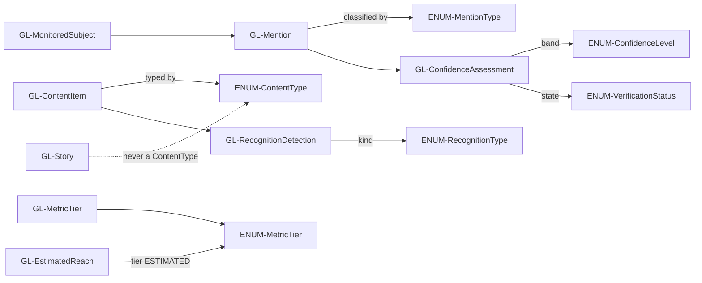

# Glossary and Enum Registry

This file is the **single canonical home** for two fact-classes:

- **Part A — Domain terms (`GL-*`)**: the shared vocabulary of "Question de Style" (QDS). Where a German headword clarifies the DACH business meaning, it is given alongside the English gloss.
- **Part B — Enums (`ENUM-*`)**: the **only** place in the 22-file tree where enum values are listed. Every other file references an enum **by name** and links here. Restating enum values anywhere else is a lint failure.

Reading rules for agents:

- **Entity field shapes are NOT defined here.** Terms that name an entity link to [`../30-data-model/00-data-model.md`](../30-data-model/00-data-model.md), which is the canonical home for entity fields. See [`01-conventions.md`](01-conventions.md) for cross-reference syntax and the master map in [`00-index.md`](00-index.md).
- **Anchor grammar (F11):** every term and enum heading anchors as its **lowercased ID**. `GL-MetricTier` → `#gl-metrictier`; `ENUM-MetricTier` → `#enum-metrictier`. Link to a term with, e.g., [`#gl-emv`](#gl-emv).
- All enum value lists below are **final and CLOSED**. Do not add, rename, or infer values.

---

## Part A — Domain Terms (`GL-*`)

Terms are grouped for reading convenience only; the ID is the identity. Entities link to their field definitions in the data model; principles/decisions/sources/deferred items link to their canonical homes.

### Core actors and content

### GL-Creator
**DE:** Influencer / Creator. An individual (or persona) who produces public social content across one or more platforms and is the unit of interest for monitoring, discovery, and CRM. A Creator aggregates one or more platform accounts under a single merged identity. Entity shape: [`ENT-Creator`](../30-data-model/00-data-model.md). Identity/merge is owned by Module 3 CRM; see the [ownership matrix](../70-shared/00-ownership-matrix.md).

### GL-PlatformAccount
**DE:** Plattform-Konto. A single account/handle on one platform (see [`ENUM-Platform`](#enum-platform)) belonging to a Creator. One Creator may have several PlatformAccounts (e.g. an Instagram and a TikTok handle). Entity shape: [`ENT-PlatformAccount`](../30-data-model/00-data-model.md).

### GL-ContentItem
**DE:** Inhalt / Beitrag. A single piece of durable public content — a post, reel, video, or short (see [`ENUM-ContentType`](#enum-contenttype)). Ephemeral stories are **not** ContentItems (see [`GL-Story`](#gl-story) and F8 in [`ENUM-ContentType`](#enum-contenttype)). Entity shape: [`ENT-ContentItem`](../30-data-model/00-data-model.md).

### GL-Story
**DE:** Story. An **ephemeral** piece of content that expires (typically 24h) and must be archived before expiry. Stories are always modelled as [`ENT-Story`](../30-data-model/00-data-model.md) and never as a ContentItem with a "story" type — `STORY` is deliberately absent from [`ENUM-ContentType`](#enum-contenttype).

### GL-Comment
**DE:** Kommentar. A public audience comment (including threaded replies) attached to a ContentItem, used for reaction and sentiment analysis. Entity shape: [`ENT-Comment`](../30-data-model/00-data-model.md).

### GL-MonitoredSubject
**DE:** Beobachtungsgegenstand. A brand, product, campaign, hashtag, handle, abbreviation, or spelling variant that the agency actively monitors. The set of search terms that drives mention collection in Module 1. Entity shape: [`ENT-MonitoredSubject`](../30-data-model/00-data-model.md).

### GL-Roster
The set of creators the agency actively monitors — modelled as [`GL-MonitoredSubject`](#gl-monitoredsubject)s of type `CREATOR` ([`ENUM-MonitoredSubjectType`](#enum-monitoredsubjecttype)). v1 monitoring is **roster-first**: it tracks these creators' accounts (reach, followers, likes, comments, last post) and detects the seeded-product content they publish. Open-web listening for mentions from non-roster creators is deferred ([DEF-006](../20-cross-cutting/01-deferred-register.md#def-006)).

### GL-Mention
**DE:** Erwähnung / Nennung. A detected reference to a MonitoredSubject within a piece of content (caption, image, audio, on-screen text). Every Mention carries a classification of how it likely came about — see [`ENUM-MentionType`](#enum-mentiontype). Entity shape: [`ENT-Mention`](../30-data-model/00-data-model.md).

### GL-RecognitionDetection
**DE:** Markenerkennung. A single machine-detected brand signal inside content — OCR text, a logo, a spoken brand name, or on-screen text — produced by the recognition pipeline (see [`ENUM-RecognitionType`](#enum-recognitiontype)). Low-confidence detections route to a human review queue. Entity shape: [`ENT-RecognitionDetection`](../30-data-model/00-data-model.md).

### Metrics, reach, and value

### GL-MetricTier
**DE:** Metrik-Stufe. The provenance/quality classification attached to **every** metric value so that a modelled number is never presented as an observed fact. The four tiers are the closed set in [`ENUM-MetricTier`](#enum-metrictier). Governed by data principle [`DP-001`](../20-cross-cutting/00-data-principles.md) and decision [`ADR-0006`](../05-decisions/decision-log.md). **Engagement rate, average performance, and median performance are `DERIVED`, never `PUBLIC` (F7).**

### GL-PublicMetric
**DE:** Öffentliche Kennzahl. A metric directly observed from a public source — e.g. views, plays, likes, comment counts. Tier `PUBLIC` in [`ENUM-MetricTier`](#enum-metrictier).

### GL-DerivedMetric
**DE:** Abgeleitete Kennzahl. A metric deterministically computed from `PUBLIC` values — e.g. engagement rate, average performance, median performance. Tier `DERIVED`. It is a calculation over observed numbers, not a model output.

### GL-EstimatedMetric
**DE:** Geschätzte Kennzahl. A modelled/inferred metric — e.g. estimated reach. Tier `ESTIMATED`. Must always be labelled as an estimate and never shown as fact ([`DP-001`](../20-cross-cutting/00-data-principles.md)).

### GL-Reach
**DE:** Reichweite. The number of unique accounts that saw content. In QDS, "reach" is a tiered concept, disambiguated by three terms below.

### GL-PublicViews
**DE:** Öffentliche Aufrufe / Wiedergaben. Directly observed public view/play counts (tier `PUBLIC`). These are what v1 shows as the observed audience-size signal; they are **not** unique reach.

### GL-EstimatedReach
**DE:** Geschätzte Reichweite. Modelled unique reach carried by the `ReachEstimate` envelope with `tier = ESTIMATED` and a stated `method`. Always clearly labelled as an estimate. See [`ENT-ReachEstimate`](../30-data-model/00-data-model.md).

### GL-ConfirmedReach
**DE:** Bestätigte Reichweite. True unique reach / impressions sourced from authorized private analytics (`tier = CONFIRMED`). This is **deferred for v1** — see [`DEF-003`](../20-cross-cutting/01-deferred-register.md) and [`ADR-0006`](../05-decisions/decision-log.md). v1 shows [`GL-PublicViews`](#gl-publicviews) plus clearly-labelled [`GL-EstimatedReach`](#gl-estimatedreach) only.

### GL-EMV
**DE:** Earned Media Value / Medienäquivalenzwert. A configurable, transparent monetary estimate of the media value earned by content or a campaign. QDS computes EMV from a documented model and per-metric rates; **every report must display the model and the rates used**. Requirement: [`REQ-M1-011`](../50-modules/module-1-monitoring.md).

### GL-CPE
**DE:** Cost per Engagement / Kosten pro Interaktion. Campaign cost divided by total engagements; a `DERIVED` campaign result reported by Module 3 ([`REQ-M3-009`](../50-modules/module-3-crm-seeding.md)).

### GL-CPM
**DE:** Cost per Mille / Tausend-Kontakt-Preis. Campaign cost per thousand views/impressions; a `DERIVED` campaign result reported by Module 3 ([`REQ-M3-009`](../50-modules/module-3-crm-seeding.md)).

### GL-ShareOfVoice
**DE:** Share of Voice / Sichtbarkeitsanteil. A brand's share of total monitored mentions (or of a chosen metric such as views or engagement) relative to a defined competitive set, over a period. Derived from [`GL-Mention`](#gl-mention) volumes in Module 1 reporting.

### GL-Snapshot
**DE:** Momentaufnahme. A single timestamped `MetricSnapshot` record capturing a metric at a point in time. Recurring snapshots produced by the snapshot scheduler service are the **sole** basis for historical growth in QDS — there is no external history API (see [`ADR-0003`](../05-decisions/decision-log.md)). Entity shape: [`ENT-MetricSnapshot`](../30-data-model/00-data-model.md).

### Trust, provenance, and assessment

### GL-Provenance
**DE:** Datenherkunft. The mandatory envelope recording where and when an externally-sourced record came from — `{ source, fetchedAt, sourceVersion }`. Required on **every** externally-sourced record by data principle [`DP-002`](../20-cross-cutting/00-data-principles.md) and doctrine [`ADR-0008`](../05-decisions/decision-log.md). `source` references a `SRC-*` id from the [data source matrix](../40-integrations/00-data-source-matrix.md). Envelope shape: [`ENT-Provenance`](../30-data-model/00-data-model.md).

### GL-ConfidenceAssessment
**DE:** Konfidenzbewertung. The envelope attached to any inferred/estimated value — location, authenticity, organic-vs-paid classification, sector — capturing `{ value, confidenceLevel, signals, verificationStatus }`. Required by [`DP-003`](../20-cross-cutting/00-data-principles.md) and [`ADR-0008`](../05-decisions/decision-log.md). Uses [`ENUM-ConfidenceLevel`](#enum-confidencelevel) and [`ENUM-VerificationStatus`](#enum-verificationstatus). Envelope shape: [`ENT-ConfidenceAssessment`](../30-data-model/00-data-model.md).

### GL-HumanInTheLoop
**DE:** Mensch in der Schleife. The doctrine that AI outputs (classification, sentiment, recognition, matching) are reviewable and correctable; corrections are stored and feed back into future rules. Principle [`DP-004`](../20-cross-cutting/00-data-principles.md). Reflected in [`ENUM-VerificationStatus`](#enum-verificationstatus) values such as `HUMAN_REVIEWED` and `HUMAN_CORRECTED`.

### GL-GeoAttribution
**DE:** Geografische Zuordnung. A confidence-based inference of a Creator's or audience's location from public signals. Never asserted as fact; carries a [`GL-ConfidenceAssessment`](#gl-confidenceassessment). Entity shape: [`ENT-GeoAttribution`](../30-data-model/00-data-model.md); requirement [`REQ-M2-003`](../50-modules/module-2-discovery.md).

### GL-AuthenticityAssessment
**DE:** Authentizitätsbewertung. An estimate of audience quality / follower authenticity from **public** signals (a risk/quality score), never a definitive audit. Carries a [`GL-ConfidenceAssessment`](#gl-confidenceassessment). Entity shape: [`ENT-AuthenticityAssessment`](../30-data-model/00-data-model.md); requirement [`REQ-M2-007`](../50-modules/module-2-discovery.md).

### GL-SectorClassification
**DE:** Branchen-Klassifikation. An AI multi-label classification of a Creator's content sectors with relevance percentages, drawn from [`ENUM-SectorLabel`](#enum-sectorlabel). Carries a [`GL-ConfidenceAssessment`](#gl-confidenceassessment). Entity shape: [`ENT-SectorClassification`](../30-data-model/00-data-model.md); requirement [`REQ-M2-005`](../50-modules/module-2-discovery.md).

### GL-SuitabilityScore
**DE:** Eignungs-Score. A configurable, per-brand score expressing how well a Creator fits a brand's model. Entity shape: [`ENT-SuitabilityScore`](../30-data-model/00-data-model.md); requirement [`REQ-M2-009`](../50-modules/module-2-discovery.md).

### GL-Shortlist
**DE:** Auswahlliste. A curated set of Creators produced by Discovery for hand-off to CRM. Entity shape: [`ENT-Shortlist`](../30-data-model/00-data-model.md).

### CRM, campaigns, and seeding

### GL-Tenant
**DE:** Mandant / Kundenkonto. The subscribing customer organisation that owns its users, staff, configuration, and business data ([ADR-0019](../05-decisions/decision-log.md#adr-0019)). Every user belongs to exactly one tenant; every tenant-owned record carries the tenant's ownership key. Not to be confused with [`GL-Client`](#gl-client) — a client is a CRM record *inside* a tenant. Entity shape: [`ENT-Tenant`](../30-data-model/00-data-model.md#ent-tenant).

### GL-Client
An agency client; the top of the client → brand → product hierarchy. `CLIENT_VIEWER` reporting is scoped to a client's brands. Entity: [`ENT-Client`](../30-data-model/00-data-model.md#ent-client). *Amended 2026-07-07 — as-built reconciliation (see [ADR-0016](../05-decisions/decision-log.md#adr-0016)):* v1 ships no external client access, so no client-scoped reporting surface exists; the scoping rule stands only if ADR-0016 is superseded.

### GL-Brand
A brand belonging to a client — the entity mentions, campaigns, seeding and products attach to, and a primary aggregation dimension. Entity: [`ENT-Brand`](../30-data-model/00-data-model.md#ent-brand).

### GL-Product
A product / SKU under a brand. It is the key that lets seeding results be aggregated across many creators (one product seeded to N influencers → one total). Entity: [`ENT-Product`](../30-data-model/00-data-model.md#ent-product).

### GL-Campaign
**DE:** Kampagne. A marketing campaign managed in Module 3; status tracked by [`ENUM-CampaignStatus`](#enum-campaignstatus). Entity shape: [`ENT-Campaign`](../30-data-model/00-data-model.md).

### GL-Seeding
**DE:** Produktseeding / Produktplatzierung. Sending product to Creators to earn coverage. QDS distinguishes four seeding variants, tracked via a SeedingCampaign (status [`ENUM-SeedingCampaignStatus`](#enum-seedingcampaignstatus)):

| Variant | DE | Meaning |
|---|---|---|
| Gifting | Reines Gifting | Product sent, **no** posting obligation. |
| Gifting-with-post | Gifting mit Beitragspflicht | Product sent **with** an agreed post/coverage. |
| Paid + product | Bezahlt plus Produkt | Paid collaboration **plus** product. |
| Organic | Organisch | Coverage arises organically; no paid/gifting agreement recorded. |

Entity shape: [`ENT-SeedingCampaign`](../30-data-model/00-data-model.md); requirement [`REQ-M3-006`](../50-modules/module-3-crm-seeding.md).

*Amended 2026-07-07 — as-built reconciliation:* the four variants are registered as the closed enum [`ENUM-SeedingType`](#enum-seedingtype).

### GL-Shipment
**DE:** Sendung / Versand. A physical dispatch of product to a Creator within a seeding campaign; status tracked by [`ENUM-ShipmentStatus`](#enum-shipmentstatus). Courier-API integration is optional. Entity shape: [`ENT-Shipment`](../30-data-model/00-data-model.md).

### GL-Contact
**DE:** Kontakt. A contact/address record for a Creator, entered **manually** in v1 — auto-extraction of email/phone is deferred ([`DEF-002`](../20-cross-cutting/01-deferred-register.md), [`ADR-0005`](../05-decisions/decision-log.md)). Entity shape: [`ENT-Contact`](../30-data-model/00-data-model.md).

### GL-BrandPreference
**DE:** Markenpräferenz / -restriktion. A Creator's brand affinities and restrictions (e.g. exclusivities, blocklisted brands). Entity shape: [`ENT-BrandPreference`](../30-data-model/00-data-model.md).

### GL-RelationshipStatus
**DE:** Beziehungsstatus. The stage of the agency's relationship with a Creator, tracked by [`ENUM-RelationshipStatus`](#enum-relationshipstatus). Recorded on the CRM communication/relationship history. Requirement [`REQ-M3-004`](../50-modules/module-3-crm-seeding.md).

### GL-CommunicationLog
**DE:** Kommunikationsverlauf. A logged interaction with a Creator (email, call, meeting, note) forming the relationship history. Entity shape: [`ENT-CommunicationLog`](../30-data-model/00-data-model.md).

### GL-Task
**DE:** Aufgabe. A CRM to-do / follow-up with a deadline; status tracked by [`ENUM-TaskStatus`](#enum-taskstatus). Entity shape: [`ENT-Task`](../30-data-model/00-data-model.md).

### GL-DocumentAttachment
**DE:** Dokument / Anhang. A file attached to a CRM record (brief, contract, media). Entity shape: [`ENT-DocumentAttachment`](../30-data-model/00-data-model.md).

### Platform, access, and export

### GL-User
**DE:** Benutzer. An authenticated platform user, administered by ADMIN in Module 3. Entity shape: [`ENT-User`](../30-data-model/00-data-model.md).

### GL-Role
**DE:** Rolle. A permission role assigned to users; role names are the closed set in [`ENUM-RoleName`](#enum-rolename). Note: `CLIENT_VIEWER` sees only **approved reports for their own brands** ([`REQ-M3-012`](../50-modules/module-3-crm-seeding.md)). Entity shape: [`ENT-Role`](../30-data-model/00-data-model.md). *Amended 2026-07-07 — as-built reconciliation (see [ADR-0016](../05-decisions/decision-log.md#adr-0016)):* v1 has no external clients; `CLIENT_VIEWER` remains a defined role whose access is deny-everything, and the approved-reports surface is not built unless ADR-0016 is superseded.

### GL-Seat
**DE:** Nutzerplatz / Seat. One active tenant member's slot under the subscription's seat allowance ([ADR-0021](../05-decisions/decision-log.md#adr-0021)). Every **active** [`GL-User`](#gl-user) consumes one seat, including the tenant owner; deactivated users and pending invitations consume none. The effective allowance is the subscription's `seatsOverride`, falling back to the plan's `maxSeats`; a downgrade below current usage never removes members — it blocks further seat-consuming team changes instead. Entity shapes: [`ENT-SubscriptionPlan`](../30-data-model/00-data-model.md#ent-subscriptionplan) and [`ENT-TenantSubscription`](../30-data-model/00-data-model.md#ent-tenantsubscription).

### GL-DeferredItem
**DE:** Zurückgestellte Funktion. A capability explicitly out of v1 scope. Deferred items are canonical in the [deferred register](../20-cross-cutting/01-deferred-register.md) (`DEF-*`). **UI rule:** a deferred field renders "unavailable" — never empty and never zero.

### GL-Export
**DE:** Export. Generation of a downloadable report/dataset in one of the formats in [`ENUM-ExportFormat`](#enum-exportformat). Requirement [`REQ-M1-012`](../50-modules/module-1-monitoring.md).

---

### Analytics vocabulary

### GL-StarSchema
The dimensional model used for reporting: central fact tables referencing dimension tables. Canonical in the [analytics model](../30-data-model/01-analytics-model.md).

### GL-FactTable
An append-only table of measurements at a declared **grain**; one row per measured event/snapshot (`FACT-*`).

### GL-Dimension
A conformed axis facts are sliced by — time, brand, product, geo, platform, etc. (`DIM-*`).

### GL-Grain
The precise meaning of one fact row (e.g. "one shipment", "one content item per snapshot"). Facts never mix grains.

### GL-Rollup
A pre-aggregated result (a materialized view / rollup table refreshed on a schedule) that dashboards read instead of scanning raw facts (`ROLLUP-*`).

## Part B — Enum Registry (`ENUM-*`)

This section is the **sole** home of every enum's values (single-source-of-truth law). All lists are CLOSED. Elsewhere, reference an enum by name and link to its anchor here.

### ENUM-Platform
Supported social platforms.

| Value | Meaning |
|---|---|
| `INSTAGRAM` | Instagram. |
| `TIKTOK` | TikTok. |
| `YOUTUBE` | YouTube. |

### ENUM-MonitoredSubjectType
The kind of thing a [`GL-MonitoredSubject`](#gl-monitoredsubject) watches.
- `CREATOR` — a tracked agency creator (the v1 roster focus).
- `BRAND` — a brand term (open-web listening; deferred, [DEF-006](../20-cross-cutting/01-deferred-register.md#def-006)).
- `KEYWORD` — a keyword/phrase (deferred, DEF-006).
- `HASHTAG` — a hashtag (deferred, DEF-006).
- `HANDLE` — a social handle (deferred, DEF-006).

### ENUM-MentionType
How a [`GL-Mention`](#gl-mention) most likely came about.

| Value | Meaning |
|---|---|
| `PAID` | Proven paid placement (a record/label establishes payment). |
| `SEEDED` | Proven to result from product seeding/gifting. |
| `LIKELY_ORGANIC` | No paid/seeded record; appears organic. |
| `UNKNOWN` | Insufficient signal to classify. |

**Rule:** a Mention is `PAID` or `SEEDED` **only** when a record or label proves it; otherwise it is `LIKELY_ORGANIC` or `UNKNOWN`. There is deliberately **no** `CONFIRMED_ORGANIC` value — organic is never asserted as fact.

### ENUM-ConfidenceLevel
Confidence band used inside a [`GL-ConfidenceAssessment`](#gl-confidenceassessment).

| Value | Meaning |
|---|---|
| `HIGH` | Strong supporting signals. |
| `MEDIUM` | Moderate supporting signals. |
| `LOW` | Weak signals; treat with caution (typically routes to review). |
| `UNKNOWN` | Confidence cannot be determined. |

### ENUM-VerificationStatus
Human/AI verification state inside a [`GL-ConfidenceAssessment`](#gl-confidenceassessment).

| Value | Meaning |
|---|---|
| `UNVERIFIED` | Not yet assessed. |
| `AI_ASSESSED` | Assessed by AI, not yet human-reviewed. |
| `HUMAN_REVIEWED` | Reviewed by a human; AI value accepted. |
| `HUMAN_CORRECTED` | A human overrode the AI value; correction stored and fed back ([`DP-004`](../20-cross-cutting/00-data-principles.md)). |
| `CONFIRMED` | Verified against an authoritative source. |

**Note (F9):** the valid AI value is `AI_ASSESSED` — never `AII_ASSESSED`.

### ENUM-DocStatus
Documentation/status lifecycle value carried in frontmatter. Build permissions and phase gating are defined in [`02-status-lifecycle.md`](02-status-lifecycle.md).

| Value | Meaning |
|---|---|
| `DRAFT` | In progress; must not be built or cited as fact. |
| `PROPOSED` | Proposed; must not be built or cited as fact. |
| `APPROVED` | Accepted; buildable **only** when its phase is active. |
| `IMPLEMENTED` | Built and verified; changes need an ADR + changelog. |
| `DEFERRED` | Out of v1 scope; must not be built; maps to a `DEF-*`. |
| `DEPRECATED` | No longer valid; must not be built. |
| `SUPERSEDED` | Replaced by a newer item; must not be built. |

### ENUM-MetricTier
Provenance/quality tier attached to every metric — see [`GL-MetricTier`](#gl-metrictier). Governed by [`DP-001`](../20-cross-cutting/00-data-principles.md) and [`ADR-0006`](../05-decisions/decision-log.md).

| Value | Meaning |
|---|---|
| `PUBLIC` | Directly observed public metric (e.g. views, likes). |
| `DERIVED` | Deterministically computed from `PUBLIC` values (e.g. engagement rate, average, median). |
| `ESTIMATED` | Modelled/inferred (e.g. estimated reach); never presented as fact. |
| `CONFIRMED` | From authorized analytics or manual agency input. |

**Rule (F7):** engagement rate, average performance, and median performance are `DERIVED`, never `PUBLIC`. Estimated reach is `ESTIMATED`.

### ENUM-ContentType
Type of a durable [`GL-ContentItem`](#gl-contentitem).

| Value | Meaning |
|---|---|
| `IMAGE_POST` | Single-image post. |
| `CAROUSEL` | Multi-image/multi-media post. |
| `REEL` | Instagram reel. |
| `VIDEO` | Standard video (e.g. YouTube). |
| `SHORT` | Short-form vertical video (e.g. YouTube Short). |
| `LIVE` | Live broadcast. |

**Rule (F8):** `STORY` is **not** a ContentType value. Stories are always [`ENT-Story`](../30-data-model/00-data-model.md), never a ContentItem with a story type.

### ENUM-RecognitionType
Kind of brand signal produced by the recognition pipeline (see [`GL-RecognitionDetection`](#gl-recognitiondetection)).

| Value | Meaning |
|---|---|
| `IMAGE_TEXT_OCR` | Text read from an image via OCR. |
| `LOGO` | Detected logo. |
| `SPOKEN_BRAND` | Brand name detected in audio/speech. |
| `ON_SCREEN_TEXT` | Text detected on-screen in video. |

### ENUM-SentimentLabel
Sentiment classification of content or comments.

| Value | Meaning |
|---|---|
| `POSITIVE` | Positive sentiment. |
| `NEUTRAL` | Neutral sentiment. |
| `NEGATIVE` | Negative sentiment. |
| `MIXED` | Both positive and negative present. |
| `UNKNOWN` | Sentiment cannot be determined. |

### ENUM-CampaignStatus
Lifecycle of a [`GL-Campaign`](#gl-campaign).

| Value | Meaning |
|---|---|
| `DRAFT` | Being set up. |
| `PLANNED` | Scheduled, not yet running. |
| `ACTIVE` | Currently running. |
| `PAUSED` | Temporarily halted. |
| `COMPLETED` | Finished. |
| `CANCELLED` | Called off. |

### ENUM-SeedingCampaignStatus
Lifecycle of a seeding campaign (see [`GL-Seeding`](#gl-seeding)).

| Value | Meaning |
|---|---|
| `DRAFT` | Being set up. |
| `PLANNED` | Scheduled, not yet running. |
| `ACTIVE` | Currently running. |
| `SHIPPING` | Product dispatch in progress. |
| `COMPLETED` | Finished. |
| `CANCELLED` | Called off. |

### ENUM-SeedingType
The seeding variant recorded on a seeding campaign (see [`GL-Seeding`](#gl-seeding)); the variants are specified in [module-3 §2.5](../50-modules/module-3-crm-seeding.md#req-m3-006) (`REQ-M3-006`, AC-M3-010).

| Value | Meaning |
|---|---|
| `GIFTING` | Product sent as a gift; **no** posting obligation (DE: Reines Gifting). |
| `GIFTING_WITH_POST` | Product sent **with** an agreed posting obligation (DE: Gifting mit Beitragspflicht). |
| `PAID_PLUS_PRODUCT` | Paid collaboration **plus** product (DE: Bezahlt plus Produkt). |
| `ORGANIC` | No agency arrangement; coverage arises organically (DE: Organisch). |

**Rule:** an `ORGANIC` seeding run never by itself justifies classifying a resulting Mention as `PAID`/`SEEDED` — the proof rule in [`ENUM-MentionType`](#enum-mentiontype) applies (AC-M3-011).

*Amended 2026-07-07 — as-built reconciliation:* registers the value set implemented as `App\Shared\Enums\SeedingType` and DB-enforced by a `CHECK` constraint on `seeding_campaigns.seeding_type`; see the [decision log](../05-decisions/decision-log.md).

### ENUM-ShipmentStatus
Lifecycle of a [`GL-Shipment`](#gl-shipment).

| Value | Meaning |
|---|---|
| `PENDING` | Awaiting preparation. |
| `PREPARING` | Being packed. |
| `SHIPPED` | Handed to courier. |
| `IN_TRANSIT` | En route. |
| `DELIVERED` | Received by recipient. |
| `RETURNED` | Returned to sender. |
| `FAILED` | Delivery failed. |

### ENUM-TaskStatus
Lifecycle of a CRM [`GL-Task`](#gl-task).

| Value | Meaning |
|---|---|
| `OPEN` | Not started. |
| `IN_PROGRESS` | Being worked on. |
| `BLOCKED` | Cannot proceed. |
| `DONE` | Completed. |
| `CANCELLED` | Dropped. |

### ENUM-RelationshipStatus
Stage of the agency's relationship with a Creator (see [`GL-RelationshipStatus`](#gl-relationshipstatus)).

| Value | Meaning |
|---|---|
| `NONE` | No relationship recorded. |
| `PROSPECT` | Identified as a potential fit. |
| `CONTACTED` | Outreach made. |
| `IN_CONVERSATION` | Active dialogue underway. |
| `ACTIVE` | Active working relationship. |
| `COLLABORATED` | Has collaborated at least once. |
| `PAUSED` | Relationship on hold. |
| `DECLINED` | Declined to collaborate. |
| `BLOCKLISTED` | Excluded from collaboration. |

### ENUM-RoleName
Permission role names (see [`GL-Role`](#gl-role)).

| Value | Meaning |
|---|---|
| `ADMIN` | Full administration, including users and roles. |
| `ACCOUNT_DIRECTOR` | Senior oversight across accounts. |
| `CAMPAIGN_MANAGER` | Manages campaigns and seeding. |
| `INFLUENCER_RELATIONS_MANAGER` | Manages Creator relationships and CRM. |
| `ANALYST` | Works with monitoring/discovery data and reports. |
| `CLIENT_VIEWER` | External client; sees **only** approved reports for their own brands. |

**Note (Amended 2026-07-07 — as-built reconciliation, see [ADR-0016](../05-decisions/decision-log.md#adr-0016)):** v1 ships no external client access. `CLIENT_VIEWER` stays a defined value (the set remains CLOSED) but is **deny-everything** for all agency data; the approved-reports behaviour described above is void unless ADR-0016 is superseded.

### ENUM-SectorLabel
Content sector labels used by [`GL-SectorClassification`](#gl-sectorclassification).

| Value | Meaning |
|---|---|
| `FASHION` | Fashion. |
| `BEAUTY` | Beauty / cosmetics. |
| `FITNESS` | Fitness. |
| `FOOD_BEVERAGE` | Food and beverage. |
| `TRAVEL` | Travel. |
| `LIFESTYLE` | Lifestyle. |
| `TECH` | Technology. |
| `GAMING` | Gaming. |
| `PARENTING_FAMILY` | Parenting and family. |
| `HOME_INTERIOR` | Home and interior. |
| `HEALTH_WELLNESS` | Health and wellness. |
| `FINANCE` | Finance. |
| `AUTOMOTIVE` | Automotive. |
| `ENTERTAINMENT` | Entertainment. |
| `SPORTS` | Sports. |
| `EDUCATION` | Education. |
| `BUSINESS` | Business. |
| `ART_DESIGN` | Art and design. |
| `MUSIC` | Music. |
| `OTHER` | None of the above. |

### ENUM-ExportFormat
Formats a [`GL-Export`](#gl-export) can produce.

| Value | Meaning |
|---|---|
| `PDF` | PDF document. |
| `EXCEL` | Excel workbook. |
| `CSV` | Comma-separated values. |

### ENUM-SubscriptionStatus
Lifecycle state of a tenant's Stripe subscription ([`ENT-TenantSubscription`](../30-data-model/00-data-model.md#ent-tenantsubscription)). Mirrors **Stripe's canonical subscription states** — no invented lifecycle ([ADR-0021](../05-decisions/decision-log.md#adr-0021)).

| Value | Meaning |
|---|---|
| `INCOMPLETE` | Created; the first payment has not completed yet. |
| `INCOMPLETE_EXPIRED` | The first payment never completed; terminal. |
| `TRIALING` | In a trial period; full product access. |
| `ACTIVE` | Paid and current; full product access. |
| `PAST_DUE` | A renewal payment failed; the **dunning grace** window — access retained. |
| `CANCELED` | Canceled; terminal. |
| `UNPAID` | Dunning exhausted without payment; product access blocked. |
| `PAUSED` | Collection paused; product access blocked. |

**Rule:** `ACTIVE`, `TRIALING`, and `PAST_DUE` allow product access; every other state (or no subscription) blocks the product surfaces ([ADR-0021](../05-decisions/decision-log.md#adr-0021)).

*Added 2026-07-12 ([ADR-0021](../05-decisions/decision-log.md#adr-0021)):* implemented as `App\Shared\Enums\SubscriptionStatus`.

### ENUM-BillingInterval
The renewal cadence of an [`ENT-SubscriptionPlan`](../30-data-model/00-data-model.md#ent-subscriptionplan). Mirrors the Stripe price `recurring.interval` ([ADR-0021](../05-decisions/decision-log.md#adr-0021)).

| Value | Meaning |
|---|---|
| `MONTH` | Renews monthly. |
| `YEAR` | Renews yearly. |

*Added 2026-07-12 ([ADR-0021](../05-decisions/decision-log.md#adr-0021)):* implemented as `App\Shared\Enums\BillingInterval`.

---

## Relationship of terms to enums

Diagram is illustrative only; entity fields and write-ownership are canonical in [`../30-data-model/00-data-model.md`](../30-data-model/00-data-model.md) and [`../70-shared/00-ownership-matrix.md`](../70-shared/00-ownership-matrix.md) respectively.