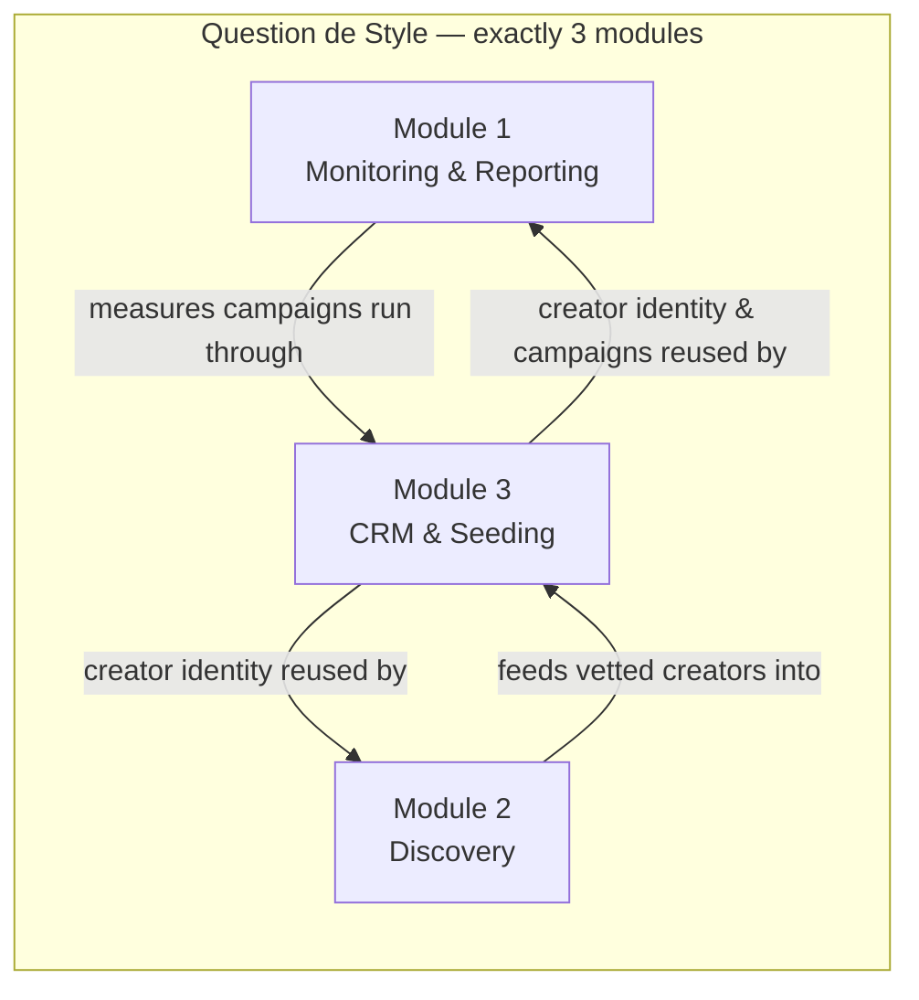

# QDS Vision and Scope

## 1. What "Question de Style" (QDS) is

"Question de Style" (QDS) is an AI-powered **influencer-intelligence platform**. It is an internal operating system for a single professional influencer-marketing **agency** that plans, runs, and reports on paid and gifted creator campaigns. QDS ingests public data about creators and their content across social platforms, enriches it with AI (classification, sentiment, brand recognition, scoring), and turns it into decisions the agency can act on: who to work with, what a campaign achieved, and how the relationship with each creator is managed over time.

QDS is **not** a public product, a self-serve SaaS, or a consumer app. It is a back-office intelligence and workflow tool for agency staff. The only externally-facing surface is read-only, approved reporting for the agency's own clients (see the `CLIENT_VIEWER` role behaviour described in [module-3-crm-seeding.md](../50-modules/module-3-crm-seeding.md)). *(v1 scope [[ADR-0016](../05-decisions/decision-log.md#adr-0016)]: the agency will have **no external clients** — this surface is dropped from v1; `CLIENT_VIEWER` remains a deny-everything role confined to an empty reports area.)*

This document is the zero-context business primer. It defines **why** QDS exists and **what** the three modules are. It defines no data shapes, no fields, and no enums. For the detailed scope map (every feature, which sources feed it, whether it is Active or Deferred, and its REQ-ID), read [01-modules-overview.md](01-modules-overview.md).

## 2. Who uses it (the DACH agency)

QDS serves one customer: a **DACH influencer-marketing agency**. DACH means the German-speaking market — **D**eutschland (Germany), **A**ustria, and the German-speaking part of the **CH** (Switzerland). Two consequences follow directly from this and are treated as first-class constraints, not afterthoughts:

- **Language.** Much of the monitored content is in German. AI enrichment (for example spoken-brand and speech transcription) must handle German. The frozen provider stack reflects this — German speech models are enabled in the source contracts (see [00-data-source-matrix.md](../40-integrations/00-data-source-matrix.md)).
- **Jurisdiction.** Creators and their audiences are largely in the EU. Storing personal data about EU creators is a documented, enforced constraint, not a "nice to have". This is single-sourced as a cross-cutting principle — see [00-data-principles.md](../20-cross-cutting/00-data-principles.md).

The people inside the agency who use QDS hold distinct responsibilities — account direction, campaign management, influencer relations, analysis, administration, and (read-only) client viewing *(unstaffed in v1 — no external clients, [ADR-0016](../05-decisions/decision-log.md#adr-0016); the role stays defined, deny-everything)*. Those responsibilities are modelled as roles and permissions in Module 3; the canonical list of role names lives in the glossary and the permission behaviour is specified in [module-3-crm-seeding.md](../50-modules/module-3-crm-seeding.md). This document does not restate them.

## 3. The problem QDS solves

Influencer marketing at agency scale is drowning in fragmented, low-trust, perishable data. Today the agency stitches this together by hand across spreadsheets, screenshots, and platform dashboards. QDS exists to fix five concrete pains:

| # | Pain today | What QDS provides |
|---|------------|-------------------|
| P1 | Brand mentions are scattered across platforms and easy to miss; stories vanish after 24h. | Continuous monitoring of brands, campaigns, hashtags and handles, with stories archived **before** they expire. |
| P2 | It is unclear whether a mention was paid, gifted, or genuinely organic — and guessing wrong misleads clients. | AI classification of mention type with mandatory human review, and a rule that organic is **never asserted as fact**. |
| P3 | Reported "reach" mixes hard numbers with vendor estimates, eroding trust. | Every metric is explicitly tiered so an estimate is never presented as a confirmed fact (see [00-data-principles.md](../20-cross-cutting/00-data-principles.md)). |
| P4 | Finding and vetting creators is slow, manual, and biased by follower count alone. | Search, geographic and sector classification, authenticity estimation, and configurable per-brand suitability scoring — every inferred value carrying a confidence assessment. |
| P5 | Creator relationships, contacts, campaigns, gifting logistics, and results live in disconnected tools. | A central CRM with cross-platform identity merge, seeding/shipment tracking, results, tasks, and documents. |

Two doctrines run through all five and are the philosophical core of the product, single-sourced in the decision log as **[ADR-0008](../05-decisions/decision-log.md#adr-0008)** and enforced as data principles: **provenance-first** (every externally-sourced record records where it came from) and **confidence-first** (every inferred or estimated value carries a confidence assessment and is reviewable/correctable by a human). QDS is deliberately honest about what it knows versus what it guesses.

## 4. The exactly-3-modules law

QDS is composed of **exactly three modules — no more, no fewer**. This is a hard architectural and product boundary, not a suggestion. Any proposed capability must fit inside one of these three modules or it is out of scope for v1. There is no "Module 4"; new ambitions are recorded as deferred items (see [01-deferred-register.md](../20-cross-cutting/01-deferred-register.md)) or as decisions, never as a fourth module.

The three modules are complementary lenses on the same creator economy: **Module 1 looks at what is happening now** (monitoring live activity and reporting on it), **Module 2 looks at who to work with next** (discovering and evaluating creators), and **Module 3 holds the durable record and the operational workflow** (the CRM and gifting/seeding engine). They share a common creator identity and a common set of tiered, provenance-bearing metrics rather than each maintaining its own copy. How responsibility for each data entity is split across the modules — who may write it versus who only reads it — is single-sourced in the [ownership matrix](../70-shared/00-ownership-matrix.md) and must not be inferred from the narrative below.

### Module 1 — Monitoring & Reporting

Module 1 is the agency's **listening and measurement** layer. It continuously watches defined subjects — brands, products, campaigns, hashtags, handles, abbreviations, and spelling variants — and collects the public content (posts and reels) and stories that mention them, archiving stories before they expire. It classifies each mention as paid, seeded, or likely-organic (with AI plus manual correction, and never claiming organic as certain), recognises brands inside content via OCR, logo, spoken-brand and on-screen-text detection, analyses sentiment and audience comment reactions, and computes performance — public metrics plus transparently-derived rates and clearly-labelled estimated reach, tracked historically. It rolls all of this into dashboards and exportable reports (Earned Media Value included). Full feature list and REQ-IDs: [module-1-monitoring.md](../50-modules/module-1-monitoring.md).

### Module 2 — Discovery

Module 2 is the agency's **find-and-vet** layer. It searches for creators by keyword, hashtag, topic, mention, or similarity, then filters and profiles them using only defensible public-derived signals. It attributes geography with confidence, classifies creators into multiple sectors with relevance, analyses performance using both average and median, estimates audience quality and authenticity from public signals, detects previous brand collaborations, and scores suitability against configurable per-brand models. Creators can be compared side by side and gathered into shortlists that feed the CRM. Audience demographics (country/age/gender) are explicitly **deferred** for v1 — see [01-deferred-register.md](../20-cross-cutting/01-deferred-register.md). Full feature list and REQ-IDs: [module-2-discovery.md](../50-modules/module-2-discovery.md).

### Module 3 — CRM & Seeding

Module 3 is the agency's **system of record and operational engine**. It is the central influencer database and the authority on creator identity, merging one creator's presence across platforms into a single record. It manages contacts and addresses (entered manually in v1 — auto-extraction is deferred), brand preferences and restrictions, relationship and communication history, campaigns, and seeding campaigns spanning gifting, gifting-with-post, paid-plus-product, and organic arrangements — including shipment tracking, automatic content-to-campaign matching, and campaign results (content counts, views, engagement, tiered reach, EMV, CPE, CPM). It also holds documents, tasks and follow-ups, and the role-and-permission model that governs who sees what — including read-only client viewers limited to approved reports for their own brands *(dropped from v1 — no external clients, [ADR-0016](../05-decisions/decision-log.md#adr-0016))*. Full feature list and REQ-IDs: [module-3-crm-seeding.md](../50-modules/module-3-crm-seeding.md).

## 5. What is deliberately out of scope for v1

To keep the exactly-3-modules boundary meaningful, several capabilities are intentionally excluded from the first version and must render as "unavailable" (never empty or zero) rather than being faked. These are single-sourced in the [deferred register](../20-cross-cutting/01-deferred-register.md) and backed by decisions in the [decision log](../05-decisions/decision-log.md): audience demographics, automatic contact extraction, true confirmed unique reach and impressions, and OAuth authorized-creator analytics flows. QDS ships an honest v1 built entirely on a frozen, public-data provider stack (see **[ADR-0001](../05-decisions/decision-log.md#adr-0001)**) rather than a speculative one.

## 6. Where to go next

- Scope map — every feature to its sources, Active/Deferred status, and REQ-ID: [01-modules-overview.md](01-modules-overview.md)
- The doctrines that constrain every module: [00-data-principles.md](../20-cross-cutting/00-data-principles.md)
- Who owns which data entity: [00-ownership-matrix.md](../70-shared/00-ownership-matrix.md)
- The decisions that froze this scope: [decision-log.md](../05-decisions/decision-log.md)
- Build sequence and phases: [00-roadmap.md](../80-delivery/00-roadmap.md)