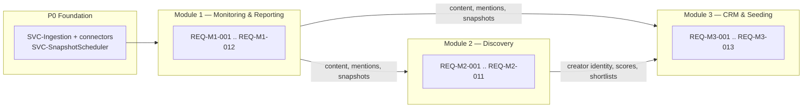

# Modules Overview — Scope Map

This file is the **anti-scope-drift scope map**. It enumerates **every** requirement
(REQ-*) across the exactly-three modules and, for each one, states:

1. the external data **source(s)** it consumes (SRC-* names, canonical in
   [data-source-matrix](../40-integrations/00-data-source-matrix.md));
2. whether it is **Active** in v1 or **Deferred** (deferred parts link to their
   DEF-* entry in the [deferred-register](../20-cross-cutting/01-deferred-register.md));
3. the **owning module** (M1/M2/M3).

## What this file is — and is NOT canonical for

- **Canonical here:** the feature → source → Active/Deferred mapping (the scope map).
- **NOT restated here (link only):**
  - The exactly-three-modules law and business framing → [vision-and-scope](00-vision-and-scope.md).
  - Full per-source contracts, capabilities, and the capability→source matrix →
    [data-source-matrix](../40-integrations/00-data-source-matrix.md).
  - Deferred item rationale and the "unavailable, never empty/zero" UI rule →
    [deferred-register](../20-cross-cutting/01-deferred-register.md).
  - Entity write-ownership (which module WRITES an entity) →
    [ownership-matrix](../70-shared/00-ownership-matrix.md). "Owning module" columns
    below refer to the **module that owns the REQ**, not entity write-authority.
  - Phase (P0..P4) and status-per-phase traceability →
    [roadmap](../80-delivery/00-roadmap.md) and
    [req-matrix](../90-traceability/00-req-matrix.md) (the canonical REQ → phase →
    status ledger). This file does **not** assert phase or build-status; it asserts scope.
  - Detailed behaviour of each REQ → the module specs
    ([M1](../50-modules/module-1-monitoring.md),
    [M2](../50-modules/module-2-discovery.md),
    [M3](../50-modules/module-3-crm-seeding.md)).

> **Reconciliation contract.** Every REQ-* below appears in exactly one module, matching
> the module specs and the [req-matrix](../90-traceability/00-req-matrix.md). Every
> "Deferred" cell maps to a DEF-* in the
> [deferred-register](../20-cross-cutting/01-deferred-register.md). If any of these three
> files disagree, that is a lint failure — this scope map is the source of truth for the
> feature→source mapping.

## Module map

## Source-name key

All source cells reference these SRC-* IDs by name; full contracts live in the
[data-source-matrix](../40-integrations/00-data-source-matrix.md):

- [SRC-apify-instagram-scraper](../40-integrations/00-data-source-matrix.md#src-apify-instagram-scraper)
- [SRC-apify-instagram-reel-scraper](../40-integrations/00-data-source-matrix.md#src-apify-instagram-reel-scraper)
- [SRC-apify-instagram-profile-scraper](../40-integrations/00-data-source-matrix.md#src-apify-instagram-profile-scraper)
- [SRC-apify-instagram-post-scraper](../40-integrations/00-data-source-matrix.md#src-apify-instagram-post-scraper)
- [SRC-apify-instagram-comment-scraper](../40-integrations/00-data-source-matrix.md#src-apify-instagram-comment-scraper)
- [SRC-apify-instagram-story-details](../40-integrations/00-data-source-matrix.md#src-apify-instagram-story-details)
- [SRC-clockworks-tiktok-scraper](../40-integrations/00-data-source-matrix.md#src-clockworks-tiktok-scraper) (the ONLY TikTok source)
- [SRC-youtube-data-api-v3](../40-integrations/00-data-source-matrix.md#src-youtube-data-api-v3)
- [SRC-google-cloud-vision](../40-integrations/00-data-source-matrix.md#src-google-cloud-vision)
- [SRC-google-speech-to-text](../40-integrations/00-data-source-matrix.md#src-google-speech-to-text)
- [SRC-google-video-intelligence](../40-integrations/00-data-source-matrix.md#src-google-video-intelligence) (OPTIONAL)

Some requirements consume **no external source** — they compute over already-ingested
records (each carrying its Provenance) or are internal-only. These are marked
**"Internal (no external SRC)"**. Historical growth has **no external source**: it is
produced by recurring timestamped `MetricSnapshot` records via `SVC-SnapshotScheduler`.

---

## Module 1 — Monitoring & Reporting (owner: M1)

Full spec: [module-1-monitoring](../50-modules/module-1-monitoring.md).

| REQ-ID | Feature | Source(s) consumed | Scope | Owner |
|---|---|---|---|---|
| REQ-M1-001 | Roster monitoring — track agency creators (reach, followers, likes, comments, last post) + detect seeded-product content | SRC-apify-instagram-scraper, SRC-apify-instagram-profile-scraper, SRC-clockworks-tiktok-scraper, SRC-youtube-data-api-v3 (per-creator polling) | **Active** | M1 |
| REQ-M1-002 | Paid/seeded/organic mention classification (AI + manual correction; `ENUM-MentionType`) | Internal (no external SRC) — AI classification over ingested content | **Active** | M1 |
| REQ-M1-003 | Public content collection (posts/reels) | SRC-apify-instagram-scraper, SRC-apify-instagram-post-scraper, SRC-apify-instagram-reel-scraper, SRC-clockworks-tiktok-scraper, SRC-youtube-data-api-v3 | **Active** | M1 |
| REQ-M1-004 | Story monitoring and archival before expiry | SRC-apify-instagram-story-details | **Active** | M1 |
| REQ-M1-005 | Performance metrics (`PUBLIC`) plus `DERIVED` rates (engagement/view/comment) | SRC-apify-instagram-scraper, SRC-apify-instagram-reel-scraper, SRC-clockworks-tiktok-scraper, SRC-youtube-data-api-v3 (PUBLIC counts); rates are `DERIVED`, computed internally | **Active** | M1 |
| REQ-M1-006 | Reach & impressions tiering | PUBLIC views/plays from the content sources above; ESTIMATED reach computed internally | **Active** for PUBLIC views + labelled `ESTIMATED` reach; **CONFIRMED** unique reach/impressions **Deferred** → [DEF-003](../20-cross-cutting/01-deferred-register.md#def-003) | M1 |
| REQ-M1-007 | Historical performance tracking | Internal (no external SRC) — recurring `MetricSnapshot` via `SVC-SnapshotScheduler` | **Active** | M1 |
| REQ-M1-008 | Brand recognition in content (OCR/logo/speech/on-screen; low-confidence → review queue) | SRC-google-cloud-vision (OCR + logo), SRC-google-speech-to-text (spoken brand), SRC-google-video-intelligence (OPTIONAL, video-wide text+logo) | **Active** (Video Intelligence optional) | M1 |
| REQ-M1-009 | Sentiment and context analysis (+ manual correction) | Internal (no external SRC) — AI over ingested content/comments | **Active** | M1 |
| REQ-M1-010 | Comment and audience-reaction analysis | — (not collected in v1) | **Deferred** ([DEF-005](../20-cross-cutting/01-deferred-register.md#def-005)) | M1 |
| REQ-M1-011 | EMV calculation (configurable, transparent; report shows model + rates) | Internal (no external SRC) — computed over PUBLIC/DERIVED metrics | **Active** | M1 |
| REQ-M1-012 | Dashboards & reporting (filters; exports PDF/Excel/CSV) | Internal (no external SRC) — `SVC-Export`, `ENUM-ExportFormat` | **Active** | M1 |

---

## Module 2 — Discovery (owner: M2)

Full spec: [module-2-discovery](../50-modules/module-2-discovery.md).

| REQ-ID | Feature | Source(s) consumed | Scope | Owner |
|---|---|---|---|---|
| REQ-M2-001 | Influencer search (keyword/hashtag/topic/mention/similar) | SRC-apify-instagram-scraper (search), SRC-clockworks-tiktok-scraper (keyword search: videos+profiles), SRC-youtube-data-api-v3 (search) | **Active** | M2 |
| REQ-M2-002 | Advanced filters | Public-derived signals from SRC-apify-instagram-profile-scraper, SRC-clockworks-tiktok-scraper, SRC-youtube-data-api-v3 | **Active** for public-derived filters; **audience country / age / gender filters Deferred** → [DEF-001](../20-cross-cutting/01-deferred-register.md#def-001) | M2 |
| REQ-M2-003 | Geographic attribution with confidence (`GeoAttribution`, carries `ConfidenceAssessment`) | SRC-apify-instagram-profile-scraper (bio/links), SRC-clockworks-tiktok-scraper, SRC-youtube-data-api-v3 (public profile signals) | **Active** | M2 |
| REQ-M2-004 | Unified creator profile | Aggregates all public sources above + internal enrichment | **Active** | M2 |
| REQ-M2-005 | AI sector classification (multi-label + relevance %; `SectorClassification`, `ENUM-SectorLabel`) | Internal (no external SRC) — AI over ingested content | **Active** | M2 |
| REQ-M2-006 | Performance analysis (average AND median) | Internal (no external SRC) — `DERIVED` from `MetricSnapshot` / ingested PUBLIC metrics | **Active** | M2 |
| REQ-M2-007 | Audience-quality / authenticity estimation (public signals; risk/quality score, carries `ConfidenceAssessment`) | Internal (no external SRC) — AI over public engagement/comment signals | **Active** | M2 |
| REQ-M2-008 | Previous brand-collaboration detection | Internal (no external SRC) — reads `Mention` records produced by M1 | **Active** | M2 |
| REQ-M2-009 | Influencer suitability scoring (configurable per-brand models; `SuitabilityScore`) | Internal (no external SRC) — AI/configurable models over enriched profile | **Active** | M2 |
| REQ-M2-010 | Influencer comparison | Internal (no external SRC) | **Active** | M2 |
| REQ-M2-011 | Shortlists (`Shortlist`) | Internal (no external SRC) | **Active** | M2 |

---

## Module 3 — CRM & Seeding (owner: M3)

Full spec: [module-3-crm-seeding](../50-modules/module-3-crm-seeding.md).

| REQ-ID | Feature | Source(s) consumed | Scope | Owner |
|---|---|---|---|---|
| REQ-M3-001 | Central influencer database + cross-platform identity merge (`Creator` system of record) | Internal (no external SRC) — merges records ingested from all sources | **Active** | M3 |
| REQ-M3-002 | Contact & address management (`Contact`) | Internal (manual entry). NOTE: SRC-apify-instagram-profile-scraper does **not** return email/phone | **Active** for manual entry; **contact auto-extraction Deferred** → [DEF-002](../20-cross-cutting/01-deferred-register.md#def-002) | M3 |
| REQ-M3-003 | Brand preferences and restrictions (`BrandPreference`) | Internal (no external SRC) | **Active** | M3 |
| REQ-M3-004 | Relationship & communication history (`ENUM-RelationshipStatus`, `CommunicationLog`) | Internal (no external SRC) | **Active** | M3 |
| REQ-M3-005 | Campaign & brand/product master data (`Campaign`, `Client`, `Brand`, `Product`, `ENUM-CampaignStatus`) | Internal (no external SRC) | **Active** | M3 |
| REQ-M3-006 | Seeding campaign management (gifting / gifting-with-post / paid+product / organic; `SeedingCampaign`, `ENUM-SeedingCampaignStatus`) | Internal (no external SRC) | **Active** | M3 |
| REQ-M3-007 | Shipment tracking (`Shipment`, `ENUM-ShipmentStatus`) | Courier APIs **optional** (not part of the frozen SRC-* registry) | **Active** (courier integration optional) | M3 |
| REQ-M3-008 | Automatic content-to-campaign matching (low-confidence → review queue) | Internal (no external SRC) — reads `ContentItem` / `Mention` from M1 | **Active** | M3 |
| REQ-M3-009 | Campaign & seeding results (content count, views, engagement, reach tiering, EMV, CPE, CPM) | Internal (no external SRC) — computed over M1 metrics/snapshots | **Active**; CONFIRMED reach within results still bounded by [DEF-003](../20-cross-cutting/01-deferred-register.md#def-003) | M3 |
| REQ-M3-010 | Documents & attachments (`DocumentAttachment`) | Internal (no external SRC) | **Active** | M3 |
| REQ-M3-011 | Tasks, deadlines, follow-ups (`Task`, `ENUM-TaskStatus`) | Internal (no external SRC) | **Active** | M3 |
| REQ-M3-012 | Roles & permissions (`ENUM-RoleName`; `CLIENT_VIEWER` sees only approved reports for their brands) | Internal (no external SRC) | **Active** for ADMIN-only User/Role management; **external `CLIENT_VIEWER` access dropped from v1** → [ADR-0016](../05-decisions/decision-log.md#adr-0016) (role stays defined, deny-everything) | M3 |
| REQ-M3-013 | Product-level seeding aggregation across influencers (total reach/views/EMV; `Product`, `ROLLUP-SeedingByProduct`) | Internal (no external SRC) — derived analytics | **Active** | M3 |

---

## Explicitly Deferred scope (restated for anti-drift)

The following are **out of v1 scope**. Per the
[deferred-register](../20-cross-cutting/01-deferred-register.md), deferred fields render
**"unavailable"** in the UI — never empty and never zero. Do not build these in v1.

| DEF-ID | Deferred capability | Where it surfaces in scope | Canonical rationale |
|---|---|---|---|
| [DEF-001](../20-cross-cutting/01-deferred-register.md#def-001) | Audience demographics — audience **country / age / gender** filters | REQ-M2-002 | Needs a specialist provider (Modash/HypeAuditor) |
| [DEF-002](../20-cross-cutting/01-deferred-register.md#def-002) | Creator **contact auto-extraction** (email/phone) | REQ-M3-002 | Manual CRM entry only in v1 |
| [DEF-003](../20-cross-cutting/01-deferred-register.md#def-003) | True **unique reach & impressions** (`CONFIRMED` reach) | REQ-M1-006, REQ-M3-009 | Private analytics; v1 shows PUBLIC views/plays + labelled `ESTIMATED` reach only |
| [DEF-004](../20-cross-cutting/01-deferred-register.md#def-004) | **OAuth authorized-creator analytics** (Meta/TikTok/YouTube Insights) | Cross-cutting (blocks any CONFIRMED-tier analytics flow; not tied to a single v1 REQ) | Authorized-creator OAuth flows deferred |
| [DEF-005](../20-cross-cutting/01-deferred-register.md#def-005) | **Comment collection & audience-reaction analysis** | REQ-M1-010 | Deferred on cost grounds ([ADR-0009](../05-decisions/decision-log.md#adr-0009)); ~half of ingestion volume |
| [DEF-006](../20-cross-cutting/01-deferred-register.md#def-006) | **Open-web brand/keyword/hashtag listening** (non-roster creators) | REQ-M1-001 | Monitoring is roster-first ([ADR-0011](../05-decisions/decision-log.md#adr-0011)); open-web listening deferred |

For the underlying data doctrine behind these boundaries — metric tiering, provenance,
and confidence — see [data-principles](../20-cross-cutting/00-data-principles.md) and
the [decision-log](../05-decisions/decision-log.md).

## Cross-references

- Business framing & the exactly-three-modules law → [vision-and-scope](00-vision-and-scope.md)
- Entity shapes & metric tiers → [data-model](../30-data-model/00-data-model.md)
- Enum values → [glossary](../00-meta/03-glossary.md)
- Entity write-ownership tiebreaker → [ownership-matrix](../70-shared/00-ownership-matrix.md)
- Phases, sequence rationale, risks → [roadmap](../80-delivery/00-roadmap.md)
- REQ → phase → status traceability → [req-matrix](../90-traceability/00-req-matrix.md)