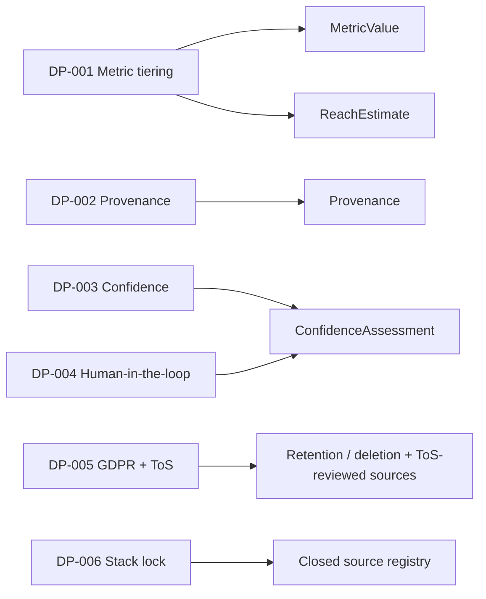

# Cross-Cutting Data Principles

This file is the canonical home of the data principles `DP-001` .. `DP-006`. Every
module (Monitoring, Discovery, CRM & Seeding) and every service MUST obey these
principles. They are cross-cutting: they apply regardless of platform, source, or
feature.

Nothing here restates an enum value or an entity field. Enum values are canonical in
[00-meta/03-glossary.md](../00-meta/03-glossary.md); entity and envelope field shapes
are canonical in [30-data-model/00-data-model.md](../30-data-model/00-data-model.md).
When a principle needs a specific value or field, it links to those files.

## How to read a principle

Each principle below states the **rule** (what must always be true), the **why**
(the business/legal/data-quality reason), and **how a feature satisfies it** (the
concrete envelope, tier, or mechanism a coding agent must wire in, with links to the
canonical definition).

| ID | Principle | Enforced primarily by |
| --- | --- | --- |
| [DP-001](#dp-001-metric-tiering) | Metric tiering | data model `MetricValue` / `ReachEstimate` envelopes |
| [DP-002](#dp-002-provenance-mandatory) | Provenance mandatory | data model `Provenance` envelope |
| [DP-003](#dp-003-confidence-based-assessments) | Confidence-based assessments | data model `ConfidenceAssessment` envelope |
| [DP-004](#dp-004-human-in-the-loop) | Human-in-the-loop | verification status + correction storage |
| [DP-005](#dp-005-gdpr-and-platform-tos) | GDPR + platform ToS | retention/deletion + documented constraint |
| [DP-006](#dp-006-stack-lock) | Stack lock | closed provider registry |

---

## DP-001 Metric tiering

**Rule.** Every metric value carried anywhere in the system MUST be tagged with a
tier from `ENUM-MetricTier`
([values are canonical in the glossary](../00-meta/03-glossary.md#enum-metrictier)).
A metric is never surfaced tier-less, and an `ESTIMATED` metric is NEVER presented
as fact. In particular (fixed classification, single-sourced here and in the data
model):

- Directly observed public counts (views, plays, likes, comments, followers) are
  tier `PUBLIC`.
- **Engagement rate, average performance, and median performance are tier `DERIVED`
  — never `PUBLIC`.** They are deterministically computed from `PUBLIC` values.
- Modeled/inferred values such as estimated reach are tier `ESTIMATED`.
- Values from authorized analytics or manual agency input are tier `CONFIRMED`.
  True unique reach / impressions at `CONFIRMED` tier is out of v1 scope — see
  [DEF-003](./01-deferred-register.md) and [ADR-0006](../05-decisions/decision-log.md).

**Why.** The agency and its clients make spend decisions from these numbers.
Presenting a modeled estimate as an observed fact, or a derived rate as a raw
platform metric, produces false confidence and misattributed budget. Tiering keeps
the epistemic status of every number visible end to end.

**How a feature satisfies it.** Store scalar metrics using the
[`MetricValue` envelope](../30-data-model/00-data-model.md#metricvalue) (amount +
tier) and reach using the
[`ReachEstimate` envelope](../30-data-model/00-data-model.md#reachestimate)
(amount + tier + method). Never hand-roll a bare number. The tier travels with the
value into dashboards and exports, and every report that shows a derived or modeled
number must label its tier. Decision basis:
[ADR-0006](../05-decisions/decision-log.md).

---

## DP-002 Provenance mandatory

**Rule.** Every externally-sourced record MUST carry the
[`Provenance` envelope](../30-data-model/00-data-model.md#provenance). No record that
originates from an external source may exist without it. Provenance identifies the
originating source (a `SRC-*` id from the
[data source matrix](../40-integrations/00-data-source-matrix.md)), the fetch
timestamp, and the source version.

**Why.** Scrapers and third-party APIs change, break, and disagree. Without
provenance the agency cannot audit a number, reproduce it, detect scraper breakage,
or defend a figure to a client. Provenance is also the anchor for cost and
rate-limit governance and for data-quality monitoring in later hardening work.

**How a feature satisfies it.** The ingestion service writes the `Provenance`
envelope on every raw record at fetch time; downstream domain records preserve it.
The list of legal sources that may appear in provenance is closed and canonical in
[40-integrations/00-data-source-matrix.md](../40-integrations/00-data-source-matrix.md);
do not invent a source id. Decision basis:
[ADR-0008](../05-decisions/decision-log.md).

---

## DP-003 Confidence-based assessments

**Rule.** Inferred or estimated judgements are NEVER stored or shown as facts. In
particular, geographic location, authenticity, sector, and organic-vs-paid
classification each MUST carry a
[`ConfidenceAssessment` envelope](../30-data-model/00-data-model.md#confidenceassessment).
Consistent with this, a mention is only classified `PAID` or `SEEDED` when a
record or label proves it; otherwise it is `LIKELY_ORGANIC` or `UNKNOWN` —
organic is never asserted as fact
([`ENUM-MentionType` is canonical in the glossary](../00-meta/03-glossary.md#enum-mentiontype)).

**Why.** These values come from AI models and heuristics over public signals, not
from ground truth. Treating "probably located in Germany" or "looks authentic" as
certain would mislead targeting and suitability decisions. Carrying confidence keeps
the judgement honest and reviewable.

**How a feature satisfies it.** Wrap every inferred value in the
`ConfidenceAssessment` envelope, whose fields (value, confidence level, contributing
signals, verification status) are defined once in the data model. The level uses
[`ENUM-ConfidenceLevel`](../00-meta/03-glossary.md#enum-confidencelevel) and the
verification state uses
[`ENUM-VerificationStatus`](../00-meta/03-glossary.md#enum-verificationstatus) —
whose valid AI value is `AI_ASSESSED`. Decision basis:
[ADR-0008](../05-decisions/decision-log.md).

---

## DP-004 Human-in-the-loop

**Rule.** Every AI-produced output MUST be reviewable and correctable by a human.
When a human corrects an AI output, the correction is stored (it does not silently
overwrite provenance of the original judgement) and feeds back into future rules.
Low-confidence AI outputs (e.g. brand recognition, content-to-campaign matching)
route to a review queue rather than being auto-accepted.

**Why.** AI classification, sentiment, recognition, and matching are probabilistic.
A closed loop where corrections are captured and reused is what lets accuracy
improve over time and gives the agency accountable control over what clients see.

**How a feature satisfies it.** Assessments track their review state through
[`ENUM-VerificationStatus`](../00-meta/03-glossary.md#enum-verificationstatus)
(from `UNVERIFIED` / `AI_ASSESSED` through `HUMAN_REVIEWED` / `HUMAN_CORRECTED` /
`CONFIRMED`) inside the
[`ConfidenceAssessment` envelope](../30-data-model/00-data-model.md#confidenceassessment).
The enrichment service exposes human-review hooks, and corrected values are
persisted so later runs can learn from them. Decision basis:
[ADR-0008](../05-decisions/decision-log.md).

---

## DP-005 GDPR and platform ToS

**Rule.** Storing personal data of EU creators is a documented constraint, not an
afterthought. The platform MUST support data-subject deletion and enforce retention
limits, and MUST respect the terms of service of every data source it reads.

**Why.** The subjects are EU-based influencers, so GDPR applies to their personal
data, and the public sources are governed by platform ToS. Deletion, retention, and
ToS compliance are legal obligations; ignoring them is a business and legal risk.

**How a feature satisfies it.** Personal data is stored only where a lawful basis and
retention policy exist; deletion and retention tooling is delivered as part of the
hardening phase in the [roadmap](../80-delivery/00-roadmap.md). Contact detail
handling is manual-entry only in v1 (auto-extraction is deferred — see
[DEF-002](./01-deferred-register.md)), which limits the personal data the system
ingests. Source usage stays inside the closed, ToS-reviewed provider set in the
[data source matrix](../40-integrations/00-data-source-matrix.md).

---

## DP-006 Stack lock

**Rule.** The v1 provider stack is frozen. Coding agents MUST NOT introduce, call, or
assume any external provider outside the approved set. New providers require a new
decision record.

**Why.** Provider sprawl breaks cost control, ToS review, and reproducibility, and it
is a common failure mode for AI agents (hallucinating a plausible-sounding API). A
locked stack keeps the build inside a reviewed, budgeted, legally-cleared perimeter.

**How a feature satisfies it.** Only the sources enumerated in the closed registry at
[40-integrations/00-data-source-matrix.md](../40-integrations/00-data-source-matrix.md)
may be used, and every fetched record ties back to one of them through
[DP-002](#dp-002-provenance-mandatory). The frozen stack is decided in
[ADR-0001](../05-decisions/decision-log.md); TikTok being Apify-only is
[ADR-0002](../05-decisions/decision-log.md), and the absence of an external history
API (snapshots instead) is [ADR-0003](../05-decisions/decision-log.md).

---

## Principle-to-envelope map

Envelope shapes (`Provenance`, `ConfidenceAssessment`, `MetricValue`,
`ReachEstimate`) are defined once in
[30-data-model/00-data-model.md](../30-data-model/00-data-model.md). This file governs
*when* and *why* they are required; the data model governs *what fields* they carry.