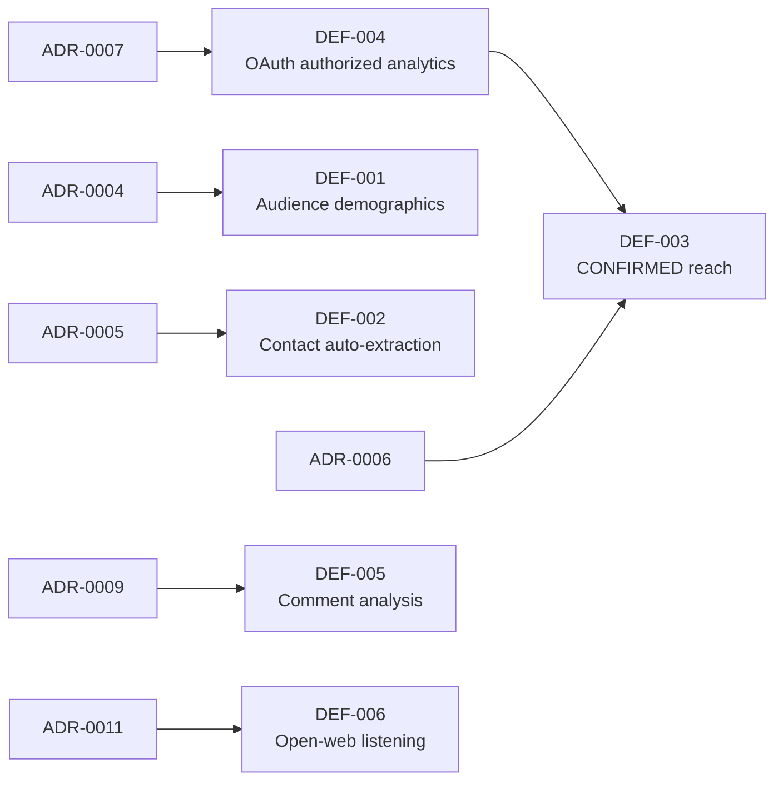

# Deferred Register

This file is the **single canonical authority** for every deferred capability in Question de Style (QDS). A deferred capability is one that is intentionally **out of v1 scope**: it must not be built, must not be cited as an available fact, and is tracked here under a stable `DEF-<NNN>` id.

Nothing outside this file defines or restates the deferred list. Module specs, the data model, the data-source matrix, and the roadmap **link here** rather than re-describing what is deferred. Each deferred item is anchored to an approved decision in the [decision log](../05-decisions/decision-log.md); the reason a capability is deferred lives in that ADR, and the constraint it enforces lives in [data principles](00-data-principles.md).

## Mandatory UI rule (stated once, applies to every DEF-*)

> **A deferred field renders "unavailable" — never empty, never blank, and never zero.**

A missing value for a deferred capability is not the same as a value of zero. Zero is a real measurement; "unavailable" communicates that QDS v1 does not collect or compute the field at all. Every UI surface, export, and API response that could expose a deferred field MUST render the explicit "unavailable" state so that no reader mistakes an unimplemented capability for a real zero, empty, or null result. This rule is the single home for the unavailable-never-empty behaviour; other documents reference it here.

## How this relates to status vocabulary

A deferred capability is distinct from a merely unbuilt one. Per the [status lifecycle](../00-meta/02-status-lifecycle.md), an item that is `DEFERRED` in [ENUM-DocStatus](../00-meta/03-glossary.md#enum-docstatus) is out of v1 scope by decision, must not be built, must show the "unavailable" UI state, and must map to a `DEF-*` id in this register. Every entry below is therefore both a scope decision (in the [decision log](../05-decisions/decision-log.md)) and a UI contract (the rule above).

## Deferred register (canonical)

| DEF id | Deferred capability | Governing ADR | Enforcing principle |
| --- | --- | --- | --- |
| [DEF-001](#def-001) | Audience demographics (audience country / age / gender) | [ADR-0004](../05-decisions/decision-log.md#adr-0004) | — |
| [DEF-002](#def-002) | Creator contact auto-extraction (email / phone) | [ADR-0005](../05-decisions/decision-log.md#adr-0005) | — |
| [DEF-003](#def-003) | True unique reach and impressions (CONFIRMED reach) | [ADR-0006](../05-decisions/decision-log.md#adr-0006) | [DP-001](00-data-principles.md#dp-001) |
| [DEF-004](#def-004) | OAuth authorized-creator analytics flows | [ADR-0007](../05-decisions/decision-log.md#adr-0007) | — |
| [DEF-005](#def-005) | Comment collection & audience-reaction analysis (REQ-M1-010) | [ADR-0009](../05-decisions/decision-log.md#adr-0009) | — |
| [DEF-006](#def-006) | Open-web brand/keyword/hashtag listening (mentions from non-roster creators) | [ADR-0011](../05-decisions/decision-log.md#adr-0011) | — |

---

### DEF-001

**Audience demographics — audience country, age, and gender distribution.**

- **What is deferred.** Any breakdown of a creator's *audience* (followers/viewers) by geography, age band, or gender. This is audience-side demographic data, not the creator's own attributes. Note the distinction from [REQ-M2-003](../90-traceability/00-req-matrix.md) geographic attribution, which infers the *creator's* location (via [GeoAttribution](../30-data-model/00-data-model.md)) and IS in scope; DEF-001 concerns the *audience's* demographics, which is not.
- **Why it is deferred.** The frozen v1 provider stack (see [ADR-0001](../05-decisions/decision-log.md#adr-0001)) contains no source that returns reliable audience demographics from public data. Producing this data requires a specialist audience-intelligence provider.
- **What would be needed later.** Integration of a specialist provider (for example Modash or HypeAuditor) as a new `SRC-*` contract in the [data-source matrix](../40-integrations/00-data-source-matrix.md), plus the confidence and provenance envelopes required by [DP-002](00-data-principles.md#dp-002) and [DP-003](00-data-principles.md#dp-003).
- **Linked decision.** [ADR-0004](../05-decisions/decision-log.md#adr-0004) (Status APPROVED).
- **UI behaviour.** Audience-demographic fields render **"unavailable"** per the rule above.

### DEF-002

**Creator contact auto-extraction — automatic capture of email and phone.**

- **What is deferred.** Automatic extraction or scraping of a creator's email address or phone number. In v1, contact details are entered **manually** into the CRM only, per [REQ-M3-002](../90-traceability/00-req-matrix.md).
- **Why it is deferred.** The profile sources in the stack do not return contact details — for example [SRC-apify-instagram-profile-scraper](../40-integrations/00-data-source-matrix.md#src-apify-instagram-profile-scraper) explicitly does not return email or phone. Auto-extracting personal contact data also carries GDPR and platform-ToS exposure governed by [DP-005](00-data-principles.md#dp-005).
- **What would be needed later.** A compliant contact-enrichment source and an extraction pipeline that satisfies the data-subject and retention constraints in [DP-005](00-data-principles.md#dp-005).
- **Linked decision.** [ADR-0005](../05-decisions/decision-log.md#adr-0005) (Status APPROVED).
- **UI behaviour.** When no contact has been entered manually, auto-derived contact fields render **"unavailable"** (never empty), distinct from a manually-entered-but-blank field.

### DEF-003

**True unique reach and impressions — CONFIRMED-tier reach.**

- **What is deferred.** Genuine unique reach and impression counts — the `CONFIRMED` tier of [ENUM-MetricTier](../00-meta/03-glossary.md#enum-metrictier) for reach. These derive from a creator's private analytics and cannot be observed publicly.
- **What v1 shows instead.** v1 exposes `PUBLIC` observed views/plays and a clearly-labelled `ESTIMATED` reach only. Per [REQ-M1-006](../90-traceability/00-req-matrix.md), estimated reach is carried as a [ReachEstimate](../30-data-model/00-data-model.md) at the `ESTIMATED` tier and is **never** presented as fact, in line with [DP-001](00-data-principles.md#dp-001) metric tiering.
- **Why it is deferred.** No source in the frozen stack yields private, authorized reach. `CONFIRMED` reach requires access to creator-authorized analytics, which is itself deferred under [DEF-004](#def-004).
- **What would be needed later.** The authorized-analytics flows of [DEF-004](#def-004), from which `CONFIRMED`-tier reach can be sourced.
- **Linked decision.** [ADR-0006](../05-decisions/decision-log.md#adr-0006) (Status APPROVED).
- **UI behaviour.** A `CONFIRMED` reach figure renders **"unavailable"**; the `ESTIMATED` figure is shown only with its tier label so it is never mistaken for confirmed truth.

### DEF-004

**OAuth authorized-creator analytics flows.**

- **What is deferred.** OAuth-based, creator-authorized access to first-party analytics: Meta (Instagram) Insights, TikTok, and YouTube Insights. These require an individual creator to grant QDS delegated access to their private analytics.
- **Why it is deferred.** v1 is a public-signal platform. Authorized-analytics onboarding is a separate consent, integration, and compliance workstream outside the frozen v1 stack ([ADR-0001](../05-decisions/decision-log.md#adr-0001)); see also the TikTok API constraints recorded in [ADR-0002](../05-decisions/decision-log.md#adr-0002).
- **What would be needed later.** Per-platform OAuth consent flows, secure token storage, and analytics connectors added as new `SRC-*` contracts in the [data-source matrix](../40-integrations/00-data-source-matrix.md). Unlocking DEF-004 is the prerequisite that enables `CONFIRMED`-tier metrics including [DEF-003](#def-003).
- **Linked decision.** [ADR-0007](../05-decisions/decision-log.md#adr-0007) (Status APPROVED).
- **UI behaviour.** Any field that would be populated only from authorized analytics renders **"unavailable"** until the flow exists.

### DEF-005

**Comment collection and audience-reaction analysis.**

- **What is deferred.** Bulk collection of public comments and all audience-reaction analysis built on them — comment volume, positive/negative reaction, frequent questions, purchase-interest signals, spam detection, and top audience themes (the whole of [REQ-M1-010](../90-traceability/00-req-matrix.md)). No `Comment` records are collected in v1.
- **Why it is deferred.** Comment collection is the single largest driver of ingestion volume and cost — roughly half of all scraped results at typical monitoring scale — while contributing the least differentiated value in v1. Collecting third-party commenter personal data at scale also widens the GDPR/ToS exposure governed by [DP-005](00-data-principles.md#dp-005).
- **What v1 does instead.** Sentiment ([REQ-M1-009](../90-traceability/00-req-matrix.md)) runs on captions/transcripts, not comment threads. Audience-quality/authenticity estimation ([REQ-M2-007](../90-traceability/00-req-matrix.md)) relies on non-comment public signals only (follower/engagement/view ratios, engagement patterns).
- **What would be needed later.** Re-activating [REQ-M1-010](../90-traceability/00-req-matrix.md) as **selective** collection — comments only on campaign/seeding/flagged content — plus the `Comment` write path and analysis pipeline. The `Comment` entity stays defined in the [data model](../30-data-model/00-data-model.md#ent-comment) but is not populated in v1.
- **Linked decision.** [ADR-0009](../05-decisions/decision-log.md#adr-0009) (Status APPROVED).
- **UI behaviour.** Comment-analysis panels and any comment-derived metric render **"unavailable"** (never empty/zero) per the rule above.

### DEF-006

**Open-web brand / keyword / hashtag listening (mentions from non-roster creators).**

- **What is deferred.** Broad social listening that finds brand/product/hashtag mentions from creators who are **not** on the agency's tracked-creator roster — open-web hashtag/keyword/handle search across all public creators (the `BRAND`/`KEYWORD`/`HASHTAG`/`HANDLE` subject types of [`ENUM-MonitoredSubjectType`](../00-meta/03-glossary.md#enum-monitoredsubjecttype)).
- **Why it is deferred.** v1 monitoring is **roster-first**: it focuses on the agency's own creators (their activity + seeded-product content), which is the primary business need and far cheaper than open-web listening, whose broad scraping cost scales with the whole platform rather than a known list.
- **What v1 does instead.** Module 1 monitors [`GL-Roster`](../00-meta/03-glossary.md#gl-roster) creators via `MonitoredSubject`s of type `CREATOR`: it polls each tracked creator's accounts and content, and detects the seeded-product posts/reels/stories among them ([REQ-M1-001](../90-traceability/00-req-matrix.md), [REQ-M1-003](../90-traceability/00-req-matrix.md)).
- **What would be needed later.** Activating the open-web subject types with broad hashtag/keyword search plus the associated cost/rate-limit governance.
- **Linked decision.** [ADR-0011](../05-decisions/decision-log.md#adr-0011) (Status APPROVED).
- **UI behaviour.** Open-web mention feeds and non-roster mention counts render **"unavailable"** per the rule above.

## Dependency map

DEF-003 cannot be delivered before DEF-004, because `CONFIRMED` reach can only originate from authorized-creator analytics.

## Related documents

- [decision-log.md](../05-decisions/decision-log.md) — the sole home of the ADRs that authorize each deferral.
- [00-data-principles.md](00-data-principles.md) — the `DP-*` principles that constrain what deferred data may not assert.
- [00-data-source-matrix.md](../40-integrations/00-data-source-matrix.md) — the closed provider registry; new `SRC-*` contracts here are what future work would add to lift a deferral.
- [00-roadmap.md](../80-delivery/00-roadmap.md) — where post-v1 phases may schedule the un-deferral of these items.