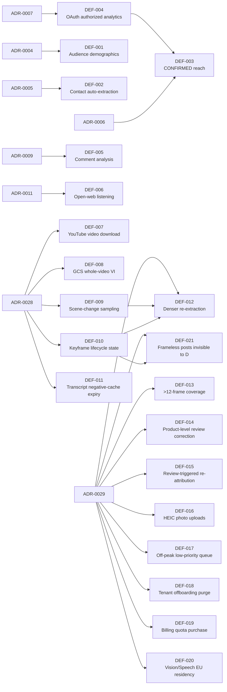

# Deferred Register

This file is the **single canonical authority** for every deferred capability in Question de Style (QDS). A deferred capability is one that is intentionally **out of v1 scope**: it must not be built, must not be cited as an available fact, and is tracked here under a stable `DEF-<NNN>` id.

Nothing outside this file defines or restates the deferred list. Module specs, the data model, the data-source matrix, and the roadmap **link here** rather than re-describing what is deferred. Each deferred item is anchored to an approved decision in the [decision log](../05-decisions/decision-log.md); the reason a capability is deferred lives in that ADR, and the constraint it enforces lives in [data principles](00-data-principles.md).

## Mandatory UI rule (stated once, applies to every DEF-*)

> **A deferred field renders "unavailable" — never empty, never blank, and never zero.**

A missing value for a deferred capability is not the same as a value of zero. Zero is a real measurement; "unavailable" communicates that QDS v1 does not collect or compute the field at all. Every UI surface, export, and API response that could expose a deferred field MUST render the explicit "unavailable" state so that no reader mistakes an unimplemented capability for a real zero, empty, or null result. This rule is the single home for the unavailable-never-empty behaviour; other documents reference it here.

## How this relates to status vocabulary

A deferred capability is distinct from a merely unbuilt one. Per the [status lifecycle](../00-meta/02-status-lifecycle.md), an item that is `DEFERRED` in [ENUM-DocStatus](../00-meta/03-glossary.md#enum-docstatus) is out of v1 scope by decision, must not be built, must show the "unavailable" UI state, and must map to a `DEF-*` id in this register. Every entry below is therefore both a scope decision (in the [decision log](../05-decisions/decision-log.md)) and a UI contract (the rule above).

## Deferred register (canonical)

| DEF id | Deferred capability | Governing ADR | Enforcing principle |
| --- | --- | --- | --- |
| [DEF-001](#def-001) | Audience demographics (audience country / age / gender) | [ADR-0004](../05-decisions/decision-log.md#adr-0004) | — |
| [DEF-002](#def-002) | Creator contact auto-extraction (email / phone) | [ADR-0005](../05-decisions/decision-log.md#adr-0005) | — |
| [DEF-003](#def-003) | True unique reach and impressions (CONFIRMED reach) | [ADR-0006](../05-decisions/decision-log.md#adr-0006) | [DP-001](00-data-principles.md#dp-001) |
| [DEF-004](#def-004) | OAuth authorized-creator analytics flows | [ADR-0007](../05-decisions/decision-log.md#adr-0007) | — |
| [DEF-005](#def-005) | Comment collection & audience-reaction analysis (REQ-M1-010) | [ADR-0009](../05-decisions/decision-log.md#adr-0009) | — |
| [DEF-006](#def-006) | Open-web brand/keyword/hashtag listening (mentions from non-roster creators) | [ADR-0011](../05-decisions/decision-log.md#adr-0011) | — |
| [DEF-007](#def-007) | Real YouTube video-file download (frame-level YouTube visual) | [ADR-0028](../05-decisions/decision-log.md#adr-0028) | — |
| [DEF-008](#def-008) | GCS-URI whole-video Video Intelligence for over-cap video | [ADR-0028](../05-decisions/decision-log.md#adr-0028) | [DP-005](00-data-principles.md#dp-005) |
| [DEF-009](#def-009) | Scene-change keyframe sampling (alternative `KeyframeSampler` mode) | [ADR-0028](../05-decisions/decision-log.md#adr-0028) | — |
| [DEF-010](#def-010) | Keyframe lifecycle state (`extracted` / `pruned` / `unavailable`) | [ADR-0028](../05-decisions/decision-log.md#adr-0028) | — |
| [DEF-011](#def-011) | Transcript negative-cache expiry / force-refresh | [ADR-0028](../05-decisions/decision-log.md#adr-0028) | — |
| [DEF-012](#def-012) | Denser keyframe re-extraction for visual matching | [ADR-0029](../05-decisions/decision-log.md#adr-0029) | — |
| [DEF-013](#def-013) | Long-video keyframe coverage beyond 12 frames | [ADR-0029](../05-decisions/decision-log.md#adr-0029) | — |
| [DEF-014](#def-014) | Product-level correction in the recognition review UI | [ADR-0029](../05-decisions/decision-log.md#adr-0029) | [DP-004](00-data-principles.md#dp-004) |
| [DEF-015](#def-015) | Human review re-triggering attribution | [ADR-0029](../05-decisions/decision-log.md#adr-0029) | — |
| [DEF-016](#def-016) | HEIC/HEIF reference-photo uploads (server-side transcoding) | [ADR-0029](../05-decisions/decision-log.md#adr-0029) | — |
| [DEF-017](#def-017) | Off-peak queue for low-priority AI work | [ADR-0029](../05-decisions/decision-log.md#adr-0029) | — |
| [DEF-018](#def-018) | Tenant offboarding data purge | [ADR-0029](../05-decisions/decision-log.md#adr-0029) | — |
| [DEF-019](#def-019) | Self-serve billing-plan AI-quota purchase | [ADR-0029](../05-decisions/decision-log.md#adr-0029) | — |
| [DEF-020](#def-020) | EU residency for the existing Vision/Speech clients | [ADR-0029](../05-decisions/decision-log.md#adr-0029) | — |
| [DEF-021](#def-021) | Shipped-but-frameless posts invisible to sub-project D's needs_verification poll | [ADR-0029](../05-decisions/decision-log.md#adr-0029) | — |

---

### DEF-001

**Audience demographics — audience country, age, and gender distribution.**

- **What is deferred.** Any breakdown of a creator's *audience* (followers/viewers) by geography, age band, or gender. This is audience-side demographic data, not the creator's own attributes. Note the distinction from [REQ-M2-003](../90-traceability/00-req-matrix.md) geographic attribution, which infers the *creator's* location (via [GeoAttribution](../30-data-model/00-data-model.md)) and IS in scope; DEF-001 concerns the *audience's* demographics, which is not.
- **Why it is deferred.** The frozen v1 provider stack (see [ADR-0001](../05-decisions/decision-log.md#adr-0001)) contains no source that returns reliable audience demographics from public data. Producing this data requires a specialist audience-intelligence provider.
- **What would be needed later.** Integration of a specialist provider (for example Modash or HypeAuditor) as a new `SRC-*` contract in the [data-source matrix](../40-integrations/00-data-source-matrix.md), plus the confidence and provenance envelopes required by [DP-002](00-data-principles.md#dp-002) and [DP-003](00-data-principles.md#dp-003).
- **Linked decision.** [ADR-0004](../05-decisions/decision-log.md#adr-0004) (Status APPROVED).
- **UI behaviour.** Audience-demographic fields render **"unavailable"** per the rule above.

### DEF-002

**Creator contact auto-extraction — automatic capture of email and phone.**

- **What is deferred.** Automatic extraction or scraping of a creator's email address or phone number. In v1, contact details are entered **manually** into the CRM only, per [REQ-M3-002](../90-traceability/00-req-matrix.md).
- **Why it is deferred.** The profile sources in the stack do not return contact details — for example [SRC-apify-instagram-profile-scraper](../40-integrations/00-data-source-matrix.md#src-apify-instagram-profile-scraper) explicitly does not return email or phone. Auto-extracting personal contact data also carries GDPR and platform-ToS exposure governed by [DP-005](00-data-principles.md#dp-005).
- **What would be needed later.** A compliant contact-enrichment source and an extraction pipeline that satisfies the data-subject and retention constraints in [DP-005](00-data-principles.md#dp-005).
- **Linked decision.** [ADR-0005](../05-decisions/decision-log.md#adr-0005) (Status APPROVED).
- **UI behaviour.** When no contact has been entered manually, auto-derived contact fields render **"unavailable"** (never empty), distinct from a manually-entered-but-blank field.

### DEF-003

**True unique reach and impressions — CONFIRMED-tier reach.**

- **What is deferred.** Genuine unique reach and impression counts — the `CONFIRMED` tier of [ENUM-MetricTier](../00-meta/03-glossary.md#enum-metrictier) for reach. These derive from a creator's private analytics and cannot be observed publicly.
- **What v1 shows instead.** v1 exposes `PUBLIC` observed views/plays and a clearly-labelled `ESTIMATED` reach only. Per [REQ-M1-006](../90-traceability/00-req-matrix.md), estimated reach is carried as a [ReachEstimate](../30-data-model/00-data-model.md) at the `ESTIMATED` tier and is **never** presented as fact, in line with [DP-001](00-data-principles.md#dp-001) metric tiering.
- **Why it is deferred.** No source in the frozen stack yields private, authorized reach. `CONFIRMED` reach requires access to creator-authorized analytics, which is itself deferred under [DEF-004](#def-004).
- **What would be needed later.** The authorized-analytics flows of [DEF-004](#def-004), from which `CONFIRMED`-tier reach can be sourced.
- **Linked decision.** [ADR-0006](../05-decisions/decision-log.md#adr-0006) (Status APPROVED).
- **UI behaviour.** A `CONFIRMED` reach figure renders **"unavailable"**; the `ESTIMATED` figure is shown only with its tier label so it is never mistaken for confirmed truth.

### DEF-004

**OAuth authorized-creator analytics flows.**

- **What is deferred.** OAuth-based, creator-authorized access to first-party analytics: Meta (Instagram) Insights, TikTok, and YouTube Insights. These require an individual creator to grant QDS delegated access to their private analytics.
- **Why it is deferred.** v1 is a public-signal platform. Authorized-analytics onboarding is a separate consent, integration, and compliance workstream outside the frozen v1 stack ([ADR-0001](../05-decisions/decision-log.md#adr-0001)); see also the TikTok API constraints recorded in [ADR-0002](../05-decisions/decision-log.md#adr-0002).
- **What would be needed later.** Per-platform OAuth consent flows, secure token storage, and analytics connectors added as new `SRC-*` contracts in the [data-source matrix](../40-integrations/00-data-source-matrix.md). Unlocking DEF-004 is the prerequisite that enables `CONFIRMED`-tier metrics including [DEF-003](#def-003).
- **Linked decision.** [ADR-0007](../05-decisions/decision-log.md#adr-0007) (Status APPROVED).
- **UI behaviour.** Any field that would be populated only from authorized analytics renders **"unavailable"** until the flow exists.

### DEF-005

**Comment collection and audience-reaction analysis.**

- **What is deferred.** Bulk collection of public comments and all audience-reaction analysis built on them — comment volume, positive/negative reaction, frequent questions, purchase-interest signals, spam detection, and top audience themes (the whole of [REQ-M1-010](../90-traceability/00-req-matrix.md)). No `Comment` records are collected in v1.
- **Why it is deferred.** Comment collection is the single largest driver of ingestion volume and cost — roughly half of all scraped results at typical monitoring scale — while contributing the least differentiated value in v1. Collecting third-party commenter personal data at scale also widens the GDPR/ToS exposure governed by [DP-005](00-data-principles.md#dp-005).
- **What v1 does instead.** Sentiment ([REQ-M1-009](../90-traceability/00-req-matrix.md)) runs on captions/transcripts, not comment threads. Audience-quality/authenticity estimation ([REQ-M2-007](../90-traceability/00-req-matrix.md)) relies on non-comment public signals only (follower/engagement/view ratios, engagement patterns).
- **What would be needed later.** Re-activating [REQ-M1-010](../90-traceability/00-req-matrix.md) as **selective** collection — comments only on campaign/seeding/flagged content — plus the `Comment` write path and analysis pipeline. The `Comment` entity stays defined in the [data model](../30-data-model/00-data-model.md#ent-comment) but is not populated in v1.
- **Linked decision.** [ADR-0009](../05-decisions/decision-log.md#adr-0009) (Status APPROVED).
- **UI behaviour.** Comment-analysis panels and any comment-derived metric render **"unavailable"** (never empty/zero) per the rule above.

### DEF-006

**Open-web brand / keyword / hashtag listening (mentions from non-roster creators).**

- **What is deferred.** Broad social listening that finds brand/product/hashtag mentions from creators who are **not** on the agency's tracked-creator roster — open-web hashtag/keyword/handle search across all public creators (the `BRAND`/`KEYWORD`/`HASHTAG`/`HANDLE` subject types of [`ENUM-MonitoredSubjectType`](../00-meta/03-glossary.md#enum-monitoredsubjecttype)).
- **Why it is deferred.** v1 monitoring is **roster-first**: it focuses on the agency's own creators (their activity + seeded-product content), which is the primary business need and far cheaper than open-web listening, whose broad scraping cost scales with the whole platform rather than a known list.
- **What v1 does instead.** Module 1 monitors [`GL-Roster`](../00-meta/03-glossary.md#gl-roster) creators via `MonitoredSubject`s of type `CREATOR`: it polls each tracked creator's accounts and content, and detects the seeded-product posts/reels/stories among them ([REQ-M1-001](../90-traceability/00-req-matrix.md), [REQ-M1-003](../90-traceability/00-req-matrix.md)).
- **What would be needed later.** Activating the open-web subject types with broad hashtag/keyword search plus the associated cost/rate-limit governance.
- **Linked decision.** [ADR-0011](../05-decisions/decision-log.md#adr-0011) (Status APPROVED).
- **UI behaviour.** Open-web mention feeds and non-roster mention counts render **"unavailable"** per the rule above.

### DEF-007

**Real YouTube video-file download — frame-level YouTube visual signal.**

- **What is deferred.** Downloading actual YouTube video bytes (for example via `yt-dlp` or a downloader Apify actor) so YouTube content gets the same multi-frame visual coverage as TikTok and Instagram. In v1, YouTube's only visual signal is the single Data-API max-res thumbnail.
- **Why it is deferred.** [ADR-0028](../05-decisions/decision-log.md#adr-0028) explicitly **rejected** downloading YouTube video files for v1 on ToS grounds — no downloader mechanism was evaluated as compliant, and the frozen stack ([ADR-0001](../05-decisions/decision-log.md#adr-0001)) admits no such provider. `SRC-apify-youtube-transcript` (also added by ADR-0028) is captions-text-only and never fetches video or audio bytes.
- **What v1 does instead.** YouTube's visual signal stays the one Data-API thumbnail frame (`KeyframeKind::Thumbnail`); spoken/on-screen brand content is covered instead by the transcript-text pipeline (`SPOKEN_BRAND` from captions).
- **What would be needed later.** An explicit ToS risk decision plus a superseding ADR authorizing a specific, compliant download mechanism before frame-level YouTube keyframes can be produced.
- **Linked decision.** [ADR-0028](../05-decisions/decision-log.md#adr-0028) (Status APPROVED).
- **UI behaviour.** Multi-frame YouTube visual detections render **"unavailable"**; the single thumbnail-derived detection is unaffected.

### DEF-008

**GCS-URI whole-video Video Intelligence for over-cap video.**

- **What is deferred.** Routing video that exceeds the inline byte cap to Google Cloud Video Intelligence via a `gs://` URI so the whole-video (on-screen text + logo) pass still runs on oversized files, instead of skipping that pass.
- **Why it is deferred.** [ADR-0028](../05-decisions/decision-log.md#adr-0028) keeps v1 with **no Google Cloud Storage**: over-cap video only skips the whole-video Video-Intelligence pass (`recognition:whole-video-skipped-too-large`). Moving Video Intelligence to a `gs://` input would reverse the inline-only doctrine governed by [DP-005](00-data-principles.md#dp-005) and stand up a second storage backend (the first GCS bucket) — a real architectural addition, not a config change.
- **What v1 does instead.** Keyframes (deterministic even-interval samples) still cover over-cap video visually; the whole-video pass is skipped **explainably** via the `recognition:whole-video-skipped-too-large` marker, never silently dropped.
- **What would be needed later.** Standing up the first GCS bucket, a DP-005 doctrine change authorizing `gs://` inputs, and a superseding ADR.
- **Linked decision.** [ADR-0028](../05-decisions/decision-log.md#adr-0028) (Status APPROVED).
- **UI behaviour.** Whole-video-only detections for over-cap video render **"unavailable"**; keyframe-derived detections for the same content are unaffected.

### DEF-009

**Scene-change keyframe sampling — alternative `KeyframeSampler` mode.**

- **What is deferred.** An alternative frame-selection strategy — scene-change detection — as opposed to v1's deterministic even-interval sampling (`N = clamp(ceil(duration/interval), min, max)`, midpoint of each span).
- **Why it is deferred.** [ADR-0028](../05-decisions/decision-log.md#adr-0028) chose deterministic even-interval sampling specifically because identical input bytes and config always yield identical frames (the repo's determinism doctrine); scene-change selection is a documented future mode, not evaluated for v1.
- **What v1 does instead.** `KeyframeSampler` always samples at fixed, deterministic intervals — every video gets the same sampling logic regardless of its visual content.
- **What would be needed later.** A scene-change detection mode added as an alternate `KeyframeSampler` strategy, evaluated for reproducibility and recall lift before activation (it does not require a new provider or ADR-0001 amendment — an internal algorithm choice).
- **Linked decision.** [ADR-0028](../05-decisions/decision-log.md#adr-0028) (Status APPROVED).
- **UI behaviour.** Not user-facing — an internal sampling-strategy choice. No field renders differently; keyframe availability itself follows the standard unavailable-never-empty rule when no video was extractable.

### DEF-010

**Keyframe lifecycle state — `extracted` / `pruned` / `unavailable`.**

- **What is deferred.** A persisted lifecycle state on keyframe sets that lets a tier-C re-embedding job distinguish "pruned by retention" (frames existed, were deleted by `qds:prune-keyframes`, and could be re-extracted from the still-available source media) from "never extractable" (sampling failed or no usable media was ever collected).
- **Why it is deferred.** [ADR-0028](../05-decisions/decision-log.md#adr-0028) ships the keyframe row set itself and its retention prune command, but not a state column recording *why* an owner currently has zero keyframe rows.
- **What v1 does instead.** The run stages report the outcome of the CURRENT run only: `KeyframeExtractor` returns `skipped:already-extracted` when frames already exist, and `skipped:<marker>` (falling back to `skipped:no-media` when no acquisition marker is set) when none could be sampled. Nothing today lets a later job tell these two "no rows exist" cases apart after the fact.
- **What would be needed later.** A lifecycle-state field on the keyframe set (or its owner) written by both the extractor and the pruner, so a future tier-C re-embedding job can skip "never extractable" owners without a wasted re-fetch and re-attempt only "pruned by retention" owners whose source media may still be available.
- **Linked decision.** [ADR-0028](../05-decisions/decision-log.md#adr-0028) (Status APPROVED).
- **UI behaviour.** Not user-facing. Internally, tier-C re-embedding logic must not yet assume it can distinguish the two cases; both currently look identical (zero keyframe rows for the owner).

### DEF-011

**Transcript negative-cache expiry / force-refresh.**

- **What is deferred.** Any mechanism to re-attempt a transcript fetch for a video whose `content_transcripts` row is `unavailable` — an expiry window on the negative cache, or an operator force-refresh command.
- **Why it is deferred.** [ADR-0028](../05-decisions/decision-log.md#adr-0028)'s billing doctrine is "at most one successful actor run per video, ever"; a refresh path was deliberately excluded from v1.
- **Evidence this matters (live probe, 2026-07-19).** A live call to `pintostudio~youtube-transcript-scraper` with an UNFETCHABLE video returned HTTP 201 with `[{"data": []}]` — byte-identical to the genuine no-captions response. The actor exposes no signal separating "video has no captions" from "the actor transiently failed to fetch the video", so a transient failure can be permanently negative-cached as `unavailable` for that video.
- **What v1 does instead.** The `unavailable` row stands until an operator deletes it (the enricher then re-fetches on the next enrichment run). Transport-level errors (non-2xx) are NOT cached and retry normally — only a successful-but-empty response caches.
- **What would be needed later.** Either a re-fetch-after-N-days rule keyed on `fetched_at` for `unavailable` rows, or a `qds:refresh-transcript {content_item}` operator command — both preserving the one-billed-run norm for the common case.
- **Linked decision.** [ADR-0028](../05-decisions/decision-log.md#adr-0028) (Status APPROVED).
- **UI behaviour.** Not user-facing; a YouTube item without a transcript simply shows no SPOKEN_BRAND detections (unavailable-never-empty rule).

### DEF-012

**Denser keyframe re-extraction for visual matching.**

- **What is deferred.** Extracting additional or denser keyframes for a post whose visual match ended `no_match`/`inconclusive`, to give the matcher (or sub-project D's verifier) more frames to look at.
- **Why it is deferred.** [ADR-0028](../05-decisions/decision-log.md#adr-0028) extraction is once-only and the source video bytes are discarded (TikTok CDN URLs expire) — there is nothing left to re-sample. The prerequisites are B-contract work: an operator force re-extract command, scene-change sampling ([DEF-009](#def-009)), and keyframe lifecycle state ([DEF-010](#def-010)). A C-side shortcut around B's contract is explicitly rejected.
- **What v1 does instead.** The "dense pass" is matching over **all** stored frames (no subset), and a shipment with no visual match sets `needs_verification` on the run instead of pretending — that flag is exactly what sub-project D verifies.
- **What would be needed later.** B's re-extraction path (with DEF-009/DEF-010), then a frame-selection strategy pass in `VisualProductMatcher` (spec §17 designs the slot).
- **Linked decision.** [ADR-0029](../05-decisions/decision-log.md#adr-0029) (Status APPROVED).
- **UI behaviour.** Not user-facing; the run records `no_match`/`inconclusive` honestly (unavailable ≠ false).

### DEF-013

**Long-video keyframe coverage beyond 12 frames.**

- **What is deferred.** More than 12 sampled frames for long videos (and any adaptive or scene-change frame selection serving visual matching).
- **Why it is deferred.** Frame extraction is sub-project B's contract: B's sampling is already duration-adaptive (3–12 frames) and the ceiling is B's `max_frames` knob. [ADR-0029](../05-decisions/decision-log.md#adr-0029) forbids C-side extraction changes; C's `frame_budget` (default 12) is purely a cost guard.
- **What v1 does instead.** C matches every stored frame up to `frame_budget`; long-video coverage scales with B's duration-adaptive sampling.
- **What would be needed later.** Raising B's `max_frames` (config) and/or DEF-009 scene-change sampling — both through B's contract, never C-side.
- **Linked decision.** [ADR-0029](../05-decisions/decision-log.md#adr-0029) (Status APPROVED).
- **UI behaviour.** Not user-facing; coverage accounting on `visual_match_runs` records what was available vs processed.

### DEF-014

**Product-level correction in the recognition review UI.**

- **What is deferred.** Letting a reviewer correct a `VISUAL_PRODUCT` detection to a *different product*. The correction path is brand-only today.
- **Why it is deferred.** [ADR-0029](../05-decisions/decision-log.md#adr-0029) keeps the existing generic review queue (approve/reject already work for `VISUAL_PRODUCT` rows at LOW, and the signals trail — frames, similarities, thresholds — already renders); reject covers the v1 need.
- **What v1 does instead.** Approve (unlocks `product_id` into evidence per the §9 gate) or reject (nulls the value + `human-rejected`, honoured by `buildEvidence`).
- **What would be needed later.** A product picker in the review correction flow writing a DP-004-compliant human correction with the corrected `product_id`.
- **Linked decision.** [ADR-0029](../05-decisions/decision-log.md#adr-0029) (Status APPROVED).
- **UI behaviour.** The review queue offers approve/reject only for visual detections; no fake "correct product" affordance is shown.

### DEF-015

**Human review re-triggering attribution.**

- **What is deferred.** Automatically re-running attribution for an already-enriched post after a human approves/rejects one of its detections, so the mention reflects the decision immediately.
- **Why it is deferred.** Pre-existing behaviour for every detection kind, not new to C; the classification refresh has always waited for the next natural enrichment run. C documents rather than changes it.
- **What v1 does instead.** `qds:visual-match-backfill` (which re-runs visual matching AND attribution over a window, through the normal budget guard) is the operator remedy; the next natural enrichment also picks the decision up.
- **What would be needed later.** A review-action hook dispatching a targeted attribution-only re-run for the affected post.
- **Linked decision.** [ADR-0029](../05-decisions/decision-log.md#adr-0029) (Status APPROVED).
- **UI behaviour.** Not user-facing beyond timing: a human decision is visible on the detection immediately and on the mention after the next run/backfill.

### DEF-016

**HEIC/HEIF reference-photo uploads (server-side transcoding).**

- **What is deferred.** Accepting HEIC/HEIF product reference-photo uploads, which requires server-side transcoding to a browser-renderable format for the management UI.
- **Why it is deferred.** The embedding model officially accepts HEIC/HEIF (spec §18) — B's *keyframes* in those formats are embedded natively with no transcoding — but browsers cannot render HEIC in the photo-management grid, so [ADR-0029](../05-decisions/decision-log.md#adr-0029) restricts uploads to `jpg/jpeg/png/webp` rather than shipping a transcoder.
- **What v1 does instead.** Upload validation rejects HEIC with a clear message; keyframe-side `frames_skipped_format` remains only for unknown/undecodable content.
- **What would be needed later.** A transcode-on-upload step (e.g. imagick HEIC→JPEG) storing the derived render alongside (or instead of) the original.
- **Linked decision.** [ADR-0029](../05-decisions/decision-log.md#adr-0029) (Status APPROVED).
- **UI behaviour.** The upload control lists the accepted formats; a rejected HEIC upload shows a validation error, never a silent drop.

### DEF-017

**Off-peak queue for low-priority AI work.**

- **What is deferred.** A deferred/off-peak processing lane for low-priority visual work (posts with no candidate products, speculative re-scans).
- **Why it is deferred.** In C, "low priority" ≡ empty candidate set ⇒ the post is already skipped at zero cost — an off-peak lane has nothing to carry until sub-project D's open-set verifier gives low-priority work meaning.
- **What v1 does instead.** Priorities high/medium gate budget behaviour ([ADR-0029](../05-decisions/decision-log.md#adr-0029) §5); empty-candidate posts record `skipped:no-candidates`.
- **What would be needed later.** D's verifier plus a scheduled off-peak queue honouring the same `AiBudgetGuard`.
- **Linked decision.** [ADR-0029](../05-decisions/decision-log.md#adr-0029) (Status APPROVED).
- **UI behaviour.** Not user-facing.

### DEF-018

**Tenant offboarding data purge.**

- **What is deferred.** A complete purge path for a departing tenant's data — now including reference photos, embeddings, visual-match runs, and AI-usage counters.
- **Why it is deferred.** A pre-existing, documented platform gap (no tenant offboarding flow exists anywhere); C inherits and re-documents it rather than building a partial purge for its tables alone.
- **What v1 does instead.** Creator-level GDPR erasure covers personal data (visual-match runs/candidates and keyframe embeddings are erased with the creator); catalog data (photos + embeddings) lives with the product; counters prune with telemetry retention.
- **What would be needed later.** A tenant-offboarding workflow (rows + blobs across all modules, in FK order, with the append-only-gate precedent) authorized by its own ADR.
- **Linked decision.** [ADR-0029](../05-decisions/decision-log.md#adr-0029) (Status APPROVED).
- **UI behaviour.** Not user-facing in v1.

### DEF-019

**Self-serve billing-plan AI-quota purchase.**

- **What is deferred.** Buying higher AI budgets (embedding, later VLM) through the billing module / subscription plans.
- **Why it is deferred.** [ADR-0029](../05-decisions/decision-log.md#adr-0029) ships the enforcement hook (`tenant_ai_quotas`, NULL → config default) and an operator command; plan integration belongs to the billing module (ADR-0021 line of work), not to C.
- **What v1 does instead.** Operators set per-tenant quotas with `qds:ai-quota {tenant} {capability} --daily= --monthly=`; the operations dashboard shows usage.
- **What would be needed later.** Plan catalog entries mapping to quota rows plus a purchase/upgrade flow writing them.
- **Linked decision.** [ADR-0029](../05-decisions/decision-log.md#adr-0029) (Status APPROVED).
- **UI behaviour.** No self-serve purchase surface is shown; quota state is visible to staff on the operations dashboard.

### DEF-020

**EU residency for the existing Vision/Speech clients.**

- **What is deferred.** Moving the pre-existing Google Cloud Vision / Video Intelligence / Speech clients from global endpoints to EU-resident endpoints.
- **Why it is deferred.** Pre-existing posture, out of C's scope; C's own provider ([ADR-0029](../05-decisions/decision-log.md#adr-0029)) uses the EU multi-region endpoint from day one, which surfaced the inconsistency.
- **What v1 does instead.** The recognition clients keep their current global endpoints; the gap is recorded here and in ADR-0029's consequences.
- **What would be needed later.** Per-service EU endpoint/location support verified against official docs, config plumbing, and a residency follow-up decision.
- **Linked decision.** [ADR-0029](../05-decisions/decision-log.md#adr-0029) (Status APPROVED).
- **UI behaviour.** Not user-facing.

### DEF-021

**Shipped-but-frameless posts invisible to sub-project D's needs_verification poll.**

- **What is deferred.** A post whose keyframe extraction produced zero frames (no media acquired, extraction failure, or an unsupported format) never reaches `VisualProductMatcher` far enough to write a `visual_match_runs` row — so no run exists to carry `needs_verification`. Sub-project D's verifier, designed to poll `visual_match_runs.needs_verification` for posts that need a closer look, has no anchor row to discover these posts by at all — they are simply absent from D's queue, not flagged and not skipped-with-a-marker. The same caution extends to runs that DO get a row: a skipped run (`skipped_budget`/`skipped_read_only`/`skipped_provider` — budget exhaustion, read-only mode, or provider/breaker unavailability) also forces `needs_verification = false`, because it assessed nothing; D's poll must not treat the absence of the flag on those outcomes as a verified absence of the product either.
- **Why it is deferred.** Flagged during Task 19's review of the matcher. Closing it needs a design decision that belongs to sub-project D, not C: either C starts writing a placeholder/inconclusive run for zero-frame shipped posts (which changes C's append-only "a run means a real match attempt happened" semantics), or D's poll is widened to independently discover shipped-but-frameless posts (e.g. by scanning `keyframes`/`content_items` directly rather than `visual_match_runs` alone). Neither belongs in C's scope.
- **What v1 does instead.** `VisualProductMatcher` records `skipped:no-frames` in its own run log (not a `visual_match_runs` row) and moves on; a shipped, seeded-eligible post with no extracted frames surfaces nowhere in the visual-match review surfaces today — it looks identical to a post that was never a candidate at all.
- **What would be needed later.** A decision, made at sub-project D's kickoff, on which of the two designs above (placeholder run row, or widened D-side discovery) closes the gap — recorded here as the design tension D's brainstorming must resolve, not a solved problem.
- **Linked decision.** [ADR-0029](../05-decisions/decision-log.md#adr-0029) (Status APPROVED); related to [DEF-010](#def-010) (keyframe lifecycle state), which would let a future job tell "never extractable" apart from other zero-frame cases.
- **UI behaviour.** Not user-facing; a shipped-but-frameless post shows no visual-match evidence and no review-queue entry — indistinguishable today from "matched cleanly, found nothing."

## Dependency map

DEF-003 cannot be delivered before DEF-004, because `CONFIRMED` reach can only originate from authorized-creator analytics.
DEF-012 cannot be delivered before DEF-009/DEF-010 land on sub-project B's side — extraction is once-only and source bytes are discarded.

## Related documents

- [decision-log.md](../05-decisions/decision-log.md) — the sole home of the ADRs that authorize each deferral.
- [00-data-principles.md](00-data-principles.md) — the `DP-*` principles that constrain what deferred data may not assert.
- [00-data-source-matrix.md](../40-integrations/00-data-source-matrix.md) — the closed provider registry; new `SRC-*` contracts here are what future work would add to lift a deferral.
- [00-roadmap.md](../80-delivery/00-roadmap.md) — where post-v1 phases may schedule the un-deferral of these items.