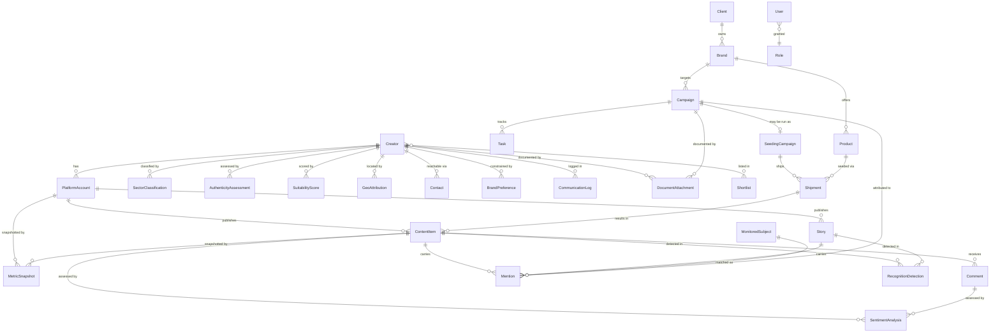

# QDS Data Model — Entities, Envelopes, and Metrics Catalog

This file is the **single home for the shape of every persisted thing** in QDS: the four shared embedded envelopes, all 32 domain entities (`ENT-*`), and the metrics catalog (`MET-*`). A coding agent implementing schemas, DTOs, or migrations reads shapes **here and only here**.

Scope guardrails for this file:

- **Enums are referenced by name only.** Every enum's closed value set is canonical in [`../00-meta/03-glossary.md`](../00-meta/03-glossary.md); this file links to it and never re-lists values (per [DP-001](../20-cross-cutting/00-data-principles.md)).
- **Write-ownership is not restated here.** Which module writes which entity (and which modules read it) is canonical in [`../70-shared/00-ownership-matrix.md`](../70-shared/00-ownership-matrix.md). This file links there.
- **Source contracts are not restated here.** External providers (`SRC-*`) and their raw→domain field mappings are canonical in [`../40-integrations/00-data-source-matrix.md`](../40-integrations/00-data-source-matrix.md).
- **Provenance and Confidence doctrine** is set by [ADR-0008](../05-decisions/decision-log.md) and enforced by [DP-002](../20-cross-cutting/00-data-principles.md) (provenance) and [DP-003](../20-cross-cutting/00-data-principles.md) (confidence). This file encodes that doctrine as two mandatory embedded envelopes.

---

## 1. ER Overview

QDS models a small number of **identity anchors** (a real-world `ENT-Creator` and its per-platform `ENT-PlatformAccount`s), the **public content** those accounts publish (`ENT-ContentItem`, `ENT-Story`, `ENT-Comment`), the **AI-derived observations** layered on top of that content (`ENT-Mention`, `ENT-RecognitionDetection`, `ENT-SentimentAnalysis`, `ENT-SectorClassification`, `ENT-GeoAttribution`, `ENT-AuthenticityAssessment`, `ENT-SuitabilityScore`), the **time-series** of public/derived metrics (`ENT-MetricSnapshot`), the **client → brand → product hierarchy** (`ENT-Client`, `ENT-Brand`, `ENT-Product`), and the **CRM + seeding operational records** (`ENT-Contact`, `ENT-BrandPreference`, `ENT-Campaign`, `ENT-SeedingCampaign`, `ENT-Shipment`, `ENT-CommunicationLog`, `ENT-DocumentAttachment`, `ENT-Task`, `ENT-Shortlist`) plus access control (`ENT-User`, `ENT-Role`). `ENT-MonitoredSubject` is the configuration record that tells Module 1 what to watch for. Since [ADR-0019](../05-decisions/decision-log.md#adr-0019) all of the above are owned by the customer account `ENT-Tenant` (see the tenancy note in §3). The **commercial layer** ([ADR-0021](../05-decisions/decision-log.md#adr-0021)) adds the billing records: the deliberately **global** plan catalog `ENT-SubscriptionPlan` plus the tenant-owned `ENT-TenantSubscription` and `ENT-TeamInvitation`.

The four **envelopes** — `Provenance`, `ConfidenceAssessment`, `MetricValue`, `ReachEstimate` — are **embedded value objects**, not standalone tables. They have no module write-owner; they are carried as fields inside owning entities.

Key relationships (verbs read owner→related):

- A `Creator` **has many** `PlatformAccount`s (one per `ENUM-Platform` presence); cross-platform identity merge collapses accounts under one `Creator`.
- A `PlatformAccount` **publishes many** `ContentItem`s and `Story`s, and **accrues many** `MetricSnapshot`s over time.
- A `ContentItem` **has many** `Comment`s and **may carry many** `Mention`s and `RecognitionDetection`s; a `Story` **may also carry** `Mention`s and `RecognitionDetection`s before it expires.
- A `SentimentAnalysis` **assesses** one `ContentItem` or one `Comment`.
- A `Mention` links a piece of content to a `MonitoredSubject` and (via matching) to a `Campaign` / `SeedingCampaign`.
- Discovery observations (`SectorClassification`, `GeoAttribution`, `AuthenticityAssessment`, `SuitabilityScore`) **describe** a `Creator` (or its `PlatformAccount`).
- A `Shortlist` **groups many** `Creator`s; a `Creator` **may appear in many** `Shortlist`s.
- CRM records (`Contact`, `BrandPreference`, `CommunicationLog`, `DocumentAttachment`, `Task`) **attach to** a `Creator` and/or a `Campaign`.
- A `SeedingCampaign` **is a specialization of** campaign activity and **has many** `Shipment`s.
- A `User` **has one** `Role`.
- A `Client` **has many** `Brand`s; a `Brand` **has many** `Product`s.
- A `Brand` **is targeted by many** `Campaign`s and `SeedingCampaign`s, and is the entity a `Mention` attributes content to (via its `MonitoredSubject`).
- A `Shipment` **ships one** `Product` to one `Creator` and, once matched ([REQ-M3-008](../90-traceability/00-req-matrix.md)), **results in** the `ContentItem`s the creator posted — the join that powers **per-product aggregation across creators** (see [analytics model](01-analytics-model.md)).
- A `Tenant` **holds at most one live** `TenantSubscription` against one `SubscriptionPlan`, and **issues many** `TeamInvitation`s ([ADR-0021](../05-decisions/decision-log.md#adr-0021)).

> **Envelopes are embedded, not drawn as tables.** `Provenance`, `ConfidenceAssessment`, `MetricValue`, and `ReachEstimate` appear as fields inside the entities above (see each entity's `notes` column). They are intentionally omitted from the ER diagram because they are value objects with no independent identity or owner.

---

## 2. Shared Envelopes

These four value objects are embedded inside entities. They enforce the confidence-first + provenance-first doctrine of [ADR-0008](../05-decisions/decision-log.md).

### Provenance

Mandatory on **every externally-sourced record** ([DP-002](../20-cross-cutting/00-data-principles.md)). Any field or entity whose value originated from an `SRC-*` provider carries this envelope.

| Field | Type | Required | Notes |
|---|---|---|---|
| `source` | `SRC-*` id | Yes | The exact provider contract id, canonical in [data-source-matrix](../40-integrations/00-data-source-matrix.md). |
| `fetchedAt` | timestamp | Yes | When the value was fetched from the source. |
| `sourceVersion` | string | Yes | Actor/API version or dataset revision for reproducibility. |

### ConfidenceAssessment

Required for **every inferred/estimated value** ([DP-003](../20-cross-cutting/00-data-principles.md)): location, authenticity, organic-vs-paid classification, and sector are never asserted as fact.

| Field | Type | Required | Notes |
|---|---|---|---|
| `value` | any | Yes | The inferred value the assessment qualifies (label, score, etc.). |
| `confidenceLevel` | [`ENUM-ConfidenceLevel`](../00-meta/03-glossary.md#enum-confidencelevel) | Yes | Reference by name; values are canonical in the glossary. |
| `signals` | list of signal descriptors | Yes | Contributing signals behind the assessment (feeds the human-review loop, [DP-004](../20-cross-cutting/00-data-principles.md)). |
| `verificationStatus` | [`ENUM-VerificationStatus`](../00-meta/03-glossary.md#enum-verificationstatus) | Yes | AI-produced values start at `AI_ASSESSED`; human actions move it along the enum. |

### MetricValue

Wraps any single quantitative metric so its tier travels with the number ([DP-001](../20-cross-cutting/00-data-principles.md)).

| Field | Type | Required | Notes |
|---|---|---|---|
| `amount` | number | Yes | The metric magnitude. |
| `tier` | [`ENUM-MetricTier`](../00-meta/03-glossary.md#enum-metrictier) | Yes | Reference by name. See §4 for which metric maps to which tier. |
| `metric` | string | No | Optional metric label (e.g. `followers`, `views`, `likes`, `spend`) so a stored **list** of `MetricValue`s stays attributable per metric — needed to reconstruct per-metric growth series from `ENT-MetricSnapshot.metrics`. Omitted when the owning field already names the metric (e.g. `followerCount`). |

*Amended 2026-07-07 — as-built reconciliation:* the optional `metric` label is an as-built addition to this envelope (implemented in `App\Shared\ValueObjects\MetricValue`; serialized only when present).

### ReachEstimate

Specialized envelope for reach, which is never a plain public count. True unique reach (`CONFIRMED`) is deferred — see [DEF-003](../20-cross-cutting/01-deferred-register.md).

| Field | Type | Required | Notes |
|---|---|---|---|
| `amount` | number | Yes | Estimated (or, if authorized analytics exist, confirmed) reach. |
| `tier` | [`ENUM-MetricTier`](../00-meta/03-glossary.md#enum-metrictier) | Yes | Constrained to the `ESTIMATED` or `CONFIRMED` members of the enum; `PUBLIC`/`DERIVED` are invalid for reach. |
| `method` | string | Yes | The estimation method/model that produced `amount` (transparency requirement). |

---

## 3. Domain Entities

For every entity below, the **write-owner and reader modules are canonical in** [`../70-shared/00-ownership-matrix.md`](../70-shared/00-ownership-matrix.md) — this file does not restate them.

> **Tenancy (amended 2026-07-11, [ADR-0019](../05-decisions/decision-log.md#adr-0019)).** The platform is multi-tenant: every entity in this section **except** `ENT-Tenant` itself and the deliberately global plan catalog [`ENT-SubscriptionPlan`](#ent-subscriptionplan) ([ADR-0021](../05-decisions/decision-log.md#adr-0021)) is **tenant-owned** and carries a required `tenantId` (`ENT-Tenant` id) ownership key, not restated in each field table below. Natural keys marked unique on an entity are unique **within a tenant** unless explicitly stated as global (the global keys are `ENT-User.email` and, since [ADR-0021](../05-decisions/decision-log.md#adr-0021), the Stripe identifiers `ENT-Tenant.stripeCustomerId`, `ENT-SubscriptionPlan.code` / `stripePriceId`, and `ENT-TenantSubscription.stripeSubscriptionId`). Cross-tenant links between tenant-owned records are structurally rejected at the database level (composite tenant foreign keys). The operational registers (§ [operational registers](#operational-registers)) are classified per table in that section.

### ENT-Tenant

The customer account (subscribing organisation) that owns its users, configuration, and business data ([ADR-0019](../05-decisions/decision-log.md#adr-0019)). The single canonical tenancy abstraction — never duplicated by an organization/workspace/team construct. Subscription and seat-allowance fields are deliberately absent until the billing phase. *Amended 2026-07-12 ([ADR-0021](../05-decisions/decision-log.md#adr-0021)):* the billing phase has arrived — the tenant is the billable Stripe customer (`stripeCustomerId` below); subscription state lives on [`ENT-TenantSubscription`](#ent-tenantsubscription) and seat allowances on [`ENT-SubscriptionPlan`](#ent-subscriptionplan), never on this entity.

| Field | Type | Required | Notes |
|---|---|---|---|
| `id` | id | Yes | |
| `name` | string | Yes | Customer organisation name. |
| `ownerUserId` | `ENT-User` id | No | Exactly one owner in practice (set at provisioning); DB-enforced to belong to this tenant. Nullable only for the create-order chicken-and-egg. Also the subject of the `billing.manage` owner-only gate ([ADR-0021](../05-decisions/decision-log.md#adr-0021)). |
| `stripeCustomerId` | string | No | The tenant's Stripe customer handle ([ADR-0021](../05-decisions/decision-log.md#adr-0021)) — **globally unique**, **not mass assignable**, and the **only trusted webhook→tenant mapping**. DB column `stripe_customer_id`; force-filled once under a row lock. |
| `createdAt` | timestamp | Yes | |
| `updatedAt` | timestamp | Yes | |

> **Stories are `ENT-Story`, never a `ContentItem`.** `STORY` is **not** a member of [`ENUM-ContentType`](../00-meta/03-glossary.md#enum-contenttype); ephemeral stories are modeled exclusively as `ENT-Story`. A `ContentItem` never carries a "story" content-type. (Stated once, here.)

### ENT-SubscriptionPlan

*Added 2026-07-12 ([ADR-0021](../05-decisions/decision-log.md#adr-0021)).* A plan in the billing catalog. Deliberately a **global** table (no `tenantId`) — plan definitions are platform vocabulary, the same class as the role/permission definitions of [ADR-0019](../05-decisions/decision-log.md#adr-0019). Written **only** by the idempotent config sync (`qds:billing-sync-plans` from `config/billing.php`); there is **no UI write path**. Plan gating reads this catalog — never plan-code literals.

| Field | Type | Required | Notes |
|---|---|---|---|
| `id` | id | Yes | |
| `code` | string | Yes | Stable machine identifier of the plan. **Globally unique** (the catalog is global). |
| `name` | string | Yes | Human-facing plan name. |
| `stripePriceId` | string | No | The Stripe price this plan maps to; **globally unique** when set. Commercial values come from the environment. |
| `billingInterval` | [`ENUM-BillingInterval`](../00-meta/03-glossary.md#enum-billinginterval) | Yes | Reference by name. |
| `maxSeats` | number | Yes | The plan's seat allowance (see the seat rule under [`ENT-TenantSubscription`](#ent-tenantsubscription)). |
| `features` | list of string | No | Entitlement flags (json list) read by plan gating; empty in v1. |
| `isActive` | boolean | Yes | Whether the plan is currently offered. |

### ENT-TenantSubscription

*Added 2026-07-12 ([ADR-0021](../05-decisions/decision-log.md#adr-0021)).* A tenant's Stripe subscription. Tenant-owned (required `tenantId` per the tenancy note above). State **mirrors Stripe's canonical lifecycle** — no invented states — and is written exclusively by the verified-webhook `SubscriptionSynchronizer`; no QDS surface mutates it directly.

| Field | Type | Required | Notes |
|---|---|---|---|
| `id` | id | Yes | |
| `subscriptionPlanId` | `ENT-SubscriptionPlan` id | Yes | The plan subscribed to; the FK is restrictive (a referenced plan cannot be deleted). |
| `stripeSubscriptionId` | string | Yes | Stripe's subscription identifier; **globally unique**. |
| `status` | [`ENUM-SubscriptionStatus`](../00-meta/03-glossary.md#enum-subscriptionstatus) | Yes | Reference by name. |
| `seatsOverride` | number | No | Bespoke per-tenant seat allowance overriding the plan's `maxSeats`. |
| `cancelAtPeriodEnd` | boolean | Yes | Whether the subscription lapses at the period boundary. |
| `trialEndsAt` | timestamp | No | |
| `currentPeriodEndsAt` | timestamp | No | |
| `endedAt` | timestamp | No | |
| `lastStripeEventAt` | timestamp | No | `event.created` watermark guarding against out-of-order webhook delivery. |

Two invariants are enforced on this entity at the database level:

- **At most one live subscription per tenant** — a partial unique index on `tenantId` over non-terminal rows (terminal = `CANCELED`, `INCOMPLETE_EXPIRED`).
- **Seat rule** ([ADR-0021](../05-decisions/decision-log.md#adr-0021)): every **active** `ENT-User` consumes one seat, including the owner; deactivated users and pending invitations consume none. Effective allowance = `seatsOverride` ?? the plan's `maxSeats`; enforcement is transactional under a per-tenant row lock, and a downgrade below current usage never removes members — the tenant goes over-limit, which blocks further seat-consuming team changes.

> The webhook idempotency ledger **`stripe_events`** is **not** an `ENT-*` entity — it is global platform infrastructure of the provider-telemetry class, listed with the [operational registers](#operational-registers).

### ENT-TeamInvitation

*Added 2026-07-12 ([ADR-0021](../05-decisions/decision-log.md#adr-0021)).* A tenant-bound invitation to join the tenant's team. Tenant-owned (required `tenantId` per the tenancy note above). Only the SHA-256 hash of the single-use 256-bit token is stored — the plaintext token is never persisted.

| Field | Type | Required | Notes |
|---|---|---|---|
| `id` | id | Yes | |
| `email` | string | Yes | Invited address. One **pending** invitation per `(tenantId, lower(email))` — partial unique index. |
| `role` | [`ENUM-RoleName`](../00-meta/03-glossary.md#enum-rolename) | Yes | Reference by name. Staff values only — never `CLIENT_VIEWER` ([ADR-0016](../05-decisions/decision-log.md#adr-0016)). |
| `tokenHash` | string | Yes | SHA-256 of the single-use 256-bit invitation token; the plaintext is never stored. |
| `invitedByUserId` | `ENT-User` id | Yes | Inviting user; composite tenant FK. |
| `acceptedUserId` | `ENT-User` id | No | The account created on acceptance; composite tenant FK. |
| `expiresAt` | timestamp | Yes | Config-bound expiry. |
| `acceptedAt` | timestamp | No | |
| `revokedAt` | timestamp | No | |

### ENT-Creator

The real-world influencer identity and system-of-record for cross-platform merge.

| Field | Type | Required | Notes |
|---|---|---|---|
| `id` | id | Yes | Canonical creator id; survives platform-account merges. |
| `displayName` | string | Yes | Human-facing name. |
| `primaryLanguage` | string | No | Primary content language (DACH focus). |
| `mergedAccountIds` | list of `ENT-PlatformAccount` ids | No | Accounts merged under this identity ([REQ-M3-001](../90-traceability/00-req-matrix.md)). |
| `relationshipStatus` | [`ENUM-RelationshipStatus`](../00-meta/03-glossary.md#enum-relationshipstatus) | No | CRM relationship state. |
| `createdAt` | timestamp | Yes | |
| `updatedAt` | timestamp | Yes | |

### ENT-PlatformAccount

One per-platform presence of a `Creator`. **Externally sourced → embeds `Provenance`.**

| Field | Type | Required | Notes |
|---|---|---|---|
| `id` | id | Yes | |
| `creatorId` | `ENT-Creator` id | No | Null until merged/attributed to a `Creator`. |
| `platform` | [`ENUM-Platform`](../00-meta/03-glossary.md#enum-platform) | Yes | Reference by name. |
| `handle` | string | Yes | @handle / channel id on that platform. Unique per platform (see amendment below). |
| `bio` | string | No | Public bio/description. |
| `externalLinks` | list of url | No | Links from the public profile. Contact auto-extraction (email/phone) is **not** done — see [DEF-002](../20-cross-cutting/01-deferred-register.md). |
| `followerCount` | `MetricValue` | No | Public follower count (tier `PUBLIC`). |
| `provenance` | `Provenance` | Yes | Externally sourced; see [DP-002](../20-cross-cutting/00-data-principles.md). |

*Amended 2026-07-07 — as-built reconciliation:* two uniqueness rules are enforced on this entity at the database level:

- **`unique(platform, handle)`** — the `(platform, handle)` pair is treated as the account's external platform identifier, so the same handle on the same platform can never be ingested twice (duplicate prevention, [module 1](../50-modules/module-1-monitoring.md) AC-M1-001). *Amended 2026-07-11 ([ADR-0019](../05-decisions/decision-log.md#adr-0019)):* the key is now **`unique(tenantId, platform, handle)`** — two tenants may track the same public handle; each ingests it independently. **Caveat:** platform handles are mutable and reusable (a creator renaming frees the handle), so the durable long-term key is a platform-native **immutable account id**; that field is not yet captured, and the entity should be re-keyed when it is added.
- **`unique(creatorId, platform)`** (partial — applies only where `creatorId` is set; migration `2026_07_07_100001`) — the database backstop for the §1 invariant "one per `ENUM-Platform` presence", closing the concurrent-write race that the application-layer guard (`CreatorWriter::assertPlatformFree`) cannot catch. Unassigned accounts (`creatorId` null) are exempt.

### ENT-ContentItem

A public post/reel/video/etc. **Externally sourced → embeds `Provenance`.**

| Field | Type | Required | Notes |
|---|---|---|---|
| `id` | id | Yes | |
| `platformAccountId` | `ENT-PlatformAccount` id | Yes | Author account. |
| `platform` | [`ENUM-Platform`](../00-meta/03-glossary.md#enum-platform) | Yes | |
| `contentType` | [`ENUM-ContentType`](../00-meta/03-glossary.md#enum-contenttype) | Yes | Reference by name. `STORY` is never a value here (use `ENT-Story`). |
| `externalId` | string | No | The platform's native content identifier; `(tenantId, platform, externalId)` is **unique** (tenant-scoped since [ADR-0019](../05-decisions/decision-log.md#adr-0019)), making re-ingestion idempotent within a tenant (no duplicate is ever created for the same platform item in the same tenant). |
| `caption` | string | No | Public caption/description. |
| `mediaUrls` | list of url | No | Public media references. |
| `permalink` | url | No | Canonical **public page URL** of the post/reel/video — never an expiring CDN media URL (those live in `mediaUrls`). Captured at ingestion; feeds the campaign-linked direct-URL metric refresh of [ADR-0017](../05-decisions/decision-log.md#adr-0017). |
| `publishedAt` | timestamp | No | Publish time as reported by the source. |
| `publicMetrics` | list of `MetricValue` | No | Views/likes/comments/shares/saves at tier `PUBLIC`. |
| `humanOverrides` | list of field names | No | Names of fields an analyst has corrected on this record; ingestion skips these fields, so a later poll never clobbers a human correction ([DP-004](../20-cross-cutting/00-data-principles.md)). |
| `provenance` | `Provenance` | Yes | Externally sourced. |

*Amended 2026-07-07 — as-built reconciliation:* `externalId` (+ its `(platform, externalId)` unique key), `humanOverrides`, and `permalink` (see [ADR-0017](../05-decisions/decision-log.md#adr-0017)) are as-built additions to this shape. All three are nullable: provider payloads do not always carry an identifier or permalink (rows ingested before `permalink` existed gain one on their next re-poll), and `humanOverrides` stays empty until an analyst corrects a field.

### ENT-Story

Ephemeral story content, archived before expiry ([REQ-M1-004](../90-traceability/00-req-matrix.md)). **Externally sourced → embeds `Provenance`.** Never a `ContentItem`.

| Field | Type | Required | Notes |
|---|---|---|---|
| `id` | id | Yes | |
| `platformAccountId` | `ENT-PlatformAccount` id | Yes | |
| `platform` | [`ENUM-Platform`](../00-meta/03-glossary.md#enum-platform) | Yes | |
| `externalId` | string | No | The platform's native story identifier; `(tenantId, platform, externalId)` is **unique** (tenant-scoped since [ADR-0019](../05-decisions/decision-log.md#adr-0019)), making story re-ingestion idempotent within a tenant. |
| `mediaUrl` | url | No | Archived media (stored before expiry). |
| `capturedAt` | timestamp | Yes | When QDS archived it. |
| `expiresAt` | timestamp | No | Platform expiry time if known. |
| `publicMetrics` | list of `MetricValue` | No | Any public story metrics, tier `PUBLIC`. |
| `humanOverrides` | list of field names | No | Names of fields an analyst has corrected; ingestion skips these fields so re-ingestion never clobbers a human correction ([DP-004](../20-cross-cutting/00-data-principles.md)). |
| `provenance` | `Provenance` | Yes | Externally sourced. |

*Amended 2026-07-07 — as-built reconciliation:* `externalId` (+ its `(platform, externalId)` unique key) and `humanOverrides` are as-built additions to this shape — the same idempotent-ingestion and correction-preservation additions as on `ENT-ContentItem`.

### ENT-Comment

A public comment on a `ContentItem`. **Externally sourced → embeds `Provenance`.**

| Field | Type | Required | Notes |
|---|---|---|---|
| `id` | id | Yes | |
| `contentItemId` | `ENT-ContentItem` id | Yes | Parent content. |
| `parentCommentId` | `ENT-Comment` id | No | Set for threaded replies. |
| `authorHandle` | string | No | Commenter handle. |
| `text` | string | Yes | Comment body. |
| `likeCount` | `MetricValue` | No | Tier `PUBLIC`. |
| `postedAt` | timestamp | No | |
| `provenance` | `Provenance` | Yes | Externally sourced. |

### ENT-MonitoredSubject

Configuration of what Module 1 watches ([REQ-M1-001](../90-traceability/00-req-matrix.md)). In v1 the primary subject type is **`CREATOR`** — the agency's own tracked-creator roster; open-web term subjects are deferred ([DEF-006](../20-cross-cutting/01-deferred-register.md#def-006)).

| Field | Type | Required | Notes |
|---|---|---|---|
| `id` | id | Yes | |
| `subjectType` | [`ENUM-MonitoredSubjectType`](../00-meta/03-glossary.md#enum-monitoredsubjecttype) | Yes | `CREATOR` (roster) in v1; `BRAND`/`KEYWORD`/`HASHTAG`/`HANDLE` are open-web modes ([DEF-006](../20-cross-cutting/01-deferred-register.md#def-006)). |
| `label` | string | Yes | Human name (creator name, or a brand/term). |
| `creatorId` | `ENT-Creator` id | No | Set when `subjectType = CREATOR` — the tracked creator whose accounts are monitored. |
| `terms` | list of string | No | Set for open-web term subjects (brands, products, hashtags, handles, spelling variants). Deferred in v1 ([DEF-006](../20-cross-cutting/01-deferred-register.md#def-006)). |
| `platforms` | list of [`ENUM-Platform`](../00-meta/03-glossary.md#enum-platform) | Yes | Platforms to monitor. |
| `campaignId` | `ENT-Campaign` id | No | Optional link to a campaign context. |
| `active` | boolean | Yes | Whether monitoring is running. |

### ENT-Mention

A detected occurrence of a `MonitoredSubject` in content, with its paid/seeded/organic classification. **Inferred classification → embeds `ConfidenceAssessment`;** the detection is derived from externally-sourced content, so it also carries `Provenance`.

| Field | Type | Required | Notes |
|---|---|---|---|
| `id` | id | Yes | |
| `monitoredSubjectId` | `ENT-MonitoredSubject` id | Yes | What was matched. |
| `contentItemId` | `ENT-ContentItem` id | No | Set when the mention is in a post/reel. |
| `storyId` | `ENT-Story` id | No | Set when the mention is in a story. |
| `campaignId` | `ENT-Campaign` id | No | Set by content-to-campaign matching ([REQ-M3-008](../90-traceability/00-req-matrix.md)). |
| `mentionType` | [`ENUM-MentionType`](../00-meta/03-glossary.md#enum-mentiontype) | Yes | Only `PAID`/`SEEDED` when a record/label proves it; otherwise `LIKELY_ORGANIC`/`UNKNOWN`. Organic is never asserted as fact. |
| `classification` | `ConfidenceAssessment` | Yes | Qualifies `mentionType`; low confidence routes to review ([DP-003](../20-cross-cutting/00-data-principles.md), [DP-004](../20-cross-cutting/00-data-principles.md)). |
| `provenance` | `Provenance` | Yes | Derived from externally-sourced content. |

### ENT-RecognitionDetection

A brand-recognition hit (OCR / logo / spoken-brand / on-screen text) inside content ([REQ-M1-008](../90-traceability/00-req-matrix.md)). **Inferred → embeds `ConfidenceAssessment`;** produced from AI sources → carries `Provenance`.

| Field | Type | Required | Notes |
|---|---|---|---|
| `id` | id | Yes | |
| `contentItemId` | `ENT-ContentItem` id | No | Source content (post/reel/video). |
| `storyId` | `ENT-Story` id | No | Source story. |
| `recognitionType` | [`ENUM-RecognitionType`](../00-meta/03-glossary.md#enum-recognitiontype) | Yes | Reference by name. |
| `detectedText` | string | No | For OCR / on-screen / spoken text. |
| `detectedBrand` | string | No | Normalized brand/logo label. |
| `assessment` | `ConfidenceAssessment` | Yes | Low-confidence detections go to the review queue. |
| `provenance` | `Provenance` | Yes | From `SRC-google-cloud-vision` / `SRC-google-speech-to-text` / `SRC-google-video-intelligence`. |

### ENT-SentimentAnalysis

Sentiment + context for a `ContentItem` or `Comment` ([REQ-M1-009](../90-traceability/00-req-matrix.md), [REQ-M1-010](../90-traceability/00-req-matrix.md)). **Inferred → embeds `ConfidenceAssessment`.**

| Field | Type | Required | Notes |
|---|---|---|---|
| `id` | id | Yes | |
| `contentItemId` | `ENT-ContentItem` id | No | Set when analyzing a post/reel. |
| `commentId` | `ENT-Comment` id | No | Set when analyzing a comment. |
| `label` | [`ENUM-SentimentLabel`](../00-meta/03-glossary.md#enum-sentimentlabel) | Yes | Reference by name. |
| `contextSummary` | string | No | Short rationale/context. |
| `assessment` | `ConfidenceAssessment` | Yes | Manual correction feeds the review loop ([DP-004](../20-cross-cutting/00-data-principles.md)). |

### ENT-MetricSnapshot

A timestamped point in a metric time series; the substrate for historical growth ([ADR-0003](../05-decisions/decision-log.md), [REQ-M1-007](../90-traceability/00-req-matrix.md)). Written by the snapshot scheduler service. **Account-level** snapshots (`platformAccountId` set) capture the creator's overall stats — followers, overall reach/engagement, posting frequency; **content-level** snapshots (`contentItemId` set) capture per-post metrics. **Externally sourced values → embeds `Provenance`.**

| Field | Type | Required | Notes |
|---|---|---|---|
| `id` | id | Yes | |
| `platformAccountId` | `ENT-PlatformAccount` id | No | Snapshot of an account-level metric. |
| `contentItemId` | `ENT-ContentItem` id | No | Snapshot of a content-level metric. |
| `capturedAt` | timestamp | Yes | Snapshot time (defines the series x-axis). |
| `metrics` | list of `MetricValue` | Yes | Each value carries its own [`ENUM-MetricTier`](../00-meta/03-glossary.md#enum-metrictier) and, as-built, the optional `metric` label (see [§2](#envelopes)) so per-metric growth series can be reconstructed from the list. |
| `provenance` | `Provenance` | Yes | Externally sourced; there is no external history API. |

### ENT-SectorClassification

Multi-label AI sector classification of a `Creator` ([REQ-M2-005](../90-traceability/00-req-matrix.md)). **Inferred → embeds `ConfidenceAssessment`.**

| Field | Type | Required | Notes |
|---|---|---|---|
| `id` | id | Yes | |
| `creatorId` | `ENT-Creator` id | Yes | Subject. |
| `labels` | list of `{ sector: `[`ENUM-SectorLabel`](../00-meta/03-glossary.md#enum-sectorlabel)`, relevancePercent: number }` | Yes | Multi-label with relevance %. Reference the enum by name only. |
| `assessment` | `ConfidenceAssessment` | Yes | |

### ENT-GeoAttribution

Geographic attribution of a `Creator`/`PlatformAccount` ([REQ-M2-003](../90-traceability/00-req-matrix.md)). **Inferred → embeds `ConfidenceAssessment`.** Audience-country demographics are out of scope — see [DEF-001](../20-cross-cutting/01-deferred-register.md).

| Field | Type | Required | Notes |
|---|---|---|---|
| `id` | id | Yes | |
| `creatorId` | `ENT-Creator` id | Yes | Subject (creator-location, not audience-location). |
| `countryCode` | string | No | Inferred creator country. |
| `region` | string | No | Inferred sub-national region if available. |
| `assessment` | `ConfidenceAssessment` | Yes | Location is never a fact ([DP-003](../20-cross-cutting/00-data-principles.md)). |

### ENT-AuthenticityAssessment

Audience-quality / authenticity estimate from public signals ([REQ-M2-007](../90-traceability/00-req-matrix.md)). **Inferred → embeds `ConfidenceAssessment`.**

| Field | Type | Required | Notes |
|---|---|---|---|
| `id` | id | Yes | |
| `creatorId` | `ENT-Creator` id | Yes | Subject. |
| `qualityScore` | `MetricValue` | Yes | Modeled quality/risk score (tier `ESTIMATED`). |
| `riskFlags` | list of string | No | Public-signal risk indicators. |
| `assessment` | `ConfidenceAssessment` | Yes | |

### ENT-SuitabilityScore

Configurable per-brand suitability score for a `Creator` ([REQ-M2-009](../90-traceability/00-req-matrix.md)). **Inferred/modeled → embeds `ConfidenceAssessment`.**

| Field | Type | Required | Notes |
|---|---|---|---|
| `id` | id | Yes | |
| `creatorId` | `ENT-Creator` id | Yes | Subject. |
| `brandModelId` | string | Yes | Which configurable per-brand model produced the score. |
| `score` | `MetricValue` | Yes | Tier `ESTIMATED`. |
| `factorBreakdown` | list of `{ factor: string, contribution: number }` | No | Transparency of the scoring model. |
| `assessment` | `ConfidenceAssessment` | Yes | |

### ENT-Shortlist

A curated set of creators for a brief ([REQ-M2-011](../90-traceability/00-req-matrix.md)).

| Field | Type | Required | Notes |
|---|---|---|---|
| `id` | id | Yes | |
| `name` | string | Yes | |
| `creatorIds` | list of `ENT-Creator` ids | Yes | Members (many-to-many with `Creator`). |
| `campaignId` | `ENT-Campaign` id | No | Optional campaign context. |
| `createdAt` | timestamp | Yes | |

### ENT-Contact

Contact + address for a `Creator`. **Manual entry only** in v1 ([REQ-M3-002](../90-traceability/00-req-matrix.md)); auto-extraction is [DEF-002](../20-cross-cutting/01-deferred-register.md).

| Field | Type | Required | Notes |
|---|---|---|---|
| `id` | id | Yes | |
| `creatorId` | `ENT-Creator` id | Yes | Owner. |
| `email` | string | No | Manually entered. |
| `phone` | string | No | Manually entered. |
| `postalAddress` | string | No | For shipments. |
| `preferredChannel` | string | No | |

### ENT-BrandPreference

A creator's brand preferences and restrictions ([REQ-M3-003](../90-traceability/00-req-matrix.md)).

| Field | Type | Required | Notes |
|---|---|---|---|
| `id` | id | Yes | |
| `creatorId` | `ENT-Creator` id | Yes | Subject. |
| `preferredBrands` | list of string | No | |
| `restrictedBrands` | list of string | No | Brands/sectors the creator will not work with. |
| `notes` | string | No | |

### ENT-Campaign

A marketing campaign ([REQ-M3-005](../90-traceability/00-req-matrix.md)).

| Field | Type | Required | Notes |
|---|---|---|---|
| `id` | id | Yes | |
| `name` | string | Yes | |
| `brandId` | `ENT-Brand` id | Yes | Target brand. |
| `status` | [`ENUM-CampaignStatus`](../00-meta/03-glossary.md#enum-campaignstatus) | Yes | Reference by name. |
| `startAt` | timestamp | No | |
| `endAt` | timestamp | No | |
| `creatorIds` | list of `ENT-Creator` ids | No | Participating creators. Persisted as the `campaign_creator` join table (see amendment below). |
| `spend` | `MetricValue` | No | Agency-entered total spend (tier `CONFIRMED`, `metric` label `spend`) — the spend input for CPE/CPM ([REQ-M3-009](../90-traceability/00-req-matrix.md), §4 note). |

*Amended 2026-07-07 — as-built reconciliation:* `spend` is an as-built addition (the agency knows what it spent — same tier-`CONFIRMED` precedent as `ENT-Product.unitValue`). `creatorIds` is not stored as an embedded list: it is persisted as the **`campaign_creator`** join table with unique `(campaignId, creatorId)` pairs.

### ENT-SeedingCampaign

A gifting/seeding program ([REQ-M3-006](../90-traceability/00-req-matrix.md)).

| Field | Type | Required | Notes |
|---|---|---|---|
| `id` | id | Yes | |
| `campaignId` | `ENT-Campaign` id | No | Parent campaign, if any. |
| `name` | string | Yes | |
| `seedingType` | [`ENUM-SeedingType`](../00-meta/03-glossary.md#enum-seedingtype) | Yes | Reference by name; the four seeding variants (gifting / gifting-with-post / paid+product / organic) are the closed set canonical in the glossary. |
| `brandId` | `ENT-Brand` id | Yes | Brand being seeded. |
| `productId` | `ENT-Product` id | No | Primary product; the authoritative per-unit product is on each `ENT-Shipment`. |
| `status` | [`ENUM-SeedingCampaignStatus`](../00-meta/03-glossary.md#enum-seedingcampaignstatus) | Yes | Reference by name. |
| `creatorIds` | list of `ENT-Creator` ids | No | Seeded creators. Persisted as the `seeding_campaign_creator` join table (see amendment below). |
| `spend` | `MetricValue` | No | Agency-entered total spend for the seeding run (tier `CONFIRMED`, `metric` label `spend`) — the spend input for CPE/CPM ([REQ-M3-009](../90-traceability/00-req-matrix.md), §4 note). |

*Amended 2026-07-07 — as-built reconciliation:* `seedingType` was originally typed here as a free string; the value set is now the closed [`ENUM-SeedingType`](../00-meta/03-glossary.md#enum-seedingtype) (DB-enforced by a `CHECK` on `seeding_campaigns.seeding_type`). `spend` is an as-built addition (same shape as `ENT-Campaign.spend`). `creatorIds` is persisted as the **`seeding_campaign_creator`** join table with unique `(seedingCampaignId, creatorId)` pairs.

### ENT-Shipment

A physical shipment within a seeding campaign ([REQ-M3-007](../90-traceability/00-req-matrix.md)). Courier APIs are optional.

| Field | Type | Required | Notes |
|---|---|---|---|
| `id` | id | Yes | |
| `seedingCampaignId` | `ENT-SeedingCampaign` id | Yes | Parent. |
| `creatorId` | `ENT-Creator` id | Yes | Recipient. |
| `status` | [`ENUM-ShipmentStatus`](../00-meta/03-glossary.md#enum-shipmentstatus) | Yes | Reference by name. |
| `trackingNumber` | string | No | Optional courier tracking. |
| `shippedAt` | timestamp | No | |
| `deliveredAt` | timestamp | No | |
| `productId` | `ENT-Product` id | Yes | Product shipped — the key that aggregates results across creators. |
| `quantity` | number | No | Units shipped. |
| `productValueAtShip` | `MetricValue` | No | Value of goods shipped. |
| `postingRequired` | boolean | No | Whether a post was agreed. |
| `posted` | boolean | No | Whether the creator posted about the product. |
| `postedAt` | timestamp | No | Publish time of the resulting content. |
| `resultingContentIds` | list of `ENT-ContentItem` ids | No | Content matched to this shipment via [REQ-M3-008](../90-traceability/00-req-matrix.md) — the join to metrics. Persisted as the `shipment_resulting_content` join table (see amendment below). |

*Amended 2026-07-07 — as-built reconciliation:* `resultingContentIds` is not stored as an embedded list: it is persisted as the **`shipment_resulting_content`** join table with unique `(shipmentId, contentItemId)` pairs, so `FACT-SeedingContent` in the [analytics model](01-analytics-model.md) can join it directly.

### ENT-CommunicationLog

A logged interaction with a creator ([REQ-M3-004](../90-traceability/00-req-matrix.md)).

| Field | Type | Required | Notes |
|---|---|---|---|
| `id` | id | Yes | |
| `creatorId` | `ENT-Creator` id | Yes | Counterparty. |
| `campaignId` | `ENT-Campaign` id | No | Context, if any. |
| `channel` | string | Yes | Email / DM / call / etc. |
| `direction` | string | Yes | inbound / outbound. *Amended 2026-07-07 — as-built reconciliation:* a **closed two-value set** (`inbound` \| `outbound`) enforced at the application layer (form validation); the column stays a plain string — no glossary `ENUM-*` is registered and no DB `CHECK` exists. |
| `summary` | string | Yes | What happened. |
| `occurredAt` | timestamp | Yes | |

### ENT-DocumentAttachment

A stored document/attachment ([REQ-M3-010](../90-traceability/00-req-matrix.md)).

| Field | Type | Required | Notes |
|---|---|---|---|
| `id` | id | Yes | |
| `creatorId` | `ENT-Creator` id | No | Attached to a creator. |
| `campaignId` | `ENT-Campaign` id | No | Attached to a campaign. |
| `seedingCampaignId` | `ENT-SeedingCampaign` id | No | Attached to a seeding run. |
| `fileName` | string | Yes | |
| `storageUrl` | url | Yes | Reference to stored blob. |
| `uploadedAt` | timestamp | Yes | |

*Amended 2026-07-07 — as-built reconciliation:* `seedingCampaignId` is an as-built addition — documents attach to creators, campaigns, **or seeding runs** ([module 3](../50-modules/module-3-crm-seeding.md) §2.9). Any combination of the three anchors may be set (no XOR constraint), and deleting a referenced record is restricted while attachments exist (restrict-on-delete, matching the sibling anchors).

### ENT-Task

A task / deadline / follow-up ([REQ-M3-011](../90-traceability/00-req-matrix.md)).

| Field | Type | Required | Notes |
|---|---|---|---|
| `id` | id | Yes | |
| `title` | string | Yes | |
| `status` | [`ENUM-TaskStatus`](../00-meta/03-glossary.md#enum-taskstatus) | Yes | Reference by name. |
| `assigneeUserId` | `ENT-User` id | No | |
| `dueAt` | timestamp | No | |
| `creatorId` | `ENT-Creator` id | No | Related creator. |
| `campaignId` | `ENT-Campaign` id | No | Related campaign. |
| `reminderSentAt` | timestamp | No | Idempotency stamp for the one-time deadline reminder: `NULL` until the reminder fires, stamped once, never re-fired. |

*Amended 2026-07-07 — as-built reconciliation:* `reminderSentAt` is an as-built addition backing the deadline reminder of [REQ-M3-011](../90-traceability/00-req-matrix.md). The v1 reminder channel is **in-app only** (the tasks UI's overdue/due-soon affordances plus an audited `task.reminder_fired` event) — no email/push provider exists in the frozen stack ([ADR-0001](../05-decisions/decision-log.md#adr-0001)).

### ENT-User

An application user ([REQ-M3-012](../90-traceability/00-req-matrix.md)).

| Field | Type | Required | Notes |
|---|---|---|---|
| `id` | id | Yes | |
| `tenantId` | `ENT-Tenant` id | Yes | The user's single tenant ([ADR-0019](../05-decisions/decision-log.md#adr-0019)) — one user belongs to exactly one tenant. |
| `email` | string | Yes | Login identity. **Globally** unique across tenants (the one deliberate global natural key). |
| `displayName` | string | Yes | |
| `roleId` | `ENT-Role` id | Yes | Exactly one role. |
| `active` | boolean | Yes | |

*Amended 2026-07-07 — as-built reconciliation:* the role assignment is not a literal `role_id` column — roles live on the permission library's standard pivot, and the **exactly-one-role invariant is enforced at the application layer** (every assignment path replaces the full role set; regression-tested). No parallel role tables exist.

*Amended 2026-07-11 ([ADR-0019](../05-decisions/decision-log.md#adr-0019)):* `tenantId` added. Role and permission **definitions** stay global (they are platform vocabulary, not tenant data); role **membership** is per-user and therefore per-tenant.

### ENT-Role

An access-control role ([REQ-M3-012](../90-traceability/00-req-matrix.md)).

| Field | Type | Required | Notes |
|---|---|---|---|
| `id` | id | Yes | |
| `name` | [`ENUM-RoleName`](../00-meta/03-glossary.md#enum-rolename) | Yes | Reference by name. `CLIENT_VIEWER` sees only approved reports for its brands. *Amended 2026-07-07 (see [ADR-0016](../05-decisions/decision-log.md#adr-0016)):* v1 ships **no external client access** — `CLIENT_VIEWER` remains a defined value whose access is deny-everything for agency data (its sole grant opens the empty containment page); the approved-reports surface described here is void unless ADR-0016 is superseded. |
| `permissions` | list of string | Yes | Permission grants for the role. |

### ENT-Client

An agency client — the top of the client → brand → product hierarchy ([REQ-M3-005](../90-traceability/00-req-matrix.md)). `CLIENT_VIEWER` reporting is scoped to a client's brands. *Amended 2026-07-07 (see [ADR-0016](../05-decisions/decision-log.md#adr-0016)):* the `CLIENT_VIEWER` reporting surface is void in v1 (no external client access); the entity itself is unaffected — it anchors the brand/product hierarchy regardless.

| Field | Type | Required | Notes |
|---|---|---|---|
| `id` | id | Yes | |
| `name` | string | Yes | The client organisation. |
| `country` | string | No | Client home country. |

### ENT-Brand

A brand belonging to a client; the entity mentions, campaigns, seeding, and products attach to, and a primary **aggregation dimension** ([REQ-M3-005](../90-traceability/00-req-matrix.md), [analytics model](01-analytics-model.md)).

| Field | Type | Required | Notes |
|---|---|---|---|
| `id` | id | Yes | |
| `clientId` | `ENT-Client` id | Yes | Owning client. |
| `name` | string | Yes | |
| `sector` | [`ENUM-SectorLabel`](../00-meta/03-glossary.md#enum-sectorlabel) | No | Reference by name. |
| `aliases` | list of string | No | Names / spellings / handles monitored; feeds `ENT-MonitoredSubject`. |

### ENT-Product

A product / SKU under a brand. It is the key that lets seeding results be **aggregated across many creators** — a product seeded to N influencers rolls up to one total ([REQ-M3-013](../90-traceability/00-req-matrix.md), [analytics model](01-analytics-model.md)).

| Field | Type | Required | Notes |
|---|---|---|---|
| `id` | id | Yes | |
| `brandId` | `ENT-Brand` id | Yes | Owning brand. |
| `name` | string | Yes | |
| `sku` | string | No | |
| `variant` | string | No | Size / colour / variant. |
| `unitValue` | `MetricValue` | No | Unit value / price (seeding value + EMV context). |
| `category` | [`ENUM-SectorLabel`](../00-meta/03-glossary.md#enum-sectorlabel) | No | Reference by name. |

---

### Operational registers (non-ENT infrastructure)

*Added 2026-07-07 — as-built reconciliation.* This document canonically owns the **domain** model (`ENT-*` shapes and shared envelopes). The application additionally persists **operational registers** — pipeline telemetry, work-queue bookkeeping, and configuration — that are deliberately **not** `ENT-*` entities and are not governed by §3: they carry no domain semantics, appear in no analytics fact/rollup, and may change shape with the pipeline that owns them (their migrations are their reference). As built they are:

- **Ingestion observability / bookkeeping** — `provider_calls`, `provider_health_states`, `ingestion_alerts`, `quarantined_records` (redacted, retention-limited per [DP-005](../20-cross-cutting/00-data-principles.md)), `provider_response_samples`, `ingestion_cycles` (incl. `creator_id` for on-demand single-creator runs and `full_depth` for the periodic sweep of [ADR-0017](../05-decisions/decision-log.md#adr-0017)).
- **Enrichment infrastructure** — `hashtag_lists`, `content_hashtags`, `review_actions` ([DP-004](../20-cross-cutting/00-data-principles.md) correction history), `enrichment_runs`, `emv_configurations`, `emv_results` (REQ-M1-011 EMV configuration and outputs).
- **Billing / webhook infrastructure** — `stripe_events` ([ADR-0021](../05-decisions/decision-log.md#adr-0021)): the webhook idempotency ledger (`stripeEventId` unique, `type`, `createdAt`) — **append-only and payload-free**.

*Amended 2026-07-11 ([ADR-0019](../05-decisions/decision-log.md#adr-0019)) — tenancy classification of the registers:* the **ingestion observability registers are GLOBAL platform telemetry** (one shared provider stack; no `tenantId`), while the **enrichment registers are tenant-owned** (they hold tenant configuration and per-content outputs and carry `tenantId`). Also tenant-owned: `export_jobs` and `monitoring_plan_settings`; `audit_logs` carries a *nullable* tenant attribution (system actions have none). *Amended 2026-07-12 ([ADR-0021](../05-decisions/decision-log.md#adr-0021)):* `stripe_events` is **GLOBAL platform infrastructure** (one shared webhook endpoint; no `tenantId`) — the provider-telemetry class, analogous to `analytics_watermarks`.

## 4. Metrics Catalog (MET-*)

Every metric is stored as a `MetricValue` (or `ReachEstimate` for reach) so its [`ENUM-MetricTier`](../00-meta/03-glossary.md#enum-metrictier) travels with the number ([DP-001](../20-cross-cutting/00-data-principles.md)). Engagement rate, average performance, and median performance are **`DERIVED`** (deterministically computed from `PUBLIC` inputs), **never `PUBLIC`**. Estimated reach is **`ESTIMATED`**. True unique reach (`CONFIRMED`) is deferred — [DEF-003](../20-cross-cutting/01-deferred-register.md).

| MET id | Formula | Tier | Notes |
|---|---|---|---|
| **MET-EngagementRate** | `(likes + comments + shares + saves) / engagementBase` where `engagementBase` is followers or views per the configured model | `DERIVED` | Inputs are `PUBLIC` `MetricValue`s; the divisor choice is part of the transparent, configured model. |
| **MET-ViewRate** | `views / followers` | `DERIVED` | From `PUBLIC` inputs. |
| **MET-CommentRate** | `comments / engagementBase` (followers or views per configured model) | `DERIVED` | From `PUBLIC` inputs. |
| **MET-AveragePerformance** | arithmetic mean of a chosen `PUBLIC`/`DERIVED` metric across a content set | `DERIVED` | Pairs with median for [REQ-M2-006](../90-traceability/00-req-matrix.md). |
| **MET-MedianPerformance** | median of the same metric across the content set | `DERIVED` | Robust counterpart to the average. |
| **MET-EMV** | `Σ (metric_i × rate_i)` over content using a configurable, transparent rate card | modeled monetary estimate — treated as `ESTIMATED` | Configurable per [REQ-M1-011](../90-traceability/00-req-matrix.md); **every report must show the model + rates used**. Never present as a hard fact. |
| **MET-EstimatedReach** | modeled from `PUBLIC` views/plays and follower signals via a documented `method` | `ESTIMATED` | Stored in the `ReachEstimate` envelope (`amount`, `tier`, `method`). Confirmed unique reach is [DEF-003](../20-cross-cutting/01-deferred-register.md). |

> Downstream campaign KPIs such as CPE and CPM ([REQ-M3-009](../90-traceability/00-req-matrix.md)) are derived from the above metrics plus agency-entered spend; they inherit the tier of their weakest input (e.g. any `ESTIMATED` reach input makes a reach-based CPM `ESTIMATED`).