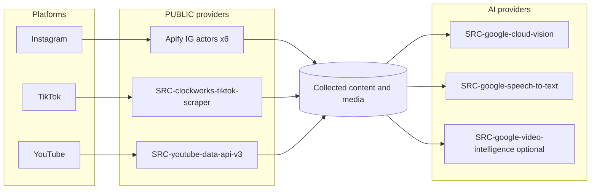

# Data Source Matrix

This file is the **single source of truth for the closed external-provider registry** (`SRC-*`). It defines, for every platform and every data need, exactly which provider is called and what kind of data it yields. It also gives one short contract summary per provider and an overview of how raw provider fields populate domain entities.

> [!IMPORTANT]
> **Closed set — do not add providers.** The v1 provider stack is frozen. The only external providers that may be integrated are the `SRC-*` contracts listed in this file. Do not invent, substitute, or add providers. See [ADR-0001](../05-decisions/decision-log.md#adr-0001) (stack lock) and [DP-006](../20-cross-cutting/00-data-principles.md#dp-006).

> [!NOTE]
> **Every externally-sourced record carries a `Provenance` envelope** whose `source` field holds one of the `SRC-*` ids on this page. This is mandatory — see [DP-002](../20-cross-cutting/00-data-principles.md#dp-002). Entity field shapes (including the `Provenance` envelope) are defined only in [30-data-model/00-data-model.md](../30-data-model/00-data-model.md); this file references them, it does not restate them.

---

## 1. Provider tier legend

Each provider is tagged with a **provider tier** that describes the *nature of the provider*, not the metric tier of any individual value:

| Provider tier | Meaning |
| --- | --- |
| **PUBLIC** | Returns directly observable public data (public posts, public counts, public profiles). |
| **ESTIMATED** | Produces modeled / inferred values (none of the v1 providers are ESTIMATED-native; estimated reach is computed internally — see §4). |
| **AI** | A machine-learning inference service (vision / speech / video understanding) that enriches already-collected media. |

The **metric tier** carried by an individual stored value is a separate concept (`ENUM-MetricTier`: PUBLIC / DERIVED / ESTIMATED / CONFIRMED), defined in the [glossary](../00-meta/03-glossary.md#enum-metrictier). Note that derived rates (engagement rate, average and median performance) are tier **DERIVED** and estimated reach is tier **ESTIMATED** — these are computed internally, not returned by any provider (see §4).

---

## 2. Capability → source matrix

For each platform and each data need, the exact `SRC-*` provider and its provider tier. Every cell that is blank means **no provider exists for that capability on that platform in v1**; where a capability is deferred, the linked `DEF-*` explains why.

### 2.1 Platform data (collection)

| Data need | Instagram | TikTok | YouTube |
| --- | --- | --- | --- |
| Profile / channel metadata + public counts | `SRC-apify-instagram-profile-scraper` (PUBLIC) | `SRC-clockworks-tiktok-scraper` (PUBLIC) | `SRC-youtube-data-api-v3` (PUBLIC) |
| Posts (image posts / carousels) | `SRC-apify-instagram-post-scraper` or `SRC-apify-instagram-scraper` (PUBLIC) | `SRC-clockworks-tiktok-scraper` (PUBLIC) | — |
| Reels / short-form video + play/view counts | `SRC-apify-instagram-reel-scraper` (PUBLIC) | `SRC-clockworks-tiktok-scraper` (PUBLIC) | `SRC-youtube-data-api-v3` (PUBLIC) |
| Long-form / standard video + view counts | — | — | `SRC-youtube-data-api-v3` (PUBLIC) |
| Stories (before expiry) | `SRC-apify-instagram-story-details` (PUBLIC) | — | — |
| Comments (with timestamps, likes, replies) — **Deferred in v1** ([DEF-005](../20-cross-cutting/01-deferred-register.md#def-005)) | `SRC-apify-instagram-comment-scraper` (PUBLIC) | `SRC-clockworks-tiktok-scraper` (PUBLIC) | `SRC-youtube-data-api-v3` (PUBLIC) |
| Keyword / hashtag / topic search + discovery | `SRC-apify-instagram-scraper` (PUBLIC) | `SRC-clockworks-tiktok-scraper` (PUBLIC) | `SRC-youtube-data-api-v3` (PUBLIC) |
| Direct post-URL metric refresh of campaign-linked content — *added 2026-07-07, as-built reconciliation ([ADR-0017](../05-decisions/decision-log.md#adr-0017))* | `SRC-apify-instagram-scraper` (PUBLIC, `directUrls` input) | — (actor has no per-URL input; covered by the refresh window + full-depth sweep, [ADR-0017](../05-decisions/decision-log.md#adr-0017)) | — |
| In-reel transcript (optional add-on) | `SRC-apify-instagram-reel-scraper` (transcript add-on, PUBLIC) | — | — |
| Contact details (email / phone) | Deferred — [DEF-002](../20-cross-cutting/01-deferred-register.md#def-002) (profile scraper does **not** return email/phone; manual CRM entry only) | Deferred — [DEF-002](../20-cross-cutting/01-deferred-register.md#def-002) | Deferred — [DEF-002](../20-cross-cutting/01-deferred-register.md#def-002) |
| Audience demographics (country/age/gender) | Deferred — [DEF-001](../20-cross-cutting/01-deferred-register.md#def-001) | Deferred — [DEF-001](../20-cross-cutting/01-deferred-register.md#def-001) | Deferred — [DEF-001](../20-cross-cutting/01-deferred-register.md#def-001) |
| True unique reach / impressions (CONFIRMED) | Deferred — [DEF-003](../20-cross-cutting/01-deferred-register.md#def-003) | Deferred — [DEF-003](../20-cross-cutting/01-deferred-register.md#def-003) | Deferred — [DEF-003](../20-cross-cutting/01-deferred-register.md#def-003) |
| Authorized-creator analytics (OAuth Insights) | Deferred — [DEF-004](../20-cross-cutting/01-deferred-register.md#def-004) | Deferred — [DEF-004](../20-cross-cutting/01-deferred-register.md#def-004) | Deferred — [DEF-004](../20-cross-cutting/01-deferred-register.md#def-004) |

> [!NOTE]
> **TikTok is Apify-only.** `SRC-clockworks-tiktok-scraper` is the single TikTok provider for all TikTok needs (videos, profiles, comments, search). There is no usable official TikTok API for commercial monitoring/discovery in v1 — see [ADR-0002](../05-decisions/decision-log.md#adr-0002).

### 2.2 AI enrichment on collected media (cross-platform)

These `AI`-tier providers run on media already collected by the PUBLIC providers above. Each maps to a value of `ENUM-RecognitionType` (see [glossary](../00-meta/03-glossary.md#enum-recognitiontype)) and produces `ENT-RecognitionDetection` records carrying a `ConfidenceAssessment` (per [DP-003](../20-cross-cutting/00-data-principles.md#dp-003)).

| AI capability | RecognitionType | Provider | Provider tier | Applies to |
| --- | --- | --- | --- | --- |
| Image text OCR | `IMAGE_TEXT_OCR` | `SRC-google-cloud-vision` (TEXT_DETECTION) | AI | IG/TikTok/YouTube images & thumbnails |
| Logo detection in images | `LOGO` | `SRC-google-cloud-vision` (LOGO_DETECTION) | AI | IG/TikTok/YouTube images & thumbnails |
| Spoken-brand detection / audio transcript | `SPOKEN_BRAND` | `SRC-google-speech-to-text` (v2 `chirp_3`, EU multi-region, language auto-detect — [ADR-0030](../05-decisions/decision-log.md#adr-0030); legacy v1 de-DE path while the v2 switch is off) | AI | Any collected video/audio |
| Video-wide on-screen text + logo | `ON_SCREEN_TEXT` | `SRC-google-video-intelligence` (**optional**) | AI | Full video content (optional deep pass) |
| Catalog-grounded VLM product verification | `VLM_PRODUCT` | `SRC-google-gemini-vlm` (`generateContent`) | AI | Stored keyframes + caption/transcript excerpts of posts sub-project C escalates |

### 2.3 Capability flow

---

## 3. Provider contract summaries (`SRC-*`)

One short contract per provider: what it returns and its key limits. These are the **only** external providers permitted in v1.

### Instagram (Apify actors) — provider tier PUBLIC

- **`SRC-apify-instagram-scraper`** — Primary Instagram actor. Returns posts, reels, comments, and profiles, and supports hashtag + keyword search. Used as the general-purpose IG collector and IG discovery entry point. *Amended 2026-07-07 — as-built reconciliation ([ADR-0017](../05-decisions/decision-log.md#adr-0017)):* now **ACTIVE**, used **exclusively** for direct post-URL metric refresh of campaign-linked content that has aged out of the roster's refresh window (operation `content.refresh`, adapter `InstagramDirectUrlAdapter`): one run re-fetches current public counts for known post/reel page URLs via the actor's `directUrls` input; multi-URL batches use the async run endpoint. Default actor `apify~instagram-scraper`, env-overridable via `APIFY_ACTOR_INSTAGRAM_DIRECT`. It is **not** a roster-polling source (verified price-identical-or-worse than the specialized actors for feed polling) — roster polling stays on the specialized actors above/below.
- **`SRC-apify-instagram-reel-scraper`** — Returns reels including play/view counts. Offers an **optional transcript add-on** (in-reel spoken text).
- **`SRC-apify-instagram-profile-scraper`** — Returns profile metrics, bio, and links. **Limit: does NOT return email or phone** — contact details are manual-entry only ([DEF-002](../20-cross-cutting/01-deferred-register.md#def-002)).
- **`SRC-apify-instagram-post-scraper`** — Returns posts (image posts / carousels).
- **`SRC-apify-instagram-comment-scraper`** — Returns comments with timestamps, like counts, and threaded replies.
- **`SRC-apify-instagram-story-details`** — `louisdeconinck` actor. Returns stories. **Limit / feature: NO login required.** Used to archive stories before expiry. *Amended 2026-07-22 — as-built reconciliation:* the actor is `louisdeconinck~instagram-story-details-scraper` (env-overridable via `APIFY_ACTOR_INSTAGRAM_STORY`). This corrects the 2026-07-07 note (below), which had used the `datavoyantlab~advanced-instagram-stories-scraper` actor because the *bare* `louisdeconinck/instagram-story-details` slug 404s — the live slug carries the `-scraper` suffix. Input is `{"usernames": [bare handles]}`; the actor returns Instagram's **raw private-API story object** (snake_case: `expiring_at` unix-seconds, `video_versions[].url` / `image_versions2.candidates[].url`, `media_type`, `user.username`), normalized in `InstagramStoryAdapter`. It exposes **no view/viewer count**. Pricing is **pay-per-event, $0.007 per profile** (verified 2026-07-22) with no disclosed per-run fee — a paid Apify account is required (a non-paying account gets an access-error item surfaced as AUTHENTICATION; the `stories_enabled` kill switch and cost circuit breaker still guard it). Live-verified end-to-end 2026-07-22 (31 real stories across 8 handles, all fields populated). Story polling runs only in the story-only cycle (removed from full cycles) as batched multi-username runs — see the cost-posture note below.

  *Superseded (2026-07-07, [ADR-0017](../05-decisions/decision-log.md#adr-0017)):* the as-built default had deviated to `datavoyantlab~advanced-instagram-stories-scraper` (also paid/rental), because the `louisdeconinck` slug was believed to 404. That actor is no longer the default.

### TikTok — provider tier PUBLIC

- **`SRC-clockworks-tiktok-scraper`** — The **only** TikTok provider. Returns views, likes, comments, shares, and saves; supports keyword search (videos + profiles); returns profiles and comments. **Limit: Apify-only; no official TikTok API is used** ([ADR-0002](../05-decisions/decision-log.md#adr-0002)). Subject to anti-bot fragility — see roadmap P4 data-quality monitoring. *Amended 2026-07-07 — as-built reconciliation ([ADR-0017](../05-decisions/decision-log.md#adr-0017)):* profile/channel metadata is read from the content run's embedded `authorMeta` (every video item carries the full profile stats), so **no separate TikTok profile run is dispatched** — the §2.1 profile row is unchanged (same source), it just costs no extra actor run. *Amended 2026-07-19 — sub-project B media resolution ([ADR-0028](../05-decisions/decision-log.md#adr-0028)):* `media_urls` is populated from the payload's own download-URL field — `mediaUrls[0]`, fallback `videoMeta.downloadAddr` — the actor's real CDN video file, never the TikTok watch-page URL. No provider or field-set change; this is a clarification of which already-returned field is read.

### YouTube — provider tier PUBLIC

- **`SRC-youtube-data-api-v3`** — Official YouTube Data API v3. Supports video / channel / playlist search and returns public view, like, comment, and subscriber statistics. **Limit: public stats only**; authorized-creator analytics are deferred ([DEF-004](../20-cross-cutting/01-deferred-register.md#def-004)).
- **`SRC-apify-youtube-transcript`** — *Added 2026-07-19 — sub-project B media resolution ([ADR-0028](../05-decisions/decision-log.md#adr-0028)), the single addition to the otherwise-closed provider set.* YouTube captions/transcript text (`SPOKEN_BRAND` input). Actor `pintostudio~youtube-transcript-scraper` (env-overridable via `APIFY_ACTOR_YOUTUBE_TRANSCRIPT`). Supplies **captions text only — never video or audio bytes**. **Limit: kill-switched** (`qds.ingestion.youtube_transcript.enabled`) and fetched by a dedicated enrichment pipeline stage ahead of recognition (recognition only consumes already-persisted transcripts), with negative-result caching — a run that finds no captions persists an `unavailable` row and is never re-billed.

### AI enrichment (Google Cloud) — provider tier AI

- **`SRC-google-cloud-vision`** — Image OCR via `TEXT_DETECTION` and brand logo detection via `LOGO_DETECTION`.
- **`SRC-google-speech-to-text`** — Audio transcript / spoken-brand detection. **German models enabled** (DACH focus). *Amended 2026-07-20 — sub-project D multilingual speech ([ADR-0030](../05-decisions/decision-log.md#adr-0030)):* behind `qds.enrichment.speech.v2_enabled` (default off) the same source id is served by **Speech-to-Text v2 `chirp_3` on the EU multi-region** (`eu-speech.googleapis.com`, `locations/eu`, implicit recognizer `_`) with **language auto-detect** (`languageCodes: ["auto"]`, dominant-language only), inline brand/product **phrase hints** (boost 10, cap 500), and **chunked ≤ 55 s inline long audio** to 10 min for candidate-bearing posts (async job); service-account JWT-bearer auth (v2 documents no API keys); $0.016/min with **no free tier**; transcripts persist to `content_transcripts` under this source id. With the switch off, the legacy v1 path (de-DE, ≤ 60 s, API key, global endpoint, no transcript rows) runs byte-identically.
- **`SRC-google-video-intelligence`** — Video-wide on-screen text + logo detection. **Optional** deep-analysis pass over full video content.
- **`SRC-google-gemini-embeddings`** — *Added 2026-07-19 — sub-project C visual product matching ([ADR-0029](../05-decisions/decision-log.md#adr-0029)), one further addition to the otherwise-closed provider set (after ADR-0028's `SRC-apify-youtube-transcript`).* Gemini Embedding 2 (`gemini-embedding-2`) multimodal image embeddings for visual product matching — one `embedContent` call per image (product reference photos and sub-project B's persisted keyframes), fused into a single 3072-dim vector compared exact-scan in pgvector. **EU multi-region endpoint** (`aiplatform.eu.rep.googleapis.com`, `locations/eu` — the residency choice locked by ADR-0029; `global` carries no residency guarantee and is rejected); **service-account (RS256 JWT-bearer) auth only — `embedContent` accepts no API keys**. **Limit: kill-switched** (`qds.enrichment.visual_match.enabled`) and governed by the AI budget subsystem (`app/Platform/AiBudget/`; per-post/tenant-daily/tenant-monthly/global caps). $0.00012/image.
- **`SRC-google-gemini-vlm`** — *Added 2026-07-20 — sub-project D VLM grounding ([ADR-0030](../05-decisions/decision-log.md#adr-0030)), one further addition to the otherwise-closed provider set.* Gemini **`gemini-3.5-flash`** `generateContent` for **closed-set product verification**: for posts sub-project C escalated (`visual_match_runs.needs_verification`), it ingests stored keyframes (inline bytes, `media_resolution` MEDIUM) + caption/transcript excerpts + C's persisted candidate shortlist and returns **enum-grounded structured JSON** (per-request `responseSchema` whose product keys are baked into string enums — the model cannot name an out-of-catalog product). **EU jurisdictional multi-region endpoint** (`aiplatform.eu.rep.googleapis.com`, `locations/eu`; `global` carries no residency guarantee and is rejected); **service-account (RS256 JWT-bearer) auth**. **Limit: kill-switched** (`qds.enrichment.vlm.enabled`, requires visual matching ON) and governed by the AI budget subsystem (capability `vlm_verification`, ≤ 3 billed calls/post via a crash-safe attempts ledger). ~$0.030/request (governance estimate).

### Internal (non-provider) source — manual entry

- **`SRC-agency-manual-entry`** — **Internal marker, not an external provider** ([ADR-0015](../05-decisions/decision-log.md#adr-0015)). Identifies a record whose values were entered by hand by agency staff in the CRM — chiefly operator-curated platform accounts under [ADR-0014](../05-decisions/decision-log.md#adr-0014). Valid as a `Provenance.source` ([DP-002](../20-cross-cutting/00-data-principles.md#dp-002)); `fetchedAt` is the entry time and `sourceVersion` names the entry surface. It performs no collection and has no cost, rate limit, or ToS surface — the frozen **external** stack ([ADR-0001](../05-decisions/decision-log.md#adr-0001)) is unchanged.

### Cost-posture actor inputs (ADR-0017)

*Added 2026-07-07 — as-built reconciliation ([ADR-0017](../05-decisions/decision-log.md#adr-0017)).* The provider **set** above is unchanged (still frozen per [ADR-0001](../05-decisions/decision-log.md#adr-0001)/[ADR-0002](../05-decisions/decision-log.md#adr-0002)); what changed is the **inputs** the actors are called with and the dispatch shape, to control provider cost. All knobs are env-tunable (`qds.ingestion.*`); the rationale and full decision live in [ADR-0017](../05-decisions/decision-log.md#adr-0017), not here.

- **Refresh-window date filters** — roster content polls send the provider-side date window (default **14 days**): `onlyPostsNewerThan` on `SRC-apify-instagram-post-scraper` / `SRC-apify-instagram-reel-scraper`, `oldestPostDateUnified` on `SRC-clockworks-tiktok-scraper`. A periodic **full-depth sweep** (default every 7 days, persisted as `ingestion_cycles.full_depth`) omits the filter to catch late engagement.
- **`skipPinnedPosts: true`** — sent on Instagram post and reel content polls.
- **Batched story usernames** — story runs send many `usernames` per run (default 25 handles/run, via the async run endpoint), amortizing the story actor's per-run start fee; story polling is gated by the `stories_enabled` kill switch.
- **Direct-URL refresh input** — `SRC-apify-instagram-scraper` is called with `directUrls` (known post/reel page URLs) only, never as a feed poller (see its contract above).

---

## 4. Raw → domain field-mapping overview

This section maps each provider's raw output **groups** to the domain entities they populate. Entity field shapes are canonical in [30-data-model/00-data-model.md](../30-data-model/00-data-model.md) — the mapping below links there and **does not restate any entity's fields**.

Rules that apply to every row:

- Every record produced carries a `Provenance` envelope with `source` = the `SRC-*` id ([DP-002](../20-cross-cutting/00-data-principles.md#dp-002)).
- Public numeric counts (followers, views, likes, comments, shares, saves) are stored as `MetricValue` at metric tier **PUBLIC** ([ENUM-MetricTier](../00-meta/03-glossary.md#enum-metrictier)).
- Derived rates (engagement rate, average/median performance) are tier **DERIVED** and estimated reach is tier **ESTIMATED** — both are computed internally by the enrichment service, **not** returned by any provider (see the note below).
- Every inferred value (recognition hits, etc.) carries a `ConfidenceAssessment` ([DP-003](../20-cross-cutting/00-data-principles.md#dp-003)).

| Provider | Raw output group | Populates entity |
| --- | --- | --- |
| `SRC-apify-instagram-profile-scraper` | Profile identity, bio, links | [`ENT-Creator`](../30-data-model/00-data-model.md), [`ENT-PlatformAccount`](../30-data-model/00-data-model.md) |
| `SRC-apify-instagram-profile-scraper` | Public follower / following counts | [`ENT-PlatformAccount`](../30-data-model/00-data-model.md) (as `MetricValue`, tier PUBLIC) |
| `SRC-apify-instagram-post-scraper`, `SRC-apify-instagram-scraper` | Image posts / carousels + public counts | [`ENT-ContentItem`](../30-data-model/00-data-model.md) (`ContentType` IMAGE_POST / CAROUSEL) |
| `SRC-apify-instagram-scraper` (direct-URL refresh, `content.refresh` — *added 2026-07-07, [ADR-0017](../05-decisions/decision-log.md#adr-0017)*) | Current public counts + permalink for known post/reel page URLs | [`ENT-ContentItem`](../30-data-model/00-data-model.md) (metric refresh of existing campaign-linked items) |
| `SRC-apify-instagram-reel-scraper` | Reels + play/view counts | [`ENT-ContentItem`](../30-data-model/00-data-model.md) (`ContentType` REEL) |
| `SRC-apify-instagram-reel-scraper` (transcript add-on) | In-reel transcript | [`ENT-RecognitionDetection`](../30-data-model/00-data-model.md) (`SPOKEN_BRAND` context) |
| `SRC-apify-instagram-story-details` | Story frames / metadata (pre-expiry) | [`ENT-Story`](../30-data-model/00-data-model.md) |
| `SRC-apify-instagram-comment-scraper` | Comments, timestamps, likes, replies | [`ENT-Comment`](../30-data-model/00-data-model.md) |
| `SRC-clockworks-tiktok-scraper` | TikTok profiles + public counts | [`ENT-Creator`](../30-data-model/00-data-model.md), [`ENT-PlatformAccount`](../30-data-model/00-data-model.md) |
| `SRC-clockworks-tiktok-scraper` | TikTok videos + views/likes/comments/shares/saves | [`ENT-ContentItem`](../30-data-model/00-data-model.md) (`ContentType` SHORT / VIDEO) |
| `SRC-clockworks-tiktok-scraper` | TikTok comments | [`ENT-Comment`](../30-data-model/00-data-model.md) |
| `SRC-youtube-data-api-v3` | Channel metadata + subscriber count | [`ENT-Creator`](../30-data-model/00-data-model.md), [`ENT-PlatformAccount`](../30-data-model/00-data-model.md) |
| `SRC-youtube-data-api-v3` | Videos + view/like/comment counts | [`ENT-ContentItem`](../30-data-model/00-data-model.md) (`ContentType` VIDEO / SHORT) |
| `SRC-youtube-data-api-v3` | Video comments | [`ENT-Comment`](../30-data-model/00-data-model.md) |
| `SRC-google-cloud-vision` | OCR text (`TEXT_DETECTION`), logos (`LOGO_DETECTION`) | [`ENT-RecognitionDetection`](../30-data-model/00-data-model.md) (`IMAGE_TEXT_OCR`, `LOGO`) |
| `SRC-google-speech-to-text` | Transcript / spoken brand mentions (v2 path additionally persists the stitched transcript) | [`ENT-RecognitionDetection`](../30-data-model/00-data-model.md) (`SPOKEN_BRAND`); `content_transcripts` rows (v2, [ADR-0030](../05-decisions/decision-log.md#adr-0030)) |
| `SRC-google-video-intelligence` | Video-wide on-screen text + logos | [`ENT-RecognitionDetection`](../30-data-model/00-data-model.md) (`ON_SCREEN_TEXT`, `LOGO`) |
| `SRC-google-gemini-vlm` | Per-candidate grounded verdicts (visible / spoken / gifting-cue / confidence / frame references) | [`ENT-RecognitionDetection`](../30-data-model/00-data-model.md) (`VLM_PRODUCT`); `vlm_verification_runs` / `vlm_candidate_verdicts` audit trail |
| `SRC-agency-manual-entry` (internal, [ADR-0015](../05-decisions/decision-log.md#adr-0015)) | Operator-typed account identity (platform, handle, bio, links) | [`ENT-PlatformAccount`](../30-data-model/00-data-model.md) |

> [!NOTE]
> **`STORY` is not a `ContentType`.** Instagram stories map exclusively to `ENT-Story`, never to `ENT-ContentItem`. The `ContentType` enum and this rule are defined once in the [data model](../30-data-model/00-data-model.md) / [glossary](../00-meta/03-glossary.md#enum-contenttype).

> [!NOTE]
> **Write-ownership is not defined here.** Which module writes each entity above (e.g. `ENT-ContentItem`, `ENT-Story`, `ENT-Comment` are written by Module 1; `ENT-PlatformAccount` by Module 3) is canonical only in the [ownership matrix](../70-shared/00-ownership-matrix.md). This file describes *which provider fills which entity*, not *which module owns the write*.

---

## 5. Snapshots & historical note

> [!IMPORTANT]
> **Historical growth has no external source.** No provider returns time-series history. Historical performance is produced **internally** by recurring, timestamped `ENT-MetricSnapshot` records written by the snapshot scheduler service (`SVC-SnapshotScheduler`). Each snapshot re-captures current PUBLIC counts at a point in time; the series *is* the history. See [ADR-0003](../05-decisions/decision-log.md#adr-0003).

Consequently:

- A `MetricSnapshot` record still carries a `Provenance` envelope whose `source` names the PUBLIC provider that supplied the point-in-time counts (per [DP-002](../20-cross-cutting/00-data-principles.md#dp-002)); the *history* is the accumulation of snapshots, not a provider response.
- True unique reach / impressions remain **CONFIRMED**-tier and are deferred ([DEF-003](../20-cross-cutting/01-deferred-register.md#def-003)); v1 exposes PUBLIC views/plays plus clearly-labelled ESTIMATED reach (computed internally), never a provider-supplied reach figure.

---

## 6. Extension rule

The provider set on this page is closed. To change it, a new or amended [ADR](../05-decisions/decision-log.md) is required — do not add, swap, or invent providers in module or architecture docs. Modules and architecture reference this file for provider identity; they do not define their own providers.

[ADR-0028](../05-decisions/decision-log.md#adr-0028) is the precedent for such an amendment: it added exactly one source (`SRC-apify-youtube-transcript`) to close a specific gap (YouTube captions text) without reopening the closed set — the freeze otherwise stands unchanged.