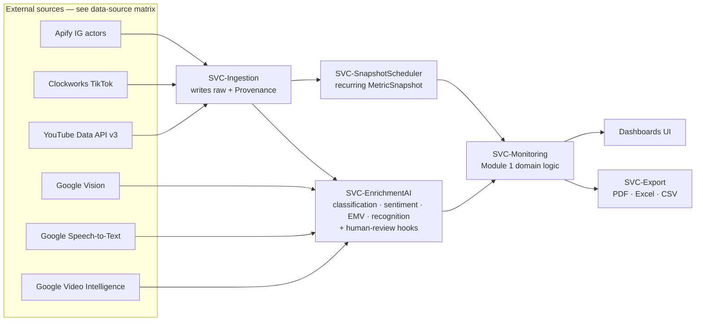

# Module 1 — Monitoring & Reporting

> **Template compliance.** This spec follows the six-section module template in
> [`_module-spec-template.md`](./_module-spec-template.md): (1) Purpose & Scope,
> (2) Requirements, (3) Data Owned, (4) Sources Consumed, (5) Acceptance
> Criteria, (6) UI & Reporting.
>
> **Single-source-of-truth reminder.** Entity fields are defined only in the
> [data model](../30-data-model/00-data-model.md). Enums are defined only in the
> [glossary](../00-meta/03-glossary.md). Write-ownership is decided only in the
> [ownership matrix](../70-shared/00-ownership-matrix.md). Sources are defined
> only in the [data-source matrix](../40-integrations/00-data-source-matrix.md).
> This file **links** to those facts and never restates them.

---

## 1. Purpose & Scope

Module 1 ("Monitoring & Reporting", service **SVC-Monitoring**) is the system's
measurement engine, focused **roster-first** on the agency's own creators — the
influencers already working with Question de Style
([ADR-0011](../05-decisions/decision-log.md#adr-0011)). For each tracked creator
(the [roster](../00-meta/03-glossary.md#gl-roster), modelled as
[`MonitoredSubject`](../30-data-model/00-data-model.md#ent-monitoredsubject)s of
type `CREATOR`) it monitors overall activity across
[`ENUM-Platform`](../00-meta/03-glossary.md#enum-platform) — reach, follower
count, likes, comments, posting cadence, last post — and collects each new post,
reel, and story. When a creator has received a seeded product, Module 1
**detects the content that shows it** (brand/product recognition + matching to
the Module 3 shipment), captures that content's views/likes/comments/estimated
reach, classifies the mention as seeded/paid/likely organic, computes a
transparent Earned Media Value, and surfaces per-creator and per-product
statistics in filterable dashboards and exports.

Broad open-web brand/keyword/hashtag listening — mentions from creators **not**
on the roster — is **deferred** in v1
([DEF-006](../20-cross-cutting/01-deferred-register.md#def-006)).

Module 1 is the first module built after foundation because it exercises the
full **ingestion → AI enrichment → storage** pipeline that Discovery (Module 2)
and CRM & Seeding (Module 3) later reuse — see the
[roadmap](../80-delivery/00-roadmap.md) (phase **P1**).

**In scope:** REQ-M1-001 … REQ-M1-012 (all **Active** except **REQ-M1-010**, deferred — [DEF-005](../20-cross-cutting/01-deferred-register.md#def-005); detailed in §2).

**Explicitly out of scope for v1 (rendered "unavailable", never empty/zero):**
open-web brand/keyword listening from non-roster creators ([DEF-006](../20-cross-cutting/01-deferred-register.md#def-006)),
comment & audience-reaction analysis ([DEF-005](../20-cross-cutting/01-deferred-register.md#def-005)),
audience demographics ([DEF-001](../20-cross-cutting/01-deferred-register.md#def-001)),
creator contact auto-extraction ([DEF-002](../20-cross-cutting/01-deferred-register.md#def-002)),
and **CONFIRMED unique reach / impressions**
([DEF-003](../20-cross-cutting/01-deferred-register.md#def-003)). See §6 for how
reach is presented.

### 1.1 Service map & data flow

Provenance is attached at ingestion for every externally-sourced record
([DP-002](../20-cross-cutting/00-data-principles.md#dp-002)); every inferred
value (mention class, sentiment, recognition, estimated reach) carries a
`ConfidenceAssessment`
([DP-003](../20-cross-cutting/00-data-principles.md#dp-003),
[ADR-0008 doctrine](../05-decisions/decision-log.md#adr-0008)).

---

## 2. Requirements

All requirements below are **Active** except **REQ-M1-010**, which is **DEFERRED** ([DEF-005](../20-cross-cutting/01-deferred-register.md#def-005)). The canonical scope map (feature →
sources → Active/Deferred → REQ-ID) lives in the
[modules overview](../10-product/01-modules-overview.md#module-1-monitoring);
phase/status tracking lives in the
[requirement matrix](../90-traceability/00-req-matrix.md). Status values are
[`ENUM-DocStatus`](../00-meta/03-glossary.md#enum-docstatus).

| REQ-ID | Feature | Status | Key entities (see [data model](../30-data-model/00-data-model.md)) | Notes |
|---|---|---|---|---|
| REQ-M1-001 | Roster monitoring — track agency creators & activity | APPROVED | `MonitoredSubject` (type `CREATOR`), `PlatformAccount` (read), `MetricSnapshot` | Poll each tracked creator (the [roster](../00-meta/03-glossary.md#gl-roster)): reach, followers, likes, comments, last post. Open-web term listening deferred ([DEF-006](../20-cross-cutting/01-deferred-register.md#def-006)). |
| REQ-M1-002 | Paid/seeded/organic mention classification | APPROVED | `Mention` | AI + manual correction; uses [`ENUM-MentionType`](../00-meta/03-glossary.md#enum-mentiontype). Organic is **never** asserted as fact ([DP-003](../20-cross-cutting/00-data-principles.md#dp-003)). |
| REQ-M1-003 | Public content collection (posts/reels) | APPROVED | `ContentItem`, `PlatformAccount` (read) | Uses [`ENUM-ContentType`](../00-meta/03-glossary.md#enum-contenttype). Stories are **not** ContentItems (see §3). |
| REQ-M1-004 | Story monitoring & archival before expiry | APPROVED | `Story` | Capture stories before platform expiry; media lifecycle hardening in **P4**. |
| REQ-M1-005 | Performance metrics — **account-level & content-level** + derived rates | APPROVED | `PlatformAccount` (read), `ContentItem`, `MetricSnapshot` | **Account-level** overall stats (followers, overall reach/engagement, posting frequency) **and** content-level PUBLIC metrics + **DERIVED** rates (see §2.1, [DP-001](../20-cross-cutting/00-data-principles.md#dp-001)). |
| REQ-M1-006 | Reach & impressions tiering | APPROVED | `MetricSnapshot` (embeds `ReachEstimate`) | PUBLIC views/plays vs **ESTIMATED** reach; **CONFIRMED** reach is [DEF-003](../20-cross-cutting/01-deferred-register.md#def-003). |
| REQ-M1-007 | Historical performance tracking — **account growth + content** | APPROVED | `MetricSnapshot` | Own-DB timestamped snapshots via **SVC-SnapshotScheduler** → **follower/engagement growth per creator** and content trends ([`ROLLUP-CreatorByPeriod`](../30-data-model/01-analytics-model.md)); no external history API ([ADR-0003](../05-decisions/decision-log.md#adr-0003)). |
| REQ-M1-008 | Brand recognition in content | APPROVED | `RecognitionDetection` | OCR / logo / spoken-brand / on-screen text; low confidence → review queue ([DP-004](../20-cross-cutting/00-data-principles.md#dp-004)). Uses [`ENUM-RecognitionType`](../00-meta/03-glossary.md#enum-recognitiontype). |
| REQ-M1-009 | Sentiment & context analysis | APPROVED | `SentimentAnalysis` | AI + manual correction; uses [`ENUM-SentimentLabel`](../00-meta/03-glossary.md#enum-sentimentlabel). |
| REQ-M1-010 | Comment & audience-reaction analysis | **DEFERRED** | `Comment` (not populated in v1) | Deferred on cost grounds — [DEF-005](../20-cross-cutting/01-deferred-register.md#def-005) / [ADR-0009](../05-decisions/decision-log.md#adr-0009). Sentiment (REQ-M1-009) runs on captions/transcripts only. |
| REQ-M1-011 | EMV calculation | APPROVED | `MetricSnapshot`, `ContentItem` | Configurable, transparent; every report shows model + rates (see §2.1). |
| REQ-M1-012 | Dashboards & reporting | APPROVED | (reads all M1 entities) | Filters + exports [`ENUM-ExportFormat`](../00-meta/03-glossary.md#enum-exportformat) via **SVC-Export**. |

### 2.1 Metric tiering rules (binding)

Metric tiers are [`ENUM-MetricTier`](../00-meta/03-glossary.md#enum-metrictier);
every emitted metric MUST be tagged
([DP-001](../20-cross-cutting/00-data-principles.md#dp-001)). Metric definitions
(MET-*) are canonical in the
[data model metrics catalog](../30-data-model/00-data-model.md#metrics-catalog).

| Quantity | Tier | Rationale |
|---|---|---|
| Views, plays, likes, comments count, shares, saves, subscribers | **PUBLIC** | Directly observed public metric. |
| Engagement rate, view rate, comment rate | **DERIVED** | Deterministically computed from PUBLIC values — **never PUBLIC**. |
| Average performance, median performance | **DERIVED** | Computed aggregates — **never PUBLIC**. |
| Reach / impressions estimate | **ESTIMATED** | Modeled via `ReachEstimate.method`; never presented as fact. |
| True unique reach / impressions | **CONFIRMED** → **unavailable in v1** | Requires private analytics — [DEF-003](../20-cross-cutting/01-deferred-register.md#def-003) / [ADR-0006](../05-decisions/decision-log.md#adr-0006). |
| Agency-authorized / manual analytics input | **CONFIRMED** | Only when supplied through authorized channels. |

---

## 3. Data Owned

Module 1 is the **single write-owner** of the entities below. The authoritative
owner→reader mapping (the tiebreaker for write authority) is the
[ownership matrix](../70-shared/00-ownership-matrix.md); reader modules and any
future changes are governed there — this section does not restate readers or
field shapes.

Entity field shapes are canonical in the
[data model](../30-data-model/00-data-model.md). Envelopes (`Provenance`,
`ConfidenceAssessment`, `MetricValue`, `ReachEstimate`) are embedded shapes with
no module owner.

**M1 write-owned entities** (link each to its definition):

- [`ContentItem`](../30-data-model/00-data-model.md#ent-contentitem)
- [`Story`](../30-data-model/00-data-model.md#ent-story)
- [`Comment`](../30-data-model/00-data-model.md#ent-comment)
- [`MonitoredSubject`](../30-data-model/00-data-model.md#ent-monitoredsubject)
- [`Mention`](../30-data-model/00-data-model.md#ent-mention)
- [`RecognitionDetection`](../30-data-model/00-data-model.md#ent-recognitiondetection)
- [`SentimentAnalysis`](../30-data-model/00-data-model.md#ent-sentimentanalysis)
- [`MetricSnapshot`](../30-data-model/00-data-model.md#ent-metricsnapshot) — written by the **SVC-SnapshotScheduler** service on a recurring schedule.

**Stories vs content (binding):** a `Story` is always the
[`ENT-Story`](../30-data-model/00-data-model.md#ent-story) entity. `STORY` is
**not** a value of
[`ENUM-ContentType`](../00-meta/03-glossary.md#enum-contenttype); a story is
never a `ContentItem` with a "story" type. The authoritative statement of this
rule lives in the [data model](../30-data-model/00-data-model.md#ent-story).

**Entities M1 reads but does not write:**
[`PlatformAccount`](../30-data-model/00-data-model.md#ent-platformaccount) and
[`Creator`](../30-data-model/00-data-model.md#ent-creator) (owned by Module 3),
[`Campaign`](../30-data-model/00-data-model.md#ent-campaign) and
[`SeedingCampaign`](../30-data-model/00-data-model.md#ent-seedingcampaign)
(owned by Module 3). When monitoring discovers a previously-unknown creator,
Module 1 **does not write `Creator` directly** — it proposes the creator to the
CRM/ingestion service via the cross-module creator-proposal contract, per the
[ownership matrix](../70-shared/00-ownership-matrix.md). Creator identity and
merge remain Module 3's system of record.

---

## 4. Sources Consumed

Sources are canonical in the
[data-source matrix](../40-integrations/00-data-source-matrix.md) (closed
provider registry, capability→source matrix, and raw→domain field mapping). The
v1 provider stack is frozen
([DP-006](../20-cross-cutting/00-data-principles.md#dp-006) /
[ADR-0001](../05-decisions/decision-log.md#adr-0001)); do not invent providers.
TikTok is Apify-only ([ADR-0002](../05-decisions/decision-log.md#adr-0002)).

| Feature (REQ) | Source(s) — see [matrix](../40-integrations/00-data-source-matrix.md) | Purpose |
|---|---|---|
| Roster monitoring — per-creator account + content polling (REQ-M1-001) | `SRC-apify-instagram-scraper`, `SRC-apify-instagram-profile-scraper`, `SRC-clockworks-tiktok-scraper`, `SRC-youtube-data-api-v3` | Poll each tracked creator's accounts by handle for profile metrics + new content (not open-web search — that is [DEF-006](../20-cross-cutting/01-deferred-register.md#def-006)). |
| Posts collection (REQ-M1-003) | `SRC-apify-instagram-scraper`, `SRC-apify-instagram-post-scraper`, `SRC-clockworks-tiktok-scraper`, `SRC-youtube-data-api-v3` | Public posts/videos + metrics. |
| Reels collection & play counts (REQ-M1-003, REQ-M1-005) | `SRC-apify-instagram-reel-scraper`, `SRC-clockworks-tiktok-scraper`, `SRC-youtube-data-api-v3` | Reels/shorts + play/view counts (optional transcript add-on on IG reels). |
| Stories (REQ-M1-004) | `SRC-apify-instagram-story-details` | Stories, no login required (louisdeconinck actor). |
| Comments / audience reaction (REQ-M1-010) | — (**Deferred** in v1, [DEF-005](../20-cross-cutting/01-deferred-register.md#def-005)) | Not collected in v1. |
| Profile context (REQ-M1-005) | `SRC-apify-instagram-profile-scraper`, `SRC-clockworks-tiktok-scraper`, `SRC-youtube-data-api-v3` | Profile metrics/bio/links. **Does not** return email/phone ([DEF-002](../20-cross-cutting/01-deferred-register.md#def-002)). |
| Historical growth (REQ-M1-007) | **None external** — own-DB `MetricSnapshot` via SVC-SnapshotScheduler | [ADR-0003](../05-decisions/decision-log.md#adr-0003). |
| Recognition — image OCR / logo (REQ-M1-008) | `SRC-google-cloud-vision` | `IMAGE_TEXT_OCR`, `LOGO`. |
| Recognition — spoken brand (REQ-M1-008) | `SRC-google-speech-to-text` | `SPOKEN_BRAND` (German models enabled). |
| Recognition — on-screen text/logo in video (REQ-M1-008) | `SRC-google-video-intelligence` (OPTIONAL) | `ON_SCREEN_TEXT`. |

---

## 5. Acceptance Criteria

Given/When/Then criteria, in the format defined in
[conventions](../00-meta/01-conventions.md#acceptance-criteria-format). IDs use
the `AC-M1-<NNN>` grammar. These cover the core buildable behaviour; each AC
traces to its REQ.

### AC-M1-001 — Roster monitoring tracks each creator's activity (REQ-M1-001)
- **Given** a [`MonitoredSubject`](../30-data-model/00-data-model.md#ent-monitoredsubject) of type `CREATOR` referencing a tracked creator's [`PlatformAccount`](../30-data-model/00-data-model.md#ent-platformaccount)s,
- **When** SVC-Ingestion runs a monitoring cycle across [`ENUM-Platform`](../00-meta/03-glossary.md#enum-platform),
- **Then** the creator's overall metrics (follower count, reach estimate, likes, comments, posting cadence, last post) are captured as [`MetricSnapshot`](../30-data-model/00-data-model.md#ent-metricsnapshot)s and each new post/reel/story is collected, **each** carrying a `Provenance` envelope naming its `SRC-*` source ([DP-002](../20-cross-cutting/00-data-principles.md#dp-002)); no duplicate is created within one cycle. Open-web term subjects are not processed in v1 ([DEF-006](../20-cross-cutting/01-deferred-register.md#def-006)).

### AC-M1-002 — Mention classification never asserts organic as fact (REQ-M1-002)
- **Given** a captured `Mention` with no disclosure label and no advertising/seeding record,
- **When** SVC-EnrichmentAI classifies it,
- **Then** its [`ENUM-MentionType`](../00-meta/03-glossary.md#enum-mentiontype) is set to `LIKELY_ORGANIC` or `UNKNOWN` (never `PAID`/`SEEDED` without a proving record; there is no `CONFIRMED_ORGANIC` value), and the value carries a `ConfidenceAssessment` with a [`ENUM-ConfidenceLevel`](../00-meta/03-glossary.md#enum-confidencelevel) and `verificationStatus = AI_ASSESSED` ([DP-003](../20-cross-cutting/00-data-principles.md#dp-003)).
- **And Given** an analyst corrects the class, **When** saved, **Then** `verificationStatus` becomes `HUMAN_CORRECTED`, the correction is stored and feeds future rules ([DP-004](../20-cross-cutting/00-data-principles.md#dp-004)).

### AC-M1-003 — Paid/seeded requires a proving record (REQ-M1-002)
- **Given** a `Mention` on content that carries a platform paid-partnership label **or** is linked to a Module-3 [`SeedingCampaign`](../30-data-model/00-data-model.md#ent-seedingcampaign)/[`Campaign`](../30-data-model/00-data-model.md#ent-campaign) record,
- **When** classified,
- **Then** its [`ENUM-MentionType`](../00-meta/03-glossary.md#enum-mentiontype) may be set to `PAID` or `SEEDED`, and the proving signal is recorded in the `ConfidenceAssessment.signals` list.

### AC-M1-020 — Seeded-product content is detected on roster creators (REQ-M1-001, REQ-M1-008)
- **Given** a tracked creator who received a [`Shipment`](../30-data-model/00-data-model.md#ent-shipment) for a [`Product`](../30-data-model/00-data-model.md#ent-product), and a new reel/post/story they publish showing that product,
- **When** SVC-EnrichmentAI runs brand/product recognition ([REQ-M1-008](../90-traceability/00-req-matrix.md)) and the content is matched to the shipment ([REQ-M3-008](../90-traceability/00-req-matrix.md)),
- **Then** the content's PUBLIC views/likes/comments and ESTIMATED reach are captured, a [`Mention`](../30-data-model/00-data-model.md#ent-mention) is classified `SEEDED` (proving record = the shipment), and the result flows to seeding results / product aggregation ([REQ-M3-009](../90-traceability/00-req-matrix.md), [REQ-M3-013](../90-traceability/00-req-matrix.md)) and EMV ([REQ-M1-011](../90-traceability/00-req-matrix.md)).

### AC-M1-004 — Public content collection & content typing (REQ-M1-003)
- **Given** a monitored IG account with image posts, a carousel, and a reel,
- **When** ingested,
- **Then** each becomes a [`ContentItem`](../30-data-model/00-data-model.md#ent-contentitem) tagged with the correct [`ENUM-ContentType`](../00-meta/03-glossary.md#enum-contenttype) value (`IMAGE_POST`, `CAROUSEL`, `REEL`), and no `ContentItem` is created with a story type (stories are handled by AC-M1-005).

### AC-M1-005 — Story archival before expiry (REQ-M1-004)
- **Given** an active story on a monitored account,
- **When** the SVC-Ingestion story cycle runs before the platform expiry window via `SRC-apify-instagram-story-details`,
- **Then** a [`Story`](../30-data-model/00-data-model.md#ent-story) record and its media are archived with a `Provenance` envelope and `fetchedAt` timestamp, so the story remains available after it expires on the platform.

### AC-M1-006 — Metrics carry the correct tier (REQ-M1-005)
- **Given** a collected `ContentItem` with observed views and likes,
- **When** metrics are emitted,
- **Then** views/likes are tagged **PUBLIC**, and the computed engagement rate, view rate, and comment rate are tagged **DERIVED** — never PUBLIC — each as a `MetricValue` with `tier` from [`ENUM-MetricTier`](../00-meta/03-glossary.md#enum-metrictier) ([DP-001](../20-cross-cutting/00-data-principles.md#dp-001)).

### AC-M1-007 — Reach tiering & CONFIRMED unavailable (REQ-M1-006)
- **Given** a `ContentItem` with public play/view counts,
- **When** the reach panel renders,
- **Then** PUBLIC views/plays are shown as fact, any reach figure is shown as a `ReachEstimate` with `tier = ESTIMATED` and a visible `method` label, and **CONFIRMED** unique reach renders "unavailable" (never empty/zero), linking [DEF-003](../20-cross-cutting/01-deferred-register.md#def-003).

### AC-M1-008 — Historical snapshots accumulate (REQ-M1-007)
- **Given** a tracked account/content,
- **When** SVC-SnapshotScheduler runs on its recurring schedule,
- **Then** a new timestamped [`MetricSnapshot`](../30-data-model/00-data-model.md#ent-metricsnapshot) is written each cycle (no external history API — [ADR-0003](../05-decisions/decision-log.md#adr-0003)), and a growth series (e.g. **follower growth**, engagement trend, content performance) can be reconstructed from the ordered snapshots.

### AC-M1-021 — Overall account monitoring per creator (REQ-M1-005, REQ-M1-007)
- **Given** a tracked creator's [`PlatformAccount`](../30-data-model/00-data-model.md#ent-platformaccount)s,
- **When** monitoring runs over successive cycles,
- **Then** the creator's **overall account stats** — follower count and growth, overall reach/engagement, average views, posting frequency, last post — are tracked over time via account-level `MetricSnapshot`s and surfaced per creator by [`ROLLUP-CreatorByPeriod`](../30-data-model/01-analytics-model.md) at any grain (week/month/quarter/year), with DERIVED rates never shown as PUBLIC ([DP-001](../20-cross-cutting/00-data-principles.md#dp-001)).

### AC-M1-009 — Recognition low-confidence routes to review (REQ-M1-008)
- **Given** an image processed by `SRC-google-cloud-vision` that yields a logo match with a low `ConfidenceAssessment.value`,
- **When** enrichment completes,
- **Then** a [`RecognitionDetection`](../30-data-model/00-data-model.md#ent-recognitiondetection) is created with the matching [`ENUM-RecognitionType`](../00-meta/03-glossary.md#enum-recognitiontype) and `verificationStatus = AI_ASSESSED`, and low-confidence detections are placed in the human review queue ([DP-004](../20-cross-cutting/00-data-principles.md#dp-004)); a reviewer decision sets `HUMAN_REVIEWED` or `HUMAN_CORRECTED`.

### AC-M1-010 — Sentiment is reviewable (REQ-M1-009)
- **Given** a `ContentItem` with its caption and, where available, its transcript,
- **When** sentiment is analysed,
- **Then** each [`SentimentAnalysis`](../30-data-model/00-data-model.md#ent-sentimentanalysis) records a [`ENUM-SentimentLabel`](../00-meta/03-glossary.md#enum-sentimentlabel) with a `ConfidenceAssessment`, and an analyst can correct it (setting `HUMAN_CORRECTED`).

> **DEFERRED — REQ-M1-010** (comment & audience-reaction analysis) is not in v1: see [DEF-005](../20-cross-cutting/01-deferred-register.md#def-005) / [ADR-0009](../05-decisions/decision-log.md#adr-0009). Sentiment above runs on captions/transcripts, not comment threads.

### AC-M1-011 — EMV is transparent (REQ-M1-011)
- **Given** an EMV computed from DERIVED rates and PUBLIC/ESTIMATED inputs,
- **When** an EMV figure appears in any dashboard or export,
- **Then** the same view discloses the EMV model, the rate parameters used, and the tier of every input ([DP-001](../20-cross-cutting/00-data-principles.md#dp-001)); no ESTIMATED input is presented as fact.

### AC-M1-012 — Dashboards filter and export (REQ-M1-012)
- **Given** a dashboard filtered by platform, subject, date range, and [`ENUM-MentionType`](../00-meta/03-glossary.md#enum-mentiontype),
- **When** the user exports,
- **Then** SVC-Export produces the file in the chosen [`ENUM-ExportFormat`](../00-meta/03-glossary.md#enum-exportformat) (`PDF`/`EXCEL`/`CSV`), preserving tier labels and provenance references shown on screen.

---

## 6. UI & Reporting

Dashboards are the primary Module-1 surface, served by SVC-Monitoring and
exported by SVC-Export.

**Dashboard behaviour**
- Filters: platform ([`ENUM-Platform`](../00-meta/03-glossary.md#enum-platform)), monitored subject, date range, content type ([`ENUM-ContentType`](../00-meta/03-glossary.md#enum-contenttype)), mention type ([`ENUM-MentionType`](../00-meta/03-glossary.md#enum-mentiontype)), sentiment ([`ENUM-SentimentLabel`](../00-meta/03-glossary.md#enum-sentimentlabel)).
- Every metric shows its [`ENUM-MetricTier`](../00-meta/03-glossary.md#enum-metrictier) badge; DERIVED rates and EMV expose their formula/model on hover or in the report footer (AC-M1-011).
- Every AI-inferred value (mention class, sentiment, recognition) shows its [`ENUM-ConfidenceLevel`](../00-meta/03-glossary.md#enum-confidencelevel) and [`ENUM-VerificationStatus`](../00-meta/03-glossary.md#enum-verificationstatus), and offers a correction control that writes back through the review loop ([DP-004](../20-cross-cutting/00-data-principles.md#dp-004)).

**Reach presentation (binding — REQ-M1-006)**
- Show **PUBLIC** views/plays as observed fact.
- Show reach only as a clearly-labelled **ESTIMATED** `ReachEstimate` with its `method`.
- Render **CONFIRMED** unique reach/impressions as **"unavailable"** (never empty, never zero), linking [DEF-003](../20-cross-cutting/01-deferred-register.md#def-003). This is the deferred-field UI rule from the [deferred register](../20-cross-cutting/01-deferred-register.md).

**Deferred fields elsewhere in M1 views:** audience demographics render
"unavailable" ([DEF-001](../20-cross-cutting/01-deferred-register.md#def-001));
creator email/phone are not auto-extracted and render "unavailable"
([DEF-002](../20-cross-cutting/01-deferred-register.md#def-002)).

**Exports (REQ-M1-012):** PDF, Excel, CSV via
[`ENUM-ExportFormat`](../00-meta/03-glossary.md#enum-exportformat); exports carry
the same tier labels, confidence indicators, and provenance references as the
on-screen view. White-label client reports are a **P4** hardening item — see the
[roadmap](../80-delivery/00-roadmap.md).

**Access:** report visibility follows the roles/permissions defined in Module 3
([`ENUM-RoleName`](../00-meta/03-glossary.md#enum-rolename)); `CLIENT_VIEWER`
sees only approved reports for their brands.