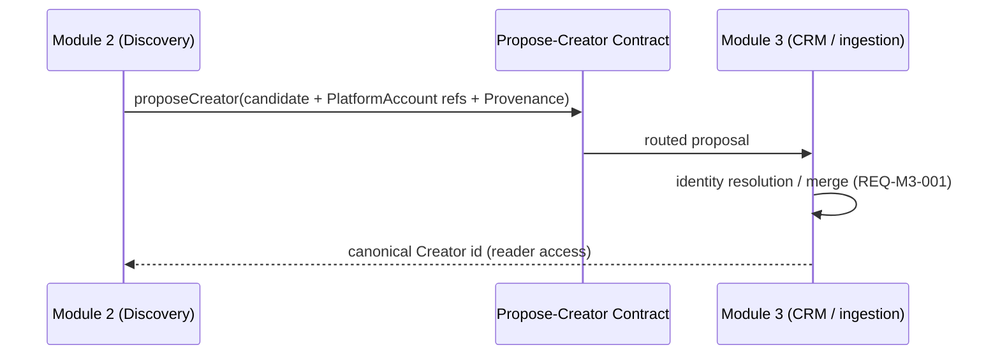

# Module 2 — Discovery

> Module spec written against the six-section shape defined in
> [`_module-spec-template.md`](_module-spec-template.md). This file is the full,
> canonical specification for Module 2 (Discovery). It links to canonical facts;
> it never restates enum values, entity field shapes, source contracts,
> write-ownership, or decisions that live in their single-source-of-truth files.

## 1. Purpose and Scope

Module 2 (Discovery) is the influencer-finding and evaluation surface of QDS. It
lets agency staff **search** for creators across the supported platforms, build a
**unified profile** per creator, and **evaluate** each creator through inferred
attributes (geography, sector, audience quality, suitability) so that a shortlist
of well-matched candidates can be handed to Module 3 for relationship and campaign
work.

Discovery is a **read-and-infer** module: it reads public content and metrics
already ingested by the platform, computes and stores its own inference entities,
and **proposes** creators into the system of record. It does not own creator
identity and does not scrape or write raw content itself.

### 1.1 Position in the platform

- Creator identity is owned by **Module 3**. Discovery **proposes** new creators
  through a cross-module hand-off; it never writes `Creator` directly. See
  [Section 5](#5-cross-module-contracts) and the
  [ownership matrix](../70-shared/00-ownership-matrix.md).
- Discovery consumes `ContentItem`, `Comment`, `MetricSnapshot`, `PlatformAccount`,
  and `Creator` as a **reader** and writes only its own inference entities
  (see [Section 4](#4-data-owned-and-consumed)).

### 1.2 Roadmap phase

Module 2 is delivered in **P2** of the
[roadmap](../80-delivery/00-roadmap.md). Per the
[status lifecycle](../00-meta/02-status-lifecycle.md), the requirements below are
`APPROVED` and become buildable only when P2 is the active phase. P2 depends on
P0 (foundation) and P1 (Monitoring pipeline: `ContentItem`, `MetricSnapshot`,
`Creator` reads).

### 1.3 In scope / out of scope

**In scope (Active):** REQ-M2-001 … REQ-M2-011 as enumerated in
[Section 2](#2-requirements) and detailed in
[Section 3](#3-acceptance-criteria).

**Out of scope (Deferred):**

| Deferred capability | Register entry | Discovery behaviour |
| --- | --- | --- |
| Audience-country / audience-age / audience-gender filters and facets | [DEF-001](../20-cross-cutting/01-deferred-register.md) | Filter controls are present but render **"unavailable"** (never empty/zero); no audience-demographic value is stored, ranked on, or exported. |

Audience-demographic filtering is deferred per
[ADR-0004](../05-decisions/decision-log.md) and must follow the
unavailable-never-empty UI rule from the
[deferred register](../20-cross-cutting/01-deferred-register.md).

## 2. Requirements

Canonical scope mapping (feature → sources → Active/Deferred → REQ-ID) lives in
[modules overview](../10-product/01-modules-overview.md) and the
[requirements matrix](../90-traceability/00-req-matrix.md). This section restates
only the requirement titles it owns the detail for.

| REQ-ID | Title | Status | Primary owned/consumed entities |
| --- | --- | --- | --- |
| REQ-M2-001 | Influencer search (keyword / hashtag / topic / mention / similar) | Active | reads `ContentItem`, `Mention`, `PlatformAccount`, `Creator` |
| REQ-M2-002 | Advanced filters (public-derived) | Active | audience-country/age/gender facets are Deferred → [DEF-001](../20-cross-cutting/01-deferred-register.md) |
| REQ-M2-003 | Geographic attribution with confidence | Active | owns `GeoAttribution` |
| REQ-M2-004 | Unified creator profile | Active | reads `Creator`, `PlatformAccount`, `ContentItem`, `MetricSnapshot` |
| REQ-M2-005 | AI sector classification (multi-label + relevance %) | Active | owns `SectorClassification` |
| REQ-M2-006 | Performance analysis (average AND median) | Active | reads `MetricSnapshot`, `ContentItem` |
| REQ-M2-007 | Audience-quality / authenticity estimation | Active | owns `AuthenticityAssessment`; non-comment public signals only in v1 ([DEF-005](../20-cross-cutting/01-deferred-register.md#def-005)) |
| REQ-M2-008 | Previous brand-collaboration detection | Active | reads `Mention` (owned by M1) |
| REQ-M2-009 | Influencer suitability scoring (per-brand models) | Active | owns `SuitabilityScore` |
| REQ-M2-010 | Influencer comparison | Active | reads inference entities + `MetricSnapshot` |
| REQ-M2-011 | Shortlists | Active | owns `Shortlist` |

### 2.1 Sources used

Discovery does not call sources directly; ingestion is performed by
`SVC-Ingestion` and surfaced through Module 1. When Discovery triggers a search,
the underlying provider registry is the closed set in the
[data-source matrix](../40-integrations/00-data-source-matrix.md):
Instagram and TikTok via Apify actors, YouTube via the official Data API v3.
No provider outside that registry may be introduced (DP-006 / ADR-0001).

## 3. Acceptance Criteria

All acceptance criteria are testable and reference canonical enums, entities,
principles, and sources by name/link only.

### 3.1 REQ-M2-001 — Influencer search

- **AC-M2-001a** — Discovery supports search by **keyword**, **hashtag**,
  **topic**, **mention**, and **similar-creator** modes. Each mode resolves
  through the capability→source matrix in the
  [data-source matrix](../40-integrations/00-data-source-matrix.md); a search
  scoped to a platform uses only sources valid for that value of
  [`ENUM-Platform`](../00-meta/03-glossary.md#enum-platform).
- **AC-M2-001b** — Every returned candidate that originates from an external
  fetch carries the `Provenance` envelope (DP-002); results without provenance
  are not shown as sourced facts.
- **AC-M2-001c** — "Similar-creator" search takes an existing `Creator` /
  `PlatformAccount` as seed and returns other accounts; results are ranked but no
  similarity value is asserted as a confirmed fact.
- **AC-M2-001d** — Search never creates a `Creator`. A user promoting a result
  into the system of record triggers the propose-creator hand-off in
  [Section 5](#5-cross-module-contracts).

### 3.2 REQ-M2-002 — Advanced filters

- **AC-M2-002a** — Filters operate on public and DERIVED attributes already held
  by the platform (e.g. platform, follower count, content type via
  [`ENUM-ContentType`](../00-meta/03-glossary.md#enum-contenttype), engagement rate,
  sector labels). Every metric-based filter respects its tier
  ([`ENUM-MetricTier`](../00-meta/03-glossary.md#enum-metrictier)) and never treats
  an `ESTIMATED` value as a hard fact (DP-001).
- **AC-M2-002b** — **Audience-country, audience-age, and audience-gender filters
  are Deferred** ([DEF-001](../20-cross-cutting/01-deferred-register.md),
  [ADR-0004](../05-decisions/decision-log.md)). Their controls appear in the UI in
  a disabled state rendered as **"unavailable"** — never as empty, zero, or a
  fabricated distribution — and they contribute nothing to filtering or ranking.
- **AC-M2-002c** — Sector filtering uses
  [`ENUM-SectorLabel`](../00-meta/03-glossary.md#enum-sectorlabel) values sourced
  from `SectorClassification` (REQ-M2-005); it is multi-label aware (a creator may
  match on any of its labels).

### 3.3 REQ-M2-003 — Geographic attribution with confidence

> **v1 note ([ADR-0018](../05-decisions/decision-log.md#adr-0018)).** Ahead of P2,
> operators may assign a creator's geography manually from the CRM; the entry is a
> `GeoAttribution` at `HUMAN_REVIEWED` written through the M2-owned `CreatorGeography`
> seam. The automatic inference below stays deferred with this phase and never
> overwrites an operator assignment (DP-004).

- **AC-M2-003a** — Discovery writes a `GeoAttribution` record per creator/account.
  Because location is inferred, `GeoAttribution` carries a `ConfidenceAssessment`
  envelope and is **never** presented as a fact (DP-003).
- **AC-M2-003b** — The `ConfidenceAssessment` on a `GeoAttribution` populates
  `confidenceLevel` from
  [`ENUM-ConfidenceLevel`](../00-meta/03-glossary.md#enum-confidencelevel), lists the
  contributing `signals` used (e.g. profile-declared location, language,
  geotags/on-content cues), and sets `verificationStatus` from
  [`ENUM-VerificationStatus`](../00-meta/03-glossary.md#enum-verificationstatus).
- **AC-M2-003c** — A freshly inferred attribution has
  `verificationStatus = AI_ASSESSED` (never `AII_ASSESSED`). Human edits move it to
  `HUMAN_REVIEWED` or `HUMAN_CORRECTED`; corrections are stored and feed future
  rules per the AI-review loop (DP-004).
- **AC-M2-003d** — Low-confidence attributions
  (`confidenceLevel` of `LOW` or `UNKNOWN`) are surfaced for human review and are
  visibly labelled as unconfirmed wherever a geography is shown.

### 3.4 REQ-M2-004 — Unified creator profile

- **AC-M2-004a** — The unified profile aggregates, for one creator, its
  `PlatformAccount` records across platforms plus reader views of `ContentItem`,
  `MetricSnapshot`, `Mention`, and the Discovery inference entities
  (`GeoAttribution`, `SectorClassification`, `AuthenticityAssessment`,
  `SuitabilityScore`).
- **AC-M2-004b** — The profile reads `Creator` and `PlatformAccount` (both owned
  by Module 3 — see [ownership matrix](../70-shared/00-ownership-matrix.md)); it
  does not write them. Cross-platform identity merge is a Module 3 responsibility
  (REQ-M3-001).
- **AC-M2-004c** — Any deferred datum on the profile (e.g. audience demographics,
  true unique reach) renders **"unavailable"** per the deferred register, not as
  zero.
- **AC-M2-004d** — Every displayed metric is tagged with its
  [`ENUM-MetricTier`](../00-meta/03-glossary.md#enum-metrictier); every inferred
  attribute shows its confidence.

### 3.5 REQ-M2-005 — AI sector classification

- **AC-M2-005a** — Discovery writes a `SectorClassification` per creator/account
  as a **multi-label** result: zero or more
  [`ENUM-SectorLabel`](../00-meta/03-glossary.md#enum-sectorlabel) values, each with
  a **relevance percentage**.
- **AC-M2-005b** — Because sector is inferred, the classification carries a
  `ConfidenceAssessment` (DP-003) with `verificationStatus = AI_ASSESSED` on
  creation; reviewers may correct labels, moving status to `HUMAN_CORRECTED`, and
  corrections feed back into future rules (DP-004).
- **AC-M2-005c** — A creator with no confidently assignable sector may be labelled
  `OTHER`; the classification is never left as a silent empty that reads as a
  factual "no sector".

### 3.6 REQ-M2-006 — Performance analysis (average AND median)

- **AC-M2-006a** — Discovery computes both the **average** and the **median** of
  the relevant public performance metrics (e.g. views, likes, comments,
  engagement rate) over a creator's content window, reading `MetricSnapshot`
  (owned by Module 1) and `ContentItem`.
- **AC-M2-006b** — Average and median performance figures, and engagement rate,
  are tier **`DERIVED`** — deterministically computed from `PUBLIC` values — never
  `PUBLIC` themselves (DP-001; see
  [`ENUM-MetricTier`](../00-meta/03-glossary.md#enum-metrictier)). Each derived
  figure is tagged `DERIVED` wherever shown.
- **AC-M2-006c** — Reach shown in performance analysis is `PUBLIC` views/plays or
  clearly-labelled `ESTIMATED` reach only; `CONFIRMED` unique reach is Deferred
  ([DEF-003](../20-cross-cutting/01-deferred-register.md), ADR-0006) and rendered
  "unavailable".

### 3.7 REQ-M2-007 — Audience-quality / authenticity estimation

- **AC-M2-007a** — Discovery writes an `AuthenticityAssessment` producing a
  **risk/quality score derived from public signals only** (e.g. follower/engagement
  ratios, engagement patterns, posting regularity).
- **AC-M2-007b** — The assessment is an **estimate, never proof of fake
  followers**. It carries a `ConfidenceAssessment` (DP-003) and is always labelled
  as a public-signal estimate; it must not assert as fact that any account is
  fraudulent.
- **AC-M2-007c** — `verificationStatus = AI_ASSESSED` on creation; human review
  can move it to `HUMAN_REVIEWED` / `HUMAN_CORRECTED`, and corrections feed future
  rules (DP-004).
- **AC-M2-007d** — Audience-demographic signals are **not** inputs to the score in
  v1 (they are Deferred — [DEF-001](../20-cross-cutting/01-deferred-register.md));
  the score relies solely on available public engagement signals.
- **AC-M2-007e** — Comment-pattern signals are **not** inputs in v1: comment
  collection is Deferred ([DEF-005](../20-cross-cutting/01-deferred-register.md#def-005));
  authenticity uses non-comment public signals only.

### 3.8 REQ-M2-008 — Previous brand-collaboration detection

- **AC-M2-008a** — Discovery detects prior brand collaborations by reading
  `Mention` records (owned by Module 1 — see
  [ownership matrix](../70-shared/00-ownership-matrix.md)) associated with a
  creator.
- **AC-M2-008b** — A collaboration is reported using
  [`ENUM-MentionType`](../00-meta/03-glossary.md#enum-mentiontype): it is shown as
  `PAID` or `SEEDED` **only when a record/label proves it**, otherwise
  `LIKELY_ORGANIC` or `UNKNOWN`. Organic is never asserted as fact (there is no
  `CONFIRMED_ORGANIC` value).
- **AC-M2-008c** — Discovery does not write `Mention`; where classification is
  wrong, correction happens through Module 1's manual-correction path
  (REQ-M1-002).

### 3.9 REQ-M2-009 — Influencer suitability scoring

- **AC-M2-009a** — Discovery writes a `SuitabilityScore` per creator per
  **configurable per-brand model**. The model, its input signals, and its weights
  are transparent and shown alongside the score.
- **AC-M2-009b** — Because the score is modelled/inferred, it carries a
  `ConfidenceAssessment` (DP-003) and is presented as an estimate, not a fact.
  Inputs that are themselves inferred (geo, sector, authenticity) propagate their
  own confidence.
- **AC-M2-009c** — A suitability model must not consume any Deferred datum; if a
  brand model references audience demographics
  ([DEF-001](../20-cross-cutting/01-deferred-register.md)) that input is treated as
  "unavailable" and excluded, and the exclusion is disclosed.

### 3.10 REQ-M2-010 — Influencer comparison

- **AC-M2-010a** — Users compare two or more creators side by side across public
  metrics and Discovery inference entities (`GeoAttribution`,
  `SectorClassification`, `AuthenticityAssessment`, `SuitabilityScore`, plus
  average/median performance).
- **AC-M2-010b** — Comparison preserves tiering and confidence: each metric shows
  its [`ENUM-MetricTier`](../00-meta/03-glossary.md#enum-metrictier); each inferred
  attribute shows its `confidenceLevel`; deferred attributes render "unavailable"
  for every creator in the comparison rather than zero.

### 3.11 REQ-M2-011 — Shortlists

- **AC-M2-011a** — Discovery writes `Shortlist` records that group selected
  creators for a purpose (e.g. a brief or brand fit). `Shortlist` is owned by
  Module 2 and read by Module 3 (see
  [ownership matrix](../70-shared/00-ownership-matrix.md)).
- **AC-M2-011b** — A shortlist references creators by identity; it does not embed
  or restate `Creator` fields. Promoting shortlisted creators for CRM/seeding work
  is the hand-off in [Section 5](#5-cross-module-contracts).
- **AC-M2-011c** — Every creator on a shortlist retains its provenance and
  confidence context; a shortlist never converts an estimate into a fact.

Acceptance-criteria format follows
[conventions](../00-meta/01-conventions.md#acceptance-criteria-format).

## 4. Data Owned and Consumed

Entity field shapes are canonical **only** in the
[data model](../30-data-model/00-data-model.md); this section lists entities by
name and links, with **no field tables** restated here (F6). Write-ownership is
canonical **only** in the [ownership matrix](../70-shared/00-ownership-matrix.md)
(F2).

### 4.1 Entities Module 2 writes (WRITE-owner)

Per the [ownership matrix](../70-shared/00-ownership-matrix.md), Module 2 is the
single write-owner of:

- [`SectorClassification`](../30-data-model/00-data-model.md#ent-sectorclassification)
  — multi-label sector inference (REQ-M2-005).
- [`GeoAttribution`](../30-data-model/00-data-model.md#ent-geoattribution)
  — confidence-bearing location inference (REQ-M2-003); reader: M3.
- [`AuthenticityAssessment`](../30-data-model/00-data-model.md#ent-authenticityassessment)
  — public-signal risk/quality estimate (REQ-M2-007).
- [`SuitabilityScore`](../30-data-model/00-data-model.md#ent-suitabilityscore)
  — per-brand configurable scoring (REQ-M2-009).
- [`Shortlist`](../30-data-model/00-data-model.md#ent-shortlist)
  — curated creator groups (REQ-M2-011); reader: M3.

Each inference entity embeds the
[`ConfidenceAssessment`](../30-data-model/00-data-model.md#confidenceassessment)
envelope (DP-003) and, where externally sourced, the
[`Provenance`](../30-data-model/00-data-model.md#provenance) envelope (DP-002).

### 4.2 Entities Module 2 reads (reader only)

- [`Creator`](../30-data-model/00-data-model.md#ent-creator) — **owned by M3**
  (system of record for identity/merge); M2 reads and **proposes** new creators
  via the hand-off in [Section 5](#5-cross-module-contracts).
- [`PlatformAccount`](../30-data-model/00-data-model.md#ent-platformaccount) —
  owned by M3.
- [`ContentItem`](../30-data-model/00-data-model.md#ent-contentitem) — owned by M1.
- [`Comment`](../30-data-model/00-data-model.md#ent-comment) — owned by M1.
- [`Mention`](../30-data-model/00-data-model.md#ent-mention) — owned by M1;
  read for collaboration detection (REQ-M2-008).
- [`MetricSnapshot`](../30-data-model/00-data-model.md#ent-metricsnapshot) —
  owned by M1 (snapshot scheduler); read for average/median performance
  (REQ-M2-006).

The write-ownership of every entity above is defined once in the
[ownership matrix](../70-shared/00-ownership-matrix.md); this list must not
contradict it.

### 4.3 Metrics

Metric definitions and tiers are canonical in the
[data model metrics catalog](../30-data-model/00-data-model.md) and
[data principles](../20-cross-cutting/00-data-principles.md). Discovery-relevant
tier rules (single-sourced there, referenced here): engagement rate and
average/median performance are **`DERIVED`**; estimated reach is **`ESTIMATED`**;
`CONFIRMED` unique reach is Deferred (DEF-003). See
[`ENUM-MetricTier`](../00-meta/03-glossary.md#enum-metrictier).

## 5. Cross-Module Contracts

Discovery participates in cross-module contracts (`XMC-*`) governing how it hands
work to and reads from other modules.

### 5.1 Propose-creator hand-off (M2 → M3)

- Module 2 **never writes `Creator` or `PlatformAccount` directly**. It emits a
  proposal; the CRM/ingestion service (`SVC-CRM`) performs identity resolution and
  cross-platform merge and returns the canonical `Creator` id, which Discovery then
  reads. This mirrors the Module 1 propose path and is required by the
  [ownership matrix](../70-shared/00-ownership-matrix.md).
- The proposal carries the
  [`Provenance`](../30-data-model/00-data-model.md#provenance) of the source that
  surfaced the candidate (DP-002).

### 5.2 Shortlist consumption (M2 → M3)

`Shortlist` is written by M2 and **read** by M3 for CRM/seeding follow-up
([ownership matrix](../70-shared/00-ownership-matrix.md)). Shortlists reference
creators by id; they never duplicate `Creator` fields.

### 5.3 Reads from Module 1

Discovery reads `ContentItem`, `Comment`, `Mention`, and `MetricSnapshot` produced
by Module 1 / the snapshot scheduler. These reads are governed by the same
ownership matrix; Discovery treats them as immutable inputs and requests
corrections through Module 1's paths rather than editing M1-owned records.

Cross-reference syntax follows
[conventions](../00-meta/01-conventions.md#cross-ref-syntax).

## 6. Services, Constraints, and Non-Functional Notes

### 6.1 Owning service

Module 2 behaviour is implemented by **`SVC-Discovery`**, summarized in the
[system architecture](../60-architecture/00-system-architecture.md). Inference
(sector, geo, authenticity, suitability) runs through **`SVC-EnrichmentAI`**,
which provides the human-review hooks required by DP-004. Search execution relies
on **`SVC-Ingestion`** for any live fetches. Comparison and profile exports use
**`SVC-Export`** and produce
[`ENUM-ExportFormat`](../00-meta/03-glossary.md#enum-exportformat) outputs.

### 6.2 Data doctrine (applies to every Module 2 output)

- **Confidence-first / provenance-first** (DP-002, DP-003,
  [ADR-0008](../05-decisions/decision-log.md)): every inferred value
  (`GeoAttribution`, `SectorClassification`, `AuthenticityAssessment`,
  `SuitabilityScore`) carries a `ConfidenceAssessment`; every externally-sourced
  record carries `Provenance`.
- **Metric tiering** (DP-001): every metric is tagged with its
  [`ENUM-MetricTier`](../00-meta/03-glossary.md#enum-metrictier); `ESTIMATED` values
  are never presented as fact.
- **Human-in-the-loop** (DP-004): all AI outputs are reviewable and correctable;
  new records are `AI_ASSESSED`; corrections are stored and feed future rules.
- **GDPR + platform ToS** (DP-005): EU-creator personal data handling, retention
  limits, and data-subject deletion apply to all stored inference entities.
- **Stack lock** (DP-006, [ADR-0001](../05-decisions/decision-log.md)): only the
  frozen provider stack in the
  [data-source matrix](../40-integrations/00-data-source-matrix.md) may be used.

### 6.3 Deferred behaviour (unavailable-never-empty)

| Deferred item | Register | Module 2 rule |
| --- | --- | --- |
| Audience demographics (country/age/gender) | [DEF-001](../20-cross-cutting/01-deferred-register.md) | Filters, profile fields, and score inputs render **"unavailable"**; excluded from ranking. |
| True unique reach / impressions (`CONFIRMED` reach) | [DEF-003](../20-cross-cutting/01-deferred-register.md) | Performance shows `PUBLIC` views/plays and clearly-labelled `ESTIMATED` reach only. |

All deferred UI follows the unavailable-never-empty rule in the
[deferred register](../20-cross-cutting/01-deferred-register.md); a deferred field
never renders as empty or zero.

### 6.4 Traceability

Requirement → module → entities/sources → phase → status is tracked in the
[requirements matrix](../90-traceability/00-req-matrix.md). Reading order and the
master file map are defined once in the
[master index](../00-meta/00-index.md).