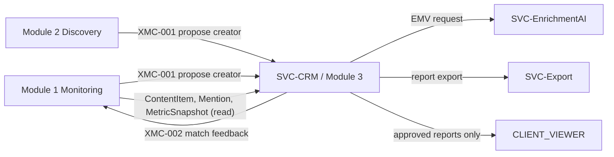

# Module 3 — CRM & Seeding

Module 3 (M3) is the **system of record for creator identity and all agency-owned relationship, campaign, and seeding data**. It is the third module of the exactly-three-module platform defined in [Vision & Scope](../10-product/00-vision-and-scope.md). Where Module 1 observes the public world and Module 2 evaluates it, Module 3 is where the agency **acts**: it merges platform identities into a single creator, records contacts and preferences, runs campaigns and seeding, tracks shipments, matches observed content back to campaigns, and computes campaign results.

This spec follows the six-section [module-spec template](./_module-spec-template.md). It does not restate facts that are canonical elsewhere; it links to them. In particular:

- **Entity field shapes** are canonical only in the [Data Model](../30-data-model/00-data-model.md). This file names entities and links; it never restates a field table (see convention F6 in [conventions](../00-meta/01-conventions.md)).
- **Write-ownership** is canonical only in the [Ownership Matrix](../70-shared/00-ownership-matrix.md). This file links to it and never contradicts it.
- **Enums** are canonical only in the [Glossary](../00-meta/03-glossary.md). This file references enum names, never values.
- **Sources** are canonical only in the [Data Source Matrix](../40-integrations/00-data-source-matrix.md).
- **Deferred items** are canonical only in the [Deferred Register](../20-cross-cutting/01-deferred-register.md).
- **Decisions** are canonical only in the [Decision Log](../05-decisions/decision-log.md).

---

## 1. Purpose & Scope

### 1.1 Purpose

Provide agency staff with a single, authoritative CRM that:

1. Unifies a creator's presence across [ENUM-Platform](../00-meta/03-glossary.md#enum-platform) accounts into one `Creator` record (identity merge).
2. Stores manually-maintained contact, address, and brand-relationship data.
3. Plans and executes campaigns and product-seeding, including the four seeding variants.
4. Tracks shipments and, where content is observed, matches it back to the originating campaign.
5. Reports campaign and seeding **results** (content count, views, engagement, reach tiering, EMV, CPE, CPM).
6. Enforces role-based access, including strict `CLIENT_VIEWER` scoping.

### 1.2 In scope (Active requirements)

REQ-M3-001 through REQ-M3-013, all **Active** in v1. See the scope map in the [Modules Overview](../10-product/01-modules-overview.md) and traceability in the [Requirements Matrix](../90-traceability/00-req-matrix.md).

### 1.3 Out of scope / Deferred

| Deferred item | Effect in M3 |
| --- | --- |
| [DEF-002](../20-cross-cutting/01-deferred-register.md) Creator contact auto-extraction | Contacts (REQ-M3-002) are **manual entry only** in v1 (per [ADR-0005](../05-decisions/decision-log.md)). Any auto-extraction UI affordance renders **"unavailable"**, never empty or zero. |
| [DEF-001](../20-cross-cutting/01-deferred-register.md) Audience demographics | Not surfaced in CRM profiles; rendered "unavailable" where referenced. |
| [DEF-003](../20-cross-cutting/01-deferred-register.md) True unique reach (CONFIRMED reach) | Results (REQ-M3-009) use PUBLIC views/plays and clearly-labelled ESTIMATED reach only. |
| [DEF-004](../20-cross-cutting/01-deferred-register.md) OAuth authorized-creator analytics | Not used to populate campaign results in v1. |

The **unavailable-never-empty** UI rule is canonical in the [Deferred Register](../20-cross-cutting/01-deferred-register.md).

### 1.4 Phase & buildability

M3 is delivered in phase **P3** of the [Roadmap](../80-delivery/00-roadmap.md). Per the [Status Lifecycle](../00-meta/02-status-lifecycle.md), these `APPROVED` requirements are buildable only while P3 is the active phase. M3 depends on identity and metrics produced earlier: `Creator` identity and `MetricSnapshot` records are consumed from P0/P1 outputs.

---

## 2. Requirements

All requirement IDs below are canonical in the [Modules Overview](../10-product/01-modules-overview.md); this section adds the M3-specific behavioural detail a coding agent needs.

| REQ-ID | Title | Primary entities (write / read) | Key sources |
| --- | --- | --- | --- |
| REQ-M3-001 | Central influencer DB + cross-platform identity merge | write `Creator`, `PlatformAccount`; read `ContentItem`, `MetricSnapshot` | none (internal) |
| REQ-M3-002 | Contact & address management (manual; DEF-002) | write `Contact` | none (manual) |
| REQ-M3-003 | Brand preferences & restrictions | write `BrandPreference` | none |
| REQ-M3-004 | Relationship & communication history | write `CommunicationLog`; read `Creator` | none |
| REQ-M3-005 | Campaign & brand/product master data | write `Campaign`, `Client`, `Brand`, `Product` | none |
| REQ-M3-006 | Seeding campaign management (4 variants) | write `SeedingCampaign`; read `Brand`, `Product` | none |
| REQ-M3-007 | Shipment tracking (courier APIs optional) | write `Shipment` | optional courier API (out of frozen stack) |
| REQ-M3-008 | Automatic content-to-campaign matching | read `Mention`, `ContentItem`; write `Campaign`/`SeedingCampaign` links | none |
| REQ-M3-009 | Campaign & seeding results (EMV/CPE/CPM) | read `ContentItem`, `MetricSnapshot`, `Mention`, `Shipment`, `Product` | none |
| REQ-M3-010 | Documents & attachments | write `DocumentAttachment` | none |
| REQ-M3-011 | Tasks, deadlines, follow-ups | write `Task` | none |
| REQ-M3-012 | Roles & permissions | write `User`, `Role` (ADMIN only) | none |
| REQ-M3-013 | Product-level seeding aggregation (across influencers) | read `Shipment`, `Product`, `ContentItem`, `MetricSnapshot` via `FACT-*`/`ROLLUP-*` | none |

### 2.1 REQ-M3-001 — Central DB + cross-platform identity merge

- M3 is the **sole write-owner and system of record** for `Creator` and `PlatformAccount` (see [Ownership Matrix](../70-shared/00-ownership-matrix.md)). All `Creator` writes route through the CRM/ingestion service `SVC-CRM`. Module 1 and Module 2 **propose** new creators via the cross-module contract [XMC-001](#5-cross-module-contracts--services); they never write `Creator` or `PlatformAccount` directly.
- A merge joins two or more `PlatformAccount` records (one per [ENUM-Platform](../00-meta/03-glossary.md#enum-platform)) under one `Creator`. Merge and un-merge are auditable operations.
- Merge decisions about identity are inferences and therefore carry a `ConfidenceAssessment` (per [DP-003](../20-cross-cutting/00-data-principles.md)); an ambiguous automatic merge routes to a human review queue rather than committing silently.

### 2.2 REQ-M3-002 — Contact & address management

- `Contact` records (email, phone, postal address for shipping) are entered **manually**. Auto-extraction is [DEF-002](../20-cross-cutting/01-deferred-register.md) and its UI affordance renders "unavailable".
- Personal data of EU creators is stored under the GDPR/ToS constraint [DP-005](../20-cross-cutting/00-data-principles.md); records support data-subject deletion and retention limits.

### 2.3 REQ-M3-003 — Brand preferences & restrictions

- `BrandPreference` stores per-creator brand affinities and **restrictions/blocklists** (e.g. "will not work with brand X", exclusivity conflicts). Restrictions are enforced as hard filters when a creator is added to a campaign or seeding run.

### 2.4 REQ-M3-004 — Relationship & communication history

- `CommunicationLog` records outreach and replies. The creator's relationship stage uses [ENUM-RelationshipStatus](../00-meta/03-glossary.md#enum-relationshipstatus).

### 2.5 REQ-M3-005 / REQ-M3-006 — Campaigns & Seeding

- `Campaign` status uses [ENUM-CampaignStatus](../00-meta/03-glossary.md#enum-campaignstatus).
- `SeedingCampaign` status uses [ENUM-SeedingCampaignStatus](../00-meta/03-glossary.md#enum-seedingcampaignstatus) and records **which of the four seeding variants** applies:

| Variant | Meaning |
| --- | --- |
| Gifting | Product sent as a gift; no posting obligation. |
| Gifting-with-post | Product sent with an agreed posting obligation. |
| Paid + product | Product plus paid compensation. |
| Organic | No agency arrangement; creator obtained/featured the product independently. |

> The seeding variant constrains how resulting `Mention` records may be classified. A `Mention` is only [PAID or SEEDED](../00-meta/03-glossary.md#enum-mentiontype) when a record/label proves it; organic seeding does not by itself justify asserting `PAID`/`SEEDED`. Organic is never asserted as fact (there is no `CONFIRMED_ORGANIC` value).

### 2.6 REQ-M3-007 — Shipment tracking

- `Shipment` status uses [ENUM-ShipmentStatus](../00-meta/03-glossary.md#enum-shipmentstatus). Courier-API integration is **optional** and is not part of the frozen v1 stack ([ADR-0001](../05-decisions/decision-log.md)); manual status updates are always supported.

### 2.7 REQ-M3-008 — Automatic content-to-campaign matching

- Matches observed public content (`ContentItem`, `Mention` — both written by M1; read here) to a `Campaign` or `SeedingCampaign`. Matching is an inference: low-confidence matches carry a `ConfidenceAssessment` and route to a **review queue** rather than auto-linking (per [DP-003](../20-cross-cutting/00-data-principles.md) and [DP-004](../20-cross-cutting/00-data-principles.md)).

### 2.8 REQ-M3-009 — Results (EMV / CPE / CPM)

- Results aggregate: content count, PUBLIC views/likes/comments, **DERIVED** engagement, **ESTIMATED** reach tiering, EMV, CPE, CPM.
- Metric tiers are single-sourced via [ENUM-MetricTier](../00-meta/03-glossary.md#enum-metrictier) and [DP-001](../20-cross-cutting/00-data-principles.md): engagement rate/averages/medians are **DERIVED**; reach is **ESTIMATED**; true unique reach is [DEF-003](../20-cross-cutting/01-deferred-register.md). CPE (cost per engagement) and CPM (cost per mille) are computed by M3 from agency-input spend (a `CONFIRMED`-tier input) divided by DERIVED engagement / PUBLIC views respectively. EMV is produced by `SVC-EnrichmentAI` using the configurable, transparent model owned by [Module 1](./module-1-monitoring.md).
- Seeding results track the **per-shipment lifecycle**: shipped → posted (`posted`/`postedAt`) → matched `resultingContentIds` → their `MetricSnapshot`s; see [REQ-M3-013](#req-m3-013) for cross-influencer product totals and the [analytics model](../30-data-model/01-analytics-model.md) (`FACT-Shipment`, `FACT-SeedingContent`).

### 2.9 REQ-M3-010 / REQ-M3-011 — Documents & Tasks

- `DocumentAttachment` stores contracts, briefs, and assets linked to creators, campaigns, or seeding runs.
- `Task` status uses [ENUM-TaskStatus](../00-meta/03-glossary.md#enum-taskstatus); tasks carry deadlines and follow-up reminders.

### 2.10 REQ-M3-012 — Roles & permissions

- `User` and `Role` are written by `ADMIN` only. Roles use [ENUM-RoleName](../00-meta/03-glossary.md#enum-rolename). `CLIENT_VIEWER` sees **only approved reports for their own brands** — no raw CRM, no unapproved data, no cross-brand data.

### 2.11 REQ-M3-013 — Product-level seeding aggregation

- A `Product` (under a `Brand`) is seeded to many creators via `Shipment`s. The platform aggregates results **across all those influencers into one product total**: shipments, post-rate, content count, total PUBLIC views, total **ESTIMATED** reach (labelled), total EMV — over any time grain (week/month/quarter/year) and sliceable by platform, content type, and country.
- Served by [`ROLLUP-SeedingByProduct`](../30-data-model/01-analytics-model.md) over `FACT-Shipment` + `FACT-SeedingContent`; per-influencer detail comes from [`ROLLUP-SeedingByShipment`](../30-data-model/01-analytics-model.md). Aggregates are **tier-aware** ([DP-001](../20-cross-cutting/00-data-principles.md)) — estimated totals are never shown as fact.

---

## 3. Data & Ownership

M3 write-owns the entities below. **Field shapes are canonical in the [Data Model](../30-data-model/00-data-model.md); they are not restated here.** Write-authority is canonical in the [Ownership Matrix](../70-shared/00-ownership-matrix.md).

### 3.1 Entities written by M3

| Entity | Notes |
| --- | --- |
| `Creator` | System of record; identity/merge. Writes route through `SVC-CRM`. |
| `PlatformAccount` | One per [ENUM-Platform](../00-meta/03-glossary.md#enum-platform), linked to a `Creator`. |
| `Client` | Top of the client → brand → product hierarchy. |
| `Brand` | Belongs to a client; primary aggregation dimension. |
| `Product` | Under a brand; the seeding aggregation key. |
| `Contact` | Manual entry (DEF-002). |
| `BrandPreference` | Preferences + restrictions/blocklists. |
| `Campaign` | Status via [ENUM-CampaignStatus](../00-meta/03-glossary.md#enum-campaignstatus). |
| `SeedingCampaign` | Status via [ENUM-SeedingCampaignStatus](../00-meta/03-glossary.md#enum-seedingcampaignstatus); records the 4 variants. |
| `Shipment` | Status via [ENUM-ShipmentStatus](../00-meta/03-glossary.md#enum-shipmentstatus). |
| `CommunicationLog` | Relationship stage via [ENUM-RelationshipStatus](../00-meta/03-glossary.md#enum-relationshipstatus). |
| `DocumentAttachment` | Contracts, briefs, assets. |
| `Task` | Status via [ENUM-TaskStatus](../00-meta/03-glossary.md#enum-taskstatus). |
| `User` | ADMIN-managed. |
| `Role` | ADMIN-managed; [ENUM-RoleName](../00-meta/03-glossary.md#enum-rolename). |

### 3.2 Entities read by M3 (written elsewhere)

| Entity | Write-owner | Used for |
| --- | --- | --- |
| `ContentItem` | M1 | Content matching (REQ-M3-008), results (REQ-M3-009). |
| `Story` | M1 | Results / seeding evidence. |
| `Mention` | M1 | Matching, classification evidence, results. |
| `MetricSnapshot` | M1 (`SVC-SnapshotScheduler`) | Results, reach/engagement tiers. |
| `GeoAttribution` | M2 | Creator profile context. |
| `Shortlist` | M2 | Seeding/campaign target lists. |
| `SuitabilityScore` | M2 | Creator selection context. |

M3 reads `ContentItem`, `Story`, and `Comment` (all M1-owned) and never writes them — see the [Ownership Matrix](../70-shared/00-ownership-matrix.md) (fix F2). Externally-sourced records read by M3 always carry the `Provenance` envelope ([DP-002](../20-cross-cutting/00-data-principles.md)); inferred values carry a `ConfidenceAssessment` ([DP-003](../20-cross-cutting/00-data-principles.md)).

> Note: stories are always the `Story` entity — `STORY` is **not** a value of [ENUM-ContentType](../00-meta/03-glossary.md#enum-contenttype). This is stated canonically once in the [Data Model](../30-data-model/00-data-model.md).

> **Analytics surfaces.** M3 reporting reads the derived [`FACT-*` / `ROLLUP-*`](../30-data-model/01-analytics-model.md) (e.g. `ROLLUP-SeedingByProduct`) maintained by `SVC-Analytics`; these are computed from the entities above and never override them.

---

## 4. Acceptance Criteria

Given/When/Then criteria (format defined in [conventions](../00-meta/01-conventions.md)). These `AC-M3-*` IDs are canonical to this file.

### REQ-M3-001 — Central DB + identity merge

- **AC-M3-001** — Given two `PlatformAccount` records on different [ENUM-Platform](../00-meta/03-glossary.md#enum-platform) values believed to be the same person, When an operator confirms the merge, Then they resolve to a single `Creator` and the operation is auditable and reversible.
- **AC-M3-002** — Given Module 1 or Module 2 observes a creator not yet in the CRM, When it submits a proposal via [XMC-001](#5-cross-module-contracts--services), Then `SVC-CRM` creates the `Creator`; the proposing module never writes `Creator`/`PlatformAccount` directly.
- **AC-M3-003** — Given an automatic merge is below the confidence threshold, When it is evaluated, Then it is routed to the review queue with a `ConfidenceAssessment` and is **not** auto-committed.

### REQ-M3-002 — Contact & address

- **AC-M3-004** — Given a creator record, When an operator adds a `Contact`, Then email/phone/address persist as manual entries.
- **AC-M3-005** — Given the contact auto-extraction affordance (DEF-002), When the profile renders, Then it shows **"unavailable"**, never empty or zero.
- **AC-M3-006** — Given an EU creator, When a data-subject deletion is requested, Then contact personal data is deletable per [DP-005](../20-cross-cutting/00-data-principles.md).

### REQ-M3-003 — Preferences & restrictions

- **AC-M3-007** — Given a `BrandPreference` restriction/blocklist for a creator, When that creator is added to a conflicting campaign or seeding run, Then the system blocks or warns before commit.

### REQ-M3-004 — Relationship & comms history

- **AC-M3-008** — Given an outreach event, When it is logged, Then a `CommunicationLog` entry is created and the creator's stage reflects an [ENUM-RelationshipStatus](../00-meta/03-glossary.md#enum-relationshipstatus) value.

### REQ-M3-005 — Campaigns

- **AC-M3-009** — Given a campaign, When its lifecycle changes, Then its status is exactly one [ENUM-CampaignStatus](../00-meta/03-glossary.md#enum-campaignstatus) value and transitions are recorded.

### REQ-M3-006 — Seeding (4 variants)

- **AC-M3-010** — Given a `SeedingCampaign`, When it is created, Then exactly one of the four variants (gifting / gifting-with-post / paid+product / organic) is recorded and its status is an [ENUM-SeedingCampaignStatus](../00-meta/03-glossary.md#enum-seedingcampaignstatus) value.
- **AC-M3-011** — Given an organic-variant seeding run, When resulting content is classified, Then the `Mention` is not asserted `PAID`/`SEEDED` without a proving record/label ([ENUM-MentionType](../00-meta/03-glossary.md#enum-mentiontype)).

### REQ-M3-007 — Shipments

- **AC-M3-012** — Given a shipment, When its state changes (manually or via optional courier API), Then its status is exactly one [ENUM-ShipmentStatus](../00-meta/03-glossary.md#enum-shipmentstatus) value.

### REQ-M3-008 — Content matching

- **AC-M3-013** — Given an M1 `Mention`/`ContentItem` and open campaigns, When a high-confidence match is found, Then it links to the campaign; When confidence is low, Then it routes to the review queue with a `ConfidenceAssessment` and is not auto-linked.

### REQ-M3-009 — Results

- **AC-M3-014** — Given a completed campaign, When results are computed, Then content count and PUBLIC views/likes/comments are shown with correct [ENUM-MetricTier](../00-meta/03-glossary.md#enum-metrictier) tags; engagement is **DERIVED**, reach is **ESTIMATED** (labelled), and true unique reach is **"unavailable"** ([DEF-003](../20-cross-cutting/01-deferred-register.md)).
- **AC-M3-015** — Given agency-input spend (a `CONFIRMED`-tier input), When results render, Then CPE = spend / DERIVED engagement and CPM = spend / (PUBLIC views ÷ 1000), and EMV is taken from `SVC-EnrichmentAI` with its model+rates shown.
- **AC-M3-018** — Given a `Shipment` for a `Product`, When a matched `ContentItem` is found ([REQ-M3-008](../90-traceability/00-req-matrix.md)), Then the shipment records `posted`/`postedAt` and its resulting content's PUBLIC views + ESTIMATED reach + EMV are tracked over time via `FACT-SeedingContent`.

### REQ-M3-013 — Product-level seeding aggregation

- **AC-M3-019** — Given a `Product` seeded to multiple creators, When product results are viewed, Then [`ROLLUP-SeedingByProduct`](../30-data-model/01-analytics-model.md) shows one total across all influencers (shipments, post-rate, content count, total views, total ESTIMATED reach labelled as estimate, total EMV) for any time grain and slice, and no estimate is presented as fact ([DP-001](../20-cross-cutting/00-data-principles.md)).

### REQ-M3-010 / REQ-M3-011 — Documents & Tasks

- **AC-M3-016** — Given a contract or brief, When it is uploaded, Then a `DocumentAttachment` links to the relevant creator/campaign/seeding record.
- **AC-M3-017** — Given a `Task` with a deadline, When the deadline nears, Then a follow-up reminder fires and status reflects an [ENUM-TaskStatus](../00-meta/03-glossary.md#enum-taskstatus) value.

### REQ-M3-012 — Roles & permissions

- **AC-M3-018** — Given a non-ADMIN user, When they attempt to write `User`/`Role`, Then the action is denied.
- **AC-M3-019** — Given a `CLIENT_VIEWER` for brand A, When they log in, Then they see only **approved** reports for brand A — no raw CRM data, no unapproved data, and no brand-B data ([ENUM-RoleName](../00-meta/03-glossary.md#enum-rolename)).

---

## 5. Cross-Module Contracts & Services

M3 is implemented by service `SVC-CRM` and consumes `SVC-Export` (PDF/Excel/CSV via [ENUM-ExportFormat](../00-meta/03-glossary.md#enum-exportformat)) and `SVC-EnrichmentAI` (EMV). Service definitions are summarized in the [System Architecture](../60-architecture/00-system-architecture.md), which references — and does not restate — the [Ownership Matrix](../70-shared/00-ownership-matrix.md).

| Contract | Direction | Purpose |
| --- | --- | --- |
| **XMC-001** Creator proposal | M1 / M2 → M3 (`SVC-CRM`) | M1/M2 propose a new creator/platform account; `SVC-CRM` is the only writer of `Creator`/`PlatformAccount`. |
| **XMC-002** Content-match feedback | M3 → M1 | M3 confirms/denies a `ContentItem`↔campaign match; corrections feed the human-in-the-loop loop ([DP-004](../20-cross-cutting/00-data-principles.md)). |

Human corrections captured in M3 (identity merges, content matches, mention labels) are stored and feed back into future rules per [DP-004](../20-cross-cutting/00-data-principles.md).

---

## 6. Dependencies, Deferred & Roadmap

### 6.1 Depends on

- **Data doctrine:** [DP-002](../20-cross-cutting/00-data-principles.md) (provenance-mandatory), [DP-003](../20-cross-cutting/00-data-principles.md) (confidence-based), [DP-004](../20-cross-cutting/00-data-principles.md) (human-in-the-loop), [DP-005](../20-cross-cutting/00-data-principles.md) (GDPR/ToS), all rooted in [ADR-0008](../05-decisions/decision-log.md).
- **Upstream data:** `Creator` identity and `MetricSnapshot` records produced in P0/P1; `ContentItem`/`Mention`/`Story` produced by [Module 1](./module-1-monitoring.md); `GeoAttribution`/`Shortlist`/`SuitabilityScore` from [Module 2](./module-2-discovery.md).
- **Decisions:** [ADR-0005](../05-decisions/decision-log.md) (manual contact entry; auto-extract deferred), [ADR-0006](../05-decisions/decision-log.md) (metric tiering; true reach deferred), [ADR-0001](../05-decisions/decision-log.md) (frozen stack — courier APIs remain optional/out of the frozen set).

### 6.2 Deferred behaviours in M3

[DEF-001](../20-cross-cutting/01-deferred-register.md), [DEF-002](../20-cross-cutting/01-deferred-register.md), [DEF-003](../20-cross-cutting/01-deferred-register.md), [DEF-004](../20-cross-cutting/01-deferred-register.md) — each rendered **"unavailable"**, never empty or zero, per the [Deferred Register](../20-cross-cutting/01-deferred-register.md).

### 6.3 Roadmap position

M3 ships in phase **P3** of the [Roadmap](../80-delivery/00-roadmap.md). It is sequenced after P1/P2 because it consumes `Creator` identity and `MetricSnapshot` data produced earlier. P4 hardening adds GDPR retention/deletion tooling and white-label client reports that further serve `CLIENT_VIEWER`.