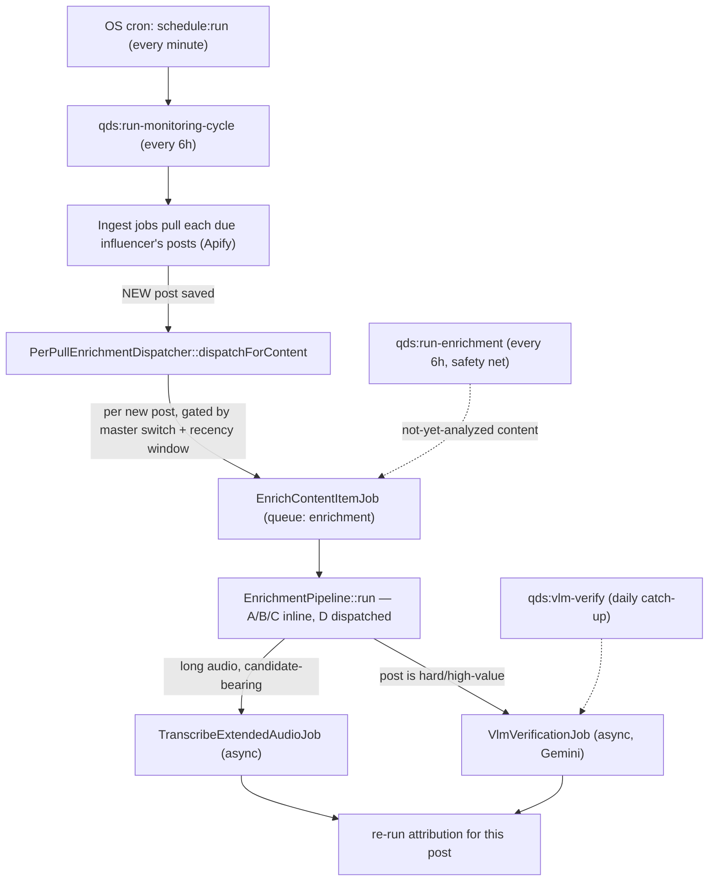

# Seeded-Product Detection — Runtime & Operations

> **What this document is.** How seeded-product detection actually **runs** in production: what
> schedules it, what triggers a single post's analysis, which parts are asynchronous, where the
> evidence lands, and where an operator watches it. It is the runtime companion to
> [`seeded-product-detection.md`](seeded-product-detection.md) (which explains *how the classifier
> decides*) and the [modernization roadmap](seeded-product-detection-roadmap.md) (the A–E
> programme). Worked example throughout: a tenant monitoring **10 influencers**.

---

## 1. The short version

Two schedules ("clocks") drive everything, plus one shortcut between them:

1. **Monitoring clock (every ~6 h):** pull each due influencer's recent posts from the platform.
2. **The shortcut:** the instant a **new** post is saved, ingestion **immediately queues that
   post's analysis** — detection does not wait for a second cron.
3. **Enrichment safety-net clock (every ~6 h, offset):** re-scan anything ingested but not yet
   analyzed (worker was down, feature just turned on).

Inside one analysis, the tiers run cheapest-first (free text/visual signals → embeddings →
Gemini vision-language model only for the hard cases). The slow Gemini step and long-audio speech
run as **separate background jobs** so they never hold up the pipeline; when they finish they
re-classify that one post.

Everything is **per tenant**: each tenant analyzes its own copy of a post with only its own
brands, products, and gift records.

---

## 2. The two clocks (the schedule)

All schedules live in [`routes/console.php`](../../routes/console.php) and are executed by
Laravel's scheduler. In production you run **one** operating-system cron line — it fans out to
every entry below:

```cron
* * * * *  cd /path/to/app && php artisan schedule:run >> /dev/null 2>&1
```

| Command | Default cadence | What it does |
|---|---|---|
| `qds:run-monitoring-cycle` | `0 */6 * * *` (every 6 h) | Pull recent **posts** for due influencers |
| `qds:run-monitoring-cycle --stories-only` | `30 */4 * * *` (every 4 h) | Pull **stories** (they expire fast) |
| `qds:run-enrichment` | `15 */6 * * *` (every 6 h, +15 min) | Safety-net: analyze ingested-but-not-yet-analyzed content |
| `qds:vlm-verify` | daily `05:00` | Catch-up for the Gemini verifier + record "couldn't look" posts |
| `qds:link-seeded-content` | hourly (+ `--all` daily `04:30`) | Turn confirmed SEEDED posts into gift↔post links |
| `qds:refresh-campaign-content` | daily `05:30` | Refresh metrics of campaign-linked posts |
| `qds:check-data-quality` | hourly | Anomaly + stale-run detection; reaps stuck analyses |
| `qds:prune-keyframes` / `-story-media` / `-audio-chunks` / `-ingestion-data` | daily | Retention + GDPR cleanup |

Cadence is tunable per environment (`QDS_INGESTION_CYCLE_CRON`, `QDS_ENRICHMENT_SWEEP_CRON`, …).
The monitoring cycle also uses **adaptive cadence**: active and in-campaign creators are polled
more often, dormant ones less — so the 10 influencers are not all pulled every 6 hours.

---

## 3. From "influencer posts" to "post analyzed" — the trigger chain



**The shortcut in code:** [`IngestContentJob`](../../app/Platform/Ingestion/Jobs/IngestContentJob.php)
calls `PerPullEnrichmentDispatcher::dispatchForContent($result->createdIds, …)` the moment it
persists a batch — one `EnrichContentItemJob` per **newly created** post. Stories do the same via
`ArchiveStoryMediaJob → dispatchForStory` after the story media is archived (ADR-0023). Only
**new** posts trigger analysis; a later metric-only refresh of an old post does **not** re-run it.

Two gates on the shortcut (in `PerPullEnrichmentDispatcher`): the master switch
`qds.enrichment.enabled` must be on, and the post's `published_at` must be within
`qds.enrichment.content_window_days` (default 30) — so a deep historical backfill can't flood the
queue with ancient posts.

---

## 4. Inside one analysis (where A→D runs)

One `EnrichContentItemJob` runs [`EnrichmentPipeline::run()`](../../app/Platform/Enrichment/EnrichmentPipeline.php)
for that post, wrapped in `TenantContext::runAs($post->tenant_id, …)`. The stages, in order:

```
hashtags → transcript → recognition → keyframes(B) → visual_match(C) → text_signals(A)
        → sentiment → attribution → emv → reach
```

- **A** (free text signals — captions, @mentions, product tags, gifting cues), **B** (keyframes),
  and **C** (visual product match against reference photos) run **inline** here.
- **D is different.** The `vlm_verification` stage does **not** call Gemini inline (the
  vision-language model is slow). It only checks the escalation flag and, if the post qualifies,
  **dispatches** a background `VlmVerificationJob` and records the marker `queued`. Likewise the
  speech stage transcribes the first ~60 s inline but **dispatches** `TranscribeExtendedAudioJob`
  for longer audio.
- **attribution** is where the post gets its label — `SEEDED`, `PAID`, `LIKELY_ORGANIC`, or
  `UNKNOWN` — from whatever evidence exists so far.

Each stage records a short marker string into `enrichment_runs.stages` (a JSON map), so you can
read exactly what happened to any post (e.g. `visual_match: completed:matched=1,review=0,rejected=2`,
`vlm_verification: queued`, `speech: chunks-queued=3`).

**Why tiered = cheap:** most posts are settled by the free A signals and cost nothing; C's
embeddings run only when the influencer has candidate gifted products with reference photos; D's
Gemini call runs only when C is unsure **or** the post is high-value. Per-tenant/day cost caps
(`qds.ai_budget`) bound the spend, and `qds:ai-read-only on` halts all AI spend instantly.

---

## 5. The asynchronous D jobs (and how the verdict gets back in)

Both run on the `enrichment` queue (name is env-tunable), each `tries=4`:

- **`VlmVerificationJob`** (timeout 180 s) — loads the stored keyframes + caption + transcript +
  the tenant's candidate product list, calls Gemini on the EU endpoint, validates the grounded
  verdict, writes a `VLM_PRODUCT` detection for a confirmed product, then **re-runs attribution
  for that one post** so the mention updates.
- **`TranscribeExtendedAudioJob`** (timeout 300 s) — transcribes the persisted audio chunks past
  the first minute, mines spoken-brand detections, stitches the transcript, then re-runs
  attribution.

This "new evidence lands → re-classify that post" pattern is the same one
`qds:visual-match-backfill` uses; DP-004 upserts make re-running safe (a human decision is never
overwritten).

**`qds:vlm-verify` (daily 05:00)** is the catch-up net: it dispatches the Gemini job for any
flagged post whose job never ran (feature was off, worker was down), records the DEF-021
"unverifiable" posts (shipped but no frames to look at), and finalizes any stuck job.

---

## 6. Worked timeline — one gifted post, 10 influencers

1. **T+0** — influencer #7 posts a gifted product.
2. **within ~6 h** — the monitoring cycle pulls #7's recent posts (adaptive cadence may pull an
   active #7 sooner).
3. **seconds after save** — ingestion queues one `EnrichContentItemJob` for the new post.
4. **seconds–minutes later** — a worker runs the pipeline: A/B/C inline. If C is confident and a
   matching gift shipment exists → already `SEEDED`. If C is unsure or the post is high-value →
   `VlmVerificationJob` is queued.
5. **shortly after** — the Gemini job (only for the hard case) runs and re-classifies.
6. **hourly** — `qds:link-seeded-content` links the confirmed SEEDED post to the gift shipment.

Net: a gifted post is typically labeled **within one poll interval (~6 h) + a few seconds/minutes
of queue time**. Want it faster? Shorten `QDS_INGESTION_CYCLE_CRON` — everything downstream
already fires within seconds of a post being found.

---

## 7. Where the evidence lands (what to query)

| Table | Holds |
|---|---|
| `enrichment_runs` | one row per analysis; `stages` JSON = per-stage markers, `status`, `correlation_id` |
| `recognition_detections` | evidence rows: `CAPTION_TEXT`/`MENTION`/`PRODUCT_TAG` (A), `LOGO`/`IMAGE_TEXT_OCR`/`ON_SCREEN_TEXT`/`SPOKEN_BRAND` (recognition), `VISUAL_PRODUCT` (C), `VLM_PRODUCT` (D) |
| `mentions` | the final verdict per post (`mention_type`, confidence envelope + signals, `campaign_id`) |
| `visual_match_runs` / `visual_match_candidates` | C's run log + ranked candidates + the `needs_verification` flag D consumes |
| `vlm_verification_runs` / `vlm_candidate_verdicts` | D's run log + per-candidate Gemini verdicts (E's "agreement" input) |
| `content_transcripts` | speech/caption transcripts (language + timestamped segments) |
| `shipment_resulting_content` | the materialized gift↔post links from SEEDED mentions |

---

## 8. Where to watch it (dashboards & commands)

- **`/monitoring/operations`** (staff) — provider health, AI spend per capability, and the visual +
  vision-language run aggregates (outcomes, cache hits, budget denials, unverifiable count).
- **`/monitoring/review`** — the human review queue (LOW/UNKNOWN AI detections; DP-004 approve/reject).
- **`/monitoring/content/{id}`** — one post's detections and mention with review actions.
- **`/monitoring/plan`** — the forward-looking monthly cost estimate per service.
- **Commands:** `qds:provider-health` (provider status), `qds:run-enrichment` (force a sweep),
  `qds:visual-match-backfill --days=N` (re-run C + attribution over a window),
  `qds:vlm-verify --days=N` (drive D over flagged posts), `qds:eval-detection` (score quality
  against the labeled golden set — no network, no cost).

---

## 9. What must be running for the pipeline to tick

1. **The scheduler** — one OS cron line calling `php artisan schedule:run` every minute (§2).
2. **At least one queue worker** — `php artisan queue:work` (Supervisor in production). Ingestion,
   analysis, and the async D jobs all run on queues (`ingestion`, `media`, `snapshots`,
   `enrichment`); the default queue driver is the database (`QUEUE_CONNECTION=database`).
3. **The master switch on** — `QDS_ENRICHMENT_ENABLED=true`. With it off, ingestion still runs but
   no post is analyzed.
4. **The tier switches** for the tiers you want (all default **off** except keyframes):
   `QDS_ENRICHMENT_TEXT_SIGNALS_ENABLED` (A), `QDS_ENRICHMENT_KEYFRAMES_ENABLED` (B, on),
   `QDS_ENRICHMENT_VISUAL_MATCH_ENABLED` (C), `QDS_ENRICHMENT_VLM_ENABLED` +
   `QDS_ENRICHMENT_SPEECH_V2_ENABLED` (D).
5. **Credentials** for whichever AI tiers are on — Apify (ingestion), the Google Vision/Speech
   keys (recognition), `GOOGLE_EMBEDDINGS_*` (C), `GOOGLE_VLM_*` and `GOOGLE_SPEECH_V2_*` (D). C
   also needs the pgvector database image and reference photos uploaded on `/crm/products` +
   `qds:embed-product-photos`. Verify the D providers first with
   [`docs/runbooks/vlm-speech-go-live-smoke.md`](../runbooks/vlm-speech-go-live-smoke.md).

If a tier's switch is off or its credentials are missing, that stage records an explainable
`skipped:*` marker and the rest of the pipeline continues — detection degrades gracefully, never
fails the run.

---

## 10. Tuning knobs (operator)

| Want | Change |
|---|---|
| Detect posts sooner | `QDS_INGESTION_CYCLE_CRON` (poll frequency) |
| Cap AI spend | `qds.ai_budget.*` per-tenant/day caps; `qds:ai-quota` per-tenant overrides |
| Emergency stop all AI spend | `qds:ai-read-only on` |
| Per-tenant timing window for gifts | Settings → Monitoring (`shipment_window_days`, ADR-0025) |
| Longer/shorter media retention | `qds:prune-keyframes` window (`keyframe_retention_days`) |

**Related:** [`seeded-product-detection.md`](seeded-product-detection.md) (decision logic),
[`seeded-product-detection-roadmap.md`](seeded-product-detection-roadmap.md) (A–E programme),
`ADR-0023` (per-pull enrichment), `ADR-0028`/`ADR-0029`/`ADR-0030` (B/C/D).
