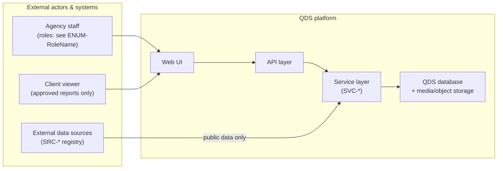
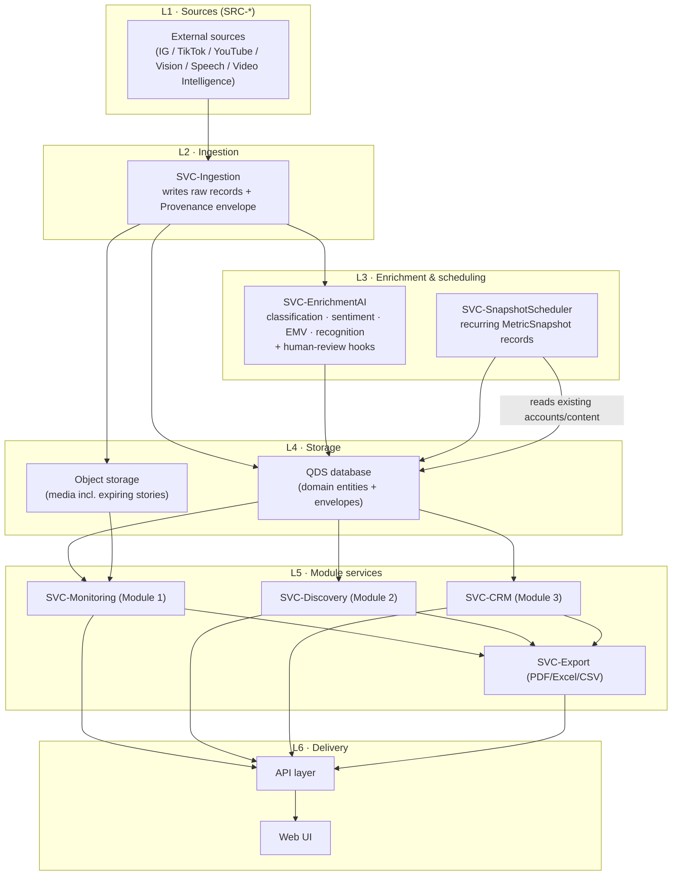

# System Architecture

This document is the canonical home for the QDS **system context**, the
**layered runtime architecture**, the **internal service map (`SVC-*`)**, and
the **module-to-service mapping**. It does **not** restate facts owned by other
files: write-authority is defined once in
[70-shared/00-ownership-matrix.md](../70-shared/00-ownership-matrix.md);
entity field shapes in
[30-data-model/00-data-model.md](../30-data-model/00-data-model.md); enum values
in [00-meta/03-glossary.md](../00-meta/03-glossary.md); external sources in
[40-integrations/00-data-source-matrix.md](../40-integrations/00-data-source-matrix.md);
cross-cutting rules in
[20-cross-cutting/00-data-principles.md](../20-cross-cutting/00-data-principles.md).
Where a fact belongs to one of those files, this document links to it.

---

## 1. System context

QDS is an internally hosted influencer-intelligence platform for a DACH
influencer-marketing agency. It ingests **public** signals from third-party
sources, enriches them with AI, stores them in the QDS-owned database, and
serves three product modules through one API to one web UI.

The three modules are the only product surfaces (the exactly-3-modules law is
stated in
[10-product/00-vision-and-scope.md](../10-product/00-vision-and-scope.md)):

- **Module 1 — Monitoring & Reporting** — see
  [50-modules/module-1-monitoring.md](../50-modules/module-1-monitoring.md)
- **Module 2 — Discovery** — see
  [50-modules/module-2-discovery.md](../50-modules/module-2-discovery.md)
- **Module 3 — CRM & Seeding** — see
  [50-modules/module-3-crm-seeding.md](../50-modules/module-3-crm-seeding.md)

### 1.1 Context diagram

> **v1 scope note ([ADR-0016](../05-decisions/decision-log.md#adr-0016)).** The
> "Client viewer" actor ships **disabled** in v1: the agency has no external
> clients, no report content exists, and `CLIENT_VIEWER` is a deny-everything
> role confined to an empty reports area. The actor stays in the diagram as
> the reserved integration point a superseding ADR would re-enable.

The external source set is closed and frozen. QDS never invents providers
(see `DP-006` stack-lock in
[20-cross-cutting/00-data-principles.md](../20-cross-cutting/00-data-principles.md#dp-006)
and `ADR-0001` in
[05-decisions/decision-log.md](../05-decisions/decision-log.md)). The full
provider registry is
[40-integrations/00-data-source-matrix.md](../40-integrations/00-data-source-matrix.md).

---

## 2. Layered architecture

QDS is organized into six layers. Data flows **up** from sources to the UI;
control flows **down** from the UI through the API to the services.

| Layer | Responsibility | Elements |
|---|---|---|
| L1 Sources | External public-data acquisition | `SRC-*` (registry in the data-source matrix) |
| L2 Ingestion | Fetch raw records, attach Provenance | `SVC-Ingestion` |
| L3 Enrichment & scheduling | AI inference, review hooks, recurring snapshots | `SVC-EnrichmentAI`, `SVC-SnapshotScheduler` |
| L4 Storage | Persist domain entities, envelopes, media | QDS database (Neon Postgres, EU) + object storage |
| L5 Module services | Module business logic + export | `SVC-Monitoring`, `SVC-Discovery`, `SVC-CRM`, `SVC-Export` |
| L5 Analytics | Maintain star-schema facts + rollups (OLAP) | `SVC-Analytics` |
| L6 Delivery | API surface + web UI | API layer, Web UI |

### 2.1 Runtime data-flow diagram

### 2.2 Layer responsibilities

- **L1 Sources.** Only the closed `SRC-*` registry may be called. Historical
  growth has **no** external source; it is produced inside L3 by
  `SVC-SnapshotScheduler` (see `ADR-0003`).
- **L2 Ingestion — `SVC-Ingestion`.** Calls sources, writes raw records, and
  attaches the **Provenance** envelope to every externally-sourced record
  (provenance-mandatory: `DP-002`). It performs no inference.
- **L3 Enrichment & scheduling.**
  - `SVC-EnrichmentAI` produces every inferred/estimated value (mention
    classification, sentiment, EMV, brand recognition) and attaches the
    **ConfidenceAssessment** envelope. Low-confidence outputs are routed to a
    human review queue; corrections are stored and feed future rules
    (human-in-the-loop: `DP-004`). AI values use the `AI_ASSESSED`
    verification state (never any misspelling of it).
  - `SVC-SnapshotScheduler` writes recurring, timestamped `MetricSnapshot`
    records; it is the only producer of historical growth data.
- **L4 Storage.** The QDS database holds domain entities and their embedded
  envelopes; object storage holds media, including expiring stories captured
  before expiry. Field shapes live only in
  [30-data-model/00-data-model.md](../30-data-model/00-data-model.md).
- **L5 Module services.** `SVC-Monitoring`, `SVC-Discovery`, and `SVC-CRM`
  hold module logic; `SVC-Export` renders reports in the formats listed under
  `ENUM-ExportFormat`.
- **L6 Delivery.** One API layer fronts the module services; one web UI
  consumes the API. Role-based access (per `ENUM-RoleName`) is enforced at the
  API; `CLIENT_VIEWER` may retrieve only approved reports for its brands
  *(v1: no external clients ship — the client-viewer report retrieval is
  dropped and the role is deny-everything, [ADR-0016](../05-decisions/decision-log.md#adr-0016))*.

---

## 3. Internal service map (`SVC-*`)

This is the canonical definition of the internal services. Each service is a
single logical write/compute owner within its layer.

| Service | Layer | Primary responsibility | Key upstream | Key downstream |
|---|---|---|---|---|
| `SVC-Ingestion` | L2 | Call `SRC-*` sources; write raw records + Provenance | `SRC-*` | database, object storage, `SVC-EnrichmentAI` |
| `SVC-EnrichmentAI` | L3 | Classification, sentiment, EMV, recognition + human-review hooks; attach ConfidenceAssessment | `SVC-Ingestion`, database | database |
| `SVC-SnapshotScheduler` | L3 | Recurring timestamped `MetricSnapshot` writes | database (accounts/content to sample) | database |
| `SVC-Monitoring` | L5 | Module 1 logic (monitoring, metrics, reporting) | database, object storage | API, `SVC-Export` |
| `SVC-Discovery` | L5 | Module 2 logic (search, profiling, scoring) | database | API, `SVC-Export` |
| `SVC-CRM` | L5 | Module 3 logic (CRM, campaigns, seeding) | database | API, `SVC-Export` |
| `SVC-Export` | L5 | Render reports (`ENUM-ExportFormat`) | module services, `SVC-Analytics` | API |
| `SVC-Analytics` | L5 | Maintain `FACT-*`/`ROLLUP-*` (star schema on Neon Postgres; scheduled rollups); serve aggregations | database (facts + entities) | dashboards, `SVC-Export` |

---

> **Analytics layer.** `SVC-Analytics` maintains the dimensional star schema (`FACT-*`/`DIM-*`/`ROLLUP-*`, see [analytics model](../30-data-model/01-analytics-model.md)) on Neon Postgres (EU); rollups are refreshed on a schedule. Dashboards and `SVC-Export` read pre-aggregated rollups, never raw facts; facts are append-only and tier-aware ([ADR-0010](../05-decisions/decision-log.md#adr-0010)).

> **Deployment.** The app (Laravel/PHP-FPM, nginx, Redis, Horizon worker, scheduler) is containerized with **Docker** and runs on **Hetzner** (EU); the database is **Neon** (EU, external). See [ADR-0013](../05-decisions/decision-log.md#adr-0013).

## 4. Module boundaries and module-to-service mapping

Each product module maps to exactly one L5 module service. Ingestion,
enrichment, and snapshot scheduling are **shared platform services** used by
all modules — they are not owned by any single module.

| Module | Module service | Shared services consumed |
|---|---|---|
| Module 1 — Monitoring & Reporting | `SVC-Monitoring` | `SVC-Ingestion`, `SVC-EnrichmentAI`, `SVC-SnapshotScheduler`, `SVC-Analytics`, `SVC-Export` |
| Module 2 — Discovery | `SVC-Discovery` | `SVC-Ingestion`, `SVC-EnrichmentAI`, `SVC-SnapshotScheduler`, `SVC-Analytics`, `SVC-Export` |
| Module 3 — CRM & Seeding | `SVC-CRM` | `SVC-Ingestion`, `SVC-EnrichmentAI`, `SVC-SnapshotScheduler`, `SVC-Analytics`, `SVC-Export` |

### 4.1 Write authority (do not restate — link)

Which module may **write** which entity is a single-sourced fact. This
document does not restate owners or readers. The tiebreaker for all
write-authority questions is the ownership matrix:

> **Canonical:**
> [70-shared/00-ownership-matrix.md](../70-shared/00-ownership-matrix.md)

Architectural consequence of that matrix (stated as a boundary rule, not as a
re-listing of owners): a module service must only issue writes for entities the
matrix assigns to it, and must obtain data for entities it merely reads from
the storage layer, never by writing them. In particular, creator identity is
never written directly by Discovery or Monitoring — those modules propose new
creators to the CRM/ingestion path via a cross-module contract (`XMC-*`) rather
than writing the record themselves. The authoritative owner/reader assignment
for every entity remains the matrix linked above.

### 4.2 Boundary rules

- **One write path per entity.** All writes for an entity route through its
  matrix-assigned owning module service. Cross-module needs are satisfied by
  reads or by an explicit cross-module contract (`XMC-*`).
- **Envelopes are enforced at the boundary.** `SVC-Ingestion` guarantees
  Provenance on ingest; `SVC-EnrichmentAI` guarantees ConfidenceAssessment on
  every inferred value. Downstream module services consume these envelopes and
  must not strip or fabricate them.
- **Metric tiering is preserved end to end.** Services carry each metric's tier
  (`ENUM-MetricTier`) unchanged from computation to UI; modeled reach stays
  `ESTIMATED` and is never presented as fact. Tier assignment rules are owned by
  [20-cross-cutting/00-data-principles.md](../20-cross-cutting/00-data-principles.md#dp-001)
  and the metrics catalog in
  [30-data-model/00-data-model.md](../30-data-model/00-data-model.md).
- **Deferred surfaces render "unavailable".** Any field mapped to a `DEF-*`
  item is rendered by the UI as unavailable, never empty or zero (rule owned by
  [20-cross-cutting/01-deferred-register.md](../20-cross-cutting/01-deferred-register.md)).

---

## 4.3 Tenant context (cross-cutting)

Since [ADR-0019](../05-decisions/decision-log.md#adr-0019) the platform is
multi-tenant: every business record is owned by an
[ENT-Tenant](../30-data-model/00-data-model.md#ent-tenant), and a
**centralized tenant context** is the sole mechanism any layer uses to
answer "whose data is this unit of work for":

- **Delivery (L6).** Requests bind the context from the authenticated user
  (one user → one tenant); every downstream service, policy, and component
  in the request resolves that same context.
- **Queues.** Dispatched jobs carry the dispatcher's tenant in their
  payload and restore it around execution — context never leaks between
  jobs on a long-running worker.
- **Shared platform services (L2/L3).** `SVC-Ingestion`,
  `SVC-SnapshotScheduler`, and `SVC-EnrichmentAI` legitimately span
  tenants; they establish the context **per unit of work** from the
  aggregate root being processed (platform account, creator, content
  item) and never write a row whose owner they cannot derive.
- **Analytics (L5).** `FACT-*` rows and entity `DIM-*` rows carry the
  tenant key of their source entities; `ROLLUP-*` grains include the
  tenant (see the [analytics model](../30-data-model/01-analytics-model.md)).

Hard per-request enforcement of the tenant boundary shipped with
[ADR-0020](../05-decisions/decision-log.md#adr-0020) and is adversarially
proven: a `Gate::before` backstop denies any cross-tenant subject,
analytics reads are tenant-scoped, and validation resolves record
existence tenant-aware — all on top of the boundary that was already
structural in the storage layer (composite tenant foreign keys). The
commercial layer of
[ADR-0021](../05-decisions/decision-log.md#adr-0021) sits on that
foundation: Stripe tenant-as-customer billing, plan/seat enforcement via
the `subscribed` middleware and the `SeatLimiter` row lock, and secure
hashed-token team invitations.

The billing enforcement seam is itself cross-cutting: product route
groups (dashboard, reports, modules) sit behind the `subscribed`
middleware, which admits only an entitled subscription state for the
request's tenant, while the account, billing, team, and auth surfaces
stay exempt so a lapsed tenant can always recover. Enforcement is
switched by the `QDS_BILLING_ENFORCED` gate
([ADR-0021](../05-decisions/decision-log.md#adr-0021)).

---

## 5. Cross-cutting constraints (linked, not restated)

The following platform-wide rules bind every layer and service. They are
defined once in the data-principles document and are referenced here so that a
coding agent implementing any service applies them:

| Principle | Constraint | Canonical link |
|---|---|---|
| `DP-001` | Every metric is tagged with a tier; `ESTIMATED` is never shown as fact | [data-principles #dp-001](../20-cross-cutting/00-data-principles.md#dp-001) |
| `DP-002` | Every externally-sourced record carries Provenance | [data-principles #dp-002](../20-cross-cutting/00-data-principles.md#dp-002) |
| `DP-003` | Location, authenticity, and organic-vs-paid carry ConfidenceAssessment | [data-principles #dp-003](../20-cross-cutting/00-data-principles.md#dp-003) |
| `DP-004` | AI outputs are reviewable/correctable; corrections feed future rules | [data-principles #dp-004](../20-cross-cutting/00-data-principles.md#dp-004) |
| `DP-005` | GDPR + platform ToS: deletion support and retention limits | [data-principles #dp-005](../20-cross-cutting/00-data-principles.md#dp-005) |
| `DP-006` | v1 provider stack is frozen (`ADR-0001`) | [data-principles #dp-006](../20-cross-cutting/00-data-principles.md#dp-006) |

Decision records that shape this architecture — including the
confidence-first + provenance-first doctrine (`ADR-0008`), the TikTok = Apify
constraint (`ADR-0002`), and own-DB historical snapshots (`ADR-0003`) — are
canonical in
[05-decisions/decision-log.md](../05-decisions/decision-log.md).

---

## 6. Phasing note

The build order of these layers and services is not defined here; it is owned by
the roadmap. Foundation (ingestion skeleton, connectors, snapshot scheduler,
auth) precedes the module services, and Monitoring is built first because it
exercises the full ingestion → AI → storage pipeline that Discovery and CRM
reuse. See
[80-delivery/00-roadmap.md](../80-delivery/00-roadmap.md).