# Ownership Matrix — Entity Write-Authority

This file is the **single source of truth for entity write-ownership** and the **tiebreaker** whenever two modules could plausibly touch the same record. If any module spec or the system architecture appears to contradict the table below, **this file wins**.

Entity *shapes* (field tables) are canonical in [30-data-model/00-data-model.md](../30-data-model/00-data-model.md) and are **not** restated here. This file assigns, for each entity, exactly **one** write-owner module and its reader modules.

## The write-authority rule

1. **Exactly one write-owner.** Every domain entity has precisely one module authorized to create, update, or delete it. No entity has two write-owners.
2. **Readers may read, never write.** A reader module may query an entity but must never persist changes to it. Reader access is read-only.
3. **Cross-module creation routes through the owner.** When a non-owning module needs a record to exist (for example, [Discovery](../50-modules/module-2-discovery.md) or [Monitoring](../50-modules/module-1-monitoring.md) encountering a creator that is not yet in the system), it does **not** write the entity directly. It **proposes** the record to the owning module's service through a **cross-module contract (XMC-\*)**. The owning module's service performs the actual write. Cross-module contracts and the service map are described in [60-architecture/00-system-architecture.md](../60-architecture/00-system-architecture.md).
4. **Envelopes have no module owner.** `Provenance`, `ConfidenceAssessment`, `MetricValue`, and `ReachEstimate` are embedded field-shapes, not standalone records. They are defined in [30-data-model/00-data-model.md](../30-data-model/00-data-model.md#envelopes) and are written as part of whichever entity embeds them; they never appear in this matrix as owned entities.

Module short names used below:

| Module | Short name | Spec |
| --- | --- | --- |
| Module 1 — Monitoring & Reporting | M1 | [module-1-monitoring.md](../50-modules/module-1-monitoring.md) |
| Module 2 — Discovery | M2 | [module-2-discovery.md](../50-modules/module-2-discovery.md) |
| Module 3 — CRM & Seeding | M3 | [module-3-crm-seeding.md](../50-modules/module-3-crm-seeding.md) |

## Entity ownership table

Each entity links to its shape in the data model. **Write-owner** is the sole module permitted to persist the entity. **Readers** may only read.

| Entity | Write-owner | Readers | Write path / notes |
| --- | --- | --- | --- |
| [ENT-Creator](../30-data-model/00-data-model.md#ent-creator) | M3 | M1, M2 | M3 CRM is the system of record for creator identity and merge. **All** Creator writes route through the CRM / ingestion service. M1 and M2 propose new creators via XMC-\*; they never write Creator directly. |
| [ENT-PlatformAccount](../30-data-model/00-data-model.md#ent-platformaccount) | M3 | M1, M2 | M3 owns cross-platform account records tied to a Creator. |
| [ENT-ContentItem](../30-data-model/00-data-model.md#ent-contentitem) | M1 | M2, M3 | Ingested public posts/reels are written by M1's ingestion pipeline. |
| [ENT-Story](../30-data-model/00-data-model.md#ent-story) | M1 | M3 | Stories are archived by M1 before expiry. Story is its own entity, never a ContentItem. |
| [ENT-Comment](../30-data-model/00-data-model.md#ent-comment) | M1 | M2 | Comments are collected and stored by M1. |
| [ENT-MonitoredSubject](../30-data-model/00-data-model.md#ent-monitoredsubject) | M1 | — | Monitoring configuration is owned solely by M1. |
| [ENT-Mention](../30-data-model/00-data-model.md#ent-mention) | M1 | M3 | Detected mentions and their classification are written by M1. |
| [ENT-RecognitionDetection](../30-data-model/00-data-model.md#ent-recognitiondetection) | M1 | — | OCR / logo / speech / on-screen detections are written by M1. |
| [ENT-SentimentAnalysis](../30-data-model/00-data-model.md#ent-sentimentanalysis) | M1 | — | Sentiment and context analysis is written by M1. |
| [ENT-MetricSnapshot](../30-data-model/00-data-model.md#ent-metricsnapshot) | M1 | M2, M3 | Written by the snapshot scheduler service operating under M1. Provides historical growth to M2 and M3. |
| [ENT-SectorClassification](../30-data-model/00-data-model.md#ent-sectorclassification) | M2 | — | AI multi-label sector classification is written by M2. |
| [ENT-GeoAttribution](../30-data-model/00-data-model.md#ent-geoattribution) | M2 | M3 | Confidence-based geographic attribution is written by M2. |
| [ENT-AuthenticityAssessment](../30-data-model/00-data-model.md#ent-authenticityassessment) | M2 | — | Public-signal authenticity / audience-quality estimation is written by M2. |
| [ENT-SuitabilityScore](../30-data-model/00-data-model.md#ent-suitabilityscore) | M2 | — | Configurable per-brand suitability scores are written by M2. |
| [ENT-Shortlist](../30-data-model/00-data-model.md#ent-shortlist) | M2 | M3 | Discovery shortlists are written by M2. |
| [ENT-Contact](../30-data-model/00-data-model.md#ent-contact) | M3 | — | Manual contact and address records are written by M3. |
| [ENT-BrandPreference](../30-data-model/00-data-model.md#ent-brandpreference) | M3 | — | Brand preferences and restrictions are written by M3. |
| [ENT-Client](../30-data-model/00-data-model.md#ent-client) | M3 | M1, M2 | Client accounts (client → brand → product hierarchy) are written by M3. |
| [ENT-Brand](../30-data-model/00-data-model.md#ent-brand) | M3 | M1, M2 | Brands belong to a client; the primary aggregation dimension. Written by M3. |
| [ENT-Product](../30-data-model/00-data-model.md#ent-product) | M3 | M1, M2 | Products under a brand; the seeding aggregation key. Written by M3. |
| [ENT-Campaign](../30-data-model/00-data-model.md#ent-campaign) | M3 | M1 | Campaigns are written by M3; M1 reads them for reporting. |
| [ENT-SeedingCampaign](../30-data-model/00-data-model.md#ent-seedingcampaign) | M3 | M1 | Seeding campaigns are written by M3; M1 reads them for reporting. |
| [ENT-Shipment](../30-data-model/00-data-model.md#ent-shipment) | M3 | — | Shipment tracking records are written by M3. |
| [ENT-CommunicationLog](../30-data-model/00-data-model.md#ent-communicationlog) | M3 | — | Relationship and communication history is written by M3. |
| [ENT-DocumentAttachment](../30-data-model/00-data-model.md#ent-documentattachment) | M3 | — | Documents and attachments are written by M3. |
| [ENT-Task](../30-data-model/00-data-model.md#ent-task) | M3 | — | Tasks, deadlines, and follow-ups are written by M3. |
| [ENT-User](../30-data-model/00-data-model.md#ent-user) | M3 | — | User accounts are written by M3, restricted to the ADMIN role of [ENUM-RoleName](../00-meta/03-glossary.md#enum-rolename). |
| [ENT-Role](../30-data-model/00-data-model.md#ent-role) | M3 | — | Roles are written by M3, restricted to the ADMIN role of [ENUM-RoleName](../00-meta/03-glossary.md#enum-rolename). |

> **Envelopes are intentionally absent from the table.** `Provenance`, `ConfidenceAssessment`, `MetricValue`, and `ReachEstimate` have no write-owner because they are never persisted independently — see [30-data-model/00-data-model.md](../30-data-model/00-data-model.md#envelopes).

> **Analytics facts and rollups have no module owner either.** `FACT-*`, `DIM-*`, and `ROLLUP-*` (see [analytics model](../30-data-model/01-analytics-model.md)) are **derived** from the entities above and maintained by `SVC-Analytics`; they are read by every module's reporting and never override the operational entities.

## Write-ownership by module (diagram)

```mermaid
flowchart LR
  subgraph M1[M1 Monitoring & Reporting]
    direction TB
    M1a[ContentItem]
    M1b[Story]
    M1c[Comment]
    M1d[MonitoredSubject]
    M1e[Mention]
    M1f[RecognitionDetection]
    M1g[SentimentAnalysis]
    M1h[MetricSnapshot]
  end
  subgraph M2[M2 Discovery]
    direction TB
    M2a[SectorClassification]
    M2b[GeoAttribution]
    M2c[AuthenticityAssessment]
    M2d[SuitabilityScore]
    M2e[Shortlist]
  end
  subgraph M3[M3 CRM & Seeding]
    direction TB
    M3a[Creator]
    M3b[PlatformAccount]
    M3c[Contact]
    M3d[BrandPreference]
    M3e[Campaign]
    M3f[SeedingCampaign]
    M3g[Shipment]
    M3h[CommunicationLog]
    M3i[DocumentAttachment]
    M3j[Task]
    M3k[User]
    M3l[Role]
  end

  M1 -. proposes new Creator via XMC-* .-> M3
  M2 -. proposes new Creator via XMC-* .-> M3
```

Each box sits inside its **sole** write-owner module. Dashed arrows show the only sanctioned way a non-owner participates in a write: by proposing through a cross-module contract to the owner's service.

## How to use this file

- **Building a write path?** Confirm the target entity's write-owner here first. If your module is not the owner, use an XMC-\* contract to the owner's service (see [60-architecture/00-system-architecture.md](../60-architecture/00-system-architecture.md)); do not write the entity directly.
- **Building a read path?** If your module is listed under Readers, read-only access is permitted.
- **Extending the model?** New entities must declare exactly one write-owner in this table before any code writes them. Adding or changing an owner is a change to an IMPLEMENTED fact and requires an ADR in [05-decisions/decision-log.md](../05-decisions/decision-log.md) plus a changelog entry.