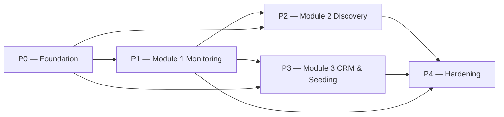

# QDS Delivery Roadmap (P0–P4)

This file is the canonical home of the phased delivery plan. It defines phases
**P0..P4**, the milestones that gate each phase, the sequence rationale, and the
delivery risks. Phases are **relative** — there are **no calendar dates** anywhere
in this plan, by design.

## How to read this roadmap

- A feature is identified by its requirement ID (`REQ-M<n>-<NNN>`). The scope map
  from feature → sources → Active/Deferred lives in
  [modules overview](../10-product/01-modules-overview.md); the full traceability
  from `REQ-*` → module → entities/sources → phase → status lives in the
  [requirement matrix](../90-traceability/00-req-matrix.md). This roadmap **assigns
  each requirement to a phase** and does not restate its detailed scope.
- **Phase membership is separate from document status.** Per the
  [status lifecycle](../00-meta/02-status-lifecycle.md), an item is buildable only
  when it is `APPROVED` **and** its phase is active. `DEFERRED` items are never
  built in v1; each maps to a `DEF-*` in the
  [deferred register](../20-cross-cutting/01-deferred-register.md) and renders as
  "unavailable" in the UI (never empty or zero).
- The technology stack that every phase depends on is frozen by
  [ADR-0001](../05-decisions/decision-log.md#adr-0001) and the stack-lock principle
  `DP-006` in the [data principles](../20-cross-cutting/00-data-principles.md).
  The confidence-first + provenance-first doctrine that P0 must enforce is
  [ADR-0008](../05-decisions/decision-log.md#adr-0008).
- The **application stack** every phase builds on — Laravel 12 with the TailAdmin
  (Blade / Alpine.js / Tailwind v4) template, all UI and CRUD hand-built with
  Livewire and **no Filament** — is fixed by
  [ADR-0012](../05-decisions/decision-log.md#adr-0012). Because no CRUD-generation
  framework is used, the login/authentication UI, data tables, forms, and dashboard
  widgets are **application code to be built**, not scaffolding a framework
  provides. This is why P0 carries an app-shell + login workstream and P3 carries a
  large hand-built CRUD workstream.
- Entity write-ownership (which service/module may write each `ENT-*`) is decided
  solely by the [ownership matrix](../70-shared/00-ownership-matrix.md); the
  internal service map (`SVC-*`) is described in the
  [system architecture](../60-architecture/00-system-architecture.md). This
  roadmap references those services by name and does not restate ownership.

---

## Phase overview

P0 unlocks everything. P1 (Monitoring) runs first among the modules because it
exercises the full ingestion → AI → storage pipeline that Discovery and CRM
reuse. P2 (Discovery) and P3 (CRM & Seeding) both consume `ENT-Creator` identity
and `ENT-MetricSnapshot` records produced earlier. P4 hardens the whole system.

---

## P0 — Foundation

**Goal.** Stand up the platform substrate that all three modules depend on:
infrastructure, the shared data model with its embedded envelopes, enforcement of
the provenance and confidence doctrine, the application UI shell (TailAdmin) with
authentication, login and roles, the ingestion skeleton with the frozen public
connectors, and the snapshot scheduler.

**Delivers (foundational capabilities — no module-facing `REQ-*` ship in P0):**

- **Analytics foundation** — the dimensional star schema (`FACT-*`/`DIM-*`/`ROLLUP-*`) on Neon Postgres and the `SVC-Analytics` service that maintains facts + scheduled rollups ([analytics model](../30-data-model/01-analytics-model.md), [ADR-0010](../05-decisions/decision-log.md#adr-0010)). Metrics are tier-aware and append-only from day one.

- Infrastructure and deployment substrate.
- The full data model and shared envelopes (`Provenance`, `ConfidenceAssessment`,
  `MetricValue`, `ReachEstimate`) from the
  [data model](../30-data-model/00-data-model.md).
- Enforcement of provenance-mandatory and confidence-based assessment
  (`DP-002`, `DP-003`, [ADR-0008](../05-decisions/decision-log.md#adr-0008)) at
  the persistence layer.
- **Application shell & UI foundation** — integrate the TailAdmin template
  (Blade / Alpine.js / Tailwind v4, Vite) as the app shell: base layout, navigation,
  dark mode, and the Livewire runtime that every module's screens are built on
  ([ADR-0012](../05-decisions/decision-log.md#adr-0012)). Because Filament is not
  used, this shell is the substrate all later CRUD and dashboard UI is hand-built
  on.
- **Authentication & login** — the login flow, session handling, password reset,
  and route/middleware protection, built on Laravel's authentication against the
  TailAdmin sign-in screens (there is no Filament auth scaffolding). Plus the roles
  substrate (`ENT-User`, `ENT-Role`, `ENUM-RoleName`) via spatie/laravel-permission
  — the enforcement substrate that `REQ-M3-012` later builds its full permission
  behaviour on in P3.
- `SVC-Ingestion` skeleton (writes raw records + `Provenance`).
- Connectors for the frozen public sources: the Apify Instagram actors
  (`SRC-apify-instagram-scraper`, `-reel-scraper`, `-profile-scraper`,
  `-post-scraper`, `-comment-scraper`, `-story-details`), the sole TikTok source
  `SRC-clockworks-tiktok-scraper`, and `SRC-youtube-data-api-v3`. See the
  [data source matrix](../40-integrations/00-data-source-matrix.md).
- `SVC-SnapshotScheduler` (recurring timestamped `ENT-MetricSnapshot` — the
  own-DB historical mechanism per
  [ADR-0003](../05-decisions/decision-log.md#adr-0003)).

**Exit criteria.**

- Every `ENT-*` and every shared envelope from the
  [data model](../30-data-model/00-data-model.md) is migrated and persistable.
- The persistence layer **rejects** any externally-sourced record lacking a
  `Provenance` envelope, and any inferred/estimated value lacking a
  `ConfidenceAssessment`.
- A user can log in through the application's own login screen, hold a role from
  `ENUM-RoleName`, and unauthenticated requests to protected routes are blocked.
- `SVC-Ingestion` can fetch from at least one Apify Instagram actor, the TikTok
  source, and the YouTube source, writing raw records with correct `Provenance`.
- `SVC-SnapshotScheduler` produces a recurring `ENT-MetricSnapshot` on schedule.

**Deferred, excluded from this phase (and all of v1):**
[DEF-001](../20-cross-cutting/01-deferred-register.md),
[DEF-002](../20-cross-cutting/01-deferred-register.md),
[DEF-003](../20-cross-cutting/01-deferred-register.md),
[DEF-004](../20-cross-cutting/01-deferred-register.md).

---

## P1 — Module 1: Monitoring & Reporting

**Goal.** Deliver [Module 1](../50-modules/module-1-monitoring.md): monitor
brands/campaigns/keywords across the platforms, collect public content and
stories, classify mentions, compute tiered metrics, run the AI enrichment loop
(sentiment, comment analysis, brand recognition, EMV), and produce dashboards and
exports. This is the module that first drives the complete ingestion → AI →
storage pipeline.

**Delivers (`REQ-*`):**

| Requirement | Feature |
|---|---|
| `REQ-M1-001` | Roster monitoring (track agency creators + seeded-product content) |
| `REQ-M1-002` | Paid/seeded/organic mention classification (`ENUM-MentionType`; AI + manual correction) |
| `REQ-M1-003` | Public content collection (posts/reels) |
| `REQ-M1-004` | Story monitoring and archival before expiry |
| `REQ-M1-005` | Performance metrics (PUBLIC) plus DERIVED rates |
| `REQ-M1-006` | Reach and impressions tiering (PUBLIC views vs ESTIMATED reach) |
| `REQ-M1-007` | Historical performance tracking (`ENT-MetricSnapshot`) |
| `REQ-M1-008` | Brand recognition in content (OCR/logo/speech/on-screen) |
| `REQ-M1-009` | Sentiment and context analysis (+ manual correction) |
| `REQ-M1-010` | Comment and audience-reaction analysis |
| `REQ-M1-011` | EMV calculation (configurable, transparent) |
| `REQ-M1-012` | Dashboards and reporting (filters; exports PDF/Excel/CSV) |

Metric tiering is applied exactly as decided in
[ADR-0006](../05-decisions/decision-log.md#adr-0006) and `DP-001`: engagement
rate, view rate and comment rate are **DERIVED**, PUBLIC views/plays are
**PUBLIC**, and estimated reach is **ESTIMATED** (the tiers are canonical in the
[glossary](../00-meta/03-glossary.md)). AI enrichment runs through
`SVC-EnrichmentAI` with the human-in-the-loop review hooks required by `DP-004`;
low-confidence recognition and classification route to a review queue. Brand
recognition uses the AI sources `SRC-google-cloud-vision`,
`SRC-google-speech-to-text`, and the optional `SRC-google-video-intelligence`.

**Exit criteria.**

- Monitored subjects can be defined and matched across `INSTAGRAM`, `TIKTOK`,
  `YOUTUBE` (`ENUM-Platform`), producing `ENT-Mention` records.
- Stories are captured and archived before expiry as `ENT-Story` records.
- Mentions carry an `ENUM-MentionType` with a `ConfidenceAssessment`, and can be
  manually corrected (correction reflected via `ENUM-VerificationStatus`, e.g.
  `AI_ASSESSED` → `HUMAN_CORRECTED`).
- Metrics render with the correct tier; DERIVED rates are computed, never labelled
  PUBLIC; estimated reach is labelled ESTIMATED.
- Sentiment (`ENUM-SentimentLabel`), comment analysis, and brand recognition
  (`ENUM-RecognitionType`) run, with low-confidence outputs in a review queue.
- EMV is computed and every report exposes the model + rates used.
- Dashboards filter, and `SVC-Export` produces PDF, Excel, and CSV
  (`ENUM-ExportFormat`).

**Deferred, excluded from this phase (and all of v1):**
CONFIRMED reach / true unique reach & impressions
([DEF-003](../20-cross-cutting/01-deferred-register.md)) —
`REQ-M1-006` ships PUBLIC views/plays + clearly-labelled ESTIMATED reach only;
audience demographics ([DEF-001](../20-cross-cutting/01-deferred-register.md));
OAuth authorized-creator analytics
([DEF-004](../20-cross-cutting/01-deferred-register.md)).

---

## P2 — Module 2: Discovery

**Goal.** Deliver [Module 2](../50-modules/module-2-discovery.md): find creators,
filter and compare them, attribute geography with confidence, build the unified
profile, classify sectors, analyse performance, estimate authenticity, detect
prior collaborations, score suitability, and manage shortlists. Discovery
consumes `ENT-Creator` identity and the `ENT-MetricSnapshot` history produced
upstream.

**Delivers (`REQ-*`):**

| Requirement | Feature |
|---|---|
| `REQ-M2-001` | Influencer search (keyword/hashtag/topic/mention/similar) |
| `REQ-M2-002` | Advanced filters (public-derived) |
| `REQ-M2-003` | Geographic attribution with confidence (`ENT-GeoAttribution`) |
| `REQ-M2-004` | Unified creator profile |
| `REQ-M2-005` | AI sector classification (multi-label + relevance %, `ENUM-SectorLabel`) |
| `REQ-M2-006` | Performance analysis (average AND median) |
| `REQ-M2-007` | Audience-quality/authenticity estimation (public signals) |
| `REQ-M2-008` | Previous brand-collaboration detection |
| `REQ-M2-009` | Influencer suitability scoring (configurable per-brand models) |
| `REQ-M2-010` | Influencer comparison |
| `REQ-M2-011` | Shortlists (`ENT-Shortlist`) |

Average and median performance are **DERIVED** metrics per
[ADR-0006](../05-decisions/decision-log.md#adr-0006) and `DP-001`. Geographic
attribution (`ENT-GeoAttribution`) and authenticity
(`ENT-AuthenticityAssessment`) are never asserted as fact — they carry a
`ConfidenceAssessment` (`DP-003`,
[ADR-0008](../05-decisions/decision-log.md#adr-0008)).

**Exit criteria.**

- Search returns creators across all `ENUM-Platform` values via the frozen
  sources; filters operate on public/derived signals only.
- Each creator has a unified profile aggregating platform accounts and metrics.
- Sector classification produces multi-label `ENUM-SectorLabel` output with
  relevance percentages and a `ConfidenceAssessment`.
- Performance shows both average and median, tagged DERIVED.
- Authenticity and geo attribution render with confidence and are
  reviewable/correctable per `DP-004`.
- Suitability scoring runs against configurable per-brand models; creators can be
  compared and added to shortlists.
- New creators surfaced by Discovery are **proposed** via the cross-module
  contract, not written directly — `ENT-Creator` remains owned per the
  [ownership matrix](../70-shared/00-ownership-matrix.md).

**Deferred, excluded from this phase (and all of v1):**
audience-country/age/gender demographics
([DEF-001](../20-cross-cutting/01-deferred-register.md)) — `REQ-M2-002` filters
exclude these; CONFIRMED reach
([DEF-003](../20-cross-cutting/01-deferred-register.md)); contact auto-extraction
([DEF-002](../20-cross-cutting/01-deferred-register.md)); OAuth analytics
([DEF-004](../20-cross-cutting/01-deferred-register.md)).

---

## P3 — Module 3: CRM & Seeding

> Includes [REQ-M3-013](../90-traceability/00-req-matrix.md) — product-level seeding aggregation across influencers via `ROLLUP-SeedingByProduct`, built on the P0 analytics foundation.

**Goal.** Deliver [Module 3](../50-modules/module-3-crm-seeding.md): the central
influencer database and cross-platform identity merge (the system of record for
`ENT-Creator`), contact and address management, brand preferences, relationship
and communication history, campaigns, seeding campaigns, shipments, content
matching, results, documents, tasks, and the full roles/permissions behaviour.

**Delivers (`REQ-*`):**

| Requirement | Feature |
|---|---|
| `REQ-M3-001` | Central influencer database + cross-platform identity merge |
| `REQ-M3-002` | Contact and address management (manual) |
| `REQ-M3-003` | Brand preferences and restrictions |
| `REQ-M3-004` | Relationship and communication history (`ENUM-RelationshipStatus`) |
| `REQ-M3-005` | Campaign management (`ENUM-CampaignStatus`) |
| `REQ-M3-006` | Seeding campaign management (`ENUM-SeedingCampaignStatus`) |
| `REQ-M3-007` | Shipment tracking (`ENUM-ShipmentStatus`; courier APIs optional) |
| `REQ-M3-008` | Automatic content-to-campaign matching |
| `REQ-M3-009` | Campaign and seeding results (count, views, engagement, reach tiering, EMV, CPE, CPM) |
| `REQ-M3-010` | Documents and attachments |
| `REQ-M3-011` | Tasks, deadlines, follow-ups (`ENUM-TaskStatus`) |
| `REQ-M3-012` | Roles and permissions (`ENUM-RoleName`) |

All `ENT-Creator` writes route through the CRM/ingestion service; identity merge
is the CRM's authority per the
[ownership matrix](../70-shared/00-ownership-matrix.md). Contact entry is manual
in v1 ([ADR-0005](../05-decisions/decision-log.md#adr-0005)). Low-confidence
content-to-campaign matches (`REQ-M3-008`) route to a review queue per `DP-004`.
`REQ-M3-012` completes the permission behaviour — notably `CLIENT_VIEWER` sees
only approved reports for their brands — on the auth substrate stood up in P0.
*(v1 scope — [ADR-0016](../05-decisions/decision-log.md#adr-0016): no external
client access ships in v1; the `CLIENT_VIEWER` approved-reports surface is
dropped and the role stays defined, deny-everything.)*

Because no CRUD-generation framework is used
([ADR-0012](../05-decisions/decision-log.md#adr-0012)), every Module 3 surface —
the data tables (sorting/filtering/pagination), the create/edit forms with
validation and model binding, and the role-gated navigation — is **hand-built as
Livewire components** on the TailAdmin shell. This is the largest single UI build
in the product and the main effort cost of dropping Filament; it is concentrated
here in P3, on the app shell and login already built in P0.

**Exit criteria.**

- Cross-platform identities merge into a single `ENT-Creator` as system of record.
- Contacts/addresses, brand preferences, and relationship + communication history
  are manageable, with relationship state from `ENUM-RelationshipStatus`.
- Campaigns and seeding campaigns are managed through their status enums;
  shipments track through `ENUM-ShipmentStatus`.
- Content-to-campaign matching runs with low-confidence items queued for review.
- Results compute content count, views, engagement, tiered reach, EMV, CPE, CPM.
- Documents, tasks, and full role-based permissions enforce correctly.

**Deferred, excluded from this phase (and all of v1):**
contact auto-extraction ([DEF-002](../20-cross-cutting/01-deferred-register.md)) —
`REQ-M3-002` is manual entry only; audience demographics
([DEF-001](../20-cross-cutting/01-deferred-register.md)); CONFIRMED reach in
results ([DEF-003](../20-cross-cutting/01-deferred-register.md)); OAuth analytics
([DEF-004](../20-cross-cutting/01-deferred-register.md)).

---

## P4 — Hardening

**Goal.** Operationalise and harden the whole platform for production: data-quality
and health monitoring, cost/rate-limit governance, media storage lifecycle,
GDPR tooling, and white-label client reporting *(void per
[ADR-0016](../05-decisions/decision-log.md#adr-0016) — no external clients in v1)*.

**Delivers (operational capabilities across all modules):**

- Data-quality / health monitoring — detect scraper breakage, especially TikTok
  anti-bot fragility on `SRC-clockworks-tiktok-scraper`.
- Cost and rate-limit governance across the Apify actors, the YouTube API, and the
  Google AI sources.
- Media storage lifecycle management (notably expiring `ENT-Story` media).
- GDPR tooling: retention limits and data-subject deletion, satisfying `DP-005`.
- White-label client reports (building on `SVC-Export` and the `CLIENT_VIEWER`
  behaviour delivered in P3). *(Void —
  [ADR-0016](../05-decisions/decision-log.md#adr-0016): no external clients in
  v1 — unless that ADR is superseded.)*

**Exit criteria.**

- Source breakage is detected and alerted, with TikTok health explicitly tracked.
- Cost and rate-limit ceilings are enforced/observable per source.
- Media (including expiring stories) follows a defined storage lifecycle.
- Retention and deletion workflows satisfy `DP-005` (GDPR + platform ToS).
- White-label client reports are producible for a brand's approved reports.
  *(Void — [ADR-0016](../05-decisions/decision-log.md#adr-0016) — unless
  superseded.)*

**Deferred, excluded from this phase (and all of v1):**
[DEF-001](../20-cross-cutting/01-deferred-register.md),
[DEF-002](../20-cross-cutting/01-deferred-register.md),
[DEF-003](../20-cross-cutting/01-deferred-register.md),
[DEF-004](../20-cross-cutting/01-deferred-register.md).

---

## Milestone table

| Phase | Key deliverables | Depends on |
|---|---|---|
| **P0 — Foundation** | Infra; app shell (TailAdmin) + login/authentication UI + roles substrate; full data model + shared envelopes + analytics star schema (Neon Postgres) + `SVC-Analytics`; provenance/confidence enforcement; `SVC-Ingestion` skeleton; Apify + TikTok + YouTube connectors; `SVC-SnapshotScheduler` | [ADR-0001](../05-decisions/decision-log.md#adr-0001), [ADR-0002](../05-decisions/decision-log.md#adr-0002), [ADR-0003](../05-decisions/decision-log.md#adr-0003), [ADR-0008](../05-decisions/decision-log.md#adr-0008), [ADR-0012](../05-decisions/decision-log.md#adr-0012), [ADR-0013](../05-decisions/decision-log.md#adr-0013); [data model](../30-data-model/00-data-model.md); [data source matrix](../40-integrations/00-data-source-matrix.md) |
| **P1 — Monitoring** | `REQ-M1-001`..`REQ-M1-012`; `SVC-Monitoring`, `SVC-EnrichmentAI`, `SVC-Export`; sentiment, comment analysis, recognition, EMV, dashboards + exports | P0; [ADR-0006](../05-decisions/decision-log.md#adr-0006); AI sources in [data source matrix](../40-integrations/00-data-source-matrix.md); [Module 1 spec](../50-modules/module-1-monitoring.md) |
| **P2 — Discovery** | `REQ-M2-001`..`REQ-M2-011`; `SVC-Discovery`; search, filters, geo, unified profile, sector classification, avg+median performance, authenticity, collaboration detection, scoring, comparison, shortlists | P0; P1 (`ENT-Creator` identity + `ENT-MetricSnapshot`); [Module 2 spec](../50-modules/module-2-discovery.md); [ownership matrix](../70-shared/00-ownership-matrix.md) |
| **P3 — CRM & Seeding** | `REQ-M3-001`..`REQ-M3-013`; `SVC-CRM`; central DB + identity merge, contacts, preferences, comms, campaigns, seeding, shipments, matching, results, documents, tasks, roles/permissions — all CRUD hand-built as Livewire components (no Filament) | P0; P1 (`ENT-Mention`, `ENT-ContentItem`, `ENT-MetricSnapshot`); [ADR-0005](../05-decisions/decision-log.md#adr-0005), [ADR-0012](../05-decisions/decision-log.md#adr-0012); [Module 3 spec](../50-modules/module-3-crm-seeding.md); [ownership matrix](../70-shared/00-ownership-matrix.md) |
| **P4 — Hardening** | Data-quality/health monitoring (TikTok fragility), cost/rate-limit governance, media storage lifecycle, GDPR tooling, white-label client reports *(void per [ADR-0016](../05-decisions/decision-log.md#adr-0016))* | P1, P2, P3; `DP-005`; [data source matrix](../40-integrations/00-data-source-matrix.md) |

---

## Sequence rationale

- **P0 unlocks everything.** No module can be built before the data model, the
  provenance/confidence enforcement, auth, ingestion, and the snapshot scheduler
  exist.
- **Monitoring (P1) goes first** among the modules because it exercises the full
  ingestion → AI → storage pipeline (`SVC-Ingestion` → `SVC-EnrichmentAI` →
  persistence) that Discovery and CRM later reuse. Building it first de-risks that
  shared pipeline.
- **Discovery (P2) and CRM (P3) both consume artefacts produced earlier** — namely
  `ENT-Creator` identity and the timestamped `ENT-MetricSnapshot` history created
  by `SVC-SnapshotScheduler` in P0 and populated during P1. Placing them after P1
  means they build on real data rather than mocks.
- **Hardening (P4) comes last** because operational concerns — source-breakage
  detection, cost governance, media lifecycle, GDPR tooling, and white-label
  reporting *(void per [ADR-0016](../05-decisions/decision-log.md#adr-0016))* —
  are only meaningful once the modules that generate the load,
  the data, and the reports exist.

---

## Delivery risks

| Risk | Description | Where addressed |
|---|---|---|
| Scraper fragility | Public scrapers break under platform changes and anti-bot measures — **especially TikTok** (`SRC-clockworks-tiktok-scraper`), the sole TikTok source per [ADR-0002](../05-decisions/decision-log.md#adr-0002). | P4 data-quality/health monitoring |
| GDPR + platform ToS | Storing EU-creator personal data is a documented constraint requiring retention limits and data-subject deletion (`DP-005`). | P4 GDPR tooling |
| Apify cost + rate limits | Public-source ingestion incurs Apify cost and is subject to rate limits across the Instagram actors and the TikTok source. | P4 cost/rate-limit governance |
| Media storage for expiring stories | `ENT-Story` media expires at the platform; capturing and retaining it (`REQ-M1-004`) requires a defined storage lifecycle. | P4 media storage lifecycle |
| Hand-built UI & CRUD effort | Dropping Filament ([ADR-0012](../05-decisions/decision-log.md#adr-0012)) means the login/authentication UI, every data table, every form (validation + model binding), and the dashboard widgets are hand-built as Livewire components rather than framework-generated. Effort concentrates in P0 (app shell + auth) and P3 (CRM CRUD). | P0 app shell + login/auth; P3 Livewire CRUD build |

---

## Post-P1 enrichment follow-ups (TODO)

Open follow-ups surfaced while building the P1 AI-enrichment loop
(`SVC-EnrichmentAI`). They are tracked here until each is folded into a formal
decision or its relevant canonical file. These are **not yet scheduled work**
and carry no `REQ-*`. Detailed engineering context for all three lives in the
enrichment review handoff `reviews/REVIEW-module1-enrichment-2026-07-05.md`.

1. **Isolate `PAID` from the QDS organic-seeding workflow.** QDS works only with
   unpaid organic product seeding, yet
   [`ENUM-MentionType`](../00-meta/03-glossary.md#enum-mentiontype) retains
   `PAID` for shared-enum compatibility. Decide and document whether `PAID` is
   removed from the QDS classification path entirely or kept only as an inert
   compatibility value that QDS never asserts — it is currently produced only
   from a platform paid-partnership label
   ([AC-M1-003](../50-modules/module-1-monitoring.md#ac-m1-003)), never inferred.
   Fold the outcome into the
   [Module 1 spec](../50-modules/module-1-monitoring.md) and, if it changes the
   enum's meaning, the
   [glossary](../00-meta/03-glossary.md#enum-mentiontype).

2. **State that EMV rates are user-managed.**
   [`REQ-M1-011`](../50-modules/module-1-monitoring.md) /
   [GL-EMV](../00-meta/03-glossary.md#gl-emv) require a configurable, transparent
   EMV model, but no canonical text says the rate card is **authored and
   maintained manually by an authorized user** — there are no system-provided
   default rates, and EMV renders "unavailable" until a user activates a valid
   configuration. Add this manual-management expectation explicitly to the
   Module 1 spec / GL-EMV so it is canonical, not only implemented.

3. **Stale enrichment-run recovery (P4 hardening).** A hard-killed enrichment job
   leaves its `enrichment_runs` telemetry row in `RUNNING`, which the recurring
   sweep then treats as already-handled and never retries. Add a stale-run
   reaper — mirroring the ingestion stale-cycle refresh — that marks over-age
   `RUNNING` runs as failed so the target becomes eligible again. This belongs to
   **P4 — Hardening** (data-quality / operational monitoring), alongside the
   existing scraper-health work.

4. **Live-verify the Google AI sources.** The recognition clients and
   normalizers for
   [`SRC-google-cloud-vision`](../40-integrations/00-data-source-matrix.md#src-google-cloud-vision)
   and
   [`SRC-google-video-intelligence`](../40-integrations/00-data-source-matrix.md#src-google-video-intelligence)
   are built and tested against **synthetic** faked payloads only — no live call
   has ever been made, so the real request/response shapes (and the Video
   Intelligence long-running-operation polling) are unverified. Run each against
   real media with real credentials and reconcile any field-mapping drift, as was
   done for the ingestion sources. Requires the credentials added to
   `config/services.php` (`GOOGLE_VISION_API_KEY`,
   `GOOGLE_VIDEO_INTELLIGENCE_API_KEY`).