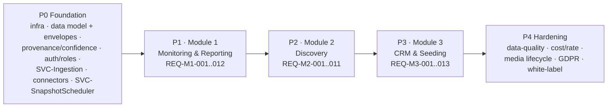

# Requirement Traceability & Coverage Matrix

This file is the **coverage audit**: it maps every requirement (`REQ-*`) to its owning
module, the primary entities it touches, the external sources it consumes, its delivery
phase, and its build status. It exists so an AI coding agent — and the linter — can prove
that no requirement is dangling and that scope, data, and schedule agree.

## What this file owns (and what it does not)

- **Owns:** the REQ → (module, entities, sources, phase, status) coverage audit and the
  orphan-detection rule below.
- **Does NOT own — link instead:**
  - REQ scope (Active/Deferred, feature meaning): [modules-overview](../10-product/01-modules-overview.md)
  - Phase definitions P0..P4 and sequencing: [roadmap](../80-delivery/00-roadmap.md)
  - Entity field shapes: [data-model](../30-data-model/00-data-model.md)
  - Source contracts (`SRC-*`): [data-source-matrix](../40-integrations/00-data-source-matrix.md)
  - Write-ownership (`ENT-*` → owner module): [ownership-matrix](../70-shared/00-ownership-matrix.md)
  - Status vocabulary + build permissions: [status-lifecycle](../00-meta/02-status-lifecycle.md)
  - Deferred sub-capabilities (`DEF-*`): [deferred-register](../20-cross-cutting/01-deferred-register.md)

The **Entities** column lists entities a requirement reads or writes; it is NOT a
restatement of write-ownership. For write authority, always defer to the
[ownership-matrix](../70-shared/00-ownership-matrix.md).

## Phase reconciliation

Every module maps 1:1 to a delivery phase; P0 precedes and enables all three.

P0 and P4 carry no module `REQ-*` of their own (they are foundation and hardening work
described in the [roadmap](../80-delivery/00-roadmap.md)); they are intentionally absent
from the requirement rows below and this is not an orphan. The "white-label" deliverable
named in the P4 node above is void per
[ADR-0016](../05-decisions/decision-log.md#adr-0016) (no external clients in v1) unless
that ADR is superseded.

## Legend

- **Status** values are from `ENUM-Platform`'s sibling `ENUM-DocStatus` (canonical in the
  [glossary](../00-meta/03-glossary.md)). All rows below are **APPROVED** — buildable only
  when their phase is active, per [status-lifecycle](../00-meta/02-status-lifecycle.md).
- A **Sources** cell of `— (…)` means the requirement consumes **no external `SRC-*`**; its
  data is produced internally (derived metrics, AI enrichment, own-DB snapshots, or manual
  entry). Such rows are still covered because they touch at least one entity.
- **Deferred sub-scope** notes point at `DEF-*` capabilities that are out of v1 but live
  inside an otherwise-Active requirement; the parent REQ stays APPROVED while the deferred
  slice renders "unavailable" per the [deferred-register](../20-cross-cutting/01-deferred-register.md).
- Every externally-sourced record additionally carries the **Provenance** envelope, and every
  inferred/estimated value carries a **ConfidenceAssessment** envelope (see
  [data-principles](../20-cross-cutting/00-data-principles.md) DP-002/DP-003); these envelopes
  are omitted from per-row Entities cells to avoid noise.

## Module 1 — Monitoring & Reporting (Phase P1)

| REQ | Module | Primary entities (ENT-*) | External sources (SRC-*) | Phase | Status | Deferred sub-scope |
|-----|--------|--------------------------|--------------------------|-------|--------|--------------------|
| REQ-M1-001 | M1 | MonitoredSubject, PlatformAccount, MetricSnapshot, ContentItem | SRC-apify-instagram-scraper, SRC-apify-instagram-profile-scraper, SRC-clockworks-tiktok-scraper, SRC-youtube-data-api-v3 | P1 | APPROVED | open-web listening (non-roster) → DEF-006 |
| REQ-M1-002 | M1 | Mention | — (SVC-EnrichmentAI; inputs: RecognitionDetection + Campaign/SeedingCampaign labels) | P1 | APPROVED | — |
| REQ-M1-003 | M1 | ContentItem | SRC-apify-instagram-scraper, SRC-apify-instagram-post-scraper, SRC-apify-instagram-reel-scraper, SRC-clockworks-tiktok-scraper, SRC-youtube-data-api-v3 | P1 | APPROVED | — |
| REQ-M1-004 | M1 | Story | SRC-apify-instagram-story-details | P1 | APPROVED | — |
| REQ-M1-005 | M1 | MetricSnapshot, PlatformAccount, ContentItem | SRC-apify-instagram-scraper, SRC-apify-instagram-profile-scraper, SRC-apify-instagram-reel-scraper, SRC-clockworks-tiktok-scraper, SRC-youtube-data-api-v3 | P1 | APPROVED | account-level & content-level; via FACT-CreatorAccount/FACT-ContentMetric |
| REQ-M1-006 | M1 | MetricSnapshot, ContentItem | SRC-apify-instagram-scraper, SRC-apify-instagram-reel-scraper, SRC-clockworks-tiktok-scraper, SRC-youtube-data-api-v3 | P1 | APPROVED | CONFIRMED reach → DEF-003 |
| REQ-M1-007 | M1 | MetricSnapshot | — (own-DB snapshots via SVC-SnapshotScheduler, ADR-0003; account growth via ROLLUP-CreatorByPeriod) | P1 | APPROVED | — |
| REQ-M1-008 | M1 | RecognitionDetection | SRC-google-cloud-vision, SRC-google-speech-to-text, SRC-google-video-intelligence | P1 | APPROVED | — |
| REQ-M1-009 | M1 | SentimentAnalysis, ContentItem | — (SVC-EnrichmentAI; human-review loop DP-004) | P1 | APPROVED | — |
| REQ-M1-010 | M1 | Comment (not populated in v1) | — (Deferred) | — | DEFERRED | Deferred on cost grounds → DEF-005 / ADR-0009 |
| REQ-M1-011 | M1 | MetricSnapshot, ContentItem | — (SVC-EnrichmentAI; configurable EMV model + rates) | P1 | APPROVED | — |
| REQ-M1-012 | M1 | ContentItem, Mention, MetricSnapshot, SentimentAnalysis | — (SVC-Export; `ENUM-ExportFormat` PDF/EXCEL/CSV) | P1 | APPROVED | — |

## Module 2 — Discovery (Phase P2)

| REQ | Module | Primary entities (ENT-*) | External sources (SRC-*) | Phase | Status | Deferred sub-scope |
|-----|--------|--------------------------|--------------------------|-------|--------|--------------------|
| REQ-M2-001 | M2 | Creator, PlatformAccount | SRC-apify-instagram-scraper, SRC-clockworks-tiktok-scraper, SRC-youtube-data-api-v3 | P2 | APPROVED | — |
| REQ-M2-002 | M2 | Creator, PlatformAccount, MetricSnapshot, SectorClassification | SRC-apify-instagram-profile-scraper, SRC-clockworks-tiktok-scraper, SRC-youtube-data-api-v3 (derived; filters run on stored public data) | P2 | APPROVED | audience country/age/gender filters → DEF-001 |
| REQ-M2-003 | M2 | GeoAttribution | SRC-apify-instagram-profile-scraper, SRC-clockworks-tiktok-scraper, SRC-youtube-data-api-v3 | P2 | APPROVED | automatic inference → P2; operator-assigned geography shipped early per [ADR-0018](../05-decisions/decision-log.md#adr-0018) |
| REQ-M2-004 | M2 | Creator, PlatformAccount, MetricSnapshot | — (aggregation of stored records) | P2 | APPROVED | — |
| REQ-M2-005 | M2 | SectorClassification | — (SVC-EnrichmentAI; `ENUM-SectorLabel`, multi-label + relevance %) | P2 | APPROVED | — |
| REQ-M2-006 | M2 | MetricSnapshot, ContentItem | — (DERIVED average AND median) | P2 | APPROVED | — |
| REQ-M2-007 | M2 | AuthenticityAssessment | — (internal; AI over stored public engagement/comment signals) | P2 | APPROVED | audience demographics inputs → DEF-001 |
| REQ-M2-008 | M2 | Mention, RecognitionDetection | — (reads M1 Mention/RecognitionDetection) | P2 | APPROVED | — |
| REQ-M2-009 | M2 | SuitabilityScore, BrandPreference | — (SVC-EnrichmentAI; configurable per-brand models) | P2 | APPROVED | — |
| REQ-M2-010 | M2 | Creator, MetricSnapshot, SuitabilityScore | — (aggregation of stored records) | P2 | APPROVED | — |
| REQ-M2-011 | M2 | Shortlist | — (agency selection) | P2 | APPROVED | — |

## Module 3 — CRM & Seeding (Phase P3)

| REQ | Module | Primary entities (ENT-*) | External sources (SRC-*) | Phase | Status | Deferred sub-scope |
|-----|--------|--------------------------|--------------------------|-------|--------|--------------------|
| REQ-M3-001 | M3 | Creator, PlatformAccount | — (system of record; cross-platform identity merge) | P3 | APPROVED | automatic + dedicated merge → ADR-0014 (v1: operator-managed identity) |
| REQ-M3-002 | M3 | Contact | — (manual CRM entry) | P3 | APPROVED | contact auto-extraction → DEF-002 |
| REQ-M3-003 | M3 | BrandPreference | — (manual CRM entry) | P3 | APPROVED | — |
| REQ-M3-004 | M3 | CommunicationLog, Creator | — (`ENUM-RelationshipStatus`; manual + logged) | P3 | APPROVED | — |
| REQ-M3-005 | M3 | Campaign, Client, Brand, Product | — (`ENUM-CampaignStatus`) | P3 | APPROVED | — |
| REQ-M3-006 | M3 | SeedingCampaign, Brand, Product | — (`ENUM-SeedingCampaignStatus`) | P3 | APPROVED | — |
| REQ-M3-007 | M3 | Shipment, Product | — (`ENUM-ShipmentStatus`; courier APIs optional, no canonical SRC-*) | P3 | APPROVED | — |
| REQ-M3-008 | M3 | Campaign, SeedingCampaign, ContentItem, Mention | — (SVC-EnrichmentAI; low-confidence → review queue, DP-004) | P3 | APPROVED | — |
| REQ-M3-009 | M3 | Campaign, SeedingCampaign, MetricSnapshot, ContentItem, Shipment, Product | — (DERIVED EMV/CPE/CPM; reach tiering per REQ-M1-006; via FACT-SeedingContent) | P3 | APPROVED | CONFIRMED reach in results → DEF-003 |
| REQ-M3-010 | M3 | DocumentAttachment | — (uploads) | P3 | APPROVED | — |
| REQ-M3-011 | M3 | Task | — (`ENUM-TaskStatus`) | P3 | APPROVED | — |
| REQ-M3-012 | M3 | User, Role | — (`ENUM-RoleName`; CLIENT_VIEWER sees only approved reports for their brands) | P3 | APPROVED | external client access (CLIENT_VIEWER surface) → ADR-0016 (v1: ADMIN-only User/Role writes; CLIENT_VIEWER deny-everything) |
| REQ-M3-013 | M3 | Product, Shipment, ContentItem, MetricSnapshot (via FACT-*/ROLLUP-*) | — (SVC-Analytics; ROLLUP-SeedingByProduct) | P3 | APPROVED | CONFIRMED reach/impressions → DEF-003 |

## Orphan-detection rule (linter MUST flag)

A requirement row is an **orphan** and MUST be flagged by
[check-docs](../_lint/check-docs.md) when **any** of the following holds:

1. It touches **no entity AND no source** — i.e. both the Entities cell and the Sources cell
   are empty (a `— (…)` note with a stated internal producer does NOT count as empty).
2. It has **no phase** (blank Phase cell, or a phase not in P0..P4).
3. Its phase disagrees with the module→phase mapping in the
   [roadmap](../80-delivery/00-roadmap.md) (M1→P1, M2→P2, M3→P3), or its scope
   (Active/Deferred) disagrees with [modules-overview](../10-product/01-modules-overview.md).

Every `REQ-*` defined in [modules-overview](../10-product/01-modules-overview.md)
(REQ-M1-001..012, REQ-M2-001..011, REQ-M3-001..013) MUST appear exactly once in the tables
above; a requirement present in modules-overview but missing here is also an orphan.

## Coverage summary

| Module | Requirements | Phase | All rows covered (entity and/or source) | Orphans |
|--------|--------------|-------|------------------------------------------|---------|
| M1 Monitoring & Reporting | REQ-M1-001..012 (12) | P1 | Yes | 0 |
| M2 Discovery | REQ-M2-001..011 (11) | P2 | Yes | 0 |
| M3 CRM & Seeding | REQ-M3-001..013 (13) | P3 | Yes | 0 |

All 35 requirements are Active/APPROVED and reconcile with
[modules-overview](../10-product/01-modules-overview.md) and the
[roadmap](../80-delivery/00-roadmap.md). Deferred slices remain governed by their `DEF-*`
entries in the [deferred-register](../20-cross-cutting/01-deferred-register.md).