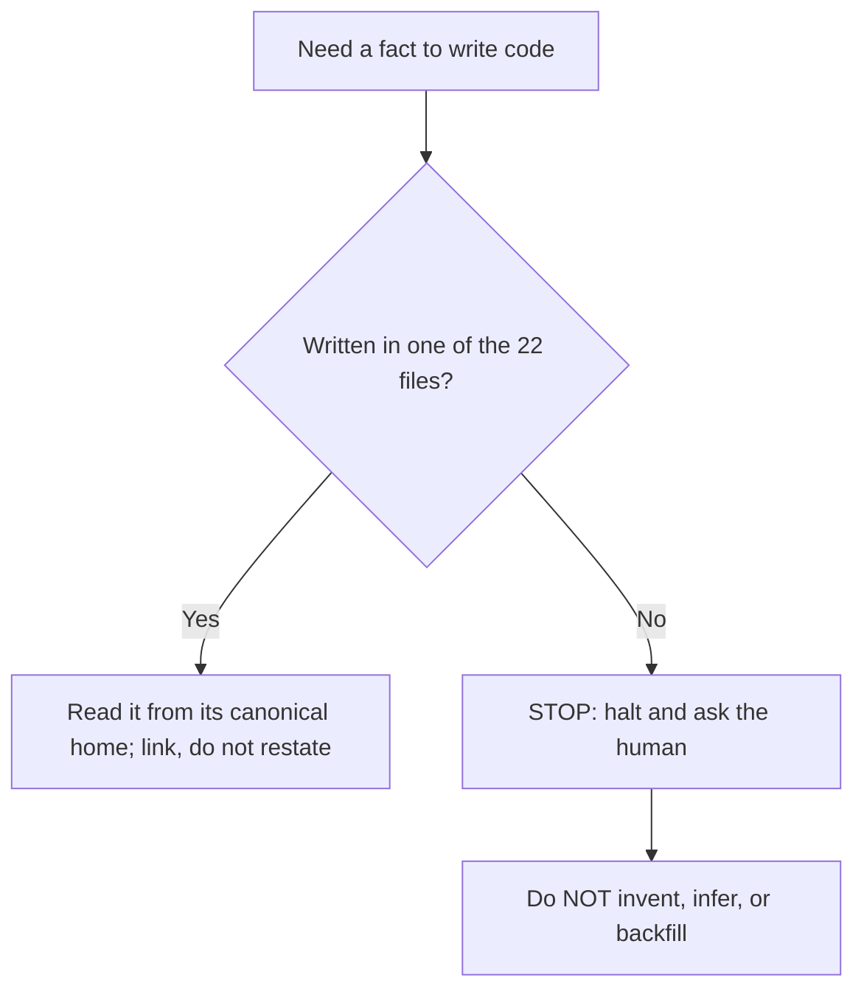
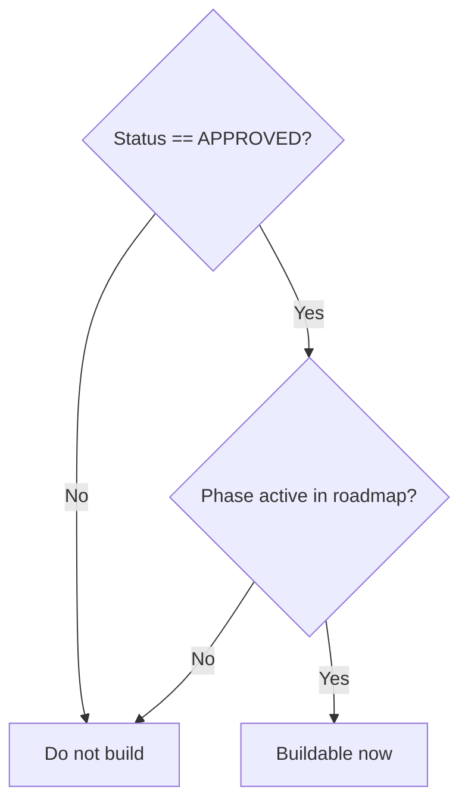

# QDS Agent Operating Manual

This is the binding operating manual every AI coding agent MUST read and obey **before writing any code** for the "Question de Style" (QDS) platform. The rules below are numbered imperatives. They are not advisory. Violating any rule is a build defect; several of them are also linter failures (see [`_lint/check-docs.md`](_lint/check-docs.md)).

If a rule here appears to conflict with anything you remember, assume, or infer from outside this documentation tree, **the documentation wins**. If two documents inside the tree appear to conflict, follow the single-source-of-truth precedence in Rule 3 and, if still unresolved, STOP per Rule 4.

---

## 1. Read before you build

**Rule 1 — Follow the canonical reading order.** Before touching code, read the files in the exact order defined by the master reading-order in [`00-meta/00-index.md`](00-meta/00-index.md). That index is the SOLE authority for the master file map and the agent reading order; do not rely on any other ordering. This manual does not restate the order — open the index and follow it.

**Rule 2 — Know the tree. Never invent paths.** The documentation is a single consolidated tree of exactly 22 files. Every fact you need lives in one of them. When you cross-reference, link only to one of those 22 real paths, optionally with a lowercased `#anchor`. Never link to, cite, or assume the existence of a fine-grained per-entity, per-source, or per-module-section file — those files DO NOT EXIST. Use the fact-location router in [`00-meta/00-index.md`](00-meta/00-index.md) to find where a fact lives.

---

## 2. The single-source-of-truth law

**Rule 3 — Read each fact only from its canonical home; never restate a canonical fact.** Every class of fact has exactly one canonical file. Read it there. If you would otherwise repeat it, **link instead** — restating a canonical fact is a linter failure. The canonical homes are:

| Fact class | Canonical home (read here; link, never restate) |
| --- | --- |
| Enums (names + values) | [`00-meta/03-glossary.md`](00-meta/03-glossary.md) |
| Domain terms (`GL-*`) | [`00-meta/03-glossary.md`](00-meta/03-glossary.md) |
| Entity field shapes / envelopes / metrics (`MET-*`) | [`30-data-model/00-data-model.md`](30-data-model/00-data-model.md) |
| Write-ownership (which module writes which entity) | [`70-shared/00-ownership-matrix.md`](70-shared/00-ownership-matrix.md) |
| External data sources (`SRC-*`) | [`40-integrations/00-data-source-matrix.md`](40-integrations/00-data-source-matrix.md) |
| Deferred items (`DEF-*`) | [`20-cross-cutting/01-deferred-register.md`](20-cross-cutting/01-deferred-register.md) |
| Decisions (`ADR-*`) | [`05-decisions/decision-log.md`](05-decisions/decision-log.md) |
| Data principles (`DP-*`) | [`20-cross-cutting/00-data-principles.md`](20-cross-cutting/00-data-principles.md) |
| Status vocabulary + build gate | [`00-meta/02-status-lifecycle.md`](00-meta/02-status-lifecycle.md) |
| Requirements traceability (`REQ-*`) | [`90-traceability/00-req-matrix.md`](90-traceability/00-req-matrix.md) |
| Master map + reading order | [`00-meta/00-index.md`](00-meta/00-index.md) |

Concretely: reference an enum by name (e.g. `ENUM-MetricTier`) and never re-list its values; reference an entity by name (e.g. `ENT-Creator`) and never re-tabulate its fields; reference an owner by linking the ownership matrix and never re-assert who writes it.

---

## 3. When a fact is missing

**Rule 4 — STOP on UNSPECIFIED. Never invent.** If a fact you need to write code is not written anywhere in the 22 files, **halt and ask the human**. Do not guess a field name, an enum value, a source capability, a threshold, a default, an owner, or a phase. Do not backfill from prior training, from another project, or from "what usually makes sense." An invented fact is worse than a blocked task. Emit a clear question naming the missing fact and the file where it would belong (use the router in [`00-meta/00-index.md`](00-meta/00-index.md)), then wait.

---

## 4. The stack is locked

**Rule 5 — Do not add, swap, or invent providers.** The v1 provider stack is frozen. Use only the sources registered in [`40-integrations/00-data-source-matrix.md`](40-integrations/00-data-source-matrix.md). Do not introduce a new scraper, API, model vendor, or SDK, and do not substitute one registered source for another. The freeze and its rationale are decided in [`ADR-0001`](05-decisions/decision-log.md#adr-0001) (v1 technology stack frozen) and [`ADR-0002`](05-decisions/decision-log.md#adr-0002) (TikTok is Apify-only; no usable official TikTok API). This rule is the operational form of data principle `DP-006`; if you believe a new provider is genuinely required, STOP per Rule 4 — it requires a new ADR, not a code change.

---

## 5. The status + phase build gate

**Rule 6 — Build an item only when it is APPROVED **and** its phase is active.** Status (an `ENUM-DocStatus` value) and phase membership (`P0`..`P4`) are two independent gates and you must clear both:

- `DRAFT` / `PROPOSED` — MUST NOT be built or cited as fact.
- `APPROVED` — buildable **only when its roadmap phase is active** in [`80-delivery/00-roadmap.md`](80-delivery/00-roadmap.md).
- `IMPLEMENTED` — already built and verified; any change needs an ADR plus a changelog entry.
- `DEFERRED` — out of v1 scope; see Rule 8.
- `DEPRECATED` / `SUPERSEDED` — MUST NOT be built.

The status vocabulary and the gate are canonical in [`00-meta/02-status-lifecycle.md`](00-meta/02-status-lifecycle.md); read it there. An `APPROVED` item whose phase is not yet active is **not** buildable yet.

---

## 6. Write only what your module owns

**Rule 7 — Respect single-write-owner ownership.** Every entity has exactly one WRITE-owner module and zero or more READER modules, defined once in [`70-shared/00-ownership-matrix.md`](70-shared/00-ownership-matrix.md). Your module may **write** an entity only if that matrix names your module as its write-owner; otherwise your module may only **read** it, and must obtain or propose changes through the owning module's service (via the applicable cross-module contract, `XMC-*`). Do not write across ownership boundaries even when it looks convenient. Consult the matrix for the exact owner of every entity you touch — this manual does not restate ownership. Note in particular that new `ENT-Creator` records are never written directly by a monitoring or discovery module; they are proposed to the CRM/ingestion service per the matrix.

---

## 7. Never build deferred capabilities

**Rule 8 — Do not build any `DEF-*` item; render it "unavailable".** Deferred capabilities are out of v1 scope. Never implement one. When a deferred field or capability would otherwise surface in the UI, it MUST render the literal state **"unavailable"** — never empty, never zero, never a fabricated placeholder value. The deferred list and this UI rule are canonical in [`20-cross-cutting/01-deferred-register.md`](20-cross-cutting/01-deferred-register.md); read the current `DEF-*` set there before building anything adjacent to audience demographics, contact auto-extraction, confirmed unique reach, or authorized-creator OAuth analytics.

---

## 8. Data doctrine you must enforce in code

**Rule 9 — Enforce provenance, confidence, and metric tiering.** These are non-negotiable data principles, canonical in [`20-cross-cutting/00-data-principles.md`](20-cross-cutting/00-data-principles.md) and grounded in [`ADR-0008`](05-decisions/decision-log.md#adr-0008) (confidence-first + provenance-first doctrine):

1. Every externally-sourced record MUST carry the `Provenance` envelope (`DP-002`).
2. Every inferred/estimated value — location, authenticity, organic-vs-paid classification, sector — MUST carry a `ConfidenceAssessment` and MUST NOT be presented as fact (`DP-003`).
3. Every metric MUST be tagged with its `ENUM-MetricTier`; never present an `ESTIMATED` value as fact (`DP-001`). Engagement rate, average performance, and median performance are `DERIVED`; estimated reach is `ESTIMATED`. Read the tier definitions and the exact envelope shapes only from [`30-data-model/00-data-model.md`](30-data-model/00-data-model.md); do not restate them.
4. AI outputs are reviewable and correctable; wire the human-in-the-loop review hooks and persist corrections (`DP-004`).
5. Honor GDPR + platform ToS constraints on EU-creator data (`DP-005`).

---

## 9. Conventions, IDs, and self-check

**Rule 10 — Follow the ID grammar and never reuse a real ID for an illustration.** Use the exact ID shapes and cross-reference syntax defined in [`00-meta/01-conventions.md`](00-meta/01-conventions.md). When you need an *illustrative* example, use placeholder IDs (`REQ-Mx-NNN`, `ENT-Example`) — never repurpose a real requirement, entity, or enum ID to demonstrate a different thing. Every `.md` you author or edit MUST carry the required frontmatter (`id`, `title`, `status`, `canonical_for`, `depends_on`, `last_reviewed`), `depends_on` MUST use real IDs or real file paths only, and `last_reviewed` MUST be `2026-07-02` and never a later date.

**Rule 11 — Run the linter mentally before you finish.** Before considering any doc or code change complete, self-check it against [`_lint/check-docs.md`](_lint/check-docs.md): no links outside the 22 files, no restated canonical facts, correct frontmatter, valid IDs and enum values (for example the AI verification value is `AI_ASSESSED`, and `STORY` is not an `ENUM-ContentType` value — stories are `ENT-Story`). If any check fails, fix it or STOP per Rule 4.

---

## Rule quick-reference

| # | Imperative |
| --- | --- |
| 1 | Follow the reading order in `00-meta/00-index.md`. |
| 2 | Link only to the 22 real paths; never invent a path. |
| 3 | Read each fact from its canonical home; link, never restate. |
| 4 | STOP on UNSPECIFIED — halt and ask, never invent. |
| 5 | Stack is locked — no new providers (`ADR-0001`, `ADR-0002`). |
| 6 | Build only APPROVED items whose phase is active. |
| 7 | Write only entities your module owns per the ownership matrix. |
| 8 | Never build a `DEF-*`; render "unavailable". |
| 9 | Enforce provenance, confidence, and metric tiering (`ADR-0008`). |
| 10 | Follow ID grammar; never reuse a real ID for an example. |
| 11 | Pass the linter (`_lint/check-docs.md`) before finishing. |