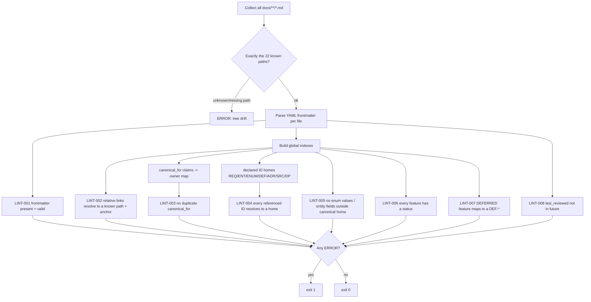

# QDS Documentation Linter Specification (check-docs)

This file is the **canonical, machine-checkable specification** for the QDS documentation linter (`check-docs`). It turns the authoring conventions defined in [00-meta/01-conventions.md](../00-meta/01-conventions.md) into deterministic CI gates. An implementer can build the linter directly from the rules below without guessing.

This file is canonical for the linter rule IDs (`LINT-*`) and for the **required-frontmatter** definition used by CI. It does **not** redefine any fact that is canonical elsewhere:

- The authoring **frontmatter-spec**, **id-grammar**, and **cross-ref-syntax** are canonical in [00-meta/01-conventions.md](../00-meta/01-conventions.md); this file references them and encodes their machine-checkable form.
- The **DocStatus** vocabulary is canonical in [00-meta/03-glossary.md#enum-docstatus](../00-meta/03-glossary.md#enum-docstatus) (`ENUM-DocStatus`); build permissions are canonical in [00-meta/02-status-lifecycle.md](../00-meta/02-status-lifecycle.md).
- The authoritative list of the 22 files (the link target allow-list) is canonical in [00-meta/00-index.md](../00-meta/00-index.md).

If any rule below appears to conflict with a canonical source, the canonical source wins and the linter rule text is the defect.

## Scope and invocation

The linter runs over **exactly the 22 files** of the QDS documentation tree, as enumerated in [00-meta/00-index.md](../00-meta/00-index.md). No fine-grained per-entity, per-source, or per-module-section files exist; a link to any path outside those 22 is a failure (see `LINT-002`).

- **Trigger:** every pull request that touches any `docs/**/*.md` file, and a full-tree run on the default branch.
- **Exit code:** `0` only when zero `ERROR`-severity findings exist. Any `ERROR` fails CI. `WARN` findings are reported but do not fail the build unless promoted by configuration.
- **Determinism:** the linter must be pure with respect to the working tree — same tree, same findings. No network calls.

### CI gate flow



## Required frontmatter definition

Every one of the 22 `.md` files MUST begin with a YAML frontmatter block delimited by `---` on its own first line and a closing `---`. The block MUST contain **exactly** these six keys, and no unknown keys:

| Key | Type | Rule (machine-checkable) |
|-----|------|--------------------------|
| `id` | string | Non-empty. Must match the ID grammar in [00-meta/01-conventions.md](../00-meta/01-conventions.md). Must be unique across all 22 files. |
| `title` | string | Non-empty human-readable title. |
| `status` | string | Exactly one value of `ENUM-DocStatus` (canonical in [00-meta/03-glossary.md#enum-docstatus](../00-meta/03-glossary.md#enum-docstatus)). The linter loads the allowed set from the glossary; it does not hard-code the values here. |
| `canonical_for` | list | List of fact-classes / ID-prefixes this file owns. MAY be empty (`[]`). Each entry is a string. Used to build the ownership index for `LINT-003` and `LINT-004`. |
| `depends_on` | list | List of concrete real IDs (matching the ID grammar) and/or real file paths that are one of the 22. MAY be empty. Placeholder IDs (see `LINT-005` placeholder rule) are forbidden here. |
| `last_reviewed` | date | ISO `YYYY-MM-DD`. MUST be `<= 2026-07-02` (see `LINT-008`). |

Notes:
- The authoring-facing description of these fields is canonical in [00-meta/01-conventions.md](../00-meta/01-conventions.md#frontmatter-spec); this table is the CI-enforced shape.
- `status` governs build permission only via [00-meta/02-status-lifecycle.md](../00-meta/02-status-lifecycle.md); the linter checks the value is legal, not whether an item should be built.

## Rule catalog (LINT-001 .. LINT-008)

Each rule below states: what it checks, how to detect it, and the severity. All rules emit findings as `file:line — LINT-NNN — message`.

| Rule | Name | Severity |
|------|------|----------|
| LINT-001 | Frontmatter present and valid | ERROR |
| LINT-002 | No broken relative links (target in the 22; anchor resolves) | ERROR |
| LINT-003 | No duplicate `canonical_for` claim across files | ERROR |
| LINT-004 | Every referenced ID resolves to a declared home | ERROR |
| LINT-005 | No enum values or entity fields defined outside canonical home | ERROR |
| LINT-006 | Every feature has a status | ERROR |
| LINT-007 | Every DEFERRED feature maps to a DEF-* | ERROR |
| LINT-008 | `last_reviewed` not in the future | ERROR |

### LINT-001 — Frontmatter present and valid

**Check:** every file parses as `---` YAML frontmatter followed by an H1 (`# `) as the first non-blank body line, and the frontmatter satisfies the *Required frontmatter definition* table above.

**How to script:**
1. Read the file. Assert the first line is exactly `---`; find the closing `---`. Fail if missing.
2. YAML-parse the block. Fail on parse error.
3. Assert the key set equals `{id, title, status, canonical_for, depends_on, last_reviewed}` — no missing keys, no extra keys.
4. Type-check each key per the table (`canonical_for`/`depends_on` are lists; `last_reviewed` is a date; others non-empty strings).
5. Assert `status` is a member of the `ENUM-DocStatus` value set loaded from [00-meta/03-glossary.md#enum-docstatus](../00-meta/03-glossary.md#enum-docstatus).
6. Assert the first body element after frontmatter is an H1.
7. Assert `id` is globally unique across the 22 files.

**Severity:** ERROR.

### LINT-002 — No broken relative links

**Check:** every relative markdown link `[text](path)` or `[text](path#anchor)` resolves to **one of the 22 known paths** (canonical list in [00-meta/00-index.md](../00-meta/00-index.md)), and, when an anchor is present, the anchor exists in the target file.

**How to script:**
1. Extract all inline links and reference-style link definitions from body and from `depends_on` path entries.
2. Ignore pure external links (`http://`, `https://`, `mailto:`). The 22 QDS files are all local; any link that looks intra-repo but is not `http(s)` MUST be a relative path.
3. Resolve the relative path against the linking file's directory to an absolute repo path.
4. Assert the resolved path is a member of the canonical 22-path allow-list. A resolved path outside that set is a failure ("link to nonexistent fine-grained file / tree drift"). This enforces **F1**.
5. If the link has `#anchor`: compute the target file's heading anchors (GitHub-style slug: lowercase, spaces→`-`, strip punctuation). Assert the anchor is one of them.
6. **Glossary anchor rule (F11):** a link pointing at a glossary term heading MUST use the lowercased ID as the anchor. For a term whose ID is `GL-MetricTier`, the only valid anchor is `#gl-metrictier`; likewise enum headings such as `ENUM-MetricTier` anchor as `#enum-metrictier`. The linter verifies the anchor equals the lowercased ID form and that the heading exists.

**Severity:** ERROR.

### LINT-003 — No duplicate `canonical_for` claim

**Check:** no two files claim the same fact-class / ID-prefix in their `canonical_for`. Each fact is single-sourced (SINGLE-SOURCE-OF-TRUTH LAW).

**How to script:**
1. Build a map `claim -> [files]` from every file's `canonical_for` list (normalize whitespace and case for comparison; treat a prefix like `REQ-M1-*` and an overlapping `REQ-*` as a conflict if one subsumes the other).
2. Any `claim` mapped to more than one file is a failure, naming all claimant files.
3. Additionally assert the expected canonical homes hold (guardrail against silent ownership drift), e.g.: enums → [00-meta/03-glossary.md](../00-meta/03-glossary.md); entity field-shapes → [30-data-model/00-data-model.md](../30-data-model/00-data-model.md); write-ownership → [70-shared/00-ownership-matrix.md](../70-shared/00-ownership-matrix.md); sources → [40-integrations/00-data-source-matrix.md](../40-integrations/00-data-source-matrix.md); deferred items → [20-cross-cutting/01-deferred-register.md](../20-cross-cutting/01-deferred-register.md); decisions → [05-decisions/decision-log.md](../05-decisions/decision-log.md); master map + reading order → [00-meta/00-index.md](../00-meta/00-index.md) (enforces **F3**). A claimant file other than the expected home for these classes is a failure.

**Severity:** ERROR. Enforces **F2**, **F3**, **F4** ownership uniqueness.

### LINT-004 — Every referenced ID resolves to a declared home

**Check:** every ID token referenced anywhere in the body — matching the grammar for `REQ-*`, `AC-*`, `ENT-*`, `ENUM-*`, `MET-*`, `DP-*`, `DEF-*`, `SRC-*`, `SVC-*`, `XMC-*`, `GL-*`, `ADR-*` — is **declared** in exactly one canonical home file.

**How to script:**
1. **Build the home index (declaration pass):** for each ID class, scan its canonical home file(s) for declarations. An ID is *declared* when it appears as a heading, a table-row primary key, or a frontmatter `id`. Canonical homes by class:
   - `REQ-*` → scope map [10-product/01-modules-overview.md](../10-product/01-modules-overview.md) and detailed in the module specs [50-modules/module-1-monitoring.md](../50-modules/module-1-monitoring.md), [50-modules/module-2-discovery.md](../50-modules/module-2-discovery.md), [50-modules/module-3-crm-seeding.md](../50-modules/module-3-crm-seeding.md); traceability [90-traceability/00-req-matrix.md](../90-traceability/00-req-matrix.md).
   - `AC-*` → the owning module spec.
   - `ENT-*`, `MET-*` → [30-data-model/00-data-model.md](../30-data-model/00-data-model.md).
   - `ENUM-*`, `GL-*` → [00-meta/03-glossary.md](../00-meta/03-glossary.md).
   - `DP-*` → [20-cross-cutting/00-data-principles.md](../20-cross-cutting/00-data-principles.md).
   - `DEF-*` → [20-cross-cutting/01-deferred-register.md](../20-cross-cutting/01-deferred-register.md).
   - `SRC-*` → [40-integrations/00-data-source-matrix.md](../40-integrations/00-data-source-matrix.md).
   - `SVC-*` → [60-architecture/00-system-architecture.md](../60-architecture/00-system-architecture.md).
   - `ADR-*` → [05-decisions/decision-log.md](../05-decisions/decision-log.md).
   - `XMC-*` → the owning module spec / [60-architecture/00-system-architecture.md](../60-architecture/00-system-architecture.md).
2. **Reference pass:** collect every ID token in every file body and in `depends_on`.
3. Any referenced ID with no matching declared home is a failure ("dangling ID"). Any ID declared in more than one home (other than intentional REQ dual-listing in scope-map + module-spec + req-matrix, which is allowed) is a failure.
4. **Placeholder exemption:** the placeholder tokens `REQ-Mx-NNN` and `ENT-Example` are illustrative-only. They MUST NOT resolve and MUST NOT be treated as dangling; instead they are the *only* legal way to write an example ID. Enforces **F5**: a real REQ-ID reused for a different/illustrative feature is caught by the placeholder rule in `LINT-005`.

**Severity:** ERROR.

### LINT-005 — No enum values or entity fields defined outside their canonical home; example-ID hygiene

**Check:** enum value lists are defined only in [00-meta/03-glossary.md](../00-meta/03-glossary.md); entity field tables are defined only in [30-data-model/00-data-model.md](../30-data-model/00-data-model.md). Everywhere else, files reference by name and link. Illustrative examples use placeholders only.

**How to script:**
1. **Enum-value restatement:** load the canonical enum→members map from the glossary. In any file other than the glossary, a line or table that lists **two or more** members of the same enum as a value enumeration (e.g. a bullet/def-list/table row set spelling out the members) is a failure. Referencing a single value inline in prose (e.g. "classified `PAID`") is allowed; re-listing the value set is not.
2. **Entity-field restatement (F6):** in any file other than the data model, a markdown table whose header row matches a field-table schema (a `Field`/`Name` column plus a `Type` column) appearing under an `ENT-*` heading is a failure. Field shapes live only in [30-data-model/00-data-model.md](../30-data-model/00-data-model.md); elsewhere, link to it.
3. **Specific closed-set guards (single-sourced fixes):**
   - **F8:** `STORY` MUST NOT appear as a member of `ENUM-ContentType`. The statement that stories are `ENT-Story` (never a `ContentItem` type) may appear only once, in the data model. A `STORY` token inside a `ENUM-ContentType` value list anywhere is a failure.
   - **F9:** the token `AII_ASSESSED` is always a typo; only `AI_ASSESSED` is valid. Any occurrence of `AII_ASSESSED` is a failure.
   - **F7:** the tier of engagement rate, average performance, and median performance is `DERIVED` (never `PUBLIC`); estimated reach is `ESTIMATED`. If any file asserts a different tier for these, it is a failure. Tier tagging is single-sourced via `ENUM-MetricTier` in the glossary and the `MET-*` catalog in the data model.
4. **Example-ID hygiene (F5):** any ID that lexically matches a real declared `REQ-*`/`ENT-*` but is introduced in an *example / illustrative* context (heading or nearby text contains "example", "e.g.", "for instance", or a fenced example block) MUST instead be the placeholder `REQ-Mx-NNN` or `ENT-Example`. Reusing a real ID for an illustration is a failure.

**Severity:** ERROR.

### LINT-006 — Every feature has a status

**Check:** every feature/requirement (`REQ-*`) has an associated `ENUM-DocStatus` value, sourced from its home file(s); no feature is statusless.

**How to script:**
1. From the traceability matrix [90-traceability/00-req-matrix.md](../90-traceability/00-req-matrix.md) and the scope map [10-product/01-modules-overview.md](../10-product/01-modules-overview.md), extract each `REQ-*` row.
2. Assert each row carries a status column value that is a legal `ENUM-DocStatus` member (loaded from the glossary — not hard-coded here).
3. A `REQ-*` present in any file but absent from the traceability matrix, or a matrix row with a blank/illegal status, is a failure.

**Severity:** ERROR.

### LINT-007 — Every DEFERRED feature maps to a DEF-*

**Check:** any feature whose status is `DEFERRED` (per `ENUM-DocStatus`) must reference at least one `DEF-*` item declared in the deferred register.

**How to script:**
1. From the traceability matrix and module specs, collect every `REQ-*` (or feature row) whose status is `DEFERRED`.
2. Assert each such row references at least one `DEF-*` token that resolves to a declared home in [20-cross-cutting/01-deferred-register.md](../20-cross-cutting/01-deferred-register.md) (reuse the `LINT-004` home index).
3. A `DEFERRED` feature with no `DEF-*` mapping is a failure. Conversely, a `DEF-*` referenced but not declared in the register is a `LINT-004` failure.
4. **UI-rule cross-check (advisory, WARN):** the deferred register states a deferred field renders "unavailable", never empty or zero; the linter cannot verify UI, so it only asserts the register contains the unavailable-never-empty statement once.

**Severity:** ERROR (mapping); WARN (advisory UI-rule presence).

### LINT-008 — `last_reviewed` not in the future

**Check:** every file's `last_reviewed` is a valid ISO date and is `<= 2026-07-02` (the frozen project reference date). Enforces **F10**.

**How to script:**
1. Parse `last_reviewed` as `YYYY-MM-DD`; fail on unparseable value.
2. Assert `last_reviewed <= 2026-07-02`. Any later date is a failure ("future review date").
3. `depends_on` must contain only real IDs (grammar-valid) and/or real 22-tree paths; a placeholder or non-existent path in `depends_on` is a `LINT-002`/`LINT-004` failure (this rule pairs with **F10**'s "real IDs only").

**Severity:** ERROR.

## Fix-to-rule traceability

The linter is the automated guardrail for the eleven required fixes. This table maps each fix to the rule(s) that enforce it.

| Fix | Enforced by |
|-----|-------------|
| F1 One tree only; links resolve to the 22 | LINT-002 |
| F2 Write-ownership single-sourced in ownership matrix | LINT-003 |
| F3 00-index.md is the sole master map / reading order | LINT-003 |
| F4 decision-log.md sole ADR home; ADR-0008 registered + referenced | LINT-003, LINT-004 |
| F5 Examples never reuse a real REQ-ID | LINT-004 (placeholder exemption), LINT-005 |
| F6 Entity fields only in data model | LINT-005 |
| F7 Engagement/average/median = DERIVED; reach = ESTIMATED | LINT-005 |
| F8 STORY not in ENUM-ContentType; stories = ENT-Story | LINT-005 |
| F9 AI_ASSESSED (never AII_ASSESSED) | LINT-005 |
| F10 depends_on real IDs only; last_reviewed <= 2026-07-02 | LINT-008 |
| F11 Glossary anchors = lowercased ID | LINT-002 |

## Finding output format

Each finding is one line:

```
<file-path>:<line> — <LINT-NNN> — <severity> — <message>
```

- `file-path` is repo-relative and MUST be one of the 22.
- `severity` is `ERROR` or `WARN`.
- The run summary prints total ERROR and WARN counts and the exit code. CI fails when ERROR count is non-zero.

## Extension

To add a rule, append a new `LINT-NNN` heading here (this file is canonical for `LINT-*`), state check / detection / severity in the same shape, and update the *Rule catalog* and *Fix-to-rule traceability* tables. Do not add a rule that restates a fact canonical in another file; instead have the rule read that file as its source of truth (as `LINT-001` does for `ENUM-DocStatus` and `LINT-002` for the 22-path list). Authoring conventions for new rules follow [00-meta/01-conventions.md](../00-meta/01-conventions.md#how-to-extend).