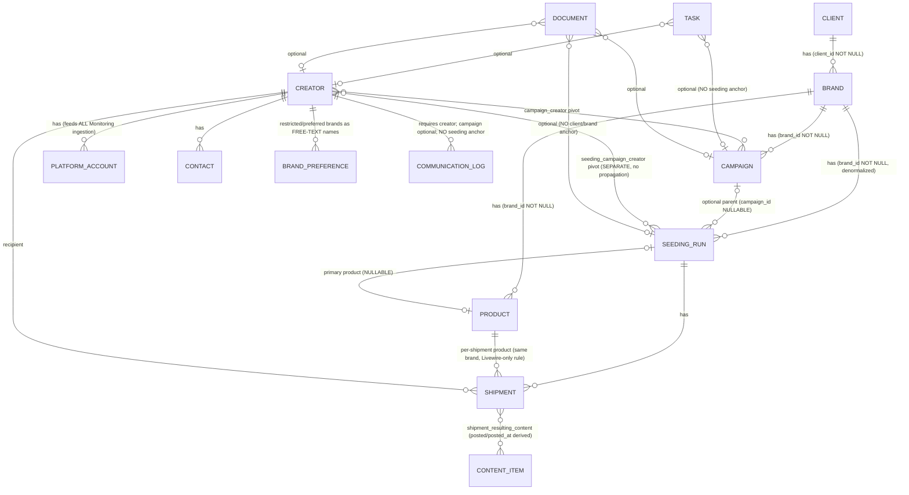

# CRM UX Audit & Redesign Plan

**Date:** 2026-07-16 · **Status:** AWAITING APPROVAL — nothing implemented yet.
**Scope:** the CRM module (`/crm`, `app/Modules/CRM`) as experienced by a first-time, non-technical agency user.
**Method:** live walkthrough of the seeded app (11 screenshots) + a 38-agent code audit (10 parallel readers over models/migrations/Livewire/blades → merge → one adversarial verifier per finding → completeness critic). 111 raw findings were merged into 26; all 26 survived verification (19 confirmed exactly, 7 confirmed with corrections, 0 refuted). Two extra findings (F27, F28) come from the completeness pass.

---

## Phase 1 — Audit

### 1.1 The current user journey

A new user logs in and lands on `/dashboard` — four Monitoring metric tiles and a content feed, no guidance. The sidebar shows five flat items; "CRM & Seeding" is one link with no children (`resources/views/layouts/sidebar.blade.php:24-30`). Opening it gives a 3×3 grid of eight equal-weight description cards, ordered **Creators, Campaigns, Seeding, Clients, Brands, Products, Results, Tasks** — dependents before their prerequisites — with copy written for engineers: "no merge feature (ADR-0014)", "brand restrictions are enforced as hard filters on join", "rollup-backed, every estimate tier-labelled" (`resources/views/crm/index.blade.php`).

There is no onboarding, checklist, "start here", or primary call to action anywhere in the product (repo-wide grep matches only the billing plan chooser). A first-timer who guesses "Campaigns" first opens a create modal whose required Brand select contains only its placeholder, with no "+ new brand" option, no link to the Brands page, and no explanation that a Brand needs a Client first. Every create modal on an empty tenant dead-ends the same way (F01).

The unstated prerequisite chain the user must discover by trial and error:

```
Client → Brand → Campaign            (campaign needs a brand; brand needs a client)
         Brand → Product             (product needs a brand)
Creator (independent)                (can be created any time; auto-enrolls into Monitoring)
Brand (+ optional Campaign, Product) → Seeding run
Seeding run + attached Creator + same-brand Product → Shipment
Shipment (shipped) + matched content → Results
```

Once records exist, navigation is the second wall: the hierarchy is display-only. No client/brand/product detail pages exist; count columns are dead text; a campaign never shows its client; the creator profile never shows the creator's campaigns, seedings, or shipments; moving between CRM areas always means breadcrumb → hub → card (F15, F16, F05).

### 1.2 Current domain relationship map



Key structural facts (all verified against migrations/models):

- **Every cross-entity rule lives only inside individual Livewire `save()` methods** — no DB constraints, no model guards. The seeding-brand ↔ parent-campaign-brand rule is enforced in exactly one place and silently breakable by editing the campaign's brand (F14).
- **Campaign rosters and seeding rosters are disjoint pivots with no propagation** — the same 30 creators must be attached twice, one at a time (F04, F08).
- **Statuses are free-pick dropdowns everywhere**; the only machine-maintained lifecycle signal in the whole CRM is `Shipment.posted/posted_at` (F07).
- **CRM entities are platform-wide, not CRM-private**: 51 non-CRM import sites. Monitoring ingestion anchors on CRM PlatformAccounts, brand recognition matches only CRM Brand names/aliases, SEEDED classification requires dispatched CRM shipments, and creating a Creator auto-enrolls them into Monitoring in the same transaction — none of which the UI ever tells the user (F09).
- The schema has **no campaign objectives, markets, deliverables, campaign↔product link, seeding dates, or CSV import** (relevant when validating the proposed 10-step workflow — see 2.1).

### 1.3 Prioritized findings

All findings verified by an independent adversarial agent against code; evidence abbreviated here (full file:line lists in the audit artifact).

| ID | Sev. | Finding | Key evidence |
|----|------|---------|--------------|
| F01 | Critical | Empty parent dropdowns dead-end every create flow; the Client → Brand prerequisite chain is stated nowhere except three scattered empty-state sentences | brands/products/campaigns/seeding create modals; NOT NULL FKs in migrations |
| F02 | Critical | No onboarding path anywhere; the CRM hub neither orders nor explains its 8 areas (dependents listed before prerequisites, spec IDs in card copy) | `crm/index.blade.php:4-99`, `dashboard.blade.php` |
| F03 | Critical | Seeded-creators roster and shipments are disconnected stores: demo runs show 8 shipment recipients under "No creators on this seeding run yet", and such shipments can never be re-saved (recipient validation fails) | `ShipmentsPanel.php:135-139`, `DemoDataSeeder.php:828-866` |
| F04 | Critical | Campaign roster does not propagate to seeding runs — same creators attached twice before shipments unblock; no copy-from-campaign action | `campaign_creator` vs `seeding_campaign_creator` pivots |
| F05 | Critical | Creator profile shows none of the creator's campaigns, seedings, or shipments; the relationship surfaces only as a blocking delete error | `crm/creator-profile.blade.php:9-18` |
| F06 | Major | Both "blocking" mechanisms fail silently: restrictions match free-text brand names, only at attach time; BLOCKLISTED status blocks nothing | `BrandRestrictionGuard.php:22-30` |
| F07 | Major | No status lifecycle: every status is a free-pick dropdown at create and edit; nothing auto-progresses except `Shipment.posted` | all index components |
| F08 | Major | Roster building is a one-at-a-time unsearchable select over all 300 creators; restricted creators are selectable and fail only after submit | `CampaignCreatorsPanel.php:46-51` |
| F09 | Major | Monitoring's CRM prerequisites (creator+account, brand records/aliases, dispatched shipments) are stated nowhere; campaign membership silently switches accounts to costlier fast polling | `BrandLexicon.php`, `AdaptiveCadence` |
| F10 | Major | Creator intake is strictly one-at-a-time; no CSV/bulk import; the empty state promises a Monitoring/Discovery intake that has no production caller | `CreatorProposalIntake.php:36-41` |
| F11 | Major | Seeding runs cannot be created from their campaign — empty state says "Create one from the Seeding area and pick this campaign as parent", no button | `campaign-detail.blade.php:29-33` |
| F12 | Major | Seeding create form is unguided: unexplained required Variant that drives no behavior; product list spans all brands and fails at save; stale selections survive a brand switch | `SeedingCampaignsIndex.php:302-309` |
| F13 | Major | Detail pages open on a read-only Results panel (8 of 10 tiles "unavailable" on a fresh run) before any setup section; its counts diverge from the live table below by definition (dispatched-only) with only a footnote as a cue | `campaign-detail.blade.php:22-33` |
| F14 | Major | Brand coherence enforced in exactly one `save()`: editing a campaign's brand silently breaks its seeding runs | `CampaignsIndex.php:136,147` |
| F15 | Major | Hierarchy is display-only: no drill-downs, no client/brand/product detail routes, owning client invisible on campaigns, results rows dead text | `routes.php:25-33` |
| F16 | Major | Lateral navigation absent: flat sidebar link, breadcrumb-only backtracking, two cross-module links in the whole app, twin creator lists (CRM vs Monitoring) that never reference each other | `sidebar.blade.php:24-30` |
| F17 | Major | Empty states fail first-run users: 0 of 19 use the component's action slot; index titles blame "your filters" on brand-new tenants | `components/states/empty.blade.php` |
| F18 | Major | Tasks and communication logs cannot anchor to a seeding run; client-level documents have no home; seeding detail has no tasks panel | `tasks` migration :27-28 |
| F19 | Major | Permanent stubs occupy top navigation: Reports (empty by design), Discovery ("ships in phase P2"), header search ("coming soon") | `reports/index.blade.php:5-9` |
| F20 | Major | Internal spec IDs (ADR-, REQ-, AC-M3-, DP-, an env var) and engineering vocabulary ("rollup", "blocked before commit", "Grain") rendered in 16 of 35 CRM blades | terminology sweep |
| F21 | Major | Metrics presented in developer form: unexplained PUBLIC/DERIVED/ESTIMATED/CONFIRMED badges with no legend/tooltip; EMV never expanded in CRM; raw JSON rate card printed as the EMV explanation | `metric/tier-badge.blade.php` |
| F22 | Major | Raw machine identifiers as UI text: `FOOD_BEVERAGE`, `SRC-apify-instagram-profile-scraper`, `->value` renders, "The brand client id field is required." | multiple blades; no `validationAttributes` |
| F23 | Major | No controlled vocabulary: six names for the seeding entity; "Variant" and "Runs" each mean two things; same enum is "Sector" on brands, "Category" on products | seeding blades |
| F24 | Major | Relationship status uninterpretable: 9 unexplained stages, zero automation (logging outreach doesn't move it), NULL and NONE render differently while meaning the same | `RelationshipStatus.php` |
| F25 | Major | "Unavailable" chips mislead: geography chip blames a future module while the working Geography form is one click away; explanations hidden in hover-only, spec-ID tooltips (unreachable on touch) | `creators-index.blade.php:113-119` |
| F26 | Minor | Money fields carry no currency anywhere (inputs, tables, results tiles) | products/campaigns/seeding blades |
| F27 | Major | (completeness pass) No status stage is ever defined: campaign and seeding vocabularies silently diverge (Paused vs Shipping), enums expose labels only, no legend or tooltip anywhere explains what a stage means or what to do next | `CampaignStatus.php`, `SeedingCampaignStatus.php` |
| F28 | Major | (completeness pass) Forms ask too early and show too much: campaign create asks for Spend (an after-the-fact actual) because create and edit share one modal; the shipment modal presents ~10 controls including tracking/delivered-at before anything shipped | `campaigns-index.blade.php:146-148`, `seeding-shipments.blade.php:159-176` |

### 1.4 The five root causes

1. **The product has no opinion about order.** The data model has a strict dependency chain, but no screen states it, orders by it, or offers the next step (F01, F02, F17).
2. **Relationships are stored but never shown.** Drill-down, context, and participation views don't exist; users must hold the graph in their heads (F05, F15, F16).
3. **The same work is demanded twice, in the weakest input control available** (F04, F08, F03).
4. **Statuses are labels, not a process.** Nothing defines, guards, suggests, or derives progress (F07, F24, F27).
5. **The UI speaks the spec's language, not the agency's** (F20–F23, F25, F26).

---

## Phase 2 — Proposed product flow

### 2.1 The recommended end-to-end workflow (validated against the domain)

Your proposed 10-step sequence is directionally right. Three corrections from the actual domain model:

- **Products are not needed before a campaign** — only before *shipments* (a seeding run's primary product is optional; each shipment requires a same-brand product). Recommended order defers products to seeding setup, offered inline.
- **Creators are fully independent** of the client hierarchy and auto-enroll into Monitoring on creation. They can be added at any point; the guided flow should treat them as a parallel track, not step 4 of a strict sequence.
- **"Objectives, markets, deliverables" (your step 6) have no schema today.** Recommendation: add two optional columns (`objective` text, `markets` jsonb) in Stage D as a lightweight campaign brief; defer a deliverables entity — per-shipment `posting_required` already covers the seeding case, and adding a deliverables tracker would be new scope, not simplification.

**Recommended canonical flow** (what the UI will teach and default to):

```
1. Create a client            (the company your agency works for)
2. Add a brand to it          (inline from anywhere a brand is needed)
3. Add creators               (any time; one form or CSV import; auto-monitored)
4. Create a campaign          (brand picked or created inline; dates; Draft by default)
5. Add a seeding run          (from inside the campaign: brand, dates context inherited;
                               product picked or created inline)
6. Select creators            (searchable multi-picker; copy from campaign roster;
                               restricted creators flagged before submit)
7. Record shipments           (recipient list = the run's roster; product prefilled)
8. Content & results          (automatic: Monitoring matches content; posted state derives;
                               results tiles fill in)
9. Review results             (campaign/seeding results, tier-labelled in plain words)
```

Standalone seedings (no campaign) remain fully supported — the schema already allows it and agencies do brand-level always-on gifting. **Seedings support both models**: campaign sub-record (primary path, created in context) and standalone record (secondary path from the Seedings index).

### 2.2 Mandatory vs optional, and what can be created inline

| Entity | Mandatory before | Optional | Inline-create from |
|--------|-----------------|----------|--------------------|
| Client | any Brand | — | Brand form, campaign wizard |
| Brand | Campaign, Product, Seeding | — | Campaign form/wizard, seeding form |
| Product | Shipment | Seeding primary product | Seeding form, shipment form |
| Creator | Roster/Shipment | — | Roster picker ("+ new creator") |
| Campaign | — (seedings may be standalone) | parent of Seeding | Seeding form |
| Seeding run | Shipment | — | Campaign detail (primary path) |

### 2.3 The new CRM home (`/crm`)

Replace the eight-card grid with an operational **Overview**:

```
┌────────────────────────────────────────────────────────────────────┐
│ CRM                                              [＋ New campaign] │
│                                                                    │
│ ┌─ Get set up ────────────────────────────────┐  (dynamic; shows   │
│ │ ● 1. Create your first client          Done │   only unfinished  │
│ │ ● 2. Add a brand                       Done │   steps; collapses │
│ │ ○ 3. Add creators (or import CSV)     Start │   to a ✓ pill when │
│ │ ○ 4. Create your first campaign             │   complete)        │
│ │ ○ 5. Launch a seeding run                   │                    │
│ └─────────────────────────────────────────────┘                    │
│                                                                    │
│ ┌ Needs attention ────────────┐ ┌ Active work ────────────────────┐│
│ │ 3 overdue tasks             │ │ Campaign X   Active   3 runs    ││
│ │ 5 shipments awaited > 7d    │ │ Campaign Y   Draft    no roster ││
│ │ 2 runs with no creators     │ │ Seeding Z    Shipping 8/12 sent ││
│ └─────────────────────────────┘ └─────────────────────────────────┘│
│ Quick actions: [New client] [New brand] [Add creator] [New seeding]│
└────────────────────────────────────────────────────────────────────┘
```

- One primary call to action; the checklist is derived from live counts (clients=0 → step 1 active) and disappears once complete.
- "Needs attention" is computed from real data (overdue tasks, runs with empty rosters, shipments without delivery/content) — it is the "return later and immediately see what needs me" surface (acceptance criterion 10).

### 2.4 Navigation

Sidebar gains CRM children (the existing menu loop needs child support — one component change):

```
CRM
├── Overview
├── Clients & Brands      (hierarchy page; products live inside a brand)
├── Creators
├── Campaigns
├── Seedings
├── Results
└── Tasks
```

- **Products** leave top-level navigation; they are managed inside a Brand (and inline from seeding/shipment forms). The `/crm/products` route stays as a searchable cross-brand list for deep links, reachable from Clients & Brands.
- **Clients & Brands merge into one hierarchy screen** (clients expand to their brands; a brand opens a detail view with Products / Campaigns / Seedings tabs). This kills two flat tables and makes the relationship visible instead of documented.
- Every detail page gets a **context header**: `Client › Brand › Campaign › Seeding run` as links, plus status chip and dates. Breadcrumbs stop being the only orientation device.
- Reports and Discovery leave the main nav until they exist (or get "coming soon" moved into the page, out of the nav).

### 2.5 Lifecycles

**Campaign — keep the existing six DB values**, define them, guard transitions softly (confirm dialogs, not hard blocks), and suggest the next stage:

| Stage | Meaning | Enters when | Suggested next |
|-------|---------|------------|----------------|
| Draft | being set up; invisible to results | created (default; not user-picked) | add roster → Planned |
| Planned | roster/dates set, not started | user confirms setup complete | start date arrives → banner "Start campaign?" |
| Active | running; fast polling on | user action (one click from banner) | end date passes → banner "Complete?" |
| Paused | temporarily stopped | user action | resume → Active |
| Completed | finished; results final | user action | archive-like; read-mostly |
| Cancelled | abandoned | user action (confirm) | — |

**Seeding — keep the existing six values as the *manual* stage, and add a derived progress strip** computed from shipments/content (this replaces your proposed 9 manual statuses — granular states should be facts, not chores):

```
Roster 12 creators  →  Shipped 8/12  →  Delivered 5/12  →  Posted 3/8 expected
[███████░░░░░░░░░░░░░░░░░]  status: Shipping
```

Derivations already possible today: shipped/delivered from `Shipment.status`+timestamps, posted from the machine-maintained `posted` flag. The manual status gets suggestion banners ("All shipments delivered — mark Completed?") instead of automation that could surprise users.

**Shipment** — keep the seven statuses but derive: setting `shipped_at` suggests status Shipped, `delivered_at` suggests Delivered (one-tap accept), and the form only reveals tracking/delivery fields once the stage makes them meaningful (fixes F28).

**Creator relationship status** — define each stage in the select itself (label + one-line description), collapse NULL/NONE into one rendering, and auto-suggest: logging an outbound communication for a "None/Prospect" creator offers "Mark as Contacted?".

### 2.6 Key screens (wireframe level)

**Campaign detail (restructured — setup first, results when meaningful):**

```
Client Brückner › Brand Atelier Nord                    [Edit] [Status ▾]
ATELIER NORD CREATOR WEEK 2026        Active · 14.06 – 24.07.2026
──────────────────────────────────────────────────────────────────
[Overview] [Creators (28)] [Seeding runs (2)] [Results] [Docs & Tasks]

Overview tab: next-step card ("2 runs shipping · 5 shipments awaited"),
key facts, spend. Results tab replaces the always-first results wall;
a Draft campaign shows a setup guide instead of "unavailable" tiles.

Seeding runs tab:
  ┌ Frühling Gifting  · Shipping · 8/12 shipped  ────────── Open ┐
  └ ...                                                          ┘
  [＋ New seeding run]   ← creates IN CONTEXT: brand, campaign,
                            dates prefilled; only name + variant asked
```

**Roster picker (used by both campaign and seeding; fixes F04/F08):**

```
Add creators to "Frühling Gifting"                       [Done]
[Search…] [Platform ▾] [Min followers ▾]  [Copy campaign roster (28)]
☑ Ariane Förster   IG 967k   ✓ ok
☑ Betty Adam       TT 412k   ✓ ok
☐ Cordula Blank    IG 120k   ⚠ restricted: brand on her no-go list
   (selectable-but-flagged BEFORE submit; blocked at save as today)
```

**Guided campaign wizard (optional path; every step also exists as a plain form):**

```
① Client & Brand → ② Campaign details → ③ Seeding run (optional)
   → ④ Creators (optional) → ⑤ Review & create
Each select offers "＋ Create new…" inline; later steps inherit
everything already chosen; skippable for experts ("Skip setup, just
create the campaign").
```

**Creator profile** gains a **Participation panel** (campaigns, seeding runs, shipments with status) at the top, and the identity form collapses to display-with-Edit (fixes F05 and the edit-form-first pattern).

### 2.7 Terminology (controlled vocabulary)

| Today (several forms) | Everywhere after |
|---|---|
| Seeding campaign / seeding run / Seeding & Shipments / CRM & Seeding | **Seeding run** (entity), **Seedings** (nav) |
| Variant (seeding) vs Variant (product) | **Seeding type** vs **Product variant** |
| Runs (column = dates) | **Dates** |
| Sector (brand) vs Category (product) | **Sector** for both |
| PUBLIC / DERIVED / ESTIMATED / CONFIRMED badges | Plain labels with legend + tooltips: "from platform", "calculated", "estimated", "entered by you" |
| EMV / CPE / CPM raw | Spelled out once per surface ("Earned Media Value (EMV)"), formula in a tooltip, JSON rate dump removed (link to Settings → EMV) |
| ADR/REQ/AC/DP IDs, "rollup", "commit", "operator-managed", `SRC-*`, enum constants | Removed or translated; spec IDs live in code comments only |

Contextual help placement: one short always-visible sentence per screen ("A brand belongs to a client and can have multiple products."), tooltips only for genuinely unfamiliar single terms, never for critical guidance (F25's hover-only pattern is banned; the `x-states.unavailable` component gets visible text).

---

## Phase 3 — Implementation plan

Four stages, each shippable and testable on its own. Stages A–B are pure UI/copy (no migrations); C adds components and two routes; D touches schema and guards.

### Stage A — Language, empty states, confirmations (lowest risk, immediate relief)

*Fixes F17, F20–F23, F25, F26, part of F01/F27.*

- Strip spec IDs/engineering vocabulary from all 16 affected blades; apply the controlled vocabulary (§2.7). Add `label()` to `SectorLabel`, platform, direction enums; render labels not constants.
- Add `validationAttributes()`/`messages()` to every CRM Livewire form component ("Please choose a brand", not "The seeding brand id field is required").
- Rewrite all 19 empty states using the existing (never-used) action slot: what this is → why it matters → what must exist first → button. Fix "match your filters" titles on unfiltered tenants (campaigns, seedings, creators, users indexes).
- Tier-badge component: plain-word labels, `title` + visible legend component on results surfaces; remove the JSON rate-card dump (link to Settings → EMV instead).
- Currency suffix on all money inputs/cells (tenant currency from EMV settings).
- Status selects get one-line descriptions per option (fixes the F27 definition gap at the cheapest layer).
- `wire:confirm` on every Delete (audit found delete confirms inconsistent).

**Acceptance:** a text-only diff of every CRM blade contains zero ADR/REQ/AC/DP strings (CI grep test); every empty state has a CTA or an explicit prerequisite link; Livewire validation tests assert friendly attribute names.
**Tests:** blade snapshot tests for empty states; enum label unit tests; a lint-style test greping compiled views for spec-ID patterns.

### Stage B — Relationship visibility & navigation

*Fixes F05, F11 (partially), F13, F15, F16, F19.*

- Sidebar: child items for CRM (Overview, Clients & Brands, Creators, Campaigns, Seedings, Results, Tasks); remove Reports/Discovery from main nav (or annotate in-page). Component: `layouts/sidebar.blade.php` menu loop gains a `children` array.
- New **Clients & Brands** hierarchy page (new Livewire component) replacing the two flat index pages; **Brand detail** route (`crm.brands.show`) with Products / Campaigns / Seedings tabs. Client edit stays a modal.
- **Context header component** (`x-crm.context-header`) rendering the Client › Brand › Campaign › Run chain as links + status chip; used on campaign detail, seeding detail, brand detail.
- Campaign detail restructure into tabs (Overview | Creators | Seeding runs | Results | Docs & Tasks); Results no longer first; Draft campaigns show a setup checklist instead of the results wall; duplicate "Seeding runs" listing removed.
- Seeding detail same treatment; parent campaign, brand, product all linked.
- Creator profile: add Participation panel (campaigns/seedings/shipments via existing relationships); identity form becomes display-first.
- Results dashboard rows link to product/brand; CRM ↔ Monitoring creator pages cross-link.

**Acceptance:** from any CRM record you can reach every directly-related record in one click; the campaign page shows its client; the creator page lists its campaigns.
**Tests:** Livewire component tests for the hierarchy page + brand tabs; route tests for `brands.show`; Dusk-style smoke for the click-through chain (or Livewire `assertSeeHtml` link assertions).

### Stage C — Guided flows, CRM home, roster picker

*Fixes F01, F02, F04 (UX half), F08, F10 (import), F11 (fully), F12, F28.*

- **New `/crm` Overview** (Livewire): dynamic setup checklist (driven by tenant counts), needs-attention queries (overdue tasks, empty-roster runs, stale shipments), active work list, quick actions. The old hub cards die.
- **Inline create** ("+ New client / brand / product / creator") inside every parent select — one reusable Livewire modal-in-modal or slide-over component (`x-crm.inline-create`).
- **Roster picker** replacing the single-select attach on campaigns and seedings: searchable, multi-select, platform/follower context, restricted-creators flagged pre-submit (uses `BrandRestrictionGuard` in a query pass), **"Copy campaign roster"** action on seeding runs (bulk-attach the parent campaign's creators minus restricted).
- **"New seeding run" button on campaign detail**, prefilling brand + parent campaign (+ dates context display); form field order fixed (type explained with one-liners per option); product select filtered to brand; brand switch resets dependent selections (`updatedSeedingBrandId`).
- **Campaign wizard** (optional guided path from Overview CTA): client → brand → campaign → optional run → optional roster → review. Thin orchestration over the existing per-entity Livewire logic — no new domain writes.
- **CSV creator import** (name, language, handles per platform) with a preview step; reuses `CreatorWriter` so Monitoring auto-enrollment keeps working. Remove the false "proposed by Monitoring or Discovery" empty-state promise (or wire `CreatorProposalIntake` later — out of scope here).
- Split create vs edit forms where they diverge (campaign create drops Spend; shipment create shows tracking/delivery fields progressively per status).

**Acceptance:** a brand-new tenant can go from zero to a seeding run with attached creators without ever leaving a flow to create a prerequisite; the checklist reflects and links each step; a 30-creator roster is buildable in under a minute.
**Tests:** Livewire tests for checklist state transitions, inline-create nesting, roster picker (search/bulk/restricted flagging/copy-roster), wizard happy path + skip path, CSV import validation/preview/tenant scoping.

### Stage D — Data-model & lifecycle hardening

*Fixes F03, F06, F07, F14, F18, F24 (automation), F27; enables §2.5.*

Migrations (all additive except the F03 repair):

1. `tasks.seeding_campaign_id` (nullable FK) + tasks panel on seeding detail; communication_logs gains `seeding_campaign_id` too.
2. `campaigns.objective` (text, nullable), `campaigns.markets` (jsonb, nullable) — the lightweight brief.
3. **F03 repair:** data migration backfilling `seeding_campaign_creator` from existing shipments' `(seeding_campaign_id, creator_id)` pairs (also fixes the demo seeder); going forward, creating a shipment auto-attaches the recipient to the roster inside the same transaction (with restriction check), making the invariant self-healing instead of save-order-dependent.
4. **Brand coherence guard:** block changing a campaign's brand while seeding runs exist (validation error with count + link), and the same rule at a service level (`CampaignWriter`) so future write paths inherit it. DB-level CHECK is not portable here; a service guard + regression tests is the pragmatic line.
5. **Restriction matching hardening:** keep free-text lists (they're a GDPR-reviewed shape) but match against brand aliases as well as names, and re-check restrictions when a restriction is added (surface "3 existing rosters include this creator" as a warning list, don't auto-detach). BLOCKLISTED relationship status becomes enforcement: attach blocked with a clear message.
6. **Status transition suggestions:** derived seeding progress strip (counts from shipments/content — read-only, no schema); suggestion banners (start/complete campaign, mark delivered) — plain Livewire actions, no scheduler required for v1.

**Migration risks:** (3) is the only data-writing migration — idempotent insert-ignore into a unique-pair pivot, safe to re-run; (4) can break an existing workflow if any tenant legitimately re-brands campaigns — mitigated by the explicit error + link rather than silent failure; (5) widening matching to aliases can newly block attaches that used to pass — release-note it. Everything else is additive nullable columns (zero-downtime).

**Permissions:** no new permission classes; all new writes stay behind `crm.manage` re-authorization like existing mutators; the Overview reads stay behind `crm.view`.

**Tests:** pivot-backfill migration test on seeded data; shipment-auto-attach + restriction interplay; campaign-brand-change guard; alias-aware restriction guard; BLOCKLISTED attach block; suggestion banner state tests. Existing 78 reach + full suite must stay green.

### Reusable components introduced

`x-crm.context-header` · `x-crm.inline-create` · roster-picker Livewire component · setup-checklist component · status-select with descriptions · tier legend · derived progress strip. All follow the existing `x-ui.*`/Livewire conventions.

### Suggested sequencing & effort

A (copy/empty states) ≈ small, 1 PR wave. B (nav/detail restructure) ≈ medium, 3–4 PRs. C (flows) ≈ the big one, 4–5 PRs. D (schema/guards) ≈ medium, can partly parallel C (the F03 repair should land **before** C's roster picker to avoid building on the broken invariant).

---

## Acceptance criteria mapping (from the brief)

| # | Criterion | Delivered by |
|---|-----------|--------------|
| 1 | Understand what the CRM is for | A (copy) + C (Overview) |
| 2 | Know the first action | C (checklist, primary CTA) |
| 3 | Create client and brand | A (empty states) + C (inline create, wizard) |
| 4 | Add a product | B (brand tabs) + C (inline create) |
| 5 | Add or import creators | C (form + CSV import) |
| 6 | Create a campaign | C (wizard/defaults; Draft not asked) |
| 7 | Create and link a seeding run | C (create-from-campaign, prefilled) |
| 8 | Select creators | C (roster picker, copy-roster) |
| 9 | Understand status and next step | A (status descriptions) + D (progress strip, banners) |
| 10 | Return later and see what needs attention | C (needs-attention queue) |

## Out of scope (deliberately)

Deliverables tracking entity; wiring Discovery/`CreatorProposalIntake`; global search; automated status transitions without user confirmation; any Monitoring-module UI beyond cross-links; multi-currency.
